# Part 7: HTTP Connection Manager (HCM) as a Network Filter

## Overview

The HTTP Connection Manager (`ConnectionManagerImpl`) is the most important class in Envoy's HTTP processing. It acts as a **terminal network read filter**, bridging Layer 4 (raw bytes on a connection) to Layer 7 (HTTP requests and responses). Every HTTP request Envoy handles passes through this class.

## HCM in the Filter Stack

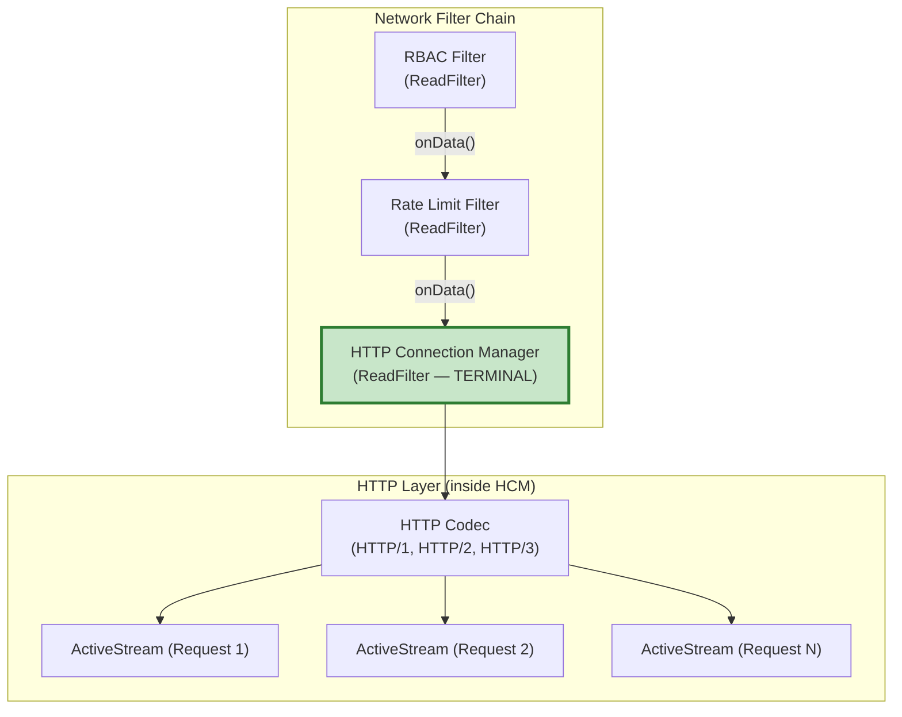

## HCM Class Hierarchy

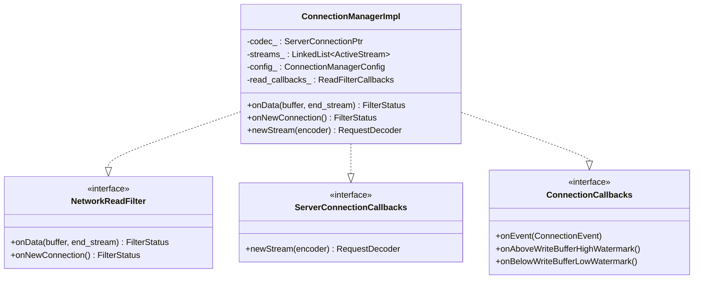

**Location:** `source/common/http/conn_manager_impl.h` (line 59)

HCM implements three interfaces simultaneously:
- **`Network::ReadFilter`** — receives raw bytes from the connection
- **`ServerConnectionCallbacks`** — receives stream events from the HTTP codec
- **`Network::ConnectionCallbacks`** — handles connection-level events

## HCM Creation

HCM is created as a network filter by the `HttpConnectionManagerFilterConfigFactory`:

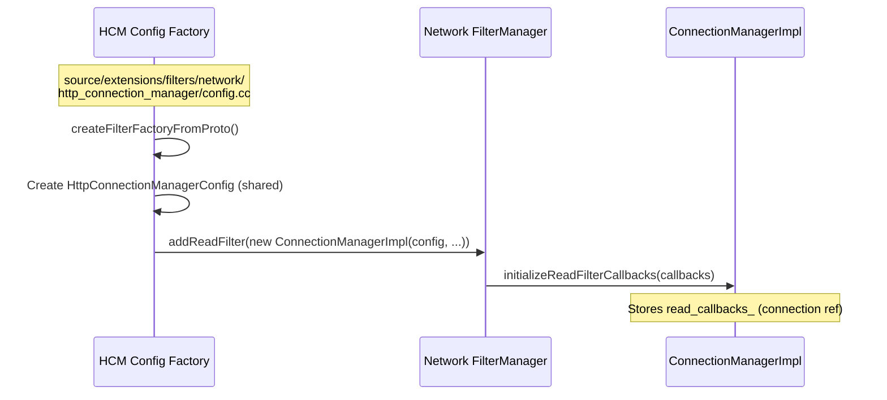

```
File: source/extensions/filters/network/http_connection_manager/config.cc

The factory creates HttpConnectionManagerConfig at config time (shared across connections),
then for each new connection, creates a ConnectionManagerImpl instance.
```

## HCM Initialization

### initializeReadFilterCallbacks

When the HCM filter is added to a connection, it receives callbacks:

```
File: source/common/http/conn_manager_impl.cc (lines 122-156)

initializeReadFilterCallbacks(callbacks):
    1. Store read_callbacks_ (connection + dispatcher reference)
    2. Register as connection callback (onEvent, watermarks)
    3. Set up overload actions
    4. Initialize drain timer, idle timer
    5. Set up stats (e.g., downstream_cx_active)
```

### onNewConnection

Called after `initializeReadFilters()`. For HTTP/1 and HTTP/2, this is a no-op. For HTTP/3 (QUIC), the protocol is known at connection time, so the codec is created here:

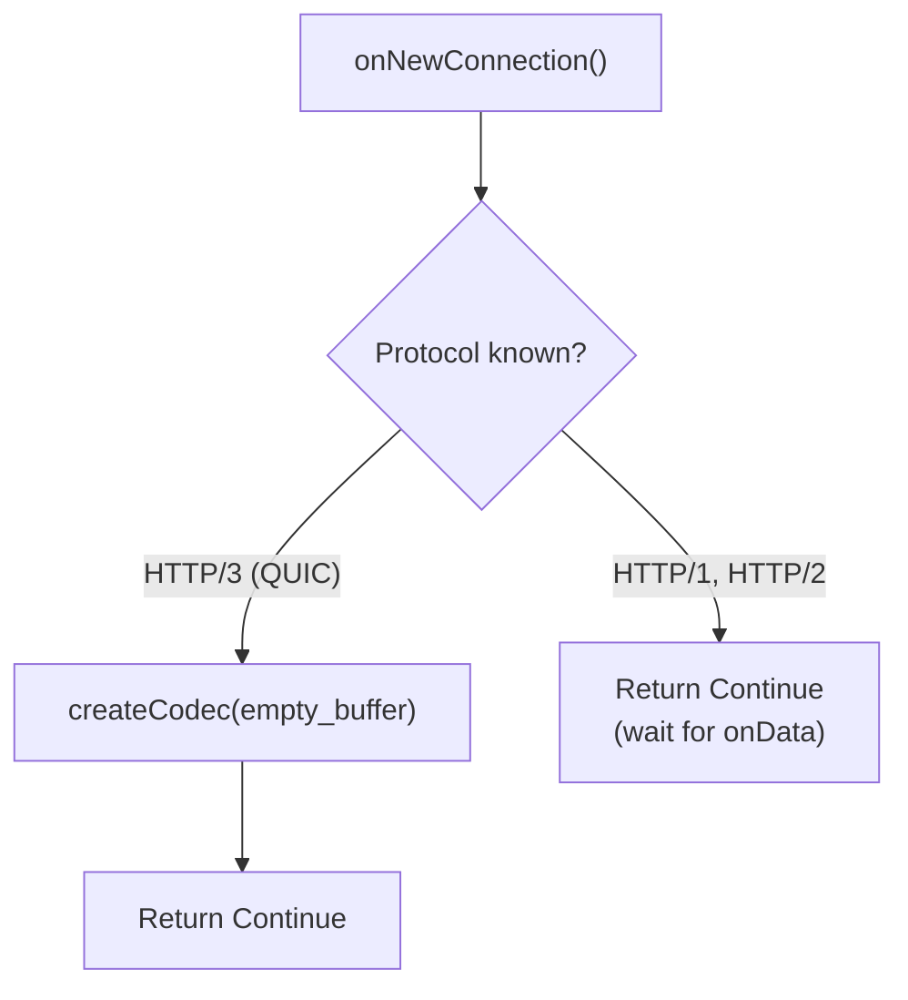

## The Core Loop: onData()

`onData()` is where raw HTTP bytes enter the HTTP layer:

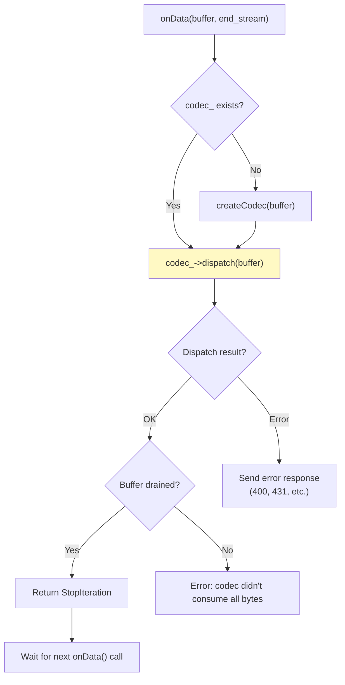

```
File: source/common/http/conn_manager_impl.cc (lines 415-467)

onData(data, end_stream):
    1. If no codec → createCodec(data)
    2. Try: codec_->dispatch(data)
       - Codec parses HTTP frames
       - Calls back into HCM via ServerConnectionCallbacks
    3. Catch codec errors → sendLocalReply(400/431/etc.)
    4. Return StopIteration (HCM consumes all data)
```

### Why StopIteration?

HCM always returns `FilterStatus::StopIteration` because it **consumes** all data from the buffer. The HTTP codec parses the bytes into structured HTTP messages — there's nothing left for any subsequent network filter.

## Codec Creation

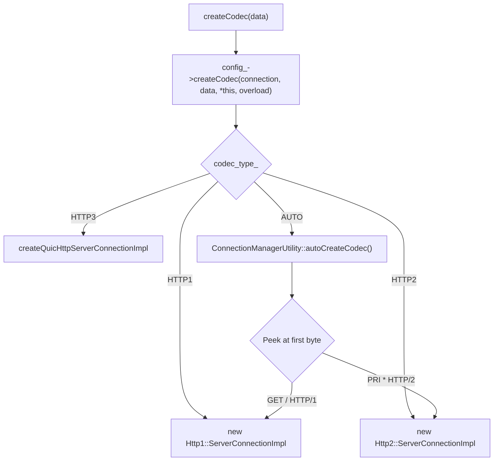

```
File: source/extensions/filters/network/http_connection_manager/config.cc (lines 537-556)

createCodec(connection, data, callbacks, overload):
    switch(codec_type_):
        HTTP1 → Http1::ServerConnectionImpl
        HTTP2 → Http2::ServerConnectionImpl  
        HTTP3 → QUIC server connection
        AUTO  → autoCreateCodec() (peek at bytes to decide)
```

## ActiveStream — Per-Request Object

When the codec encounters a new HTTP request, it calls `newStream()` on HCM:

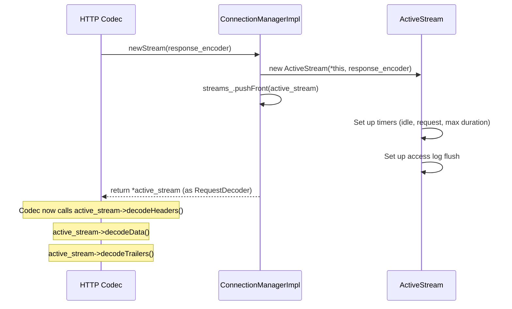

```
File: source/common/http/conn_manager_impl.cc (lines 324-379)

newStream(response_encoder, is_internally_created):
    1. Create ActiveStream with response_encoder reference
    2. Wire up stream callbacks (reset, watermarks)
    3. Add to streams_ linked list
    4. Return ActiveStream as RequestDecoder
```

### What ActiveStream Implements

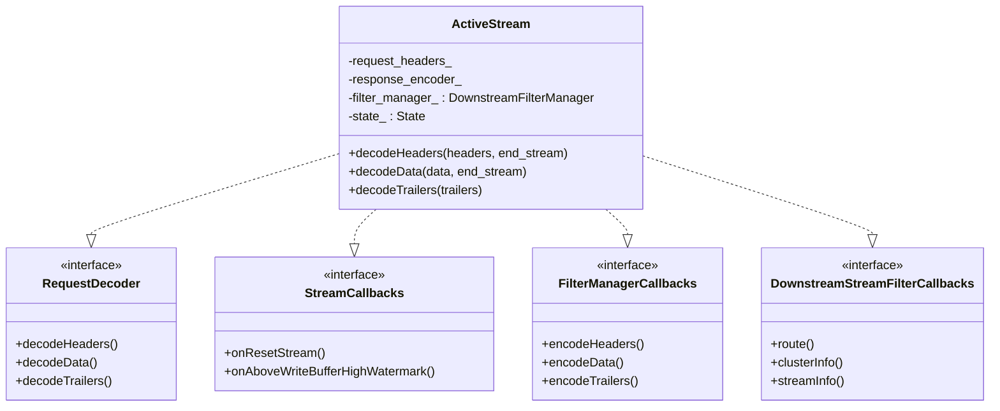

`ActiveStream` is a junction point connecting:
1. **Codec** (upstream from it) — via `RequestDecoder` interface
2. **HTTP Filter Chain** (downstream from it) — via `DownstreamFilterManager`
3. **Connection** (for encoding responses) — via `response_encoder_`

## Multiple Streams on One Connection

HTTP/2 supports multiplexing. A single HCM manages multiple concurrent `ActiveStream` objects:

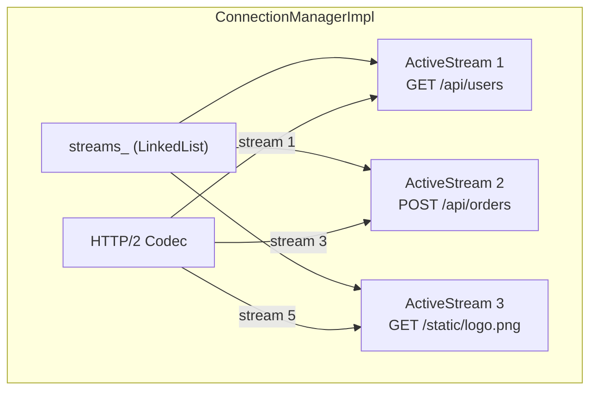

For HTTP/1, there is at most one active stream at a time (request-response, then the next).

## Connection vs Stream Lifecycle

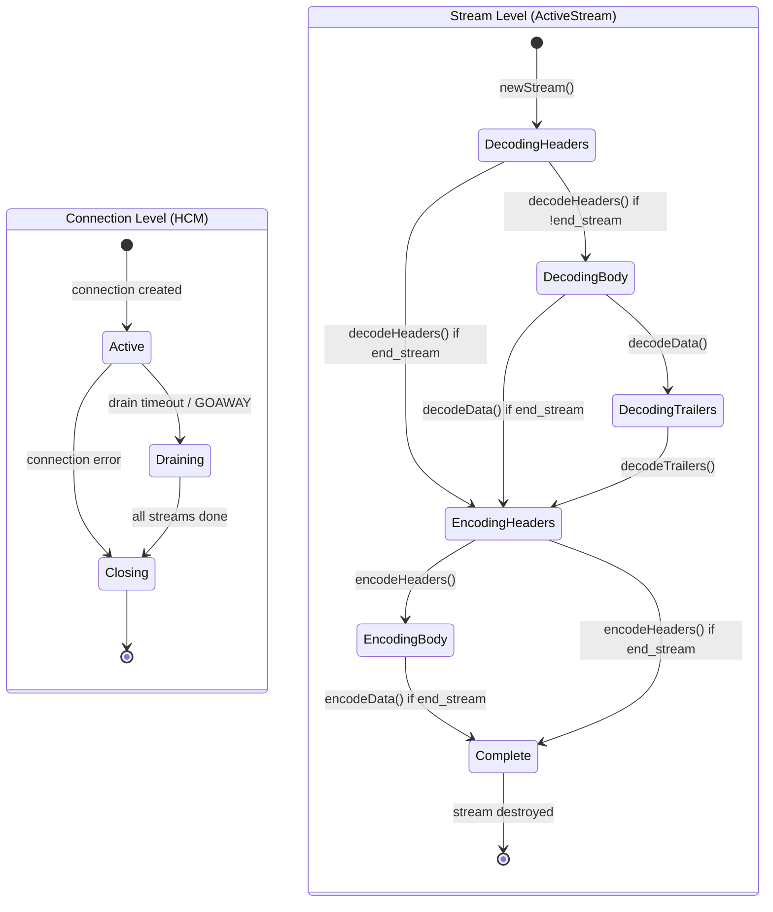

## HCM Configuration

`ConnectionManagerConfig` (`source/common/http/conn_manager_config.h`) provides all HCM settings:

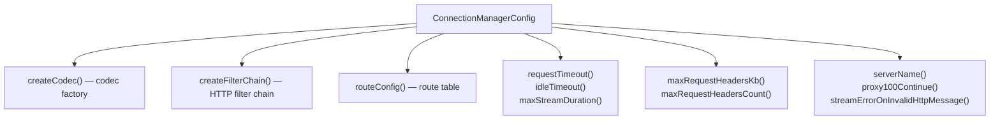

## Key Source Files

| File | Lines | What It Does |
|------|-------|-------------|
| `source/common/http/conn_manager_impl.h` | 59-130 | `ConnectionManagerImpl` class |
| `source/common/http/conn_manager_impl.h` | 123-220 | `ActiveStream` class |
| `source/common/http/conn_manager_impl.cc` | 122-156 | HCM initialization |
| `source/common/http/conn_manager_impl.cc` | 324-379 | `newStream()` creates ActiveStream |
| `source/common/http/conn_manager_impl.cc` | 394-414 | `createCodec()` |
| `source/common/http/conn_manager_impl.cc` | 415-467 | `onData()` main entry point |
| `source/common/http/conn_manager_config.h` | 222-231 | `createCodec()` interface |
| `source/extensions/filters/network/http_connection_manager/config.cc` | 537-556 | Codec creation by protocol |
| `source/extensions/filters/network/http_connection_manager/config.h` | — | `HttpConnectionManagerConfig` |

---

**Previous:** [Part 6 — Transport Sockets and TLS](06-transport-sockets.md)  
**Next:** [Part 8 — HTTP Codec Layer: Protocol Parsing](08-http-codec.md)
