# Part 8: HTTP Codec Layer — Protocol Parsing

## Overview

The HTTP codec sits between raw bytes and structured HTTP messages. It parses incoming bytes into headers, body, and trailers, and serializes outgoing responses. Envoy supports HTTP/1.1, HTTP/2, and HTTP/3, each with a different codec implementation but the same interface.

## Codec Architecture

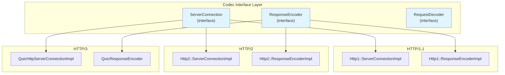

## Key Codec Interfaces

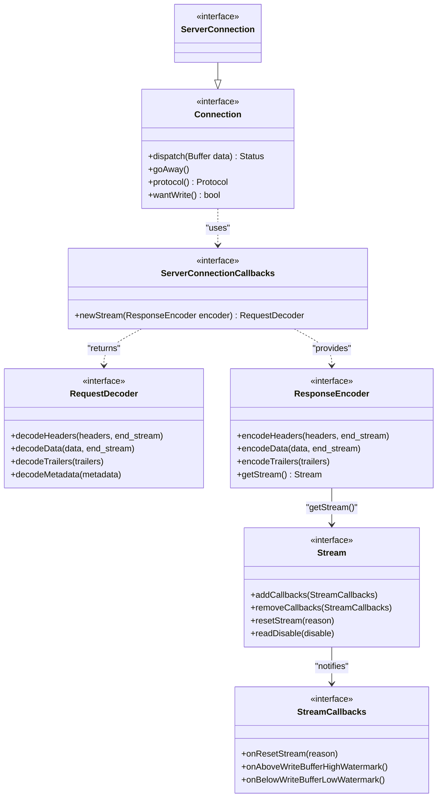

**Interface location:** `envoy/http/codec.h`

- `Connection` (lines 428-450) — `dispatch()` is the main entry
- `ServerConnectionCallbacks` (lines 416-428) — HCM implements this
- `RequestDecoder` (lines 241-280) — `ActiveStream` implements this
- `ResponseEncoder` (lines 145-210) — codec provides this for each stream

## The dispatch() Call

The central method that drives HTTP parsing:

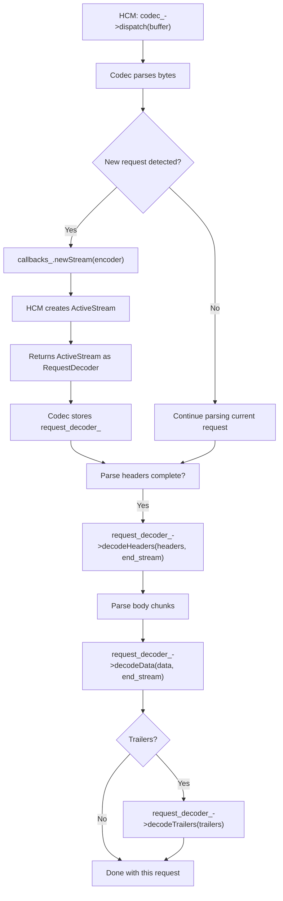

## HTTP/1.1 Codec Flow

### Parsing Architecture

HTTP/1.1 uses a streaming parser (based on llhttp/http-parser):

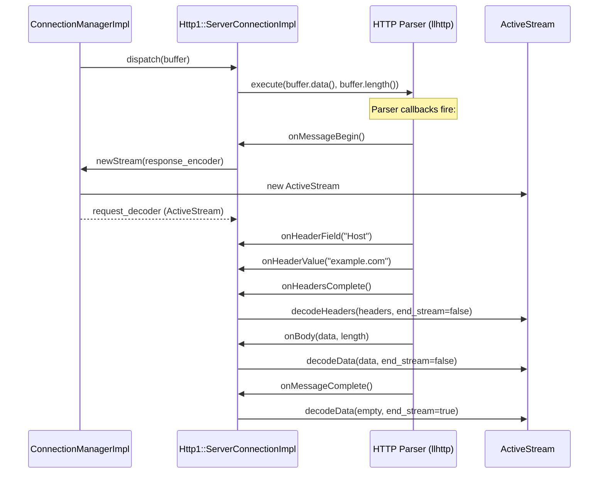

```
File: source/common/http/http1/codec_impl.cc

Key flow:
- onMessageBeginBase() → creates ResponseEncoder, calls callbacks_.newStream()
- onHeadersCompleteBase() → builds HeaderMap, calls decodeHeaders()
- onBody() → wraps data in Buffer, calls decodeData()  
- onMessageComplete() → sets end_stream=true
```

### HTTP/1.1 One Request at a Time

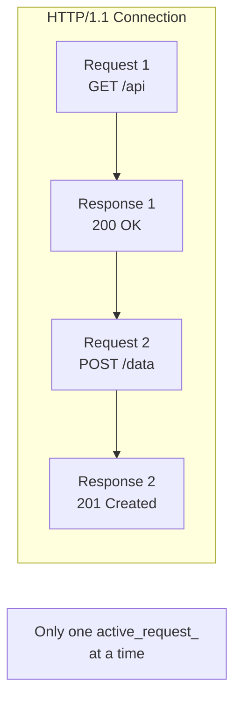

HTTP/1.1 codec tracks `active_request_` — a single request/response pair. The next request is only parsed after the current response is sent (unless pipelining, which is limited).

## HTTP/2 Codec Flow

### Multiplexed Streams

HTTP/2 uses nghttp2 (or oghttp2) to handle frame parsing:

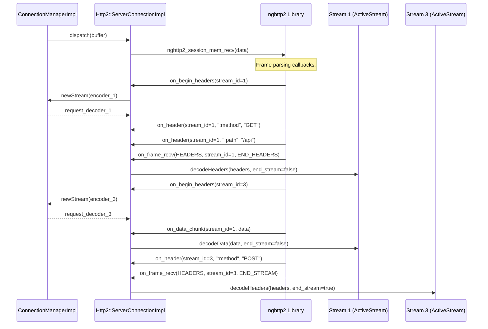

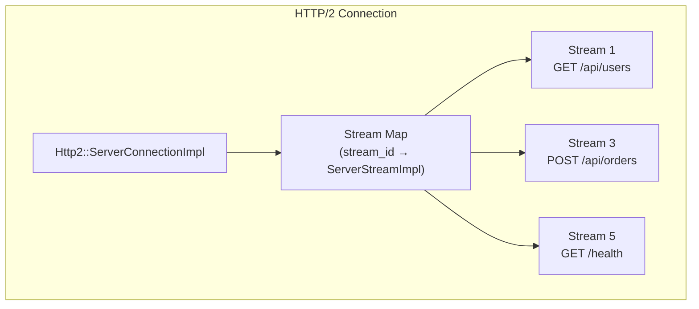

## From Codec to ActiveStream

### The Handoff Pattern

The codec-to-HCM interaction follows a producer-consumer pattern:

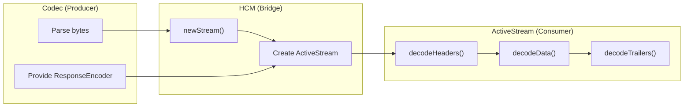

The key contract:
1. Codec calls `ServerConnectionCallbacks::newStream(encoder)` to get a `RequestDecoder`
2. Codec then calls `decodeHeaders()`, `decodeData()`, `decodeTrailers()` on that decoder
3. The decoder (ActiveStream) owns the `ResponseEncoder` for sending the response back

## ActiveStream::decodeHeaders() — The Big One

`decodeHeaders()` on `ActiveStream` is where HTTP processing truly begins:

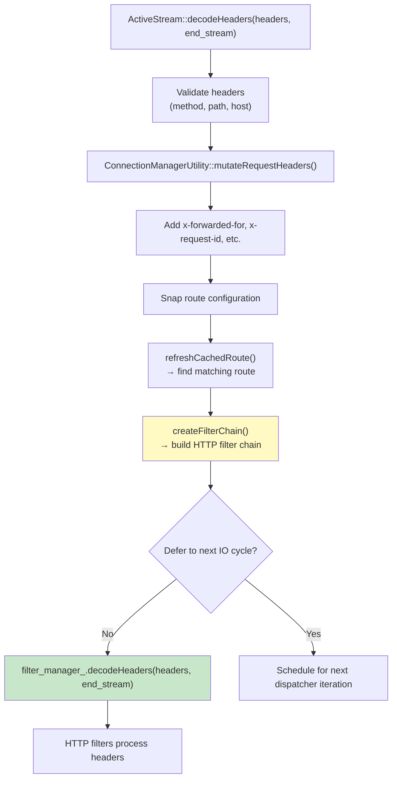

```
File: source/common/http/conn_manager_impl.cc (lines ~1260-1340)

decodeHeaders(headers, end_stream):
    1. Request validation (method, path, content-length)
    2. mutateRequestHeaders() → add proxy headers
    3. Snap route config (RDS/scoped routes)
    4. refreshCachedRoute() → route resolution
    5. createFilterChain() → build HTTP filter chain
    6. filter_manager_.decodeHeaders() → start filter iteration
```

## Response Encoding

When a response is ready (from upstream or local reply), the encode path goes through the codec:

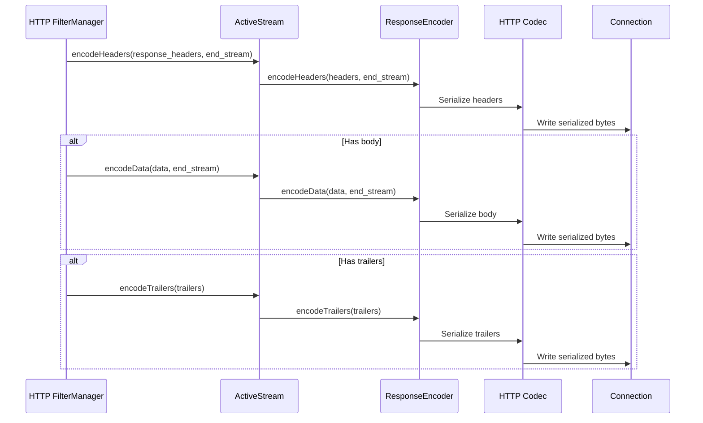

## Protocol Detection (AUTO Codec)

When `codec_type: AUTO`, Envoy peeks at the first bytes to determine the protocol:

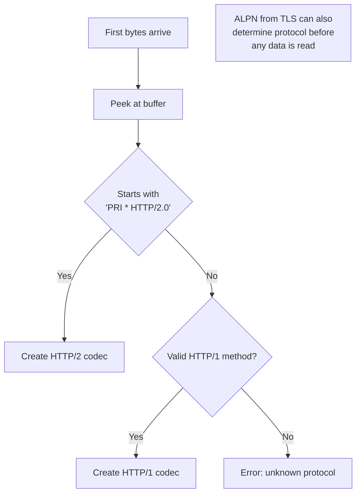

## Key Source Files

| File | Lines | What It Does |
|------|-------|-------------|
| `envoy/http/codec.h` | 145-450 | All codec interfaces |
| `source/common/http/http1/codec_impl.h` | — | HTTP/1.1 server codec |
| `source/common/http/http1/codec_impl.cc` | 1144-1164 | HTTP/1 newStream and decodeHeaders |
| `source/common/http/http2/codec_impl.h` | — | HTTP/2 server codec |
| `source/common/http/http2/codec_impl.cc` | 675, 2200 | HTTP/2 stream creation |
| `source/common/http/conn_manager_impl.cc` | 324-379 | `newStream()` |
| `source/common/http/conn_manager_impl.cc` | 394-414 | `createCodec()` |
| `source/common/http/conn_manager_impl.cc` | 415-467 | `onData()` dispatches to codec |
| `source/common/http/conn_manager_impl.cc` | ~1260-1340 | `ActiveStream::decodeHeaders()` |

---

**Previous:** [Part 7 — HTTP Connection Manager](07-http-connection-manager.md)  
**Next:** [Part 9 — HTTP Filter Manager: Decode and Encode Paths](09-http-filter-manager.md)
