# Part 9: HTTP Filter Manager — Decode and Encode Paths

## Overview

The HTTP `FilterManager` is the heart of Envoy's L7 processing. It manages two ordered chains of filters — **decoder filters** for request processing and **encoder filters** for response processing — and drives iteration through them with careful state management for buffering, watermarks, and local replies.

## FilterManager Architecture

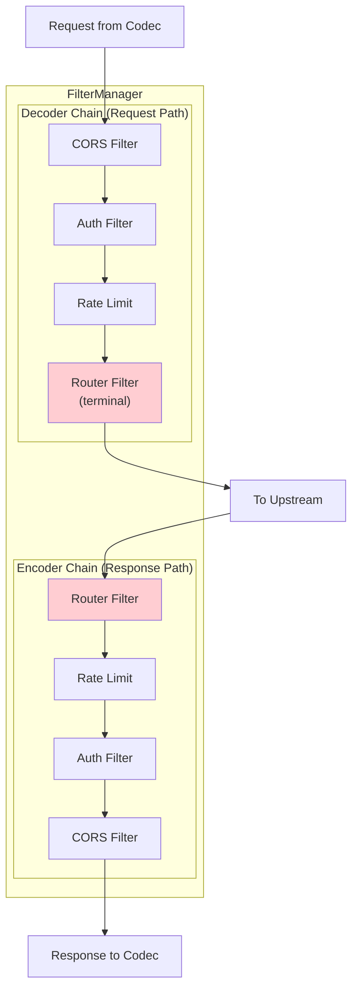

**Key insight:** Decoder filters run in configuration order (A→B→C→Router). Encoder filters run in **reverse** order (Router→C→B→A).

## Key Classes

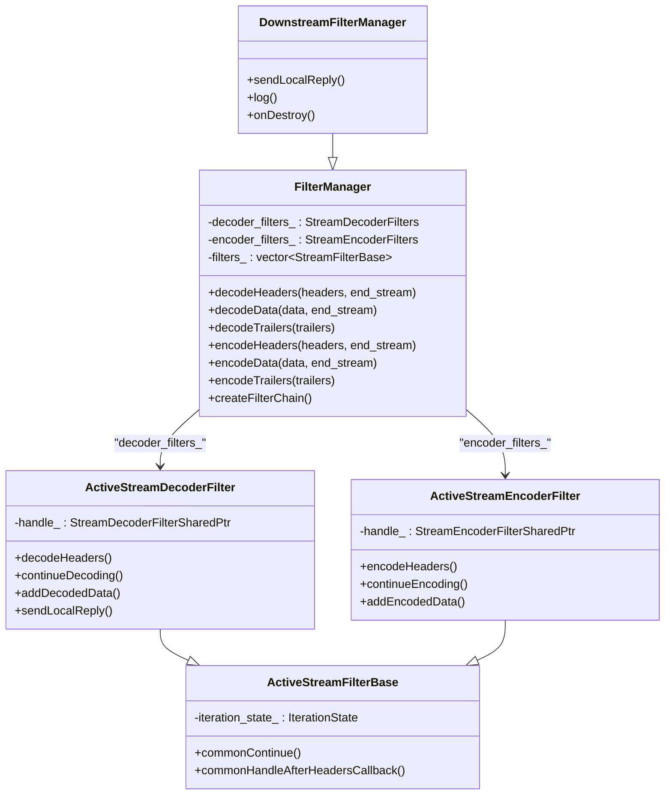

**Location:** `source/common/http/filter_manager.h` (lines 434-768)

## HTTP Filter Interfaces

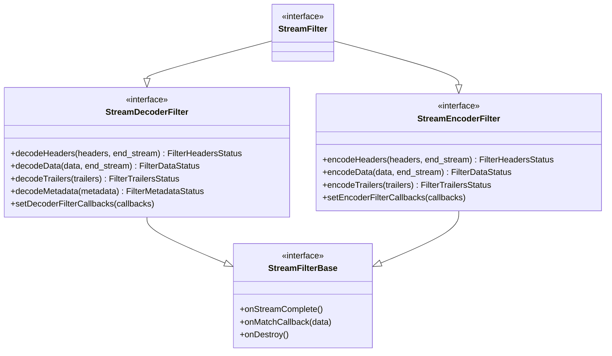

**Location:** `envoy/http/filter.h` (lines 619-836)

## Filter Chain Creation

### How HTTP Filter Factories Work

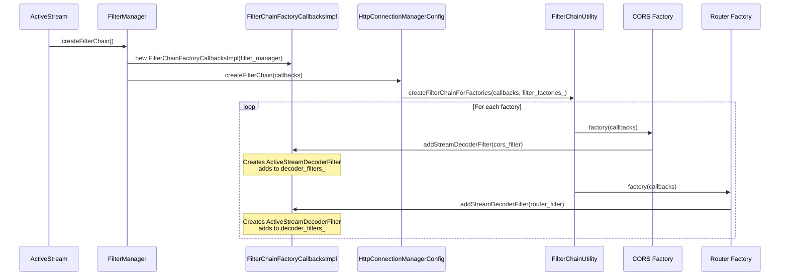

### FilterChainFactoryCallbacksImpl

This wrapper receives filter instances and creates the appropriate active filter wrappers:

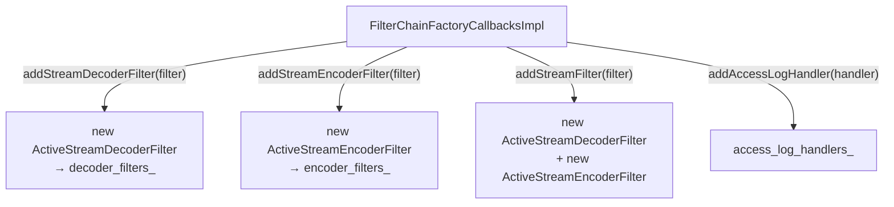

```
File: source/common/http/filter_manager.h (lines 648-676)

FilterChainFactoryCallbacksImpl:
    addStreamDecoderFilter(filter) → wraps in ActiveStreamDecoderFilter
    addStreamEncoderFilter(filter) → wraps in ActiveStreamEncoderFilter
    addStreamFilter(filter) → adds to BOTH chains
    addAccessLogHandler(handler) → stores for access logging
```

```
File: source/common/http/filter_chain_helper.cc (lines 18-45)

createFilterChainForFactories(callbacks, filter_factories):
    For each factory in filter_factories:
        config = provider.config()
        if missing → return false (ECDS not ready)
        config.value()(callbacks)  // invoke the factory lambda
```

## Decoder Path (Request Processing)

### Iteration Order

Decoder filters are iterated in **forward order** (first added = first called):

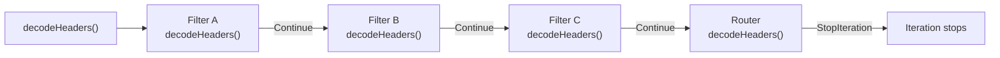

### decodeHeaders() Flow

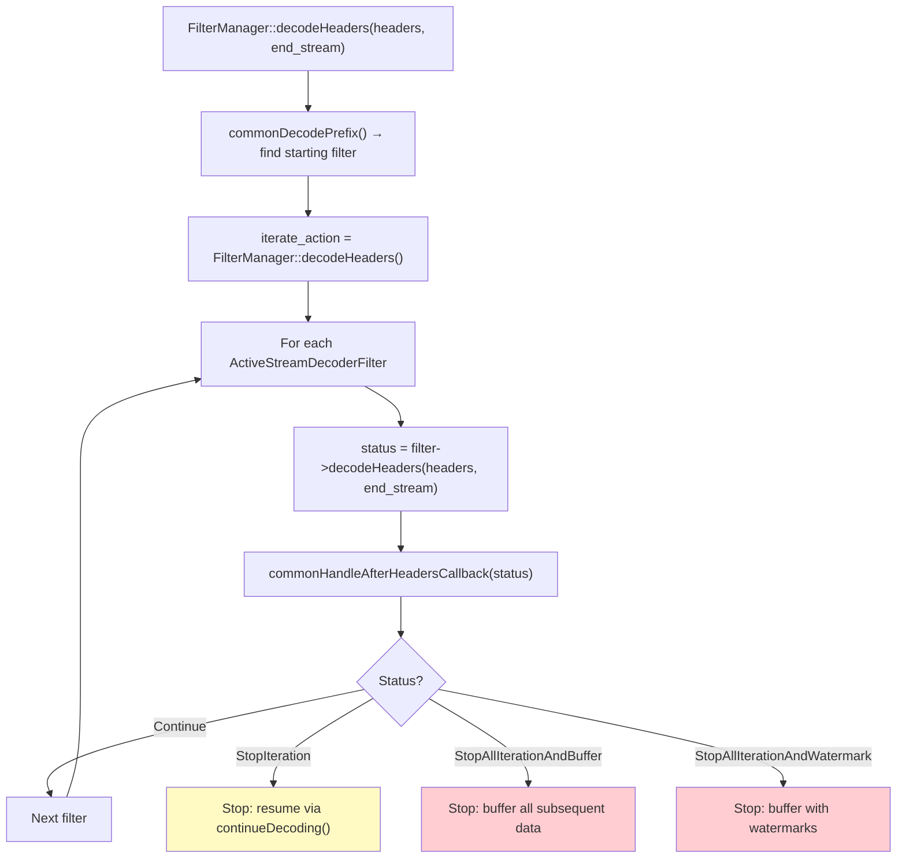

```
File: source/common/http/filter_manager.cc (lines 361-434)

decodeHeaders(headers, end_stream):
    For each decoder filter (forward order):
        1. Set filter's end_stream flag
        2. status = filter->handle_->decodeHeaders(headers, end_stream)
        3. commonHandleAfterHeadersCallback(status, end_stream)
           - Continue → advance
           - StopIteration → stop, filter will call continueDecoding()
           - StopAllBuffer → stop, buffer all following data
           - StopAllWatermark → stop, buffer with watermark control
```

### decodeData() and decodeTrailers()

Same pattern — iterate forward, call each filter, handle stop/continue:

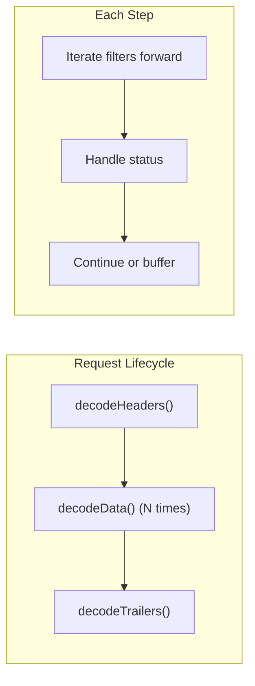

## Encoder Path (Response Processing)

### Iteration Order

Encoder filters are iterated in **reverse order** (last added = first called):

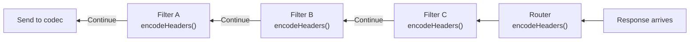

### encodeHeaders() Flow

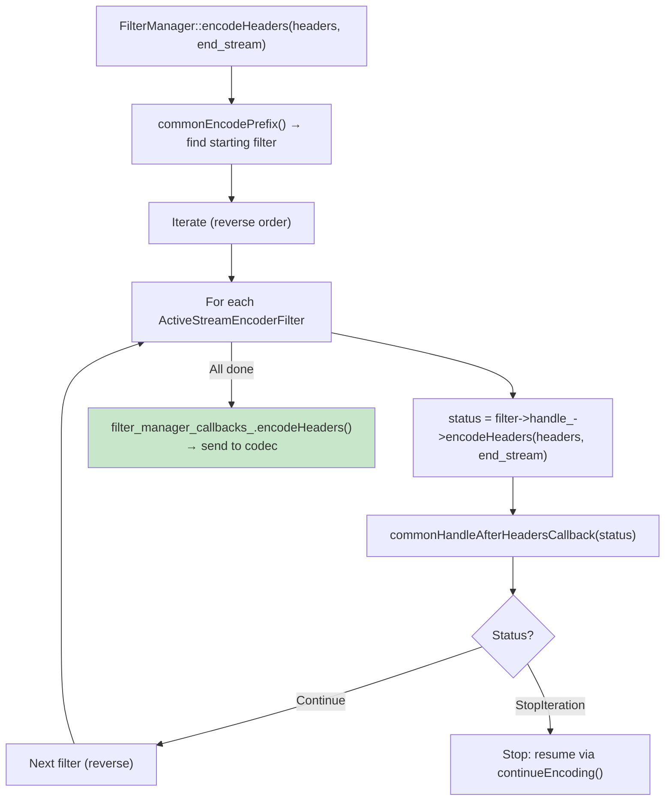

## Iteration States

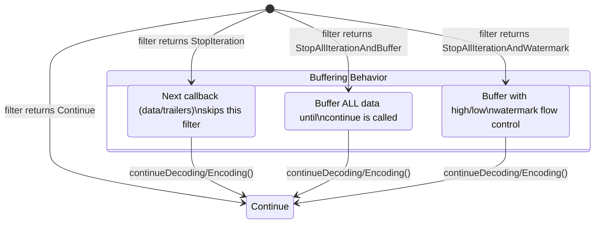

### What Each Status Means

| Status | Effect on Headers | Effect on Data | Effect on Trailers |
|--------|------------------|----------------|-------------------|
| `Continue` | Pass to next filter | Pass to next filter | Pass to next filter |
| `StopIteration` | Stop at this filter | Data skips this filter until `continue` | Trailers skip until `continue` |
| `StopAllIterationAndBuffer` | Stop at this filter | Buffer all data | Buffer trailers |
| `StopAllIterationAndWatermark` | Stop at this filter | Buffer with watermarks | Buffer trailers |

## Resuming Iteration with continueDecoding()

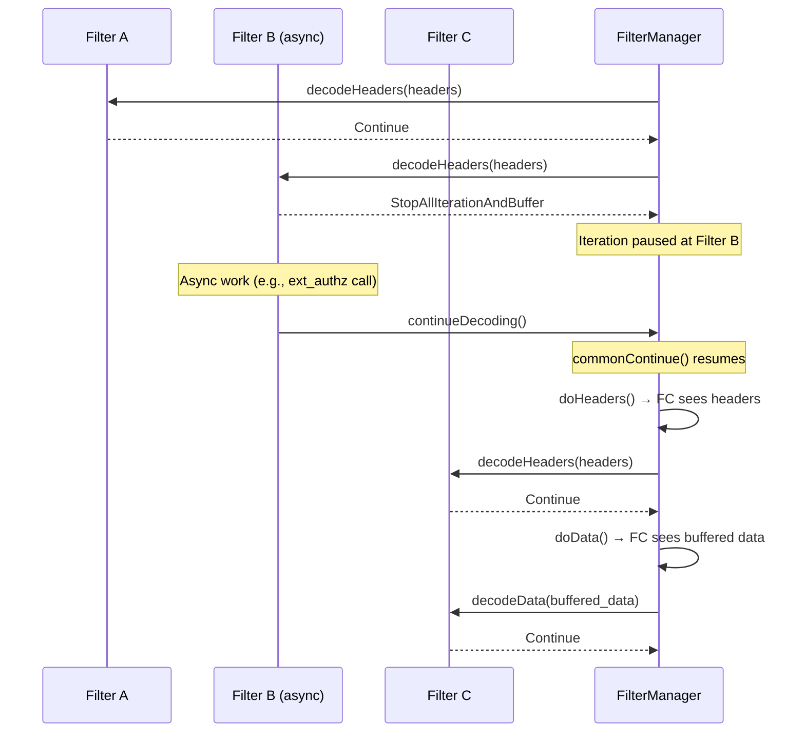

```
File: source/common/http/filter_manager.h (lines ~160-180)

commonContinue():
    1. doHeaders(headers) → resume headers iteration from next filter
    2. doData(data) → resume data iteration if data was buffered
    3. doTrailers(trailers) → resume trailers if buffered
    4. doMetadata() → resume metadata if buffered
```

## Filter Sending a Local Reply

Any filter can short-circuit the request by sending a local reply:

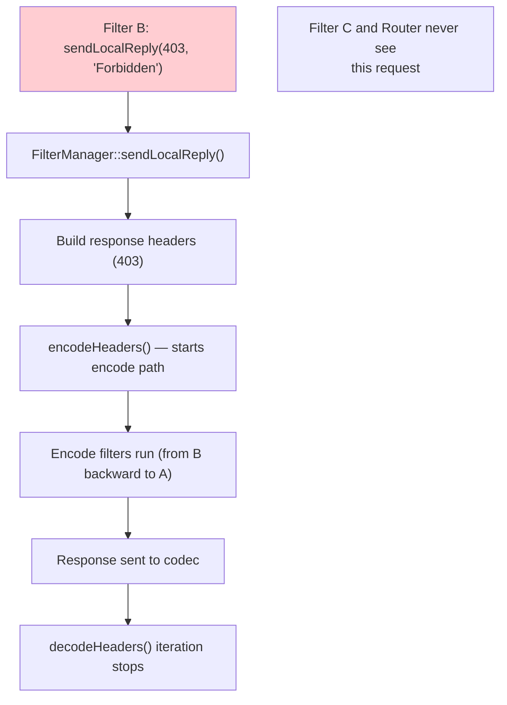

## Dual Filters (StreamFilter)

Many filters implement both decode and encode interfaces:

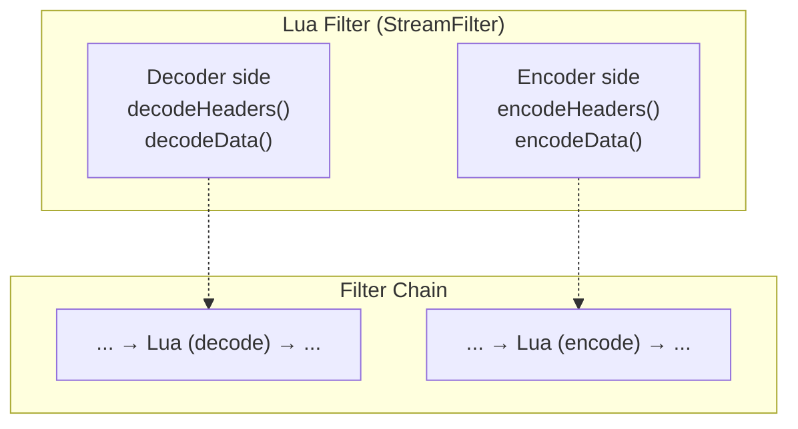

When added via `addStreamFilter()`, the same filter object gets **two** wrappers — an `ActiveStreamDecoderFilter` and an `ActiveStreamEncoderFilter`. The filter sees both the request and response.

## Typical HTTP Filter Chain

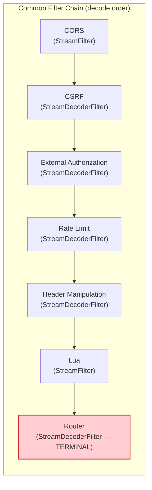

## Key Source Files

| File | Lines | What It Does |
|------|-------|-------------|
| `source/common/http/filter_manager.h` | 434-768 | `FilterManager` class |
| `source/common/http/filter_manager.h` | 771-1084 | `DownstreamFilterManager` |
| `source/common/http/filter_manager.h` | 225-299 | `ActiveStreamDecoderFilter` |
| `source/common/http/filter_manager.h` | 304-343 | `ActiveStreamEncoderFilter` |
| `source/common/http/filter_manager.h` | 106-221 | `ActiveStreamFilterBase` |
| `source/common/http/filter_manager.h` | 648-676 | `FilterChainFactoryCallbacksImpl` |
| `source/common/http/filter_manager.cc` | 361-434 | `decodeHeaders()` iteration |
| `source/common/http/filter_manager.cc` | 436-516 | `decodeData()` iteration |
| `source/common/http/filter_manager.cc` | 754-831 | `encodeHeaders()` iteration |
| `source/common/http/filter_chain_helper.cc` | 18-45 | `createFilterChainForFactories()` |
| `envoy/http/filter.h` | 619-836 | HTTP filter interfaces |

---

**Previous:** [Part 8 — HTTP Codec Layer](08-http-codec.md)  
**Next:** [Part 10 — Router Filter and Upstream Request Flow](10-router-filter.md)
