# Part 10: Router Filter and Upstream Request Flow

## Overview

The Router filter is the **terminal decoder filter** in the HTTP filter chain. It is responsible for resolving routes, selecting upstream clusters and hosts, creating connection pools, and forwarding the request upstream. It is the bridge between the downstream HTTP filter chain and the upstream network.

## Router's Role in the Architecture

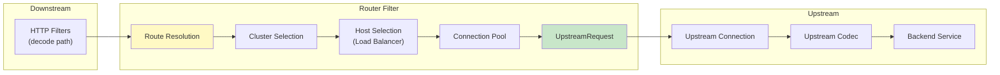

## Router Filter Class

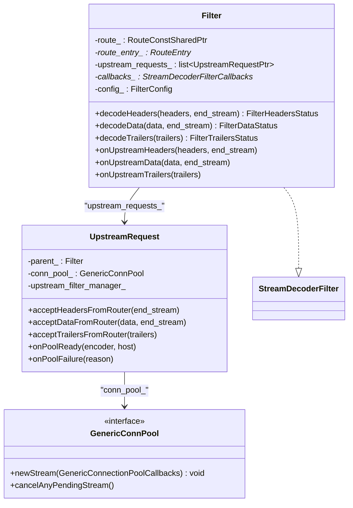

**Location:** `source/common/router/router.h` (lines 262-434)

## Route Resolution

### How Routes Are Found

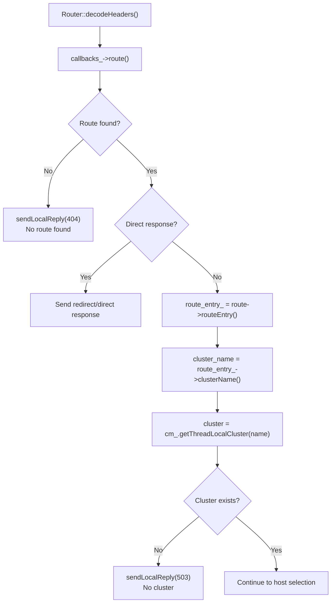

Route resolution happens earlier in `ActiveStream::decodeHeaders()` via `refreshCachedRoute()`, but the Router filter accesses the cached route via `callbacks_->route()`.

```
File: source/common/router/router.cc (lines 364-448)

decodeHeaders():
    1. route_ = callbacks_->route()
    2. if (!route_) → 404
    3. Check for direct response → handle redirect
    4. route_entry_ = route_->routeEntry()
    5. cluster = cm_.getThreadLocalCluster(route_entry_->clusterName())
    6. if (!cluster) → 503
```

### Route Interfaces

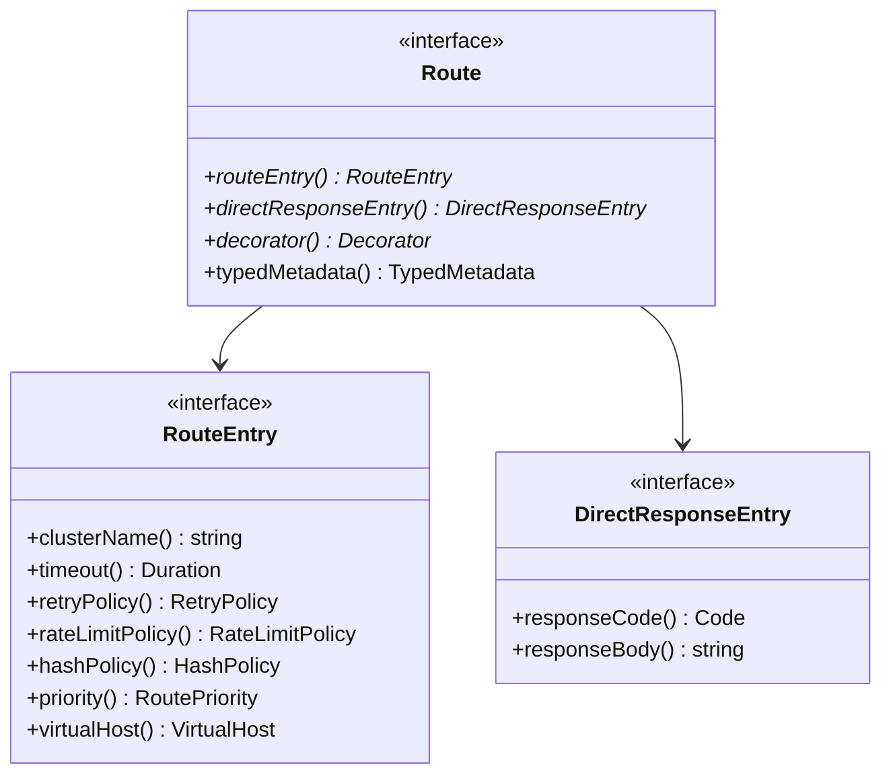

## Host Selection and Load Balancing

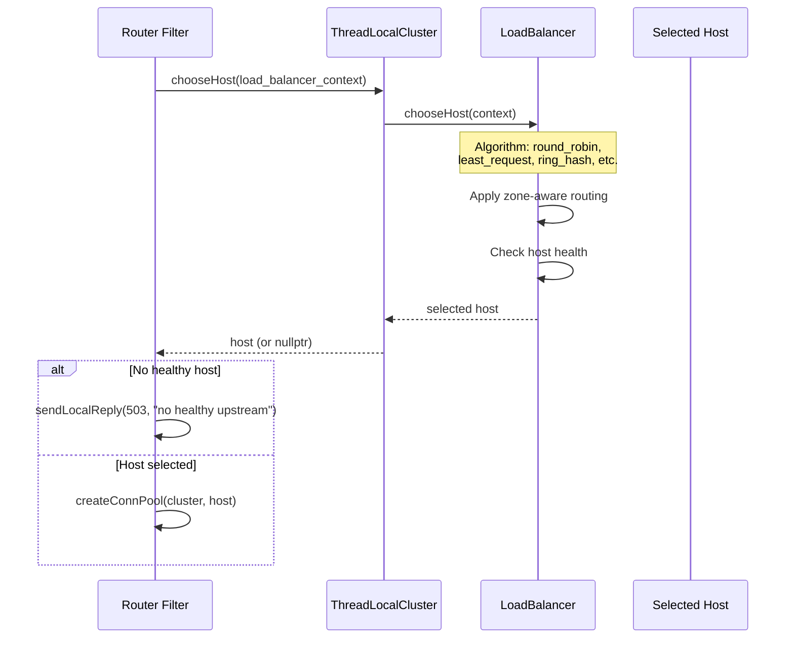

## Creating the Upstream Request

### Connection Pool and UpstreamRequest Creation

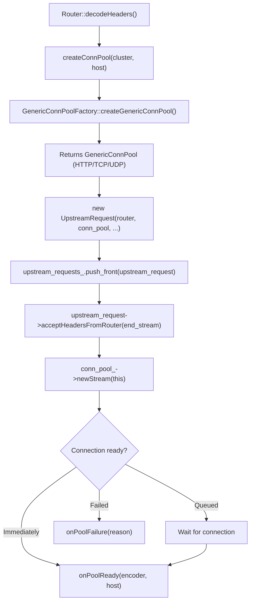

```
File: source/common/router/router.cc (lines 624-749)

continueDecodeHeaders():
    1. createConnPool(cluster, host) → GenericConnPool
    2. new UpstreamRequest(this, conn_pool, ...)
    3. upstream_requests_.push_front(request)
    4. request->acceptHeadersFromRouter(end_stream)
       → conn_pool_->newStream(this)  // starts connection pooling
```

### UpstreamRequest and Upstream Filter Chain

`UpstreamRequest` has its own filter chain for upstream processing:

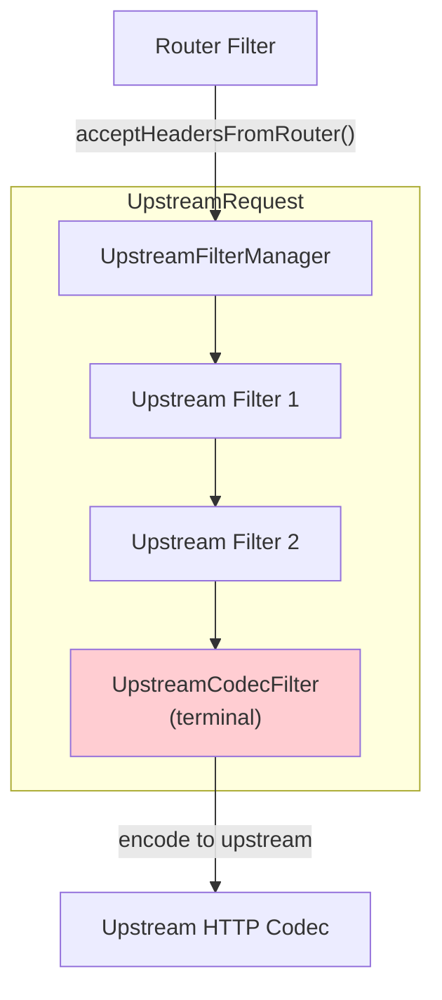

```
File: source/common/router/upstream_request.h (lines 42-66)

Payload arrives via accept[X]fromRouter functions:
    → Passed to UpstreamFilterManager
    → Filters process (if any upstream HTTP filters configured)
    → UpstreamCodecFilter (terminal) encodes to upstream codec
```

## onPoolReady — Connection Available

When a connection is available from the pool:

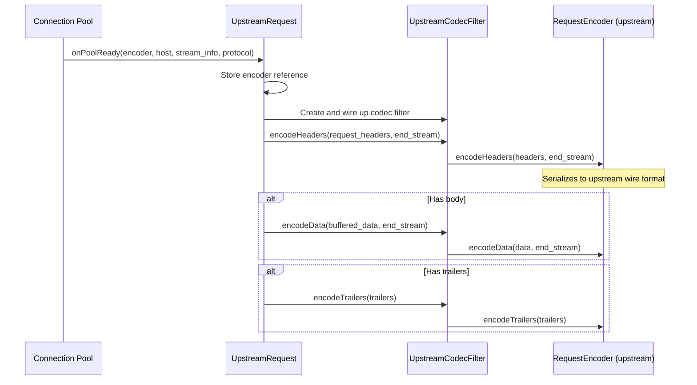

## Retry Handling

The Router filter implements retry logic:

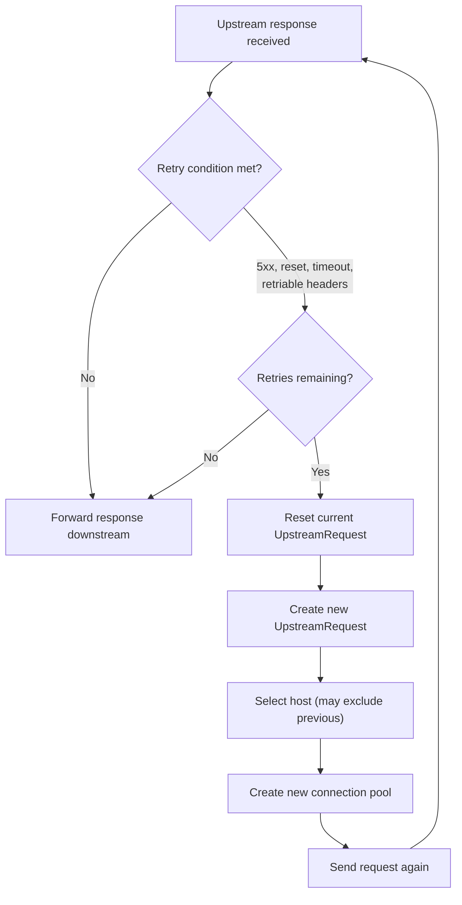

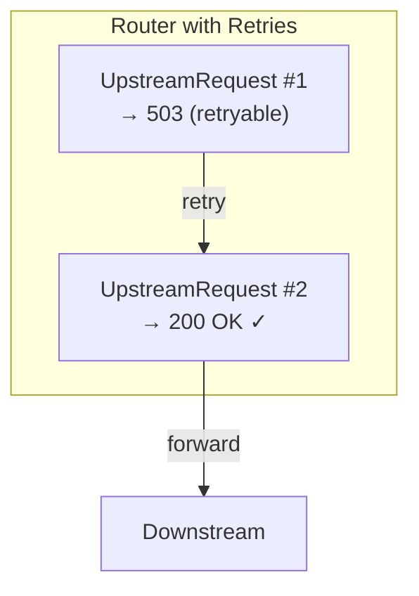

## Shadowing (Traffic Mirroring)

The Router can also shadow requests to additional clusters:

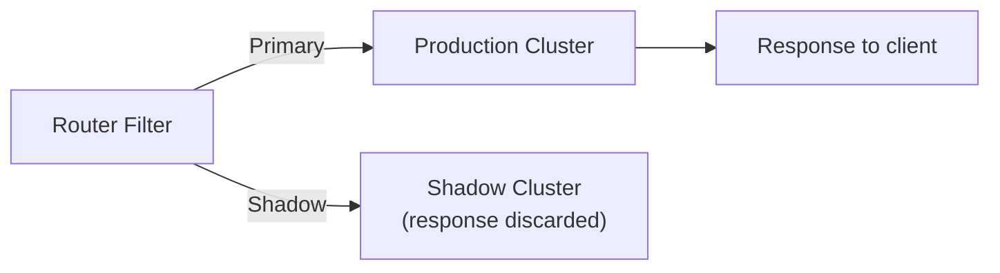

## Router decodeHeaders() — Complete Flow

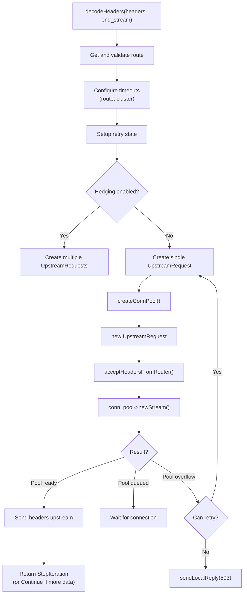

## Data and Trailers Forwarding

After headers, the Router forwards body and trailers:

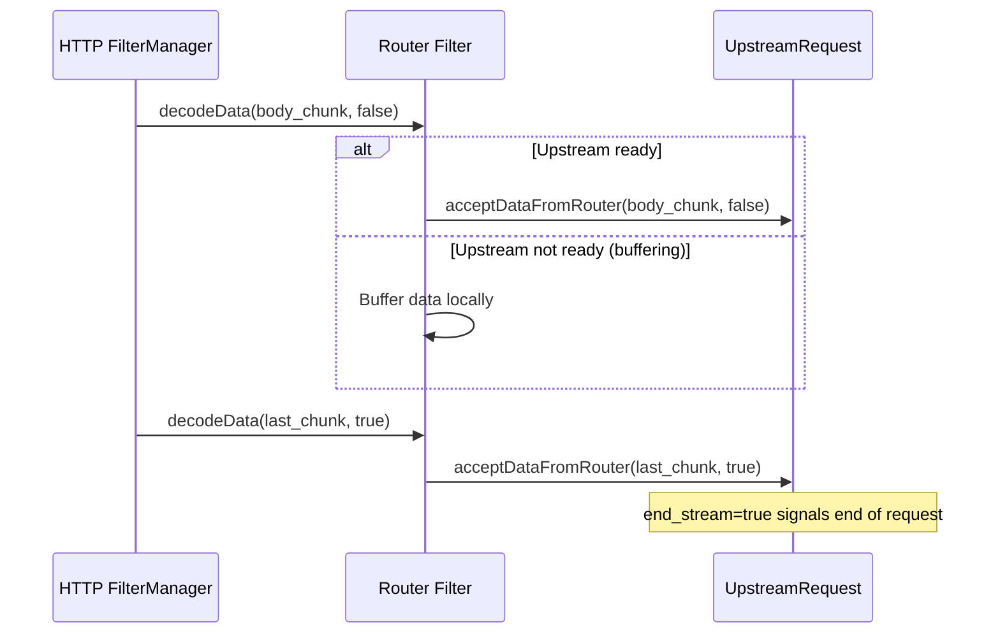

## Key Source Files

| File | Lines | What It Does |
|------|-------|-------------|
| `source/common/router/router.h` | 262-434 | Router `Filter` class |
| `source/common/router/router.cc` | 364-432 | `decodeHeaders()` — route resolution |
| `source/common/router/router.cc` | 585 | Host selection |
| `source/common/router/router.cc` | 624-749 | `continueDecodeHeaders()` — conn pool + upstream request |
| `source/common/router/router.cc` | 752-786 | `createConnPool()` |
| `source/common/router/upstream_request.h` | 42-66 | `UpstreamRequest` class |
| `source/common/router/upstream_request.cc` | ~376 | `acceptHeadersFromRouter()` → `newStream()` |
| `source/extensions/filters/http/router/config.h` | 23 | Router is terminal filter |
| `source/extensions/filters/http/router/config.cc` | 15-21 | Router factory |
| `envoy/router/router.h` | 636-848 | Route interfaces |

---

**Previous:** [Part 9 — HTTP Filter Manager](09-http-filter-manager.md)  
**Next:** [Part 11 — Connection Pools and Upstream Connections](11-connection-pools.md)
