# Part 11: Connection Pools and Upstream Connections

## Overview

Connection pools manage the lifecycle of upstream connections. They maintain pools of ready, busy, and connecting connections to upstream hosts, multiplex streams over HTTP/2 connections, handle connection draining, and implement preconnect logic. The pool is the interface between the Router filter and the actual upstream network.

## Connection Pool Architecture

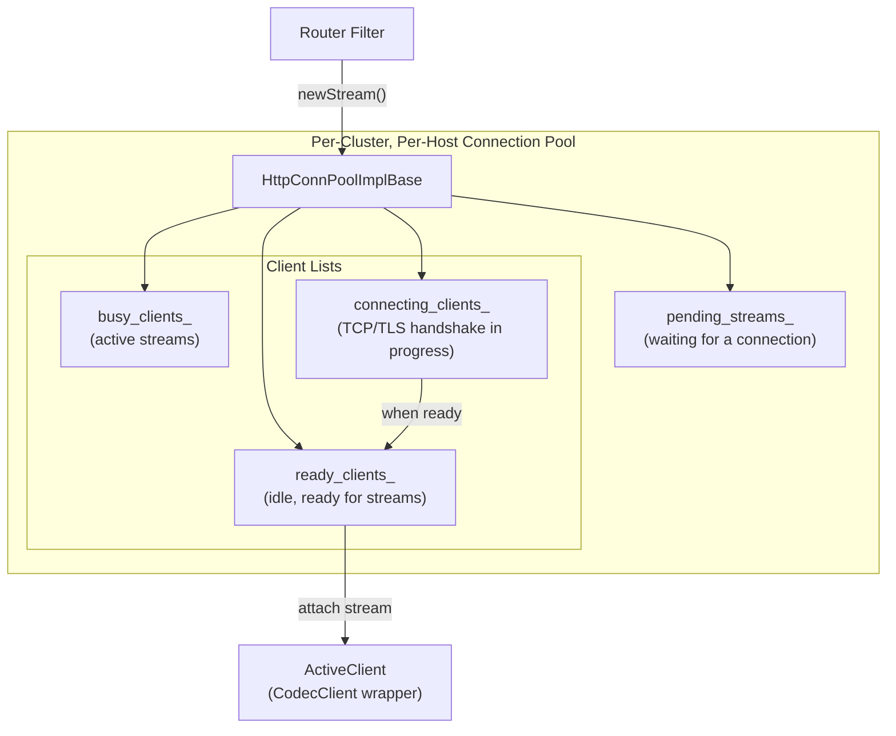

## Class Hierarchy

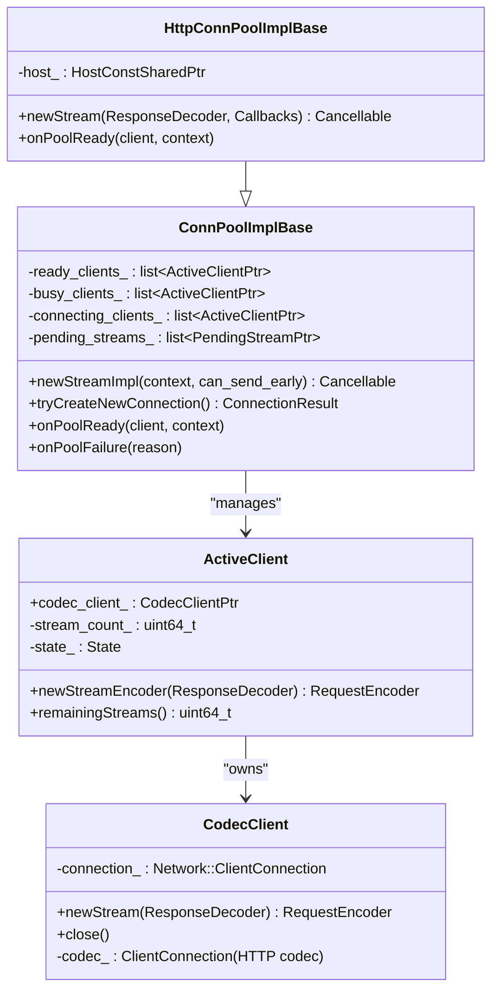

**Location:** `source/common/conn_pool/conn_pool_base.h`, `source/common/http/conn_pool_base.h`

## Connection Pool Flow

### newStream() — Requesting a Connection

```mermaid
flowchart TD
    A["Router: conn_pool->newStream(decoder, callbacks)"] --> B["HttpConnPoolImplBase::newStream()"]
    B --> C["Create HttpPendingStream"]
    C --> D["newStreamImpl(context)"]
    D --> E{Ready client available?}
    
    E -->|Yes| F["attachToClient(ready_client)"]
    F --> G["onPoolReady(client, context)"]
    G --> H["encoder = client.newStreamEncoder(decoder)"]
    H --> I["callbacks.onPoolReady(encoder, host)"]
    
    E -->|No| J{Can create new connection?}
    J -->|Yes| K["tryCreateNewConnection()"]
    K --> L["createCodecClient(host)"]
    L --> M["host->createConnection(dispatcher)"]
    M --> N["Add to connecting_clients_"]
    N --> O["Queue pending_stream"]
    
    J -->|No (at limit)| P{Overflow?}
    P -->|No| O
    P -->|Yes| Q["onPoolFailure(Overflow)"]
```

### Connection Lifecycle

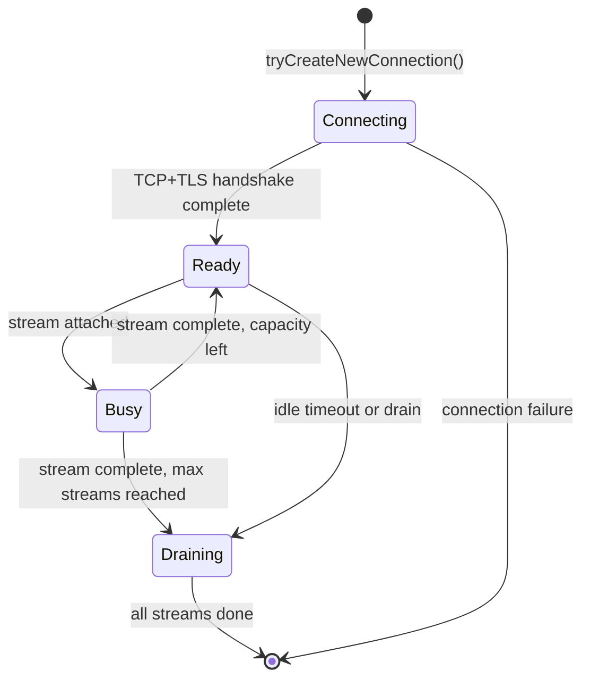

### Connection Ready — onPoolReady()

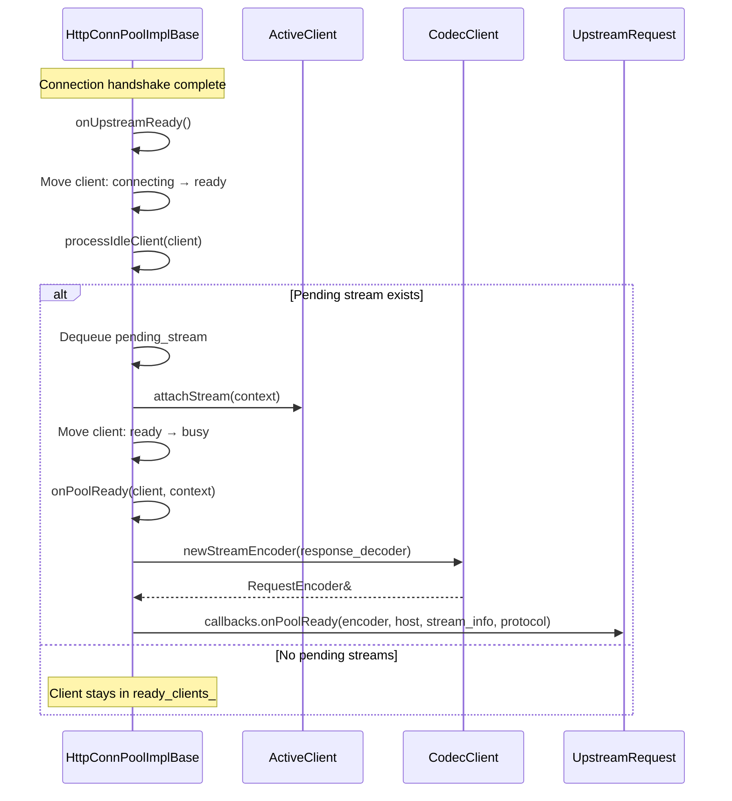

```
File: source/common/http/conn_pool_base.h (lines 62-80)

onPoolReady(client, context):
    1. Cast to HTTP ActiveClient
    2. encoder = http_client->newStreamEncoder(response_decoder)
    3. callbacks.onPoolReady(encoder, host, stream_info, protocol)
```

## ActiveClient — Connection Wrapper

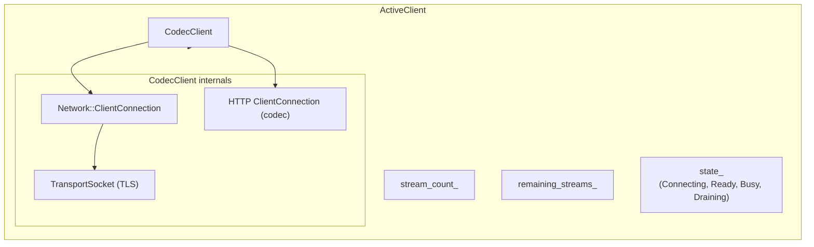

### ActiveClient Initialization

```
File: source/common/http/conn_pool_base.h (lines 98-137)

ActiveClient::initialize():
    1. host()->createConnection(dispatcher, socketOptions, transportSocketOptions)
       → Creates Network::ClientConnection with TransportSocket
    2. createCodecClient(data)
       → Creates CodecClient wrapping the connection
    3. codec_client_->addConnectionCallbacks(this)
    4. codec_client_->setConnectionCloseListener(...)
```

### CodecClient

`CodecClient` wraps a network connection + HTTP codec as a unified client:

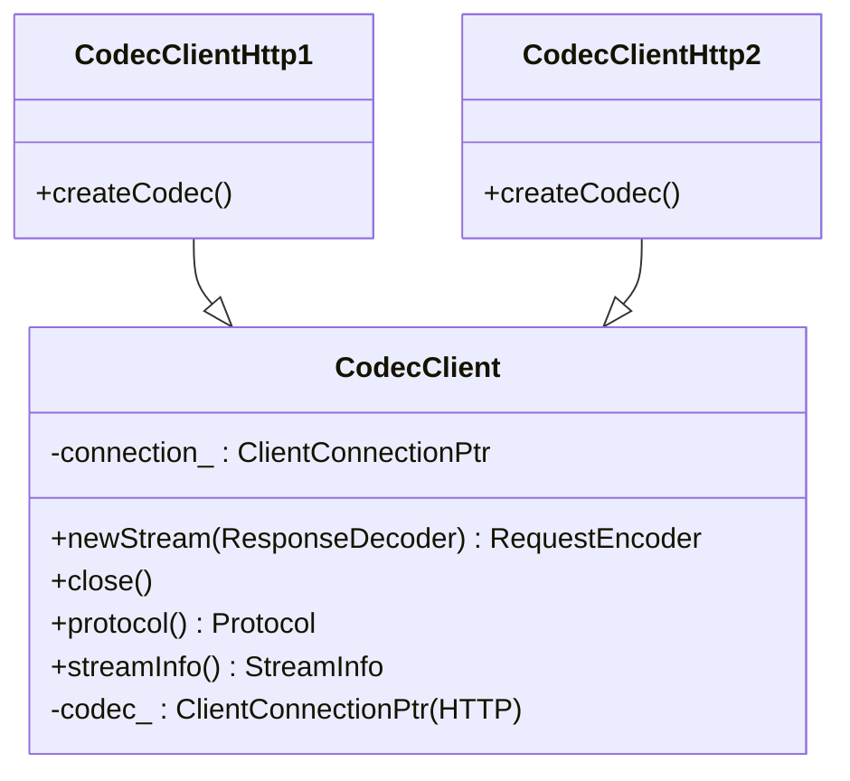

## HTTP/1 vs HTTP/2 Connection Pools

### HTTP/1.1 — One Stream per Connection

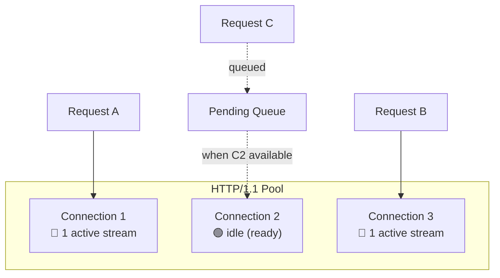

### HTTP/2 — Multiple Streams per Connection

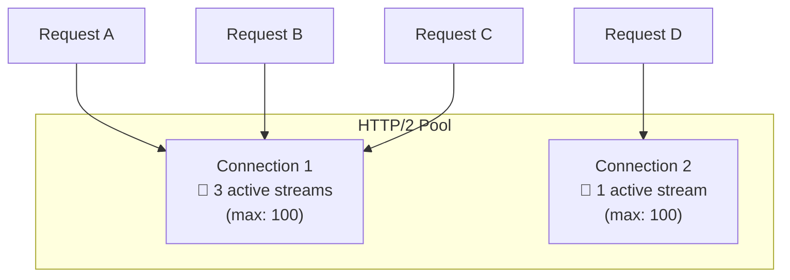

HTTP/2 pool can multiplex many streams over a single connection. The `max_concurrent_streams` setting (from SETTINGS frame or config) controls how many streams a single connection can handle.

## Upstream Connection Creation

### Host::createConnection()

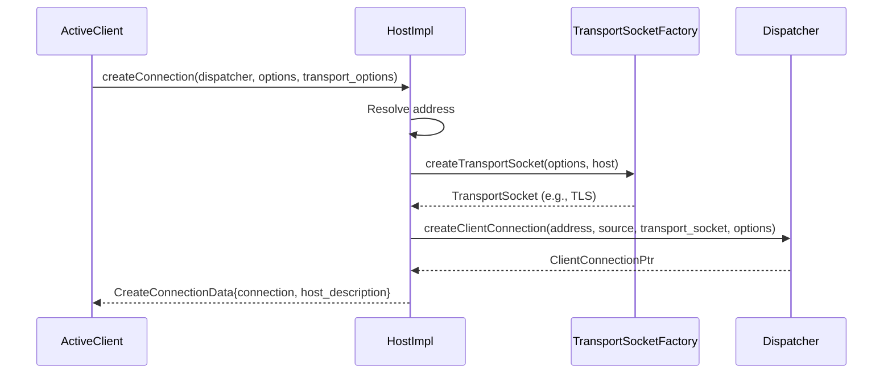

```
File: source/common/upstream/upstream_impl.cc (lines 477-503)

createConnection():
    1. Resolve transport socket factory (may use transport socket match criteria)
    2. factory.createTransportSocket(options, host)
    3. dispatcher.createClientConnection(address, source_addr, transport_socket, ...)
    4. Return {connection, host_description}
```

## Connection Pool Limits and Flow Control

### Key Limits

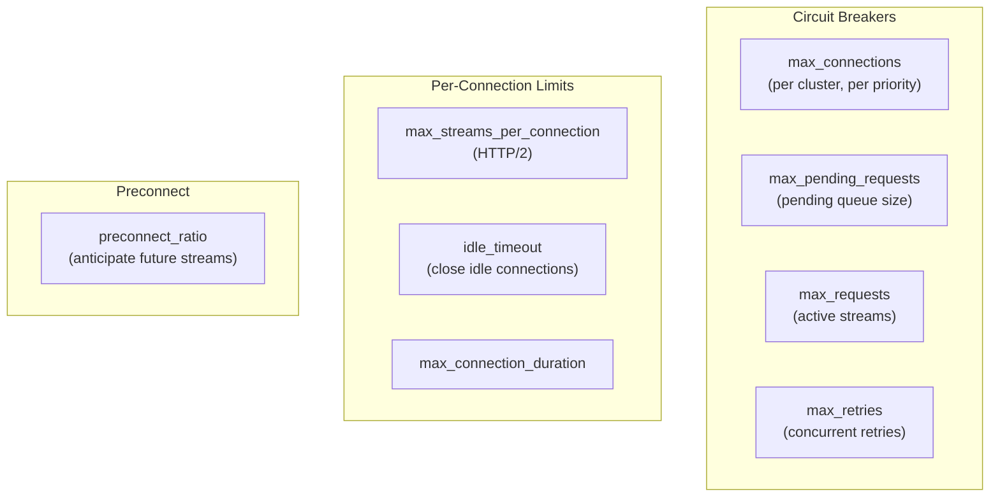

### Preconnect Logic

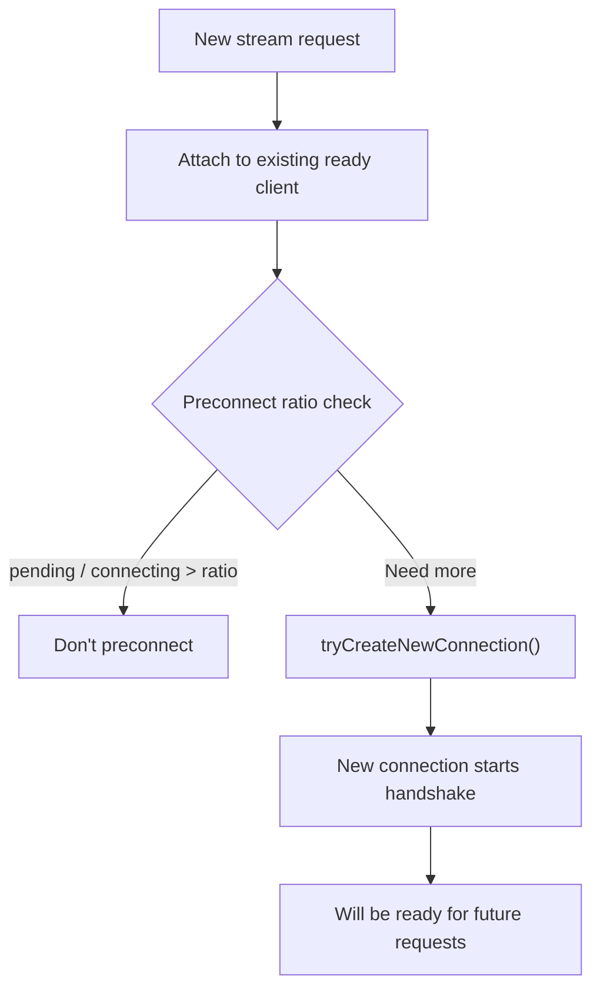

## Connection Pool Failure Handling

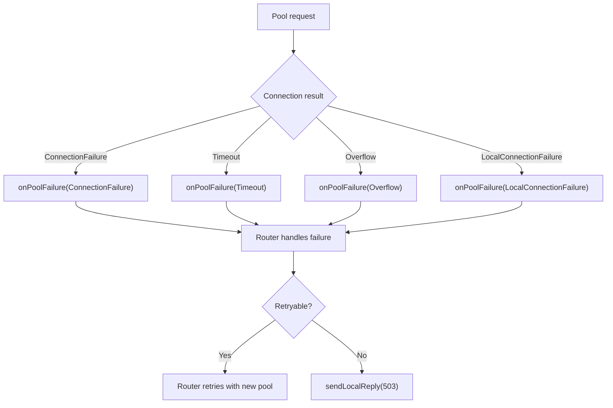

## Key Source Files

| File | Lines | What It Does |
|------|-------|-------------|
| `source/common/conn_pool/conn_pool_base.h` | 173-391 | `ConnPoolImplBase` — base pool logic |
| `source/common/http/conn_pool_base.h` | 52-95 | `HttpConnPoolImplBase` — HTTP pool |
| `source/common/http/conn_pool_base.h` | 62-80 | `onPoolReady()` — stream attachment |
| `source/common/http/conn_pool_base.h` | 98-137 | `ActiveClient` — connection wrapper |
| `source/common/http/codec_client.h` | — | `CodecClient` — codec + connection |
| `source/common/upstream/upstream_impl.cc` | 477-503 | `Host::createConnection()` |
| `source/common/router/router.cc` | 752-786 | `createConnPool()` in Router |
| `envoy/upstream/upstream.h` | — | `ThreadLocalCluster`, `Host` interfaces |

---

**Previous:** [Part 10 — Router Filter](10-router-filter.md)  
**Next:** [Part 12 — Response Flow: Upstream to Downstream](12-response-flow.md)
