# Part 12: Response Flow — Upstream to Downstream

## Overview

The response flow is the reverse of the request flow. When an upstream service sends a response, the data travels through the upstream codec, the upstream filter chain, the Router filter, the downstream HTTP filter chain (encoder path), and finally the downstream codec to the client. This document traces this complete return journey.

## End-to-End Response Path

```mermaid
graph RL
    subgraph "Upstream"
        Backend["Backend Service"]
        UConn["Upstream Connection"]
        UCodec["Upstream Codec<br/>(decode response)"]
    end
    
    subgraph "Upstream Filter Chain"
        UCF["UpstreamCodecFilter"]
        UBridge["CodecBridge"]
        UFM["UpstreamFilterManager<br/>(encode direction)"]
        URFMC["UpstreamRequest<br/>FilterManagerCallbacks"]
    end
    
    subgraph "Router"
        URDecode["UpstreamRequest::decode[X]()"]
        RouterCB["Router::onUpstream[X]()"]
    end
    
    subgraph "Downstream Filter Chain"
        HFM["HTTP FilterManager<br/>(encode path, reverse order)"]
        FC["Filter C"]
        FB["Filter B"]
        FA["Filter A"]
    end
    
    subgraph "Downstream"
        DCodec["Downstream Codec<br/>(encode response)"]
        DConn["Downstream Connection"]
        Client["Client"]
    end
    
    Backend --> UConn --> UCodec --> UCF
    UCF --> UBridge --> UFM --> URFMC
    URFMC --> URDecode --> RouterCB
    RouterCB --> HFM --> FC --> FB --> FA
    FA --> DCodec --> DConn --> Client
```

## Step 1: Upstream Bytes → Upstream Codec

When the upstream service sends response bytes:

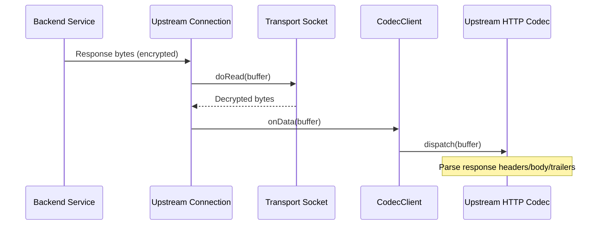

The upstream `CodecClient` acts as the network read filter for the upstream connection. When bytes arrive, the HTTP codec parses them into structured response data.

## Step 2: Codec → UpstreamCodecFilter → CodecBridge

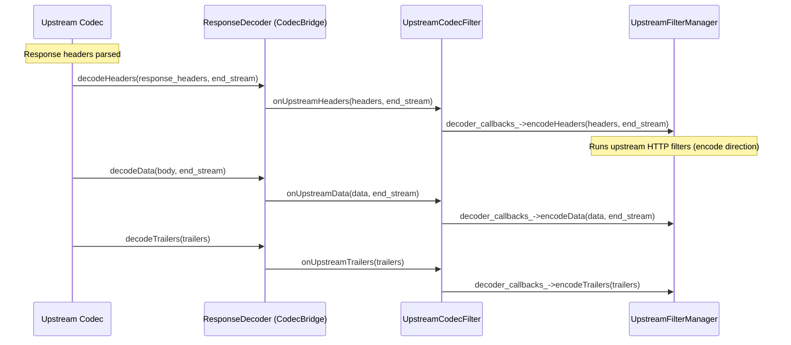

### CodecBridge

The `CodecBridge` (`source/common/router/upstream_codec_filter.h`) implements `ResponseDecoder` and bridges between the upstream codec and the upstream filter chain:

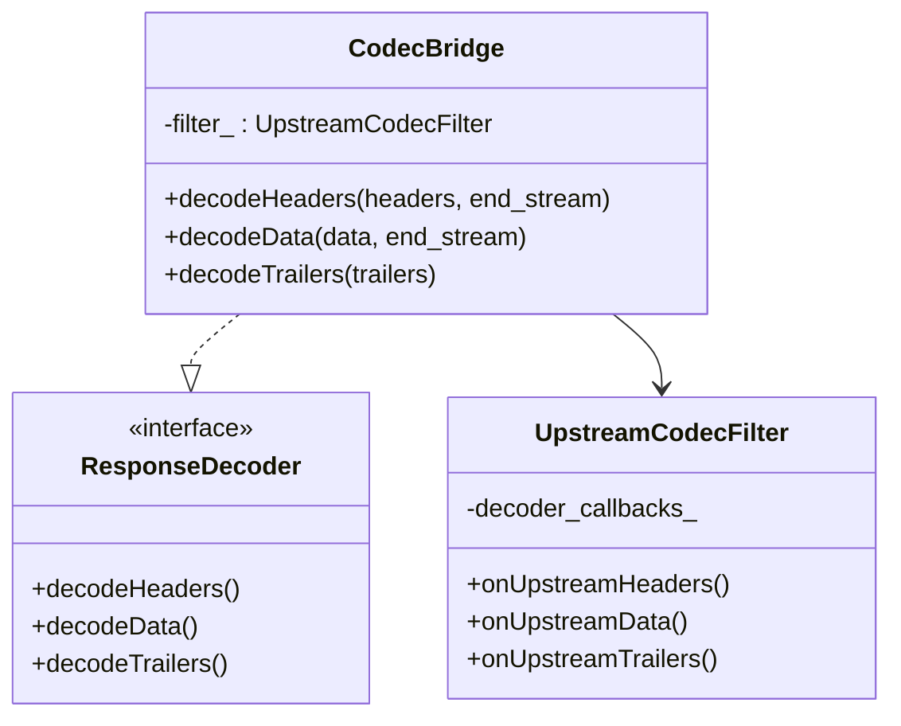

## Step 3: Upstream Filter Manager → UpstreamRequest

After upstream filters process the response, `UpstreamRequestFilterManagerCallbacks` receives it:

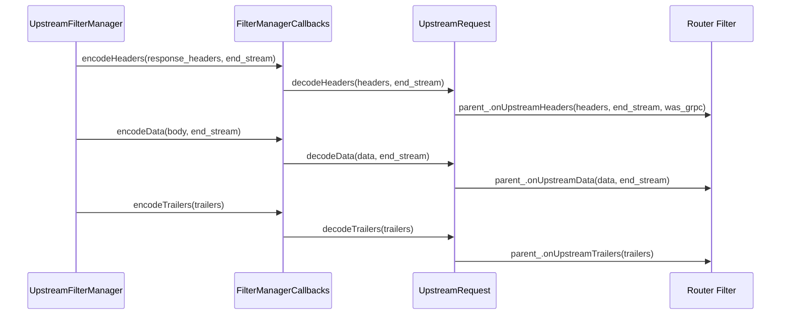

```
File: source/common/router/upstream_request.h (lines 248-258)

UpstreamRequestFilterManagerCallbacks:
    encodeHeaders() → upstream_request_.decodeHeaders()
    encodeData()    → upstream_request_.decodeData()
    encodeTrailers() → upstream_request_.decodeTrailers()
```

## Step 4: Router → Downstream HTTP Filter Chain (Encode Path)

The Router filter receives the response and forwards it to the downstream filter chain:

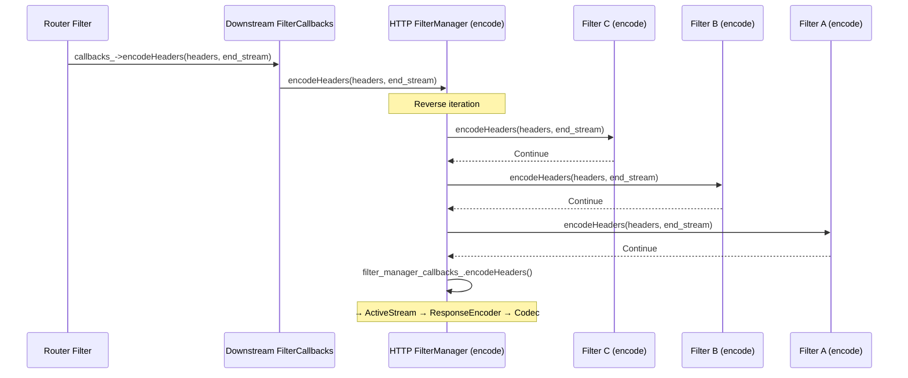

### Encoder Filter Iteration (Reverse Order)

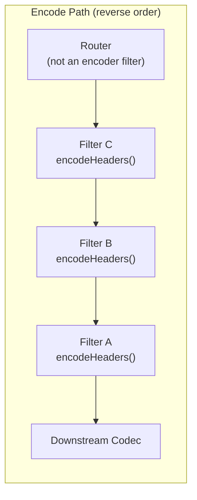

```
File: source/common/http/filter_manager.cc (lines 754-831)

encodeHeaders(headers, end_stream):
    For each encoder filter (REVERSE order):
        status = filter->handle_->encodeHeaders(headers, end_stream)
        If StopIteration → pause, wait for continueEncoding()
        If Continue → next filter
    When all done:
        filter_manager_callbacks_.encodeHeaders(headers, end_stream)
```

## Step 5: ActiveStream → ResponseEncoder → Downstream Codec

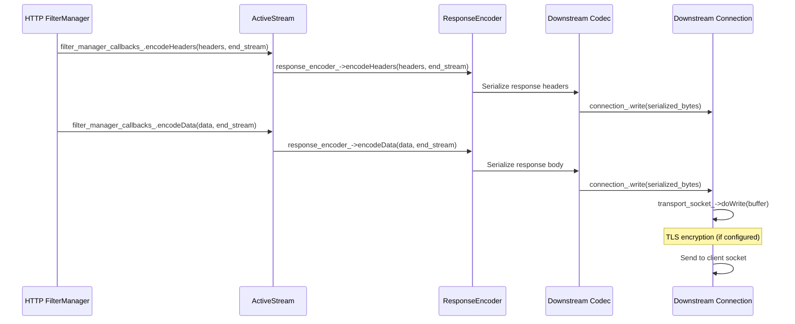

## Step 6: Stream Completion

After the response is fully sent:

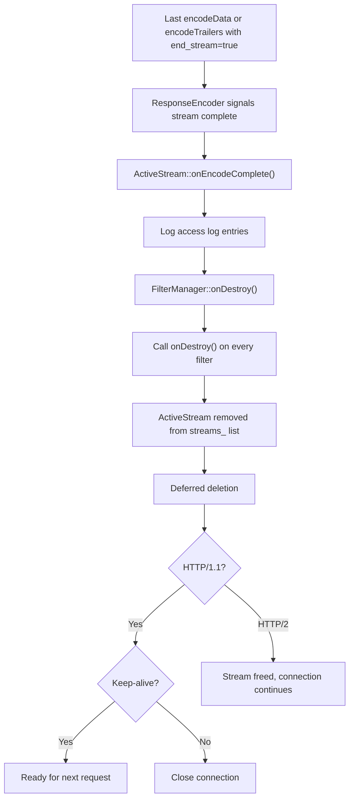

## Local Reply Flow

When a filter generates a response locally (without going upstream):

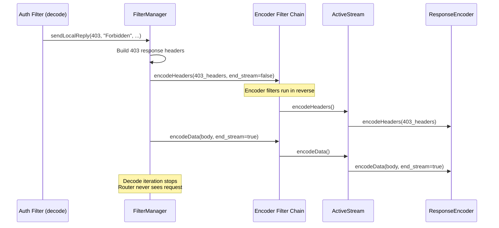

## Complete Data Flow Diagram

```mermaid
graph TB
    subgraph "Request Path (→)"
        C1["Client"] -->|"1"| DConn1["Downstream Connection"]
        DConn1 -->|"2"| DTS1["Transport Socket (decrypt)"]
        DTS1 -->|"3"| NFM1["Network Filters"]
        NFM1 -->|"4"| HCM1["HCM onData()"]
        HCM1 -->|"5"| DCodec1["Downstream Codec (parse)"]
        DCodec1 -->|"6"| AS1["ActiveStream"]
        AS1 -->|"7"| DHFM1["HTTP Filters (decode →)"]
        DHFM1 -->|"8"| Router1["Router"]
        Router1 -->|"9"| CP1["Connection Pool"]
        CP1 -->|"10"| UConn1["Upstream Connection"]
        UConn1 -->|"11"| UTS1["Transport Socket (encrypt)"]
        UTS1 -->|"12"| Backend["Backend"]
    end
    
    subgraph "Response Path (←)"
        Backend -->|"13"| UTS2["Transport Socket (decrypt)"]
        UTS2 -->|"14"| UCodec2["Upstream Codec (parse)"]
        UCodec2 -->|"15"| UCF2["UpstreamCodecFilter"]
        UCF2 -->|"16"| UR2["UpstreamRequest"]
        UR2 -->|"17"| Router2["Router"]
        Router2 -->|"18"| DHFM2["HTTP Filters (← encode)"]
        DHFM2 -->|"19"| AS2["ActiveStream"]
        AS2 -->|"20"| DCodec2["Downstream Codec (serialize)"]
        DCodec2 -->|"21"| DTS2["Transport Socket (encrypt)"]
        DTS2 -->|"22"| C2["Client"]
    end
    
    style Router1 fill:#ffcdd2
    style Router2 fill:#ffcdd2
```

## Watermarks and Flow Control

Response data is flow-controlled through the entire path:

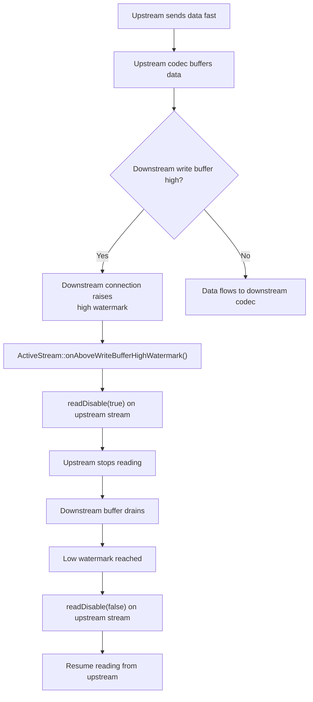

## Error Handling in Response Path

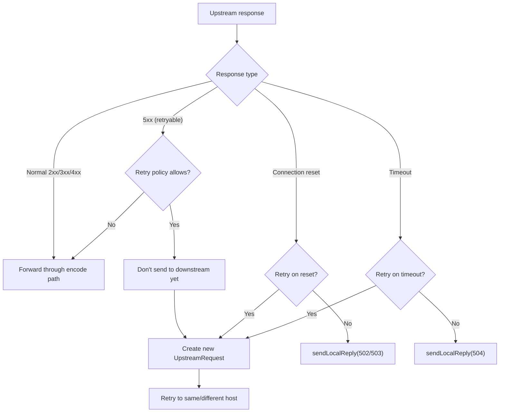

## Key Source Files

| File | Lines | What It Does |
|------|-------|-------------|
| `source/common/router/upstream_codec_filter.h` | 26-74 | `CodecBridge`, `UpstreamCodecFilter` |
| `source/common/router/upstream_request.h` | 248-258 | `UpstreamRequestFilterManagerCallbacks` |
| `source/common/router/router.h` | 416-421 | `onUpstreamHeaders/Data/Trailers()` |
| `source/common/http/filter_manager.cc` | 754-831 | `encodeHeaders()` iteration |
| `source/common/http/filter_manager.cc` | 877-941 | `encodeData()` iteration |
| `source/common/http/conn_manager_impl.h` | 123-220 | `ActiveStream` as `FilterManagerCallbacks` |
| `envoy/http/codec.h` | 145-210 | `ResponseEncoder` interface |
| `source/common/http/filter_manager.h` | 771-1084 | `DownstreamFilterManager` — local reply, access log |

---

**Previous:** [Part 11 — Connection Pools](11-connection-pools.md)  
**Back to:** [Part 1 — Overview](01-overview.md)
