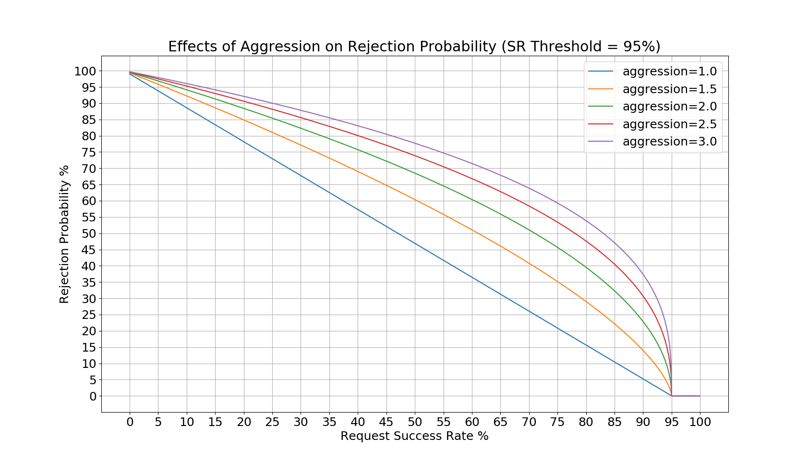

.. _config_http_filters_admission_control:

Admission Control
=================

.. attention::

  The admission control filter is experimental and is currently under active development.

See the :ref:`v3 API reference <envoy_v3_api_msg_extensions.filters.http.admission_control.v3alpha.AdmissionControl>` for details on each configuration parameter.

Overview
--------

The admission control filter probabilistically rejects requests based on the success rate of
previous requests in a configurable sliding time window. It is based on `client-side
throttling <https://landing.google.com/sre/sre-book/chapters/handling-overload/>`_ from the `Google SRE handbook <https://landing.google.com/sre/sre-book/toc/index.html>`_. The only notable difference between the admission control
filter's load shedding and load shedding defined in client-side throttling is that users may
configure how aggressively load shedding starts at a target request success rate. Users may also
configure the definition of a successful request for the purposes of the rejection probability
calculation.

The probability that the filter will reject a request is as follows:

.. math::

   P_{reject} = {(\frac{n_{total} - s}{n_{total} + 1})}^\frac{1}{aggression}

where,

.. math::

   s = \frac{n_{success}}{threshold}

- *n* refers to a request count gathered in the sliding window.
- *threshold* is a configurable value that dictates the lowest request success rate at which the
  filter will **not reject** requests. The value is normalized to [0,1] for the calculation.
- *aggression* controls the rejection probability curve such that 1.0 is a linear increase in
  rejection probability as the success rate decreases. As the **aggression** increases, the
  rejection probability will be higher for higher success rates. See `Aggression`_ for a more
  detailed explanation.

.. note::
   The success rate calculations are performed on a per-thread basis for increased performance. In
   addition, the per-thread isolation prevents decreases the blast radius of a single bad connection
   with an anomalous success rate. Therefore, the rejection probability may vary between worker
   threads.

.. note::
   Health check traffic does not count towards any of the filter's measurements.

See the :ref:`v3 API reference
<envoy_v3_api_msg_extensions.filters.http.admission_control.v3alpha.AdmissionControl>` for more
details on this parameter.

The definition of a successful request is a :ref:`configurable parameter
<envoy_v3_api_msg_extensions.filters.http.admission_control.v3alpha.AdmissionControl.SuccessCriteria>`
for both HTTP and gRPC requests.

Aggression
~~~~~~~~~~

The aggression value affects the rejection probabilities as shown in the following figures:

Since the success rate threshold in the first figure is set to 95%, the rejection probability
remains 0 until then. In the second figure, there rejection probability remains 0 until the success
rate reaches 50%. In both cases, as success rate drops to 0%, the rejection probability approaches a
value just under 100%. The aggression values dictate how high the rejection probability will be at a
given request success rate, so it will shed load more *aggressively*.

Example Configuration
---------------------
An example filter configuration can be found below. Not all fields are required and many of the
fields can be overridden via runtime settings.

.. code-block:: yaml

  name: envoy.filters.http.admission_control
  typed_config:
    "@type": type.googleapis.com/envoy.extensions.filters.http.admission_control.v3alpha.AdmissionControl
    enabled:
      default_value: true
      runtime_key: "admission_control.enabled"
    sampling_window: 120s
    sr_threshold:
      default_value: 95.0
      runtime_key: "admission_control.sr_threshold"
    aggression:
      default_value: 1.5
      runtime_key: "admission_control.aggression"
    success_criteria:
      http_criteria:
        http_success_status:
          - start: 100
            end:   400
          - start: 404
            end:   404
      grpc_criteria:
        grpc_success_status:
          - 0
          - 1

The above configuration can be understood as follows:

* Calculate the request success-rate over a 120s sliding window.
* Do not begin shedding any load until the request success-rate drops below 95% in the sliding
  window.
* HTTP requests are considered successful if they are 1xx, 2xx, 3xx, or a 404.
* gRPC requests are considered successful if they are OK or CANCELLED.

Statistics
----------
The admission control filter outputs statistics in the
*http.<stat_prefix>.admission_control.* namespace. The :ref:`stat prefix
<envoy_v3_api_field_extensions.filters.network.http_connection_manager.v3.HttpConnectionManager.stat_prefix>`
comes from the owning HTTP connection manager.

.. csv-table::
  :header: Name, Type, Description
  :widths: auto

  rq_rejected, Counter, Total requests that were not admitted by the filter.
  rq_success, Counter, Total requests that were considered a success.
  rq_failure, Counter, Total requests that were considered a failure.
