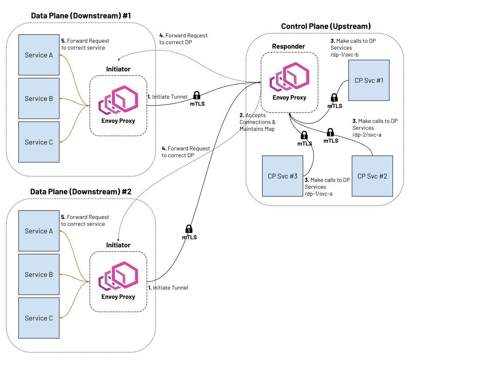

.. _overview_reverse_tunnel:

Reverse tunnels overview
========================

.. attention::

  The reverse tunnels feature is experimental and is currently under active development.

Envoy supports reverse tunnels that enable establishing persistent connections from downstream Envoy
instances to upstream Envoy instances without requiring the upstream to be directly reachable from the
downstream. This feature is particularly useful in scenarios where downstream instances are behind NATs,
firewalls, or in private networks, and need to communicate with upstream instances in public networks
or cloud environments.

Reverse tunnels invert the typical connection model: the downstream Envoy initiates TCP connections to
upstream Envoy instances and keeps them alive for reuse. These connections are established using a
handshake protocol, after which traffic can be forwarded bidirectionally. Services behind the upstream
Envoy can send requests through the tunnel to downstream services behind the initiator Envoy, effectively
treating the normally unreachable downstream services as if they were directly accessible.

.. _config_reverse_tunnel_bootstrap:

Reverse tunnels require the following extensions:

#. **Downstream socket interface**: Registered as a bootstrap extension on the initiator Envoy to initiate and maintain reverse tunnels.
#. **Upstream socket interface**: Registered as a bootstrap extension on the responder Envoy to accept and manage reverse tunnels.
#. **Reverse tunnel network filter**: Configured on the responder Envoy to accept and validate reverse tunnel handshake requests.
#. **Reverse connection cluster**: Configured on the responder Envoy to route data requests to downstream nodes through established reverse tunnels.

.. _config_reverse_tunnel_configuration_files:

.. _config_reverse_tunnel_initiator:

Initiator configuration (downstream Envoy)
-------------------------------------------

The initiator Envoy (downstream) requires the following configuration components to establish reverse tunnels:

.. _config_reverse_tunnel_downstream_socket_interface:

Downstream socket interface
~~~~~~~~~~~~~~~~~~~~~~~~~~~

.. literalinclude:: /_configs/reverse_connection/initiator-envoy.yaml
    :language: yaml
    :lines: 8-12
    :linenos:
    :lineno-start: 8
    :caption: :download:`initiator-envoy.yaml </_configs/reverse_connection/initiator-envoy.yaml>`

This extension enables the initiator Envoy to establish and maintain reverse tunnel connections to the responder Envoy.

.. _config_reverse_tunnel_listener:

Reverse tunnel listener
~~~~~~~~~~~~~~~~~~~~~~~~

The reverse tunnel listener triggers reverse connection initiation to the upstream Envoy and encodes
identity metadata for the local Envoy instance. The listener's address field uses a special ``rc://``
format to specify connection parameters, and its route configuration defines which downstream services
are reachable through the reverse tunnel.

.. literalinclude:: /_configs/reverse_connection/initiator-envoy.yaml
    :language: yaml
    :lines: 17-50
    :linenos:
    :lineno-start: 17
    :caption: :download:`initiator-envoy.yaml </_configs/reverse_connection/initiator-envoy.yaml>`

The special ``rc://`` address format encodes connection and identity metadata:

``rc://src_node_id:src_cluster_id:src_tenant_id@remote_cluster:connection_count``

In the example above, this expands to:

* ``src_node_id``: ``downstream-node`` - Unique identifier for this specific Envoy instance.
* ``src_cluster_id``: ``downstream-cluster`` - Logical grouping identifier for this Envoy and its peers.
* ``src_tenant_id``: ``downstream-tenant`` - Tenant identifier for multi-tenant isolation.
* ``remote_cluster``: ``upstream-cluster`` - Name of the upstream cluster to connect to.
* ``connection_count``: ``1`` - Number of reverse connections to establish to the remote cluster.

The identifiers serve the following purposes:

* **src_node_id**: Each node must have a unique ``src_node_id`` across the entire system to ensure proper routing and connection management. Data requests can target a specific node by its ID.
* **src_cluster_id**: Multiple nodes can share the same ``src_cluster_id``, forming a logical group. Data requests sent using the cluster ID will be load balanced across all nodes in that cluster. The ``src_cluster_id`` must not collide with any ``src_node_id``.
* **src_tenant_id**: Used in multi-tenant environments to isolate traffic and resources between different tenants or organizational units.

The ``downstream-service`` cluster in the example refers to the service behind the initiator Envoy that will be accessed via reverse tunnels from services behind the responder Envoy.

.. literalinclude:: /_configs/reverse_connection/initiator-envoy.yaml
    :language: yaml
    :lines: 69-80
    :linenos:
    :lineno-start: 69
    :caption: :download:`initiator-envoy.yaml </_configs/reverse_connection/initiator-envoy.yaml>`

Upstream cluster
~~~~~~~~~~~~~~~~~

Each upstream Envoy to which reverse tunnels should be established requires a cluster configuration.
This cluster can be defined statically in the bootstrap configuration or added dynamically via the
:ref:`Cluster Discovery Service (CDS) <config_cluster_manager_cds>`.

.. literalinclude:: /_configs/reverse_connection/initiator-envoy.yaml
    :language: yaml
    :lines: 54-65
    :linenos:
    :lineno-start: 54
    :caption: :download:`initiator-envoy.yaml </_configs/reverse_connection/initiator-envoy.yaml>`

Multiple cluster support
~~~~~~~~~~~~~~~~~~~~~~~~~

To establish reverse tunnels to multiple upstream clusters simultaneously, use the ``additional_addresses``
field on the listener. Each address in this list specifies an additional upstream cluster and the number
of connections to establish to it.

.. code-block:: yaml

  name: multi_cluster_listener
  address:
    socket_address:
      address: "rc://node-1:downstream-cluster:tenant-a@cluster-a:2"
      port_value: 0
  additional_addresses:
  - address:
      socket_address:
        address: "rc://node-1:downstream-cluster:tenant-a@cluster-b:3"
        port_value: 0
  filter_chains:
  - filters:
    - name: envoy.filters.network.tcp_proxy
      typed_config:
        "@type": type.googleapis.com/envoy.extensions.filters.network.tcp_proxy.v3.TcpProxy
        stat_prefix: tcp
        cluster: dynamic_cluster

This configuration establishes:

* 2 connections to ``cluster-a``
* 3 connections to ``cluster-b``

TLS configuration
~~~~~~~~~~~~~~~~~

For secure reverse tunnel establishment, configure a TLS transport socket on the upstream cluster.
The example below shows mutual TLS (mTLS) configuration with certificate pinning:

.. code-block:: yaml

  name: upstream-cluster
  type: STRICT_DNS
  connect_timeout: 30s
  transport_socket:
    name: envoy.transport_sockets.tls
    typed_config:
      "@type": type.googleapis.com/envoy.extensions.transport_sockets.tls.v3.UpstreamTlsContext
      common_tls_context:
        tls_certificates:
        - certificate_chain:
            filename: "/etc/ssl/certs/client-cert.pem"
          private_key:
            filename: "/etc/ssl/private/client-key.pem"
        validation_context:
          filename: "/etc/ssl/certs/ca-cert.pem"
          verify_certificate_spki:
          - "NdQcW/8B5PcygH/5tnDNXeA2WS/2JzV3K1PKz7xQlKo="
        alpn_protocols: ["h2", "http/1.1"]
      sni: upstream-envoy.example.com

This configuration provides mutual TLS authentication between the initiator and responder Envoys.
The client certificate authenticates the initiator, while the server certificate and SPKI pinning
authenticate the responder. The ALPN configuration negotiates HTTP/2, which is required for reverse
tunnel operation.

.. _config_reverse_tunnel_responder:

Responder configuration (upstream Envoy)
-----------------------------------------

The responder Envoy (upstream) requires the following configuration components to accept reverse tunnels:

.. _config_reverse_tunnel_upstream_socket_interface:

Upstream socket interface
~~~~~~~~~~~~~~~~~~~~~~~~~

.. literalinclude:: /_configs/reverse_connection/responder-envoy.yaml
    :language: yaml
    :lines: 8-12
    :linenos:
    :lineno-start: 8
    :caption: :download:`responder-envoy.yaml </_configs/reverse_connection/responder-envoy.yaml>`

This extension enables the responder Envoy to accept and manage incoming reverse tunnel connections from initiator Envoys.

.. _config_reverse_tunnel_network_filter:

Reverse tunnel network filter
~~~~~~~~~~~~~~~~~~~~~~~~~~~~~~

The ``envoy.filters.network.reverse_tunnel`` network filter implements the reverse tunnel handshake
protocol. It validates incoming connection requests and accepts or rejects them based on the handshake
parameters.

.. literalinclude:: /_configs/reverse_connection/responder-envoy.yaml
    :language: yaml
    :lines: 17-28
    :linenos:
    :lineno-start: 17
    :caption: :download:`responder-envoy.yaml </_configs/reverse_connection/responder-envoy.yaml>`

.. _config_reverse_connection_cluster:

Reverse connection cluster
~~~~~~~~~~~~~~~~~~~~~~~~~~

The reverse connection cluster is a special cluster type that routes traffic through established reverse
tunnels rather than creating new outbound connections. When a data request arrives at the upstream Envoy
for a downstream node, the cluster looks up a cached reverse tunnel connection to that node and reuses it.

Each data request must include a ``host_id`` that identifies the target downstream node. This ID can be
specified directly in request headers or computed from them. The cluster extracts the ``host_id`` using
the configured ``host_id_format`` field and uses it to look up the appropriate reverse tunnel connection.

.. literalinclude:: /_configs/reverse_connection/responder-envoy.yaml
    :language: yaml
    :lines: 92-112
    :linenos:
    :lineno-start: 92
    :caption: :download:`responder-envoy.yaml </_configs/reverse_connection/responder-envoy.yaml>`

The reverse connection cluster configuration includes several key fields:

Load balancing policy
^^^^^^^^^^^^^^^^^^^^^

Must be set to ``CLUSTER_PROVIDED`` to delegate load balancing to the custom cluster implementation.

Host ID format
^^^^^^^^^^^^^^

The ``host_id_format`` field uses Envoy's :ref:`formatter system <config_access_log_format_strings>` to
extract the target downstream node identifier from the request context. Supported formatters include:

* ``%REQ(header-name)%``: Extract value from a request header.
* ``%DYNAMIC_METADATA(namespace:key)%``: Extract value from dynamic metadata.
* ``%FILTER_STATE(key)%``: Extract value from filter state.
* ``%DOWNSTREAM_REMOTE_ADDRESS%``: Use the downstream connection address.
* Plain text and combinations of the above.

See the :ref:`config_reverse_connection_egress_listener` section for an example of processing headers
to set the ``host_id``.

Protocol
^^^^^^^^

Only HTTP/2 is supported for reverse connections. This is required to support multiplexing multiple
data requests over a single TCP connection.

Connection reuse
^^^^^^^^^^^^^^^^

Once a connection is established to a specific downstream node, it is cached and reused for all subsequent
requests to that node. Each data request is multiplexed as a new HTTP/2 stream on the existing connection,
avoiding the overhead of establishing new connections.

.. _config_reverse_connection_egress_listener:

Egress listener for data traffic
~~~~~~~~~~~~~~~~~~~~~~~~~~~~~~~~~

An egress listener on the upstream Envoy accepts data requests and routes them to the reverse connection
cluster. This listener typically includes header processing logic to extract or compute the ``host_id``
that identifies the target downstream node for each request.

.. literalinclude:: /_configs/reverse_connection/responder-envoy.yaml
    :language: yaml
    :lines: 31-88
    :linenos:
    :lineno-start: 31
    :caption: :download:`responder-envoy.yaml </_configs/reverse_connection/responder-envoy.yaml>`

The example above demonstrates using a :ref:`Lua filter <config_http_filters_lua>` to implement flexible
header-based routing logic. This is one of several approaches for computing the ``host_id`` from request
context; alternatives include using other HTTP filters, the ``host_id_format`` field with direct header
mapping, or custom filter implementations. The Lua filter checks request headers in priority order and
sets the ``x-computed-host-id`` header, which the reverse connection cluster uses to look up the appropriate
tunnel connection.

The header priority order is:

#. **x-node-id header**: Highest priority—targets a specific downstream node.
#. **x-cluster-id header**: Fallback—targets a cluster, allowing load balancing across nodes.
#. **None found**: Logs an error and fails cluster matching.

**Example request flows:**

#. **Request with node ID** (highest priority):

   .. code-block:: http

      GET /downstream_service HTTP/1.1
      x-node-id: example-node

   The filter sets ``host_id = "example-node"`` and routes to that specific node.

#. **Request with cluster ID** (fallback):

   .. code-block:: http

      GET /downstream_service HTTP/1.1
      x-cluster-id: example-cluster

   The filter sets ``host_id = "example-cluster"`` and routes to any node in that cluster.

.. _config_reverse_connection_security:

Security considerations
-----------------------

Reverse tunnels should be used with appropriate security measures:

* **Authentication**: Implement proper authentication mechanisms for handshake validation as part of the reverse tunnel handshake protocol.
* **Authorization**: Validate that downstream nodes are authorized to connect to upstream clusters.
* **TLS**: TLS can be configured for each upstream cluster that reverse tunnels are established to.
