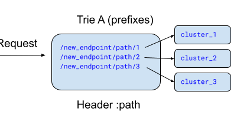

.. _arch_overview_http_routing:

HTTP routing
============

Envoy includes an HTTP :ref:`router filter <config_http_filters_router>` which can be installed to
perform advanced routing tasks.

This is useful both for handling edge traffic (traditional reverse proxy request handling) as well
as for building a service to service Envoy mesh (typically via routing on the host/authority HTTP
header to reach a particular upstream service cluster).

Envoy also has the ability to be configured as forward proxy. In the forward proxy configuration, mesh
clients can participate by appropriately configuring their HTTP proxy to be an Envoy.

At a high level the router takes an incoming HTTP request, matches it to an upstream cluster, acquires a
:ref:`connection pool <arch_overview_conn_pool>` to a host in the upstream cluster, and forwards the
request.

The router filter supports many features, including:

Virtual hosts and clusters
    Map domains/authorities to a set of routing rules.

    A virtual cluster is specified at the virtual host level and is
    used by Envoy to generate additional statistics on top of the standard cluster level ones. Virtual
    clusters can use regex matching.
Path, prefix and header matching
    Route according to case :ref:`sensitive <envoy_v3_api_field_config.route.v3.RouteMatch.case_sensitive>`
    and insensitive prefix and exact request paths, or use
    :ref:`regex path matching <envoy_v3_api_field_config.route.v3.RouteMatch.safe_regex>`
    and for more complex matching rules.

    Match routes according to :ref:`arbitrary headers <envoy_v3_api_msg_config.route.v3.HeaderMatcher>`.
Path, prefix and host rewriting
    Rewrite the :ref:`prefix <envoy_v3_api_field_config.route.v3.RedirectAction.prefix_rewrite>`, or
    :ref:`path using a regular expression and capture groups <envoy_v3_api_field_config.route.v3.RouteAction.regex_rewrite>`.

    :ref:`Explicit host rewriting <envoy_v3_api_field_extensions.filters.http.aws_request_signing.v3.AwsRequestSigning.host_rewrite>`,
    and :ref:`automatic host rewriting <envoy_v3_api_field_config.route.v3.RouteAction.auto_host_rewrite>` based on
    the DNS name of the selected upstream host.
Request redirection
    :ref:`Path <envoy_v3_api_field_config.route.v3.RedirectAction.path_redirect>`/:ref:`host
    <envoy_v3_api_field_config.route.v3.RedirectAction.host_redirect>` redirection at the route level.

    :ref:`TLS redirection <envoy_v3_api_field_config.route.v3.VirtualHost.require_tls>`
    at the virtual host level.
Request timeouts, retries and hedging
    :ref:`Request retries <arch_overview_http_routing_retry>` can be specified either via HTTP header or via
    route configuration.

    Timeouts can be specified either via :ref:`HTTP
    header <config_http_filters_router_headers_consumed>` or via :ref:`route configuration
    <envoy_v3_api_field_config.route.v3.RouteAction.timeout>`.

    Envoy also provides :ref:`request hedging <arch_overview_http_routing_hedging>` for
    retries in response to a request (per try) timeout.
Traffic shifting and splitting
    Shift traffic from one upstream cluster to another via :ref:`runtime values
    <envoy_v3_api_field_config.route.v3.RouteMatch.runtime_fraction>` or split traffic across multiple
    upstream clusters according to
    :ref:`weight/percentage-based routing <envoy_v3_api_field_config.route.v3.RouteAction.weighted_clusters>`
    (see :ref:`traffic shifting/splitting <config_http_conn_man_route_table_traffic_splitting>`).
Policy-based routing
    Routing based on :ref:`priority <arch_overview_http_routing_priority>` or a
    :ref:`hash policy <envoy_v3_api_field_config.route.v3.RouteAction.hash_policy>`.
Direct responses
    :ref:`Non-proxied HTTP responses <arch_overview_http_routing_direct_response>`
    at the route level.
Absolute URLs
    :ref:`Absolute URLs <envoy_v3_api_field_extensions.filters.network.http_connection_manager.v3.HttpConnectionManager.http_protocol_options>`
    are supported for non-TLS forward proxies.

.. _arch_overview_http_routing_route_scope:

Route scope
-----------

Scoped routing enables Envoy to put constraints on search space of domains and route rules.

A :ref:`Route Scope <envoy_v3_api_msg_config.route.v3.scopedrouteconfiguration>` associates
a key with a :ref:`route table <arch_overview_http_routing_route_table>`.

For each request, a scope key is computed dynamically by the HTTP connection manager to pick the
:ref:`route table <envoy_v3_api_msg_config.route.v3.routeconfiguration>`.

:ref:`RouteConfiguration <envoy_v3_api_msg_config.route.v3.RouteConfiguration>` associated with scope
can be configured with the :ref:`OnDemand <envoy_v3_api_msg_extensions.filters.http.on_demand.v3.OnDemand>`
filter.

The :ref:`Scoped RDS (SRDS) API <arch_overview_dynamic_config_srds>` contains a set of
:ref:`Scopes <envoy_v3_api_msg_config.route.v3.ScopedRouteConfiguration>` resources,
each defining independent routing configuration, along with a
:ref:`ScopeKeyBuilder <envoy_v3_api_msg_extensions.filters.network.http_connection_manager.v3.ScopedRoutes.ScopeKeyBuilder>`
defining the key construction algorithm used by Envoy to look up the scope corresponding to each request.

In the following (statically configured) scoped route example, Envoy will split the
``Addr`` header value by ``;``, ascertain key value pairs by splitting them on ``=``,
and use the first value found for key ``x-foo-key`` as the scope key.

Specifically, if the ``Addr`` header value is ``foo=1;x-foo-key=bar;x-bar-key=something-else``, then ``bar``
will be computed as the scope key to look up for corresponding route configuration.

.. literalinclude:: /_configs/route/route-scope.yaml
    :language: yaml
    :lines: 11-46
    :emphasize-lines: 12-18, 24-25
    :linenos:
    :lineno-start: 11
    :caption: :download:`route-scope.yaml </_configs/route/route-scope.yaml>`

For a key to match a :ref:`ScopedRouteConfiguration <envoy_v3_api_msg_config.route.v3.ScopedRouteConfiguration>`,
the number of fragments in the computed key has to match that of the
:ref:`ScopedRouteConfiguration<envoy_v3_api_msg_config.route.v3.ScopedRouteConfiguration>`. The fragments are then matched in order.

.. note::
     A missing fragment (treated as ``NULL``) in the built key makes the request unable to match
     any scope, i.e. no route entry can be found for the request.

.. _arch_overview_http_routing_route_table:

Route table
-----------

The :ref:`configuration <config_http_conn_man>` for the HTTP connection manager owns the :ref:`route
table <envoy_v3_api_msg_config.route.v3.RouteConfiguration>` that is used by all configured HTTP filters.

Although the router filter is the primary consumer of the route table, other filters also have access in case
they want to make decisions based on the ultimate destination of the request. For example, the built
in rate limit filter consults the route table to determine whether the global rate limit service
should be called based on the route.

The connection manager makes sure that all calls to acquire a route are stable for a particular request,
even if the decision involves randomness (e.g. in the case of a runtime configuration route rule).

.. _arch_overview_http_routing_retry:

Retry semantics
---------------

Envoy allows retries to be configured both in the :ref:`route configuration
<envoy_v3_api_field_config.route.v3.RouteAction.retry_policy>` as well as for specific requests via :ref:`request
headers <config_http_filters_router_headers_consumed>`.

The following configurations are possible:

Maximum number of retries
    Envoy will continue to retry any number of times.

    The intervals between retries are decided either by an exponential backoff algorithm (the default),
    or based on feedback from the upstream server via headers (if present).

    .. note::
       All retries are contained within the overall request timeout.

       This avoids long request times due to a large number of retries.
Retry conditions
    Envoy can retry on different types of conditions depending on application
    requirements. For example, network failure, all 5xx response codes, idempotent 4xx response codes,
    etc.
Retry budgets
    Envoy can limit the proportion of active requests via
    :ref:`retry budgets <envoy_v3_api_field_config.cluster.v3.circuitbreakers.thresholds.retry_budget>`
    that can be retried to prevent their contribution to large increases in traffic volume.
Host selection retry plugins
    Envoy can be configured to apply additional logic when selecting hosts for retries.

    Specifying a :ref:`retry host predicate <envoy_v3_api_field_config.route.v3.RetryPolicy.retry_host_predicate>`
    allows for reattempting host selection when certain hosts are selected (e.g. when an already
    attempted host is selected), while a
    :ref:`retry priority <envoy_v3_api_field_config.route.v3.RetryPolicy.retry_priority>` can be
    configured to adjust the priority load used when selecting a priority for retries.

.. note::
   Envoy retries requests when :ref:`x-envoy-overloaded
   <config_http_filters_router_x-envoy-overloaded_set>` is present. It is recommended to
   either configure
   :ref:`retry budgets (preferred) <envoy_v3_api_field_config.cluster.v3.circuitbreakers.thresholds.retry_budget>`
   or set
   :ref:`maximum active retries circuit breaker <arch_overview_circuit_break>` to an appropriate
   value to avoid retry storms.

.. _arch_overview_http_routing_hedging:

Request hedging
---------------

Envoy supports request hedging which can be enabled by specifying a :ref:`hedge
policy <envoy_v3_api_msg_config.route.v3.HedgePolicy>`.

This means that Envoy will race multiple simultaneous upstream requests and return the first
response with acceptable headers to the downstream.

The retry policy is used to determine whether a response should be returned or whether more
responses should be awaited.

Currently hedging can only be performed in response to a request timeout. This
means that a retry request will be issued without cancelling the initial
timed-out request and a late response will be awaited. The first "good"
response according to the retry policy will be returned downstream.

This implementation ensures that the same upstream request is not retried twice,
which might otherwise occur if a request times out and then results in a 5xx
response, creating two retriable events.

.. _arch_overview_http_routing_priority:

Priority routing
----------------

Envoy supports priority routing at the :ref:`route <envoy_v3_api_msg_config.route.v3.Route>` level.

The current priority implementation uses different :ref:`connection pool <arch_overview_conn_pool>`
and :ref:`circuit breaking <config_cluster_manager_cluster_circuit_breakers>` settings for each
priority level, which means that even for HTTP/2 requests, two physical connections will be used to
an upstream host.

The currently supported priorities are ``default`` and ``high``.

.. _arch_overview_http_routing_direct_response:

Direct responses
----------------

Envoy supports the sending of "direct" responses. These are preconfigured HTTP responses
that do not require proxying to an upstream server.

There are two ways to specify a direct response in a Route:

* Set the :ref:`direct_response <envoy_v3_api_field_config.route.v3.Route.direct_response>` field.
  This works for all HTTP response statuses.
* Set the :ref:`redirect <envoy_v3_api_field_config.route.v3.Route.redirect>` field. This works for
  redirect response statuses only, but it simplifies the setting of the ``Location`` header.

A direct response has an HTTP status code and an optional body.

The Route configuration can specify the response body inline or specify the path of
a file containing the body.

If the Route configuration specifies a file pathname, Envoy will read the file upon configuration load
and cache the contents.

.. attention::

   If a response body is specified, by default it is limited to 4KB in size, regardless of
   whether it is provided inline or in a file.

   Envoy currently holds the entirety of the body in memory, so the 4KB default is intended to keep
   the proxy's memory footprint from growing too large.

   If required, this limit can be changed through setting the :ref:`max_direct_response_body_size_bytes
   <envoy_v3_api_field_config.route.v3.RouteConfiguration.max_direct_response_body_size_bytes>`
   field.

If ``response_headers_to_add`` has been set for the Route or the enclosing Virtual Host,
Envoy will include the specified headers in the direct HTTP response.

.. _arch_overview_http_routing_matcher:

Routing via generic matching
----------------------------

Envoy supports using a :ref:`generic match tree <arch_overview_matching_api>` to
specify the route table.

This is a more expressive matching engine than the original one, allowing
for sublinear matching on arbitrary headers (unlike the original matching engine which could only
do this for ``:authority`` in some cases).

To use the generic matching tree, specify a matcher on a virtual host with a :ref:`Route <envoy_v3_api_msg_config.route.v3.Route>`
or :ref:`RouteList <envoy_v3_api_msg_config.route.v3.RouteList>` as the action:

.. literalinclude:: /_configs/route/route-match-tree.yaml
    :language: yaml
    :lines: 11-83
    :emphasize-lines: 14-71
    :linenos:
    :lineno-start: 11
    :caption: :download:`route-scope.yaml </_configs/route/route-match-tree.yaml>`

This allows resolving the same ``Route`` proto message used for the ``routes``-based routing using the additional
matching flexibility provided by the generic matching framework.

.. note::
   The resulting :ref:`Route <envoy_v3_api_msg_config.route.v3.Route>` also specifies a match criteria.

   This must be satisfied in addition to resolving the route in order to achieve a route match.

   When path rewrites are used, the matched path will only depend on the match criteria of the resolved
   :ref:`Route <envoy_v3_api_msg_config.route.v3.Route>`.

   Path matching done during the match tree traversal does not contribute to path rewrites.

The only inputs supported are request headers (via :ref:`HttpRequestHeaderMatchInput <envoy_v3_api_msg_type.matcher.v3.HttpRequestHeaderMatchInput>`).

.. tip::
   See the docs for the :ref:`matching API <arch_overview_matching_api>` for more information about the API as a whole.

Sublinear Route Matching
========================

Overview
--------
`kirti <https://kirti.com>`_
An incoming request to Envoy needs to be matched to a cluster based on defined `routes <https://www.envoyproxy.io/docs/envoy/latest/api-v3/config/route/v3/route_components.proto#envoy-v3-api-msg-config-route-v3-virtualhost>`_. Typically, a well understood, linear route search matching with O(n) search cost (see  `Virtual Host <https://www.envoyproxy.io/docs/envoy/latest/api-v3/config/route/v3/route_components.proto#envoy-v3-api-msg-config-route-v3-virtualhost>`_ → `Routes <https://www.envoyproxy.io/docs/envoy/latest/api-v3/config/route/v3/route_components.proto#envoy-v3-api-msg-config-route-v3-route>`_) is employed where the cost of route matching to clusters linearly goes up with increasing number of route rules. It can become a scalability issue with higher latencies as the number of routes go up in o(1k+). To overcome these scalability challenges the Generic Matcher API ( `Virtual Host → matcher{} <https://www.envoyproxy.io/docs/envoy/latest/api-v3/config/route/v3/route_components.proto#envoy-v3-api-msg-config-route-v3-virtualhost>`_) → `matcher_tree <https://www.envoyproxy.io/docs/envoy/latest/xds/type/matcher/v3/matcher.proto#envoy-v3-api-msg-xds-type-matcher-v3-matcher-matchertree>`_ can offer a robust and flexible framework for route matching with two distinct sublinear matching implementations:

* **Trie-based Matching** (`prefix_match_map <https://github.com/envoyproxy/envoy/blob/main/source/common/matcher/prefix_map_matcher.h#L43>`_): Employs a prefix trie structure for efficient longest prefix matching in significantly much lower time complexity of O(min{input key length, longest prefix match}) compared to traditional linear search with O(# of routes x avg length of routes). Trie implementation in Envoy leverages ranged vectors for storing children to optimize on space as described `here <https://github.com/envoyproxy/envoy/blob/main/source/common/common/trie_lookup_table.h#L16>`_. Also, it is to be noted that longest-prefix-match lookup of chars in trie does not support wildcards and each char is matched literally. 

* **Hash Map-based Matching** (`exact_match_map <https://github.com/envoyproxy/envoy/blob/main/source/common/matcher/exact_map_matcher.h#L45>`_): Uses a hashmap structure for exact string matching in practically constant time O(1).

These implementations can be used recursively and even combined with each other in nested fashion using Generic Matching API. It also enables mixing sublinear and linear route matching for breaking up route matching space for diverse use-cases.

Trie-based Matching in Actions
------------------------------

The Generic Matching API offers exceptional flexibility, enabling a wide variety of route matching configurations. The following examples showcase its versatility, particularly in the realm of sublinear matching. While some of these may not be ideal for production use, they serve to illustrate the API's vast potential.

**Usecase 1:** A single trie structure for all url paths in :path header

Suppose one wants to route requests with following path prefixes to respective clusters using trie or hashmap for sublinear route searching

A request with :path header set to url /new_endpoint/path/2/abc should be routed to cluster_2

To achieve the above results, Envoy config below will create a single trie structure with above path strings and calls findLongestPrefix() match once, for paths in incoming request :path header. 

**NOTE:** Changing prefix_match_map to exact_match_map in below configuration will result in use of hash based path matching (instead of trie) and will succeed in lookup if :path header in request matches exactly with one of the routes defined.

.. literalinclude:: /_configs/route/sublinear_routing_example1.yaml
    :language: yaml
    :lines: 25-59
    :emphasize-lines: 31-32
    :linenos:
    :lineno-start: 1
    :caption: :download:`single_trie.yaml </_configs/route/sublinear_routing_example1.yaml>`

**Usecase 2:** Configuration for Hierarchical trie structures in example below illustrates how three different trie structures can be created by Envoy using nested prefix_match_map which can do request matching across various headers.:
**Note:** Use of exact_match_map will result in creation of hashmaps instead of tries.
.. image:: sublinear_routing_img2.png

For an incoming request with :path header set to say /new_endpoint/path/2/video, x-foo-header set to foo-2 and x-bar-header set to bar-2, three longest-prefix-match trie lookups will happen across A, B and C tries in the order of nesting for a successful request match.

.. literalinclude:: /_configs/route/sublinear_routing_example2.yaml
    :language: yaml
    :lines: 25-115
    :emphasize-lines: 31-32,50-51,69-70
    :linenos:
    :lineno-start: 1
    :caption: :download:`nested_trie.yaml </_configs/route/sublinear_routing_example2.yaml>`

**Usecase 3:** Mixing sublinear route matching with traditional prefix based inorder linear routing.
.. image:: sublinear_routing_img3.png

.. literalinclude:: /_configs/route/sublinear_routing_example3.yaml
    :language: yaml
    :lines: 25-80
    :emphasize-lines: 31-32,37-38,46-47,55-56
    :linenos:
    :lineno-start: 1
    :caption: :download:`mix_sublinear_linear.yaml </_configs/route/sublinear_routing_example3.yaml>`

**Usecase 4:** This example shows how one can run exact matches first (using hashmap) and if no matches are found then attempt prefix matches (using tries).

.. literalinclude:: /_configs/route/sublinear_routing_example4.yaml
    :language: yaml
    :lines: 7-69
    :emphasize-lines: 13-14,42-43
    :linenos:
    :lineno-start: 1
    :caption: :download:`exact_prefix_mix.yaml </_configs/route/sublinear_routing_example4.yaml>`
