# TLS Context Implementation

## Overview

TLS contexts in Envoy manage SSL/TLS connections for both downstream (client-facing) and upstream (backend) connections. The TLS context contains certificates, private keys, trusted CA certificates, cipher suites, and TLS protocol versions. Envoy builds separate SSL contexts for different listeners and clusters, enabling fine-grained TLS configuration.

## Architecture

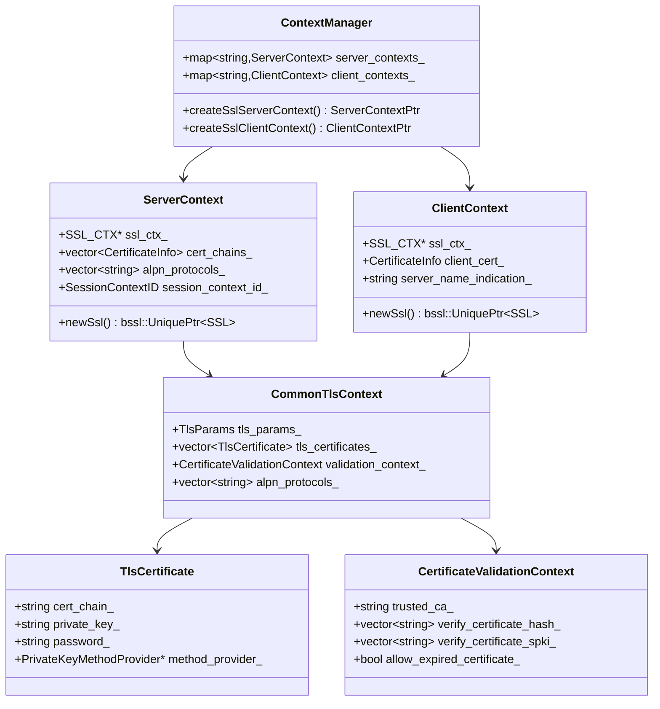

## Downstream (Server) TLS Context Creation

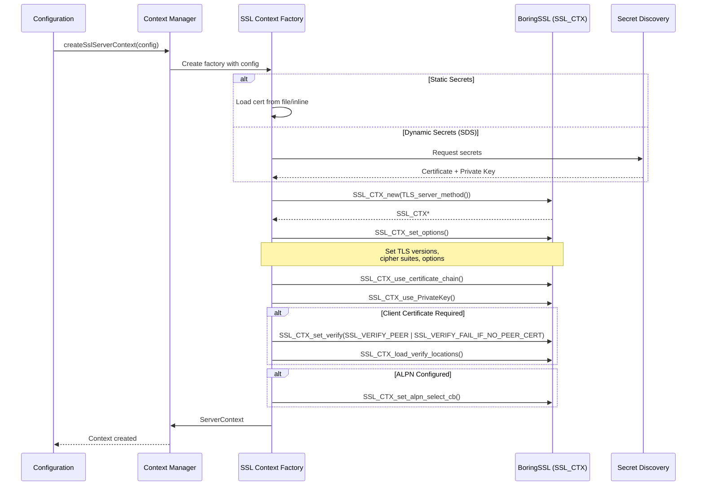

## Upstream (Client) TLS Context Creation

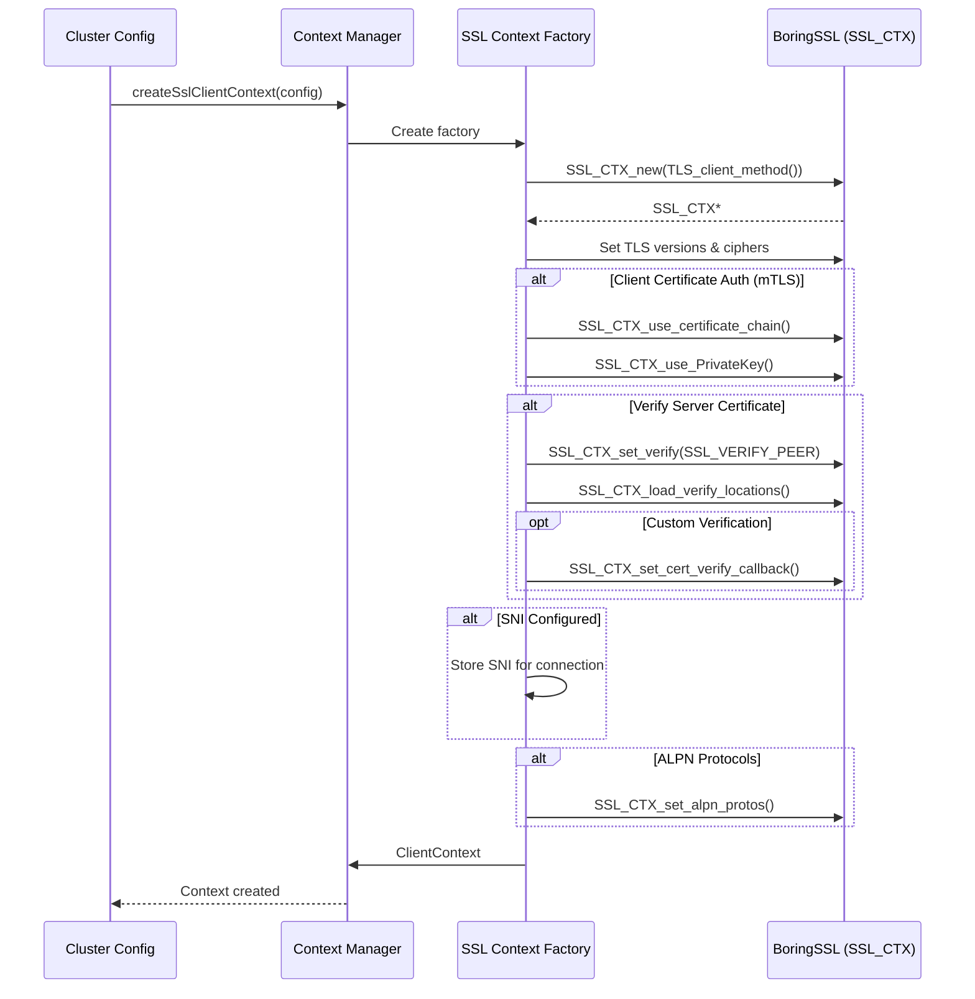

## SSL_CTX Structure and Lifecycle

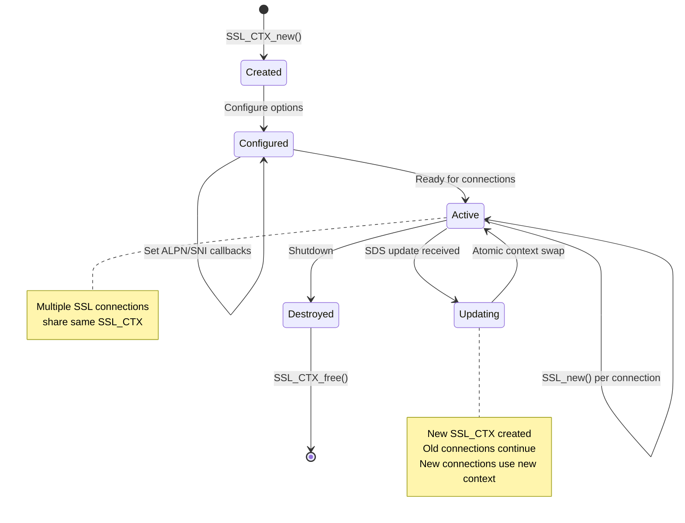

## Certificate Chain Loading

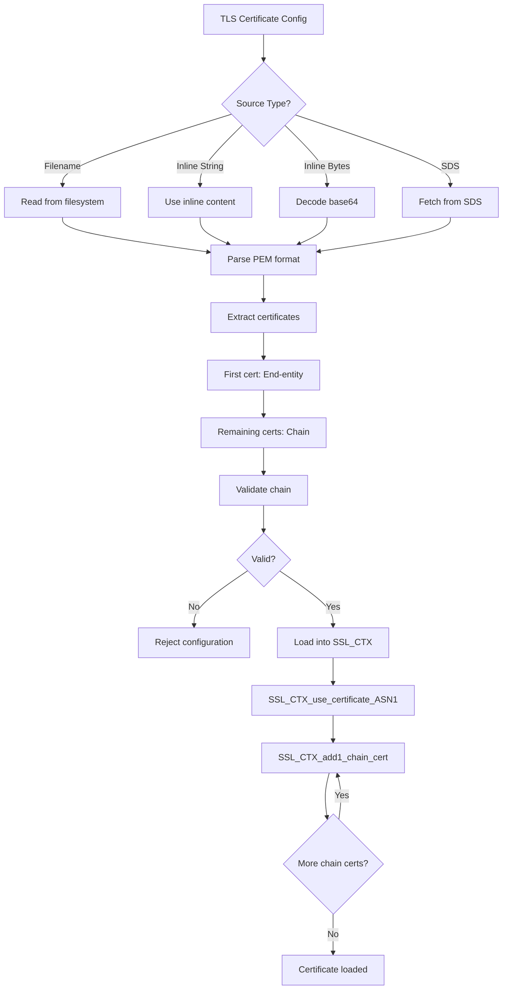

## Private Key Loading and Management

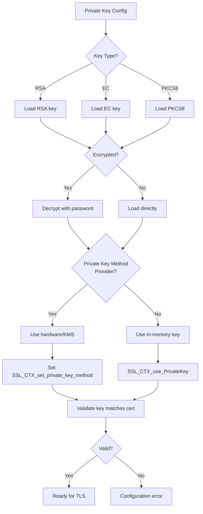

## TLS Parameters Configuration

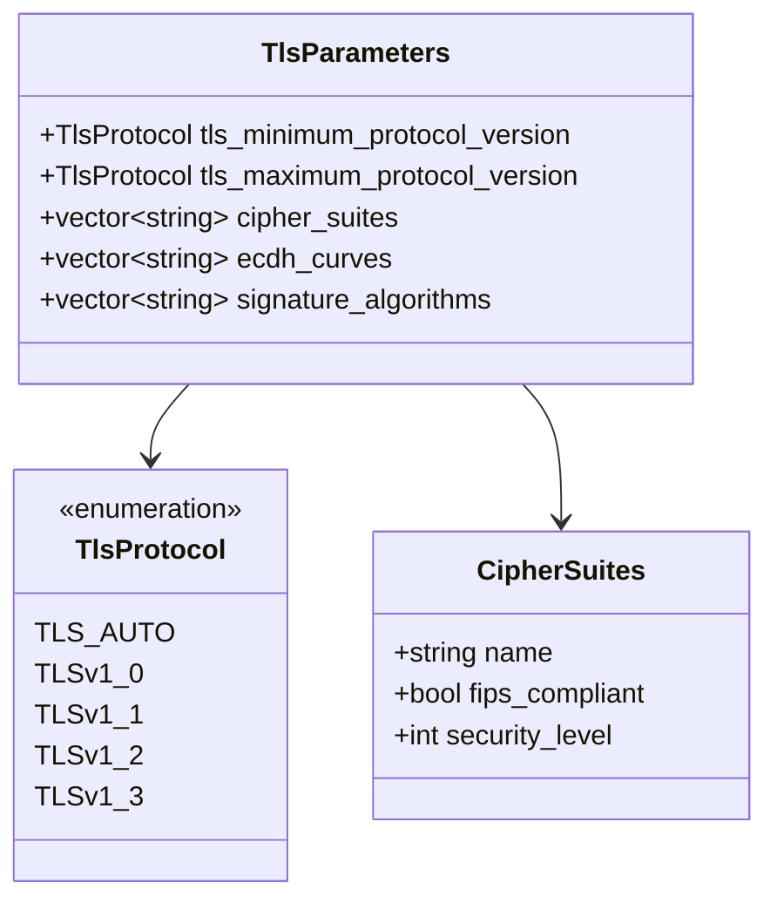

## Downstream TLS Handshake Flow

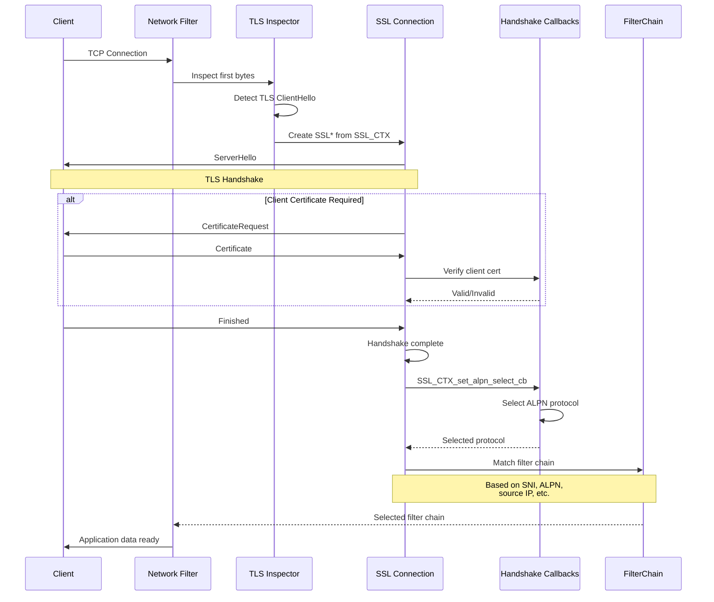

## Upstream TLS Connection

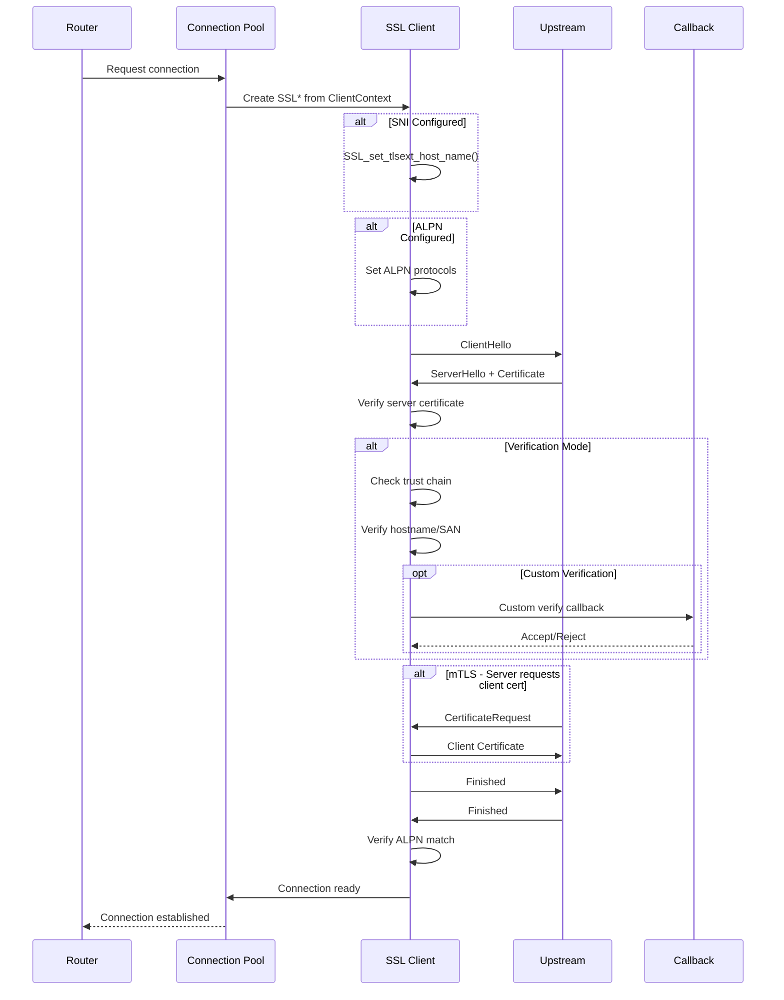

## Certificate Validation Context

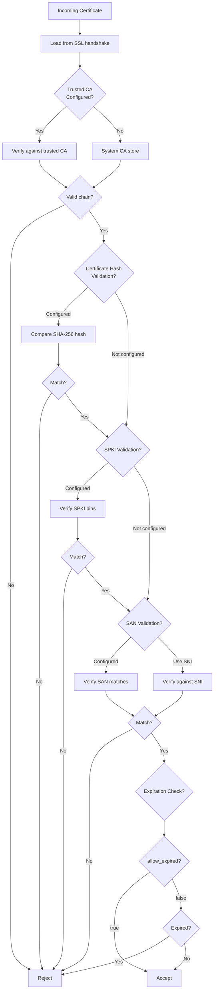

## Session Resumption and Caching

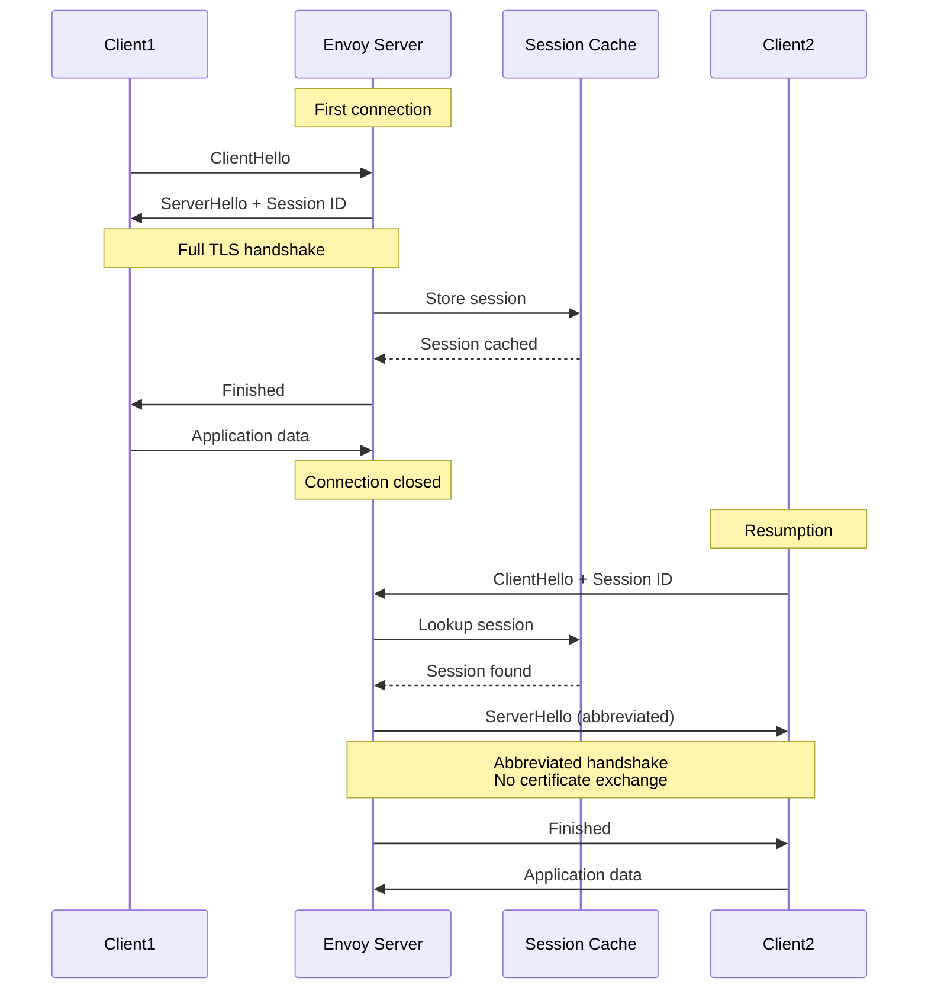

## Configuration Example - Downstream TLS

```yaml
listeners:
  - name: https_listener
    address:
      socket_address:
        address: 0.0.0.0
        port_value: 443
    filter_chains:
      - filter_chain_match:
          server_names: ["example.com"]
        transport_socket:
          name: envoy.transport_sockets.tls
          typed_config:
            "@type": type.googleapis.com/envoy.extensions.transport_sockets.tls.v3.DownstreamTlsContext

            # Common TLS configuration
            common_tls_context:

              # TLS parameters
              tls_params:
                tls_minimum_protocol_version: TLSv1_2
                tls_maximum_protocol_version: TLSv1_3
                cipher_suites:
                  - ECDHE-ECDSA-AES128-GCM-SHA256
                  - ECDHE-RSA-AES128-GCM-SHA256
                  - ECDHE-ECDSA-AES256-GCM-SHA384
                  - ECDHE-RSA-AES256-GCM-SHA384
                ecdh_curves:
                  - X25519
                  - P-256

              # Server certificates
              tls_certificates:
                - certificate_chain:
                    filename: /etc/ssl/certs/server-cert.pem
                  private_key:
                    filename: /etc/ssl/private/server-key.pem

              # Client certificate validation (mTLS)
              validation_context:
                trusted_ca:
                  filename: /etc/ssl/certs/ca-cert.pem
                verify_certificate_spki:
                  - "base64-encoded-spki-hash"
                match_typed_subject_alt_names:
                  - san_type: DNS
                    matcher:
                      exact: "client.example.com"

              # ALPN protocols
              alpn_protocols:
                - h2
                - http/1.1

            # Require client certificate
            require_client_certificate: true

            # Session resumption
            session_timeout: 3600s
```

## Configuration Example - Upstream TLS

```yaml
clusters:
  - name: backend_cluster
    type: STRICT_DNS
    load_assignment:
      cluster_name: backend_cluster
      endpoints:
        - lb_endpoints:
            - endpoint:
                address:
                  socket_address:
                    address: backend.example.com
                    port_value: 443

    transport_socket:
      name: envoy.transport_sockets.tls
      typed_config:
        "@type": type.googleapis.com/envoy.extensions.transport_sockets.tls.v3.UpstreamTlsContext

        # SNI to send to upstream
        sni: backend.example.com

        common_tls_context:

          # TLS parameters
          tls_params:
            tls_minimum_protocol_version: TLSv1_2
            tls_maximum_protocol_version: TLSv1_3

          # Client certificate for mTLS
          tls_certificates:
            - certificate_chain:
                filename: /etc/ssl/certs/client-cert.pem
              private_key:
                filename: /etc/ssl/private/client-key.pem

          # Verify server certificate
          validation_context:
            trusted_ca:
              filename: /etc/ssl/certs/ca-bundle.pem
            match_typed_subject_alt_names:
              - san_type: DNS
                matcher:
                  exact: "backend.example.com"

          # ALPN for HTTP/2
          alpn_protocols:
            - h2
```

## Memory Management

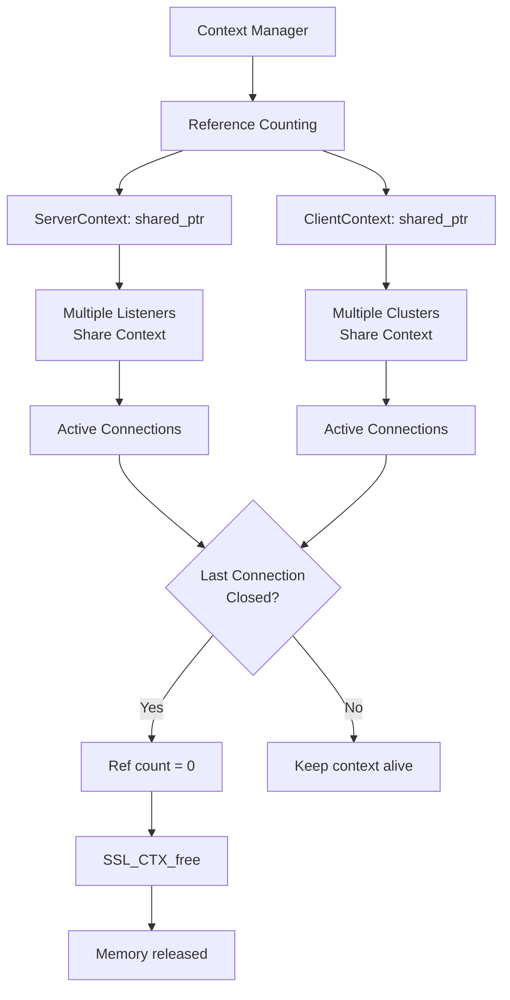

## TLS Statistics

```yaml
# Downstream TLS stats
listener.0.0.0.0_443.ssl.connection_error
listener.0.0.0.0_443.ssl.handshake
listener.0.0.0.0_443.ssl.session_reused
listener.0.0.0.0_443.ssl.no_certificate
listener.0.0.0.0_443.ssl.fail_verify_no_cert
listener.0.0.0.0_443.ssl.fail_verify_error
listener.0.0.0.0_443.ssl.fail_verify_san
listener.0.0.0.0_443.ssl.fail_verify_cert_hash

# Upstream TLS stats
cluster.backend.ssl.connection_error
cluster.backend.ssl.handshake
cluster.backend.ssl.session_reused
cluster.backend.ssl.fail_verify_no_cert
cluster.backend.ssl.fail_verify_error
cluster.backend.ssl.fail_verify_san
```

## Best Practices

### 1. TLS Version Configuration
```yaml
tls_params:
  tls_minimum_protocol_version: TLSv1_2  # Never use TLS 1.0/1.1
  tls_maximum_protocol_version: TLSv1_3  # Prefer TLS 1.3
```

### 2. Cipher Suite Selection
```yaml
# Modern, secure cipher suites only
cipher_suites:
  - ECDHE-ECDSA-AES128-GCM-SHA256
  - ECDHE-RSA-AES128-GCM-SHA256
  - ECDHE-ECDSA-AES256-GCM-SHA384
  - ECDHE-RSA-AES256-GCM-SHA384
  - ECDHE-ECDSA-CHACHA20-POLY1305
  - ECDHE-RSA-CHACHA20-POLY1305
# Avoid: CBC ciphers, RC4, 3DES, export ciphers
```

### 3. Certificate Validation
```yaml
validation_context:
  trusted_ca:
    filename: /etc/ssl/ca-bundle.pem
  match_typed_subject_alt_names:
    - san_type: DNS
      matcher:
        exact: "backend.example.com"  # Always verify hostname
  verify_certificate_spki:
    - "base64-spki-hash"  # Certificate pinning for critical upstreams
```

### 4. Client Certificate Validation
```yaml
require_client_certificate: true
validation_context:
  trusted_ca:
    filename: /etc/ssl/client-ca.pem
  only_verify_leaf_cert_crl: false  # Verify entire chain
```

### 5. Session Resumption
```yaml
# Enable for performance
session_timeout: 3600s
session_ticket_keys:
  keys:
    - filename: /etc/ssl/session-ticket-key.bin
```

## Troubleshooting

### Debug TLS Issues

```bash
# Enable TLS debug logging
curl -X POST "http://localhost:9901/logging?connection=debug"
curl -X POST "http://localhost:9901/logging?ssl=trace"

# Check TLS stats
curl http://localhost:9901/stats | grep ssl

# View active connections
curl http://localhost:9901/certs

# Dump TLS configuration
curl http://localhost:9901/config_dump | jq '.configs[] | select(.["@type"] | contains("tls"))'
```

### Common Issues

1. **Certificate chain incomplete**: Include intermediate certificates
2. **Private key mismatch**: Ensure key matches certificate
3. **Cipher suite mismatch**: Client and server must share common ciphers
4. **Protocol version mismatch**: Ensure overlapping TLS versions
5. **SNI not sent**: Configure SNI on upstream connections
6. **Certificate validation fails**: Check SAN/hostname matching

## References

- [Envoy TLS Documentation](https://www.envoyproxy.io/docs/envoy/latest/intro/arch_overview/security/ssl)
- [BoringSSL](https://boringssl.googlesource.com/boringssl/)
- [TLS 1.3 RFC 8446](https://tools.ietf.org/html/rfc8446)
