# SDS (Secret Discovery Service) and Dynamic Certificate Rotation

## Overview

Secret Discovery Service (SDS) enables Envoy to dynamically fetch and rotate TLS certificates, private keys, and validation contexts without restarting. SDS uses the xDS protocol to deliver secrets from a secret provider (file-based, Kubernetes secrets, or custom SDS server). This is critical for zero-downtime certificate rotation and automated certificate management (ACME, cert-manager, etc.).

## Architecture

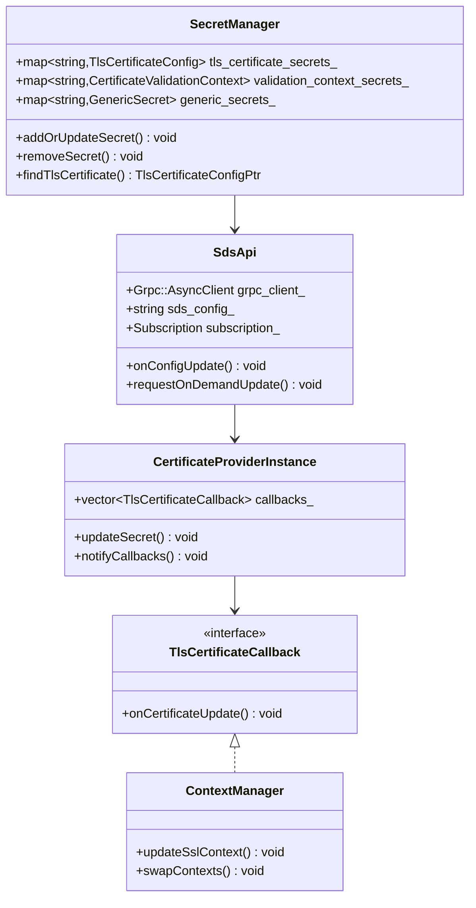

## SDS Protocol Flow

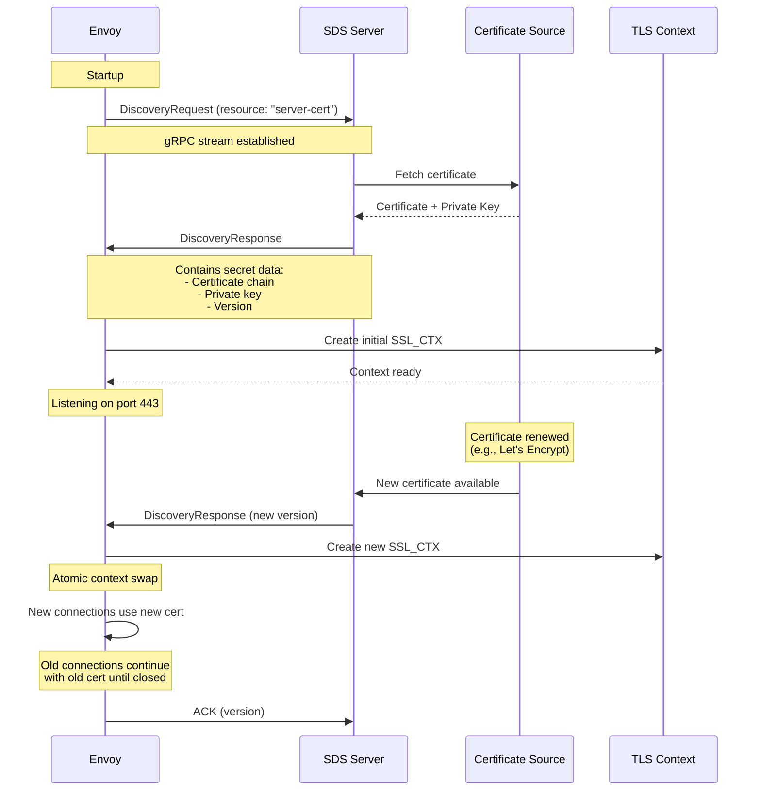

## Secret Configuration Types

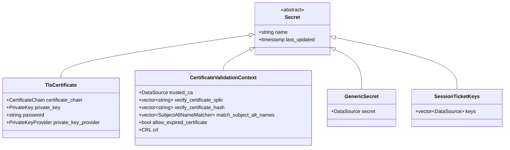

## SDS Configuration Flow

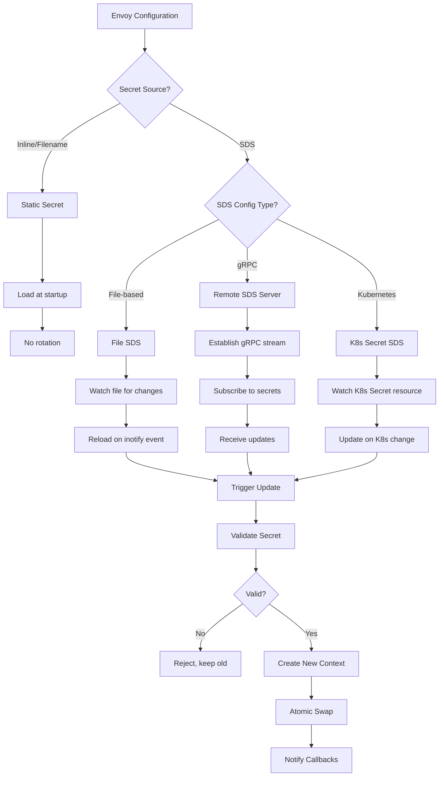

## Configuration Example - File-based SDS

```yaml
listeners:
  - name: https_listener
    address:
      socket_address:
        address: 0.0.0.0
        port_value: 443
    filter_chains:
      - transport_socket:
          name: envoy.transport_sockets.tls
          typed_config:
            "@type": type.googleapis.com/envoy.extensions.transport_sockets.tls.v3.DownstreamTlsContext
            common_tls_context:
              tls_certificate_sds_secret_configs:
                - name: server_cert
                  sds_config:
                    path_config_source:
                      path: /etc/envoy/sds/server-cert.yaml
                      watched_directory:
                        path: /etc/envoy/sds

# File: /etc/envoy/sds/server-cert.yaml
resources:
  - "@type": type.googleapis.com/envoy.extensions.transport_sockets.tls.v3.Secret
    name: server_cert
    tls_certificate:
      certificate_chain:
        filename: /etc/ssl/certs/server-cert.pem
      private_key:
        filename: /etc/ssl/private/server-key.pem
```

## Configuration Example - gRPC SDS

```yaml
listeners:
  - name: https_listener
    address:
      socket_address:
        address: 0.0.0.0
        port_value: 443
    filter_chains:
      - transport_socket:
          name: envoy.transport_sockets.tls
          typed_config:
            "@type": type.googleapis.com/envoy.extensions.transport_sockets.tls.v3.DownstreamTlsContext
            common_tls_context:

              # TLS certificate from SDS
              tls_certificate_sds_secret_configs:
                - name: server_cert
                  sds_config:
                    api_config_source:
                      api_type: GRPC
                      grpc_services:
                        - envoy_grpc:
                            cluster_name: sds_cluster
                      set_node_on_first_message_only: true

              # CA certificate from SDS
              validation_context_sds_secret_config:
                name: validation_context
                sds_config:
                  api_config_source:
                    api_type: GRPC
                    grpc_services:
                      - envoy_grpc:
                          cluster_name: sds_cluster

clusters:
  - name: sds_cluster
    type: STATIC
    load_assignment:
      cluster_name: sds_cluster
      endpoints:
        - lb_endpoints:
            - endpoint:
                address:
                  socket_address:
                    address: sds-server.example.com
                    port_value: 8080
    http2_protocol_options: {}
```

## Secret Update Lifecycle

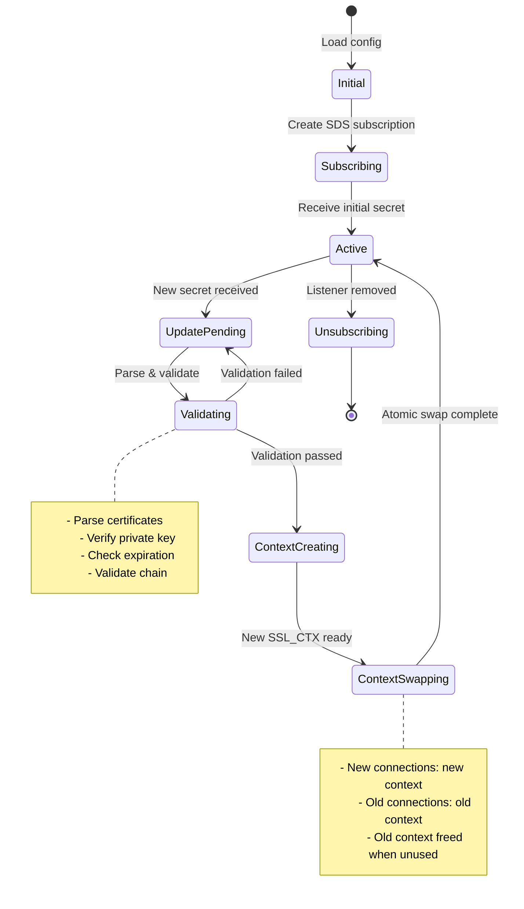

## Certificate Rotation with Zero Downtime

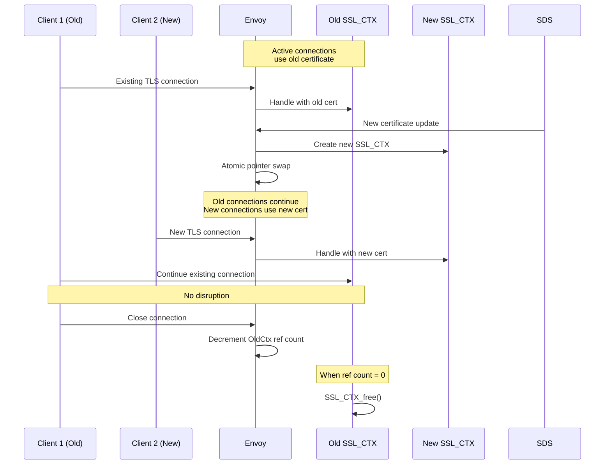

## File Watch Mechanism

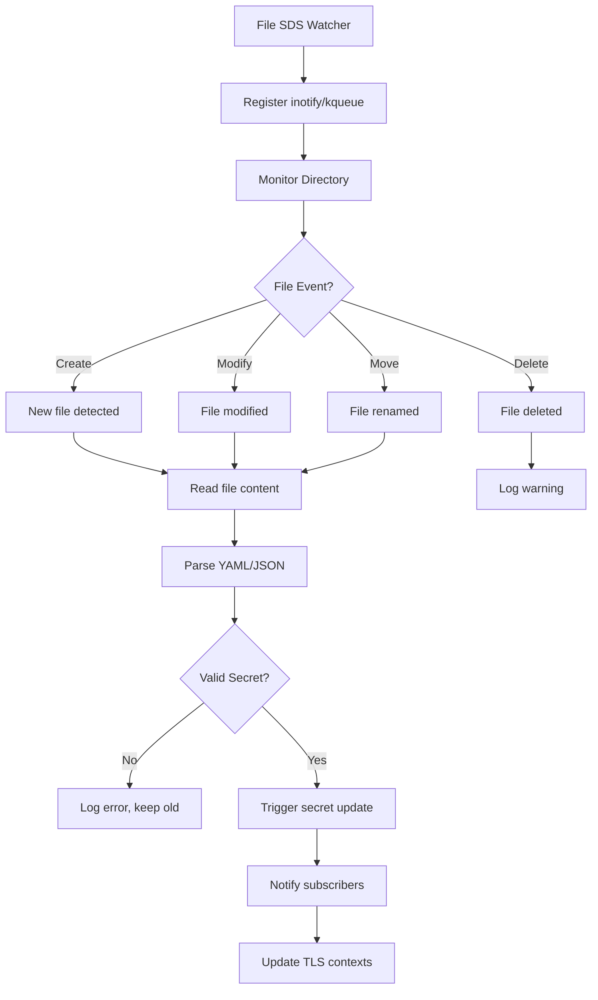

## SDS API Protocol

### DiscoveryRequest

```protobuf
message DiscoveryRequest {
  // Secret resource names
  repeated string resource_names = 3;

  // Type URL: type.googleapis.com/envoy.extensions.transport_sockets.tls.v3.Secret
  string type_url = 1;

  // Version from last response
  string version_info = 2;

  // Node identifier
  Node node = 4;

  // ACK/NACK
  ErrorDetail error_detail = 5;
}
```

### DiscoveryResponse

```protobuf
message DiscoveryResponse {
  // Secret resources
  repeated Any resources = 2;

  // Type URL
  string type_url = 1;

  // New version
  string version_info = 3;

  // Nonce for request/response matching
  string nonce = 4;
}
```

## Secret Update State Machine

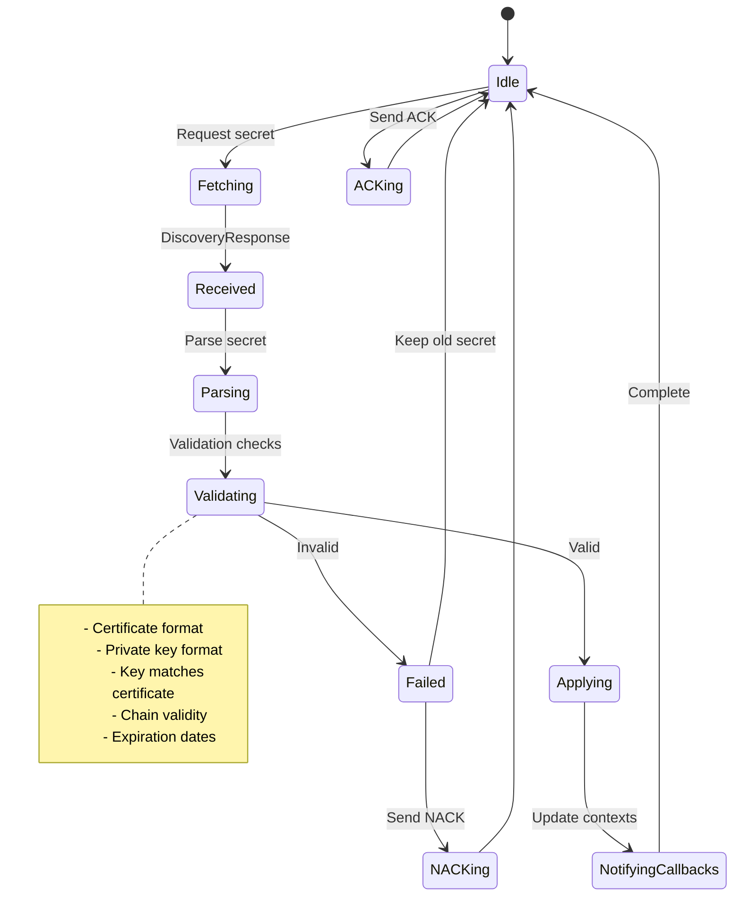

## Kubernetes Secrets Integration

```yaml
apiVersion: v1
kind: Secret
metadata:
  name: envoy-tls-cert
  namespace: default
type: kubernetes.io/tls
data:
  tls.crt: <base64-encoded-cert>
  tls.key: <base64-encoded-key>

---
# Envoy configuration to use K8s secret
apiVersion: v1
kind: ConfigMap
metadata:
  name: envoy-config
data:
  envoy.yaml: |
    static_resources:
      listeners:
        - name: https_listener
          address:
            socket_address:
              address: 0.0.0.0
              port_value: 443
          filter_chains:
            - transport_socket:
                name: envoy.transport_sockets.tls
                typed_config:
                  "@type": type.googleapis.com/envoy.extensions.transport_sockets.tls.v3.DownstreamTlsContext
                  common_tls_context:
                    tls_certificate_sds_secret_configs:
                      - name: kubernetes://default/envoy-tls-cert
                        sds_config:
                          resource_api_version: V3
                          ads: {}

    # Use ADS for secret discovery
    dynamic_resources:
      ads_config:
        api_type: GRPC
        grpc_services:
          - envoy_grpc:
              cluster_name: xds_cluster
```

## Secret Validation

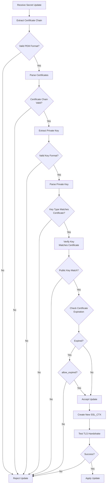

## Monitoring Certificate Expiration

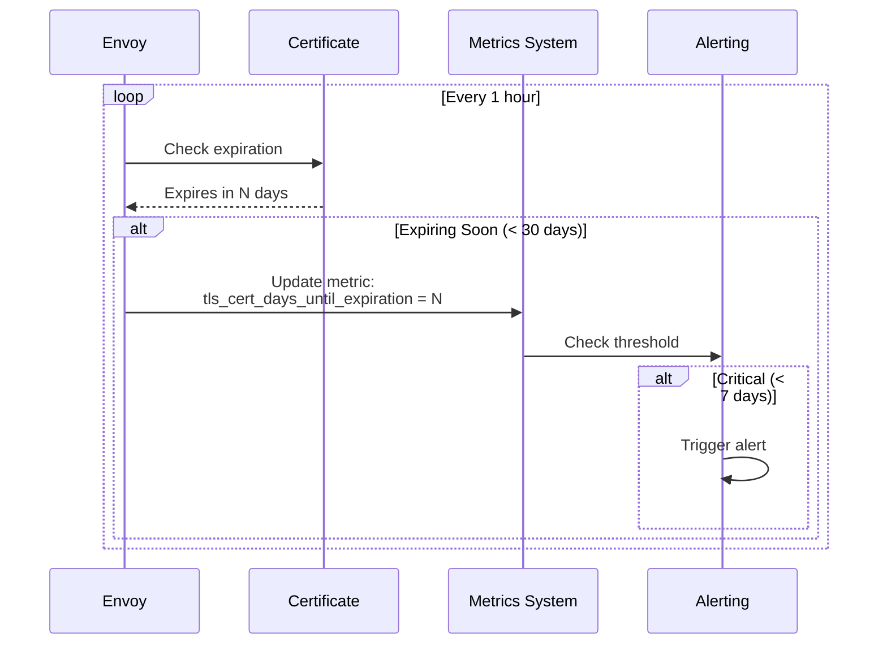

## Statistics

```yaml
# Certificate update stats
sds.server_cert.update_attempt
sds.server_cert.update_success
sds.server_cert.update_failure
sds.server_cert.update_rejected

# Secret fetch stats
sds.server_cert.config_reload
sds.server_cert.update_duration

# Certificate expiration
listener.0.0.0.0_443.ssl.days_until_first_cert_expiring

# Context update stats
listener.0.0.0.0_443.ssl.context_config_update_by_sds
```

## Best Practices

### 1. Certificate Rotation Strategy

```yaml
# Overlapping validity periods
# Old cert: Valid until Day 90
# New cert: Issued on Day 60, valid from Day 60

# SDS updates on Day 60:
# - Some clients see old cert (valid)
# - Some clients see new cert (valid)
# - No downtime
```

### 2. File-based SDS with Atomic Writes

```bash
# BAD: Direct write (can read partial file)
echo "new-content" > /etc/envoy/sds/cert.yaml

# GOOD: Atomic write using temp file + rename
echo "new-content" > /etc/envoy/sds/cert.yaml.tmp
mv /etc/envoy/sds/cert.yaml.tmp /etc/envoy/sds/cert.yaml
```

### 3. Validation Before Update

```yaml
# Pre-validate certificates before pushing to SDS
validation_context:
  trust_chain_verification: VERIFY_TRUST_CHAIN
  # This ensures invalid certs are rejected
```

### 4. Monitor Certificate Expiration

```yaml
# Set up alerts
alert: TLSCertificateExpiringSoon
expr: envoy_ssl_days_until_first_cert_expiring < 30
annotations:
  summary: TLS certificate expiring in {{ $value }} days
```

### 5. Graceful Rollback

```yaml
# Keep backup of previous certificate
# If new cert causes issues, quickly roll back via SDS update
```

## ACME Integration (Let's Encrypt)

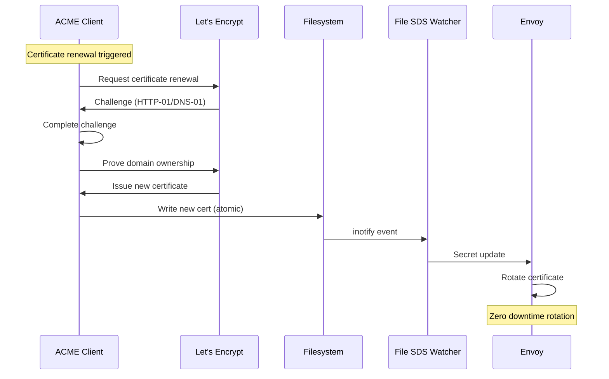

## Troubleshooting

### Check Secret Status

```bash
# View loaded secrets
curl http://localhost:9901/config_dump | jq '.configs[] | select(.["@type"] | contains("SecretsConfigDump"))'

# Check certificate details
curl http://localhost:9901/certs

# View SDS stats
curl http://localhost:9901/stats | grep sds
```

### Common Issues

1. **Secret not updating**
   - Check file permissions and SDS watcher
   - Verify inotify limits: `cat /proc/sys/fs/inotify/max_user_watches`
   - Check SDS server connectivity

2. **Certificate validation failed**
   - Verify private key matches certificate
   - Check certificate chain order (leaf first)
   - Ensure proper PEM format

3. **Old context not released**
   - Check for long-lived connections
   - Monitor `ssl.context_config_update_by_sds` stat

## References

- [Envoy SDS Documentation](https://www.envoyproxy.io/docs/envoy/latest/configuration/security/secret)
- [xDS Protocol](https://www.envoyproxy.io/docs/envoy/latest/api-docs/xds_protocol)
- [cert-manager](https://cert-manager.io/)
- [ACME Protocol](https://tools.ietf.org/html/rfc8555)
