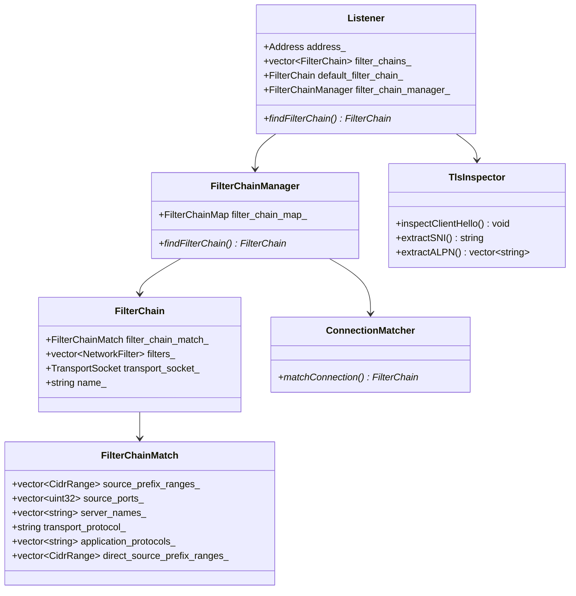
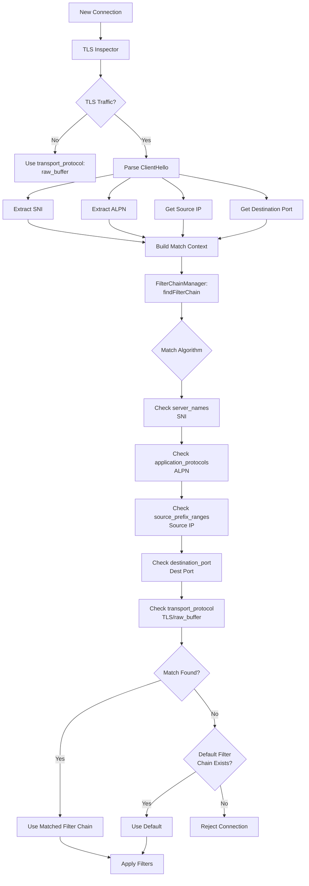
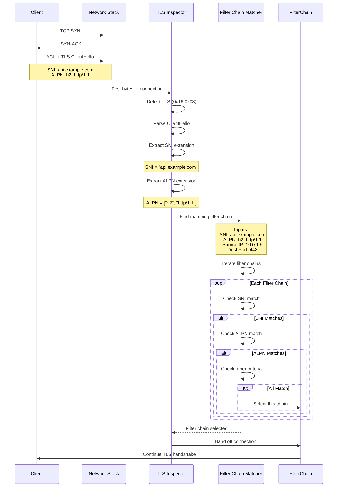
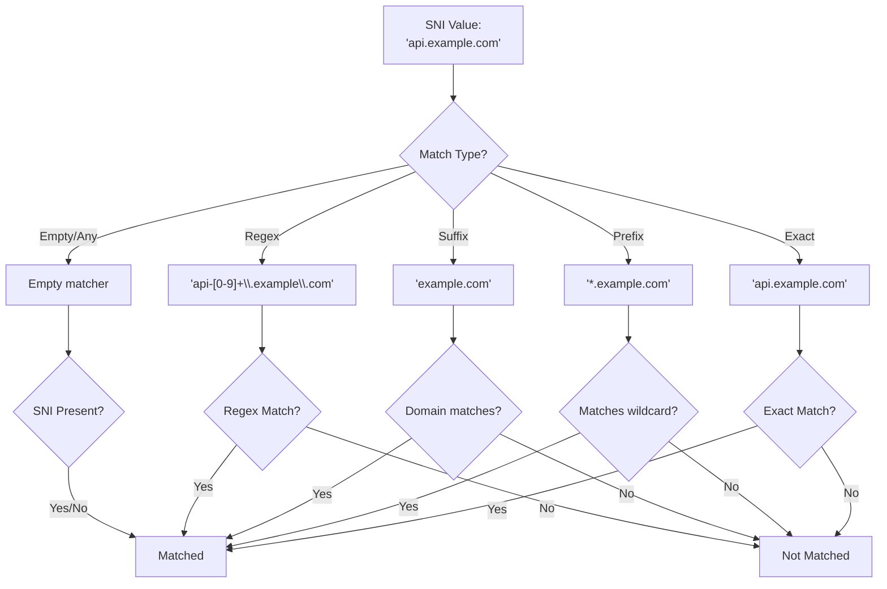
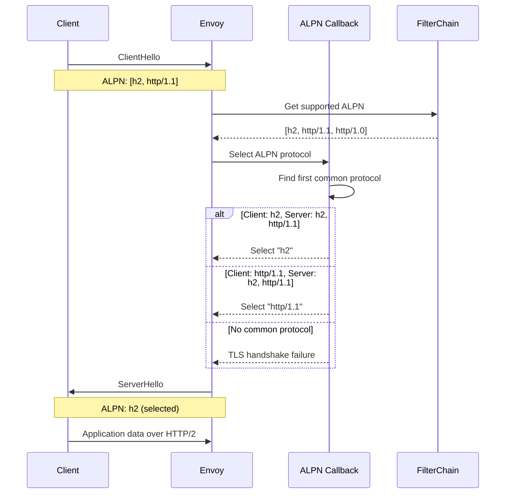
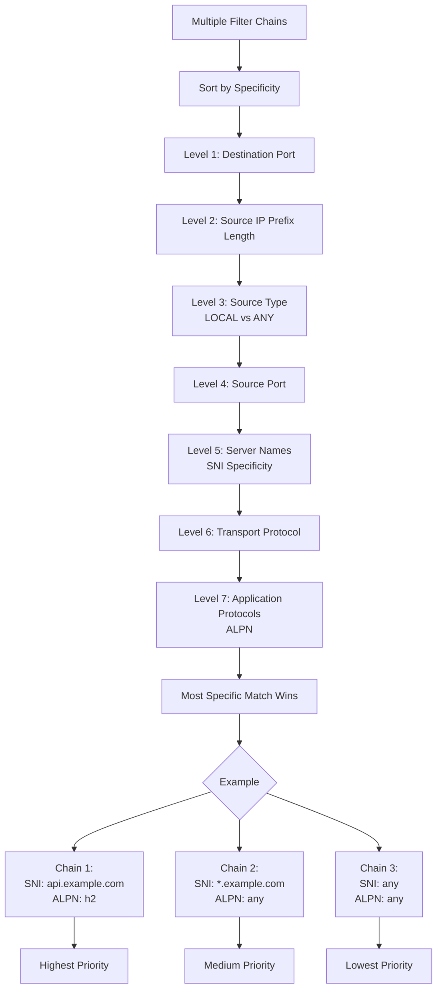
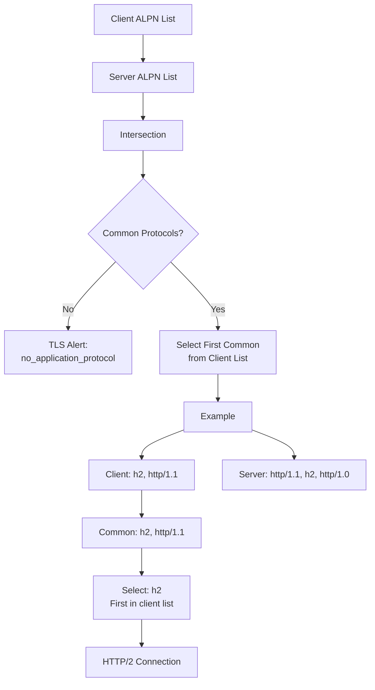
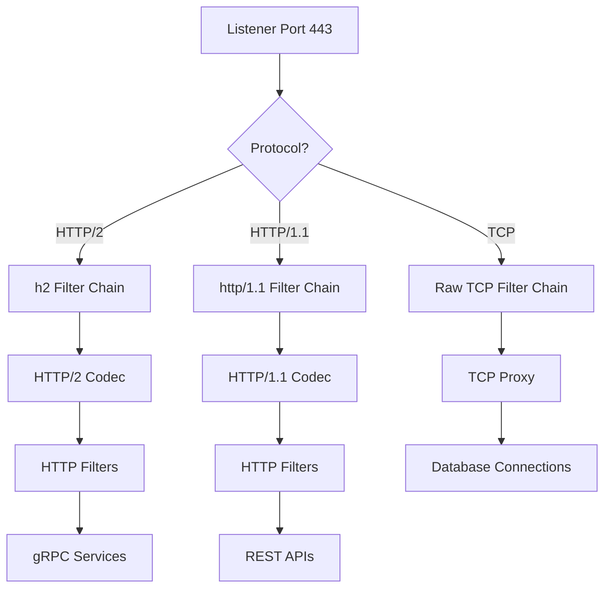
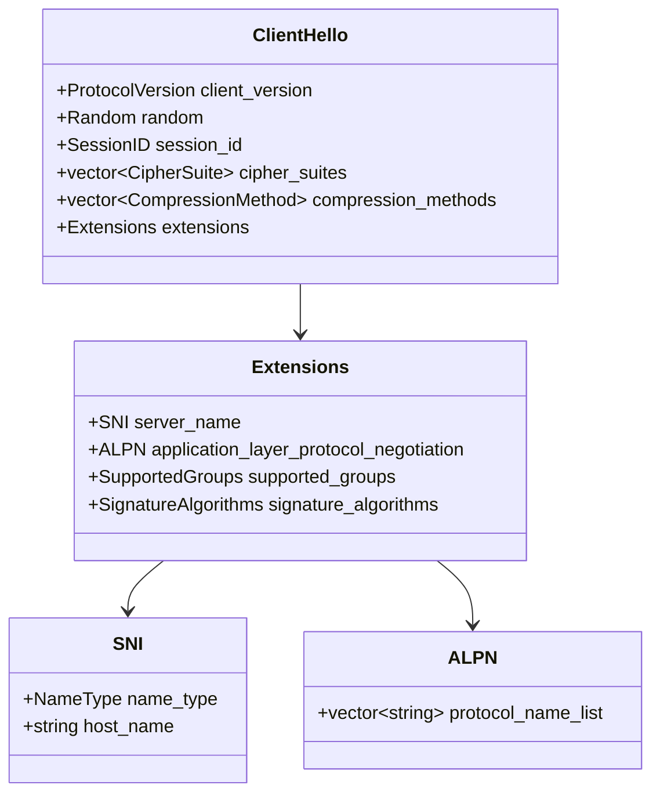
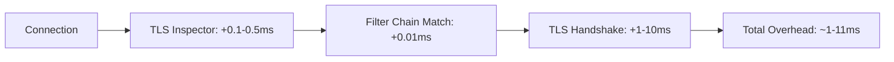

# ALPN & SNI Handling and Filter Chain Matching

## Overview

Application-Layer Protocol Negotiation (ALPN) and Server Name Indication (SNI) are TLS extensions that Envoy uses to route traffic to the appropriate filter chain. SNI allows hosting multiple TLS domains on a single IP address, while ALPN enables protocol negotiation (HTTP/1.1, HTTP/2, HTTP/3). Envoy's filter chain matching is a powerful mechanism that selects the appropriate configuration based on connection properties detected during the TLS handshake.

## Architecture



## Filter Chain Matching Flow



## SNI Extraction and Matching



## SNI Matching Patterns



## ALPN Protocol Negotiation



## Filter Chain Match Priority



## Configuration Example - Multiple Domains

```yaml
listeners:
  - name: https_listener
    address:
      socket_address:
        address: 0.0.0.0
        port_value: 443

    listener_filters:
      # Required for SNI/ALPN inspection
      - name: envoy.filters.listener.tls_inspector
        typed_config:
          "@type": type.googleapis.com/envoy.extensions.filters.listener.tls_inspector.v3.TlsInspector

    filter_chains:
      # Chain 1: api.example.com with HTTP/2
      - filter_chain_match:
          server_names:
            - "api.example.com"
          application_protocols:
            - "h2"
        transport_socket:
          name: envoy.transport_sockets.tls
          typed_config:
            "@type": type.googleapis.com/envoy.extensions.transport_sockets.tls.v3.DownstreamTlsContext
            common_tls_context:
              tls_certificates:
                - certificate_chain:
                    filename: /etc/ssl/api-cert.pem
                  private_key:
                    filename: /etc/ssl/api-key.pem
              alpn_protocols:
                - h2
        filters:
          - name: envoy.filters.network.http_connection_manager
            typed_config:
              "@type": type.googleapis.com/envoy.extensions.filters.network.http_connection_manager.v3.HttpConnectionManager
              stat_prefix: api_h2
              codec_type: AUTO
              route_config:
                name: api_route
                virtual_hosts:
                  - name: api
                    domains: ["api.example.com"]
                    routes:
                      - match: { prefix: "/" }
                        route: { cluster: api_cluster }

      # Chain 2: www.example.com with HTTP/1.1
      - filter_chain_match:
          server_names:
            - "www.example.com"
          application_protocols:
            - "http/1.1"
        transport_socket:
          name: envoy.transport_sockets.tls
          typed_config:
            "@type": type.googleapis.com/envoy.extensions.transport_sockets.tls.v3.DownstreamTlsContext
            common_tls_context:
              tls_certificates:
                - certificate_chain:
                    filename: /etc/ssl/www-cert.pem
                  private_key:
                    filename: /etc/ssl/www-key.pem
              alpn_protocols:
                - http/1.1
        filters:
          - name: envoy.filters.network.http_connection_manager
            typed_config:
              "@type": type.googleapis.com/envoy.extensions.filters.network.http_connection_manager.v3.HttpConnectionManager
              stat_prefix: www_http1
              codec_type: AUTO
              route_config:
                name: www_route
                virtual_hosts:
                  - name: www
                    domains: ["www.example.com"]
                    routes:
                      - match: { prefix: "/" }
                        route: { cluster: www_cluster }

      # Chain 3: Wildcard for other subdomains
      - filter_chain_match:
          server_names:
            - "*.example.com"
        transport_socket:
          name: envoy.transport_sockets.tls
          typed_config:
            "@type": type.googleapis.com/envoy.extensions.transport_sockets.tls.v3.DownstreamTlsContext
            common_tls_context:
              tls_certificates:
                - certificate_chain:
                    filename: /etc/ssl/wildcard-cert.pem
                  private_key:
                    filename: /etc/ssl/wildcard-key.pem
              alpn_protocols:
                - h2
                - http/1.1
        filters:
          - name: envoy.filters.network.http_connection_manager
            typed_config:
              "@type": type.googleapis.com/envoy.extensions.filters.network.http_connection_manager.v3.HttpConnectionManager
              stat_prefix: wildcard
              codec_type: AUTO
              route_config:
                name: wildcard_route
                virtual_hosts:
                  - name: wildcard
                    domains: ["*"]
                    routes:
                      - match: { prefix: "/" }
                        route: { cluster: default_cluster }

      # Default chain (no SNI)
      - transport_socket:
          name: envoy.transport_sockets.tls
          typed_config:
            "@type": type.googleapis.com/envoy.extensions.transport_sockets.tls.v3.DownstreamTlsContext
            common_tls_context:
              tls_certificates:
                - certificate_chain:
                    filename: /etc/ssl/default-cert.pem
                  private_key:
                    filename: /etc/ssl/default-key.pem
        filters:
          - name: envoy.filters.network.http_connection_manager
```

## TLS Inspector Listener Filter

```mermaid
flowchart TD
    A[Connection Established] --> B[TLS Inspector Activated]
    B --> C[Peek First Bytes]
    Note over C[Non-blocking peek]

    C --> D{Bytes Available?}
    D -->|No| E[Wait for data]
    E --> D
    D -->|Yes| F[Examine First Byte]

    F --> G{TLS Content Type?}
    G -->|0x16 Handshake| H[TLS Detected]
    G -->|Other| I[Non-TLS]

    H --> J[Parse ClientHello]
    J --> K[Extract Extensions]

    K --> L[SNI Extension<br/>0x0000]
    K --> M[ALPN Extension<br/>0x0010]
    K --> N[Other Extensions]

    L --> O[Store SNI Value]
    M --> P[Store ALPN List]
    N --> Q[Store Other Properties]

    O --> R[Continue to Filter Chain Matching]
    P --> R
    Q --> R
    I --> R
```

## Configuration Example - Source IP Matching

```yaml
listeners:
  - name: multi_criteria_listener
    address:
      socket_address:
        address: 0.0.0.0
        port_value: 443

    listener_filters:
      - name: envoy.filters.listener.tls_inspector

    filter_chains:
      # Chain 1: Internal traffic from VPC
      - filter_chain_match:
          server_names:
            - "internal.example.com"
          source_prefix_ranges:
            - address_prefix: "10.0.0.0"
              prefix_len: 8
          application_protocols:
            - "h2"
        transport_socket:
          name: envoy.transport_sockets.tls
          typed_config:
            "@type": type.googleapis.com/envoy.extensions.transport_sockets.tls.v3.DownstreamTlsContext
            common_tls_context:
              tls_certificates:
                - certificate_chain:
                    filename: /etc/ssl/internal-cert.pem
                  private_key:
                    filename: /etc/ssl/internal-key.pem
              alpn_protocols:
                - h2
              # Require client certificates for internal traffic
              validation_context:
                trusted_ca:
                  filename: /etc/ssl/internal-ca.pem
            require_client_certificate: true
        filters:
          - name: envoy.filters.network.http_connection_manager
            # ... internal HCM config ...

      # Chain 2: External traffic
      - filter_chain_match:
          server_names:
            - "api.example.com"
          # No source IP restriction - any external IP
          application_protocols:
            - "h2"
            - "http/1.1"
        transport_socket:
          name: envoy.transport_sockets.tls
          typed_config:
            "@type": type.googleapis.com/envoy.extensions.transport_sockets.tls.v3.DownstreamTlsContext
            common_tls_context:
              tls_certificates:
                - certificate_chain:
                    filename: /etc/ssl/api-cert.pem
                  private_key:
                    filename: /etc/ssl/api-key.pem
              alpn_protocols:
                - h2
                - http/1.1
            # No client certificate required
        filters:
          - name: envoy.filters.network.http_connection_manager
            # ... external HCM config ...
```

## ALPN Protocol Selection Logic



## Multi-Protocol Filter Chains



## Filter Chain Match Examples

### Example 1: Exact SNI Match
```yaml
filter_chain_match:
  server_names:
    - "api.example.com"  # Exact match only
```

### Example 2: Wildcard SNI Match
```yaml
filter_chain_match:
  server_names:
    - "*.example.com"  # Matches any.example.com, api.example.com, etc.
    - "*.prod.example.com"  # Matches app1.prod.example.com
```

### Example 3: Multiple ALPN Protocols
```yaml
filter_chain_match:
  application_protocols:
    - "h2"           # HTTP/2
    - "http/1.1"     # HTTP/1.1
    - "http/1.0"     # HTTP/1.0
```

### Example 4: Combined Matching
```yaml
filter_chain_match:
  server_names:
    - "secure.example.com"
  source_prefix_ranges:
    - address_prefix: "192.168.0.0"
      prefix_len: 16
  application_protocols:
    - "h2"
  destination_port: 443
```

## ClientHello Structure



## Statistics

```yaml
# Listener filter chain match stats
listener.0.0.0.0_443.server_ssl_socket_factory.ssl_context_update_by_sds
listener.0.0.0.0_443.server_ssl_socket_factory.downstream_context_secrets_not_ready
listener.0.0.0.0_443.ssl.connection_error
listener.0.0.0.0_443.ssl.no_certificate

# Per filter chain stats (if named)
listener.0.0.0.0_443.filter_chain.api_example_com.downstream_cx_total
listener.0.0.0.0_443.filter_chain.api_example_com.downstream_cx_active

# TLS inspector stats
listener.0.0.0.0_443.tls_inspector.alpn_found
listener.0.0.0.0_443.tls_inspector.alpn_not_found
listener.0.0.0.0_443.tls_inspector.sni_found
listener.0.0.0.0_443.tls_inspector.sni_not_found
listener.0.0.0.0_443.tls_inspector.client_hello_too_large
```

## Best Practices

### 1. Always Enable TLS Inspector for SNI/ALPN

```yaml
listener_filters:
  - name: envoy.filters.listener.tls_inspector
    typed_config:
      "@type": type.googleapis.com/envoy.extensions.filters.listener.tls_inspector.v3.TlsInspector
```

### 2. Order Filter Chains by Specificity

```yaml
filter_chains:
  # Most specific first
  - filter_chain_match:
      server_names: ["api.v2.example.com"]
      application_protocols: ["h2"]

  # Less specific
  - filter_chain_match:
      server_names: ["*.example.com"]
      application_protocols: ["h2"]

  # Least specific
  - filter_chain_match:
      server_names: ["*.example.com"]

  # Default (no match criteria)
  - {}
```

### 3. Use Named Filter Chains for Observability

```yaml
filter_chains:
  - name: "api_h2"
    filter_chain_match:
      server_names: ["api.example.com"]
      application_protocols: ["h2"]
```

### 4. Configure ALPN for HTTP/2

```yaml
alpn_protocols:
  - "h2"          # HTTP/2 over TLS
  - "http/1.1"    # HTTP/1.1 over TLS
```

### 5. Handle Missing SNI Gracefully

```yaml
# Default filter chain for connections without SNI
filter_chains:
  - {} # No filter_chain_match - catches all
    transport_socket:
      # ... default certificate ...
```

## Troubleshooting

### Debug SNI/ALPN Matching

```bash
# Enable debug logging
curl -X POST "http://localhost:9901/logging?connection=debug"

# Check TLS inspector stats
curl http://localhost:9901/stats | grep tls_inspector

# View active connections and their SNI
curl http://localhost:9901/certs

# Check filter chain matching
# Look for: "filter chain match" in logs
```

### Common Issues

1. **SNI Not Found**
   - Client not sending SNI extension
   - Ensure TLS inspector is enabled
   - Check for old TLS clients

2. **ALPN Mismatch**
   - No common protocols between client and server
   - Configure matching ALPN protocols

3. **Wrong Filter Chain Selected**
   - Check filter chain order
   - Verify match criteria
   - Use named chains for debugging

4. **TLS Handshake Failure**
   - Check cipher suite compatibility
   - Verify certificate validity
   - Ensure TLS version overlap

## Performance Considerations

### TLS Inspector Overhead



- TLS Inspector adds minimal overhead (~0.1-0.5ms)
- Peeking is non-blocking and efficient
- Filter chain matching is very fast (hash lookup)

## References

- [Envoy TLS Inspector](https://www.envoyproxy.io/docs/envoy/latest/configuration/listeners/listener_filters/tls_inspector)
- [Filter Chain Matching](https://www.envoyproxy.io/docs/envoy/latest/api-v3/config/listener/v3/listener_components.proto#envoy-v3-api-msg-config-listener-v3-filterchainmatch)
- [ALPN RFC 7301](https://tools.ietf.org/html/rfc7301)
- [SNI RFC 6066](https://tools.ietf.org/html/rfc6066)
