# RBAC Filter Internals: Authorization Enforcement

## Overview

The RBAC (Role-Based Access Control) filter enforces authorization policies within Envoy by evaluating rules against connection and request attributes. Unlike external authorization filters, RBAC performs local, synchronous policy evaluation with minimal latency. This document covers the internal implementation details, policy evaluation algorithms, matching engines, and performance optimizations.

## Architecture

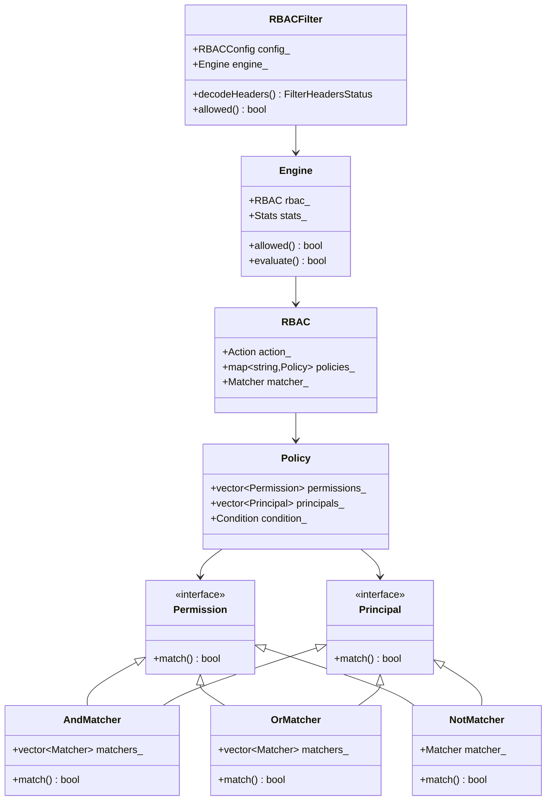

## Policy Evaluation Engine

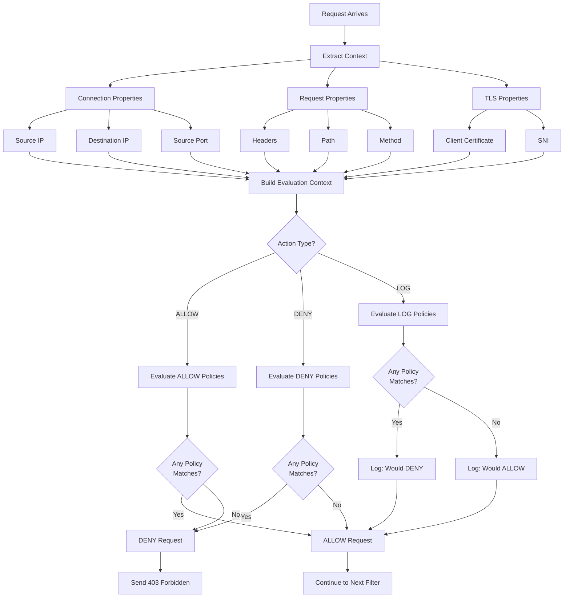

## Policy Matching Algorithm

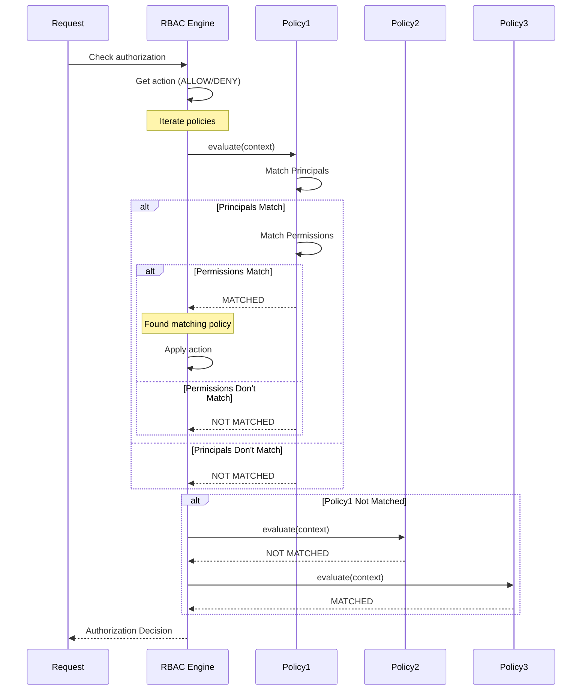

## Principal Matching Implementation

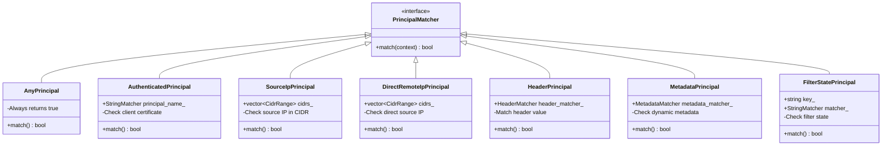

## Permission Matching Implementation

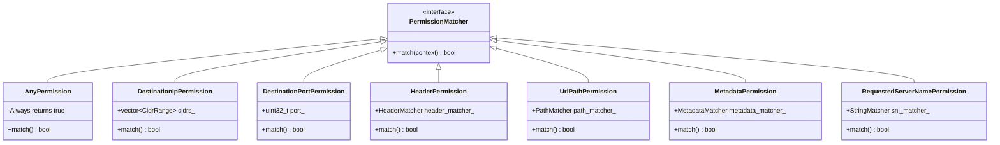

## AND/OR/NOT Logic Implementation

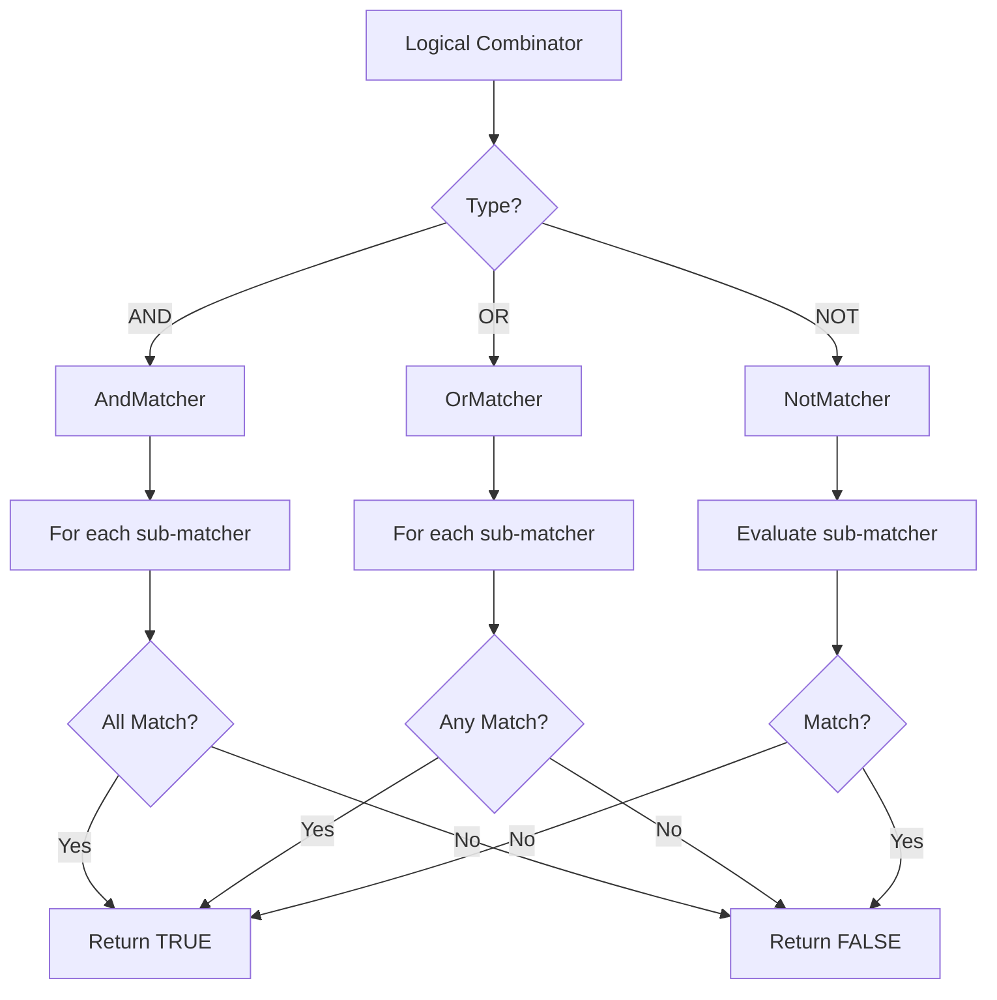

## IP Address Matching

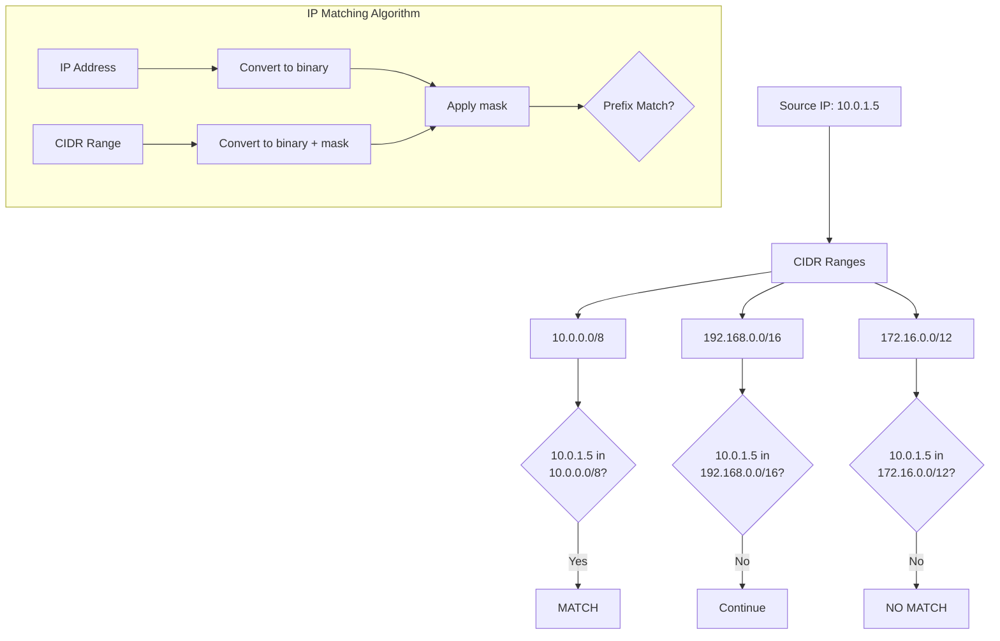

## Header Matching Engine

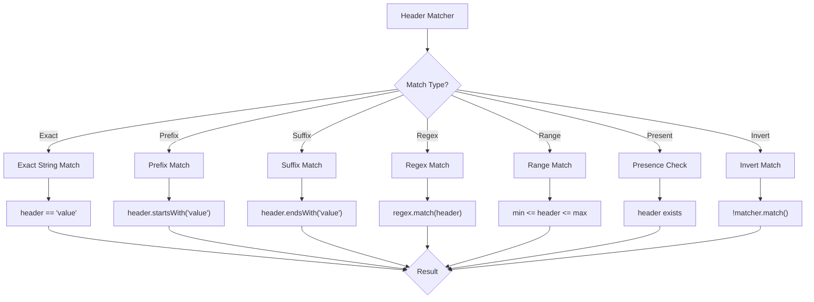

## TLS Certificate Extraction

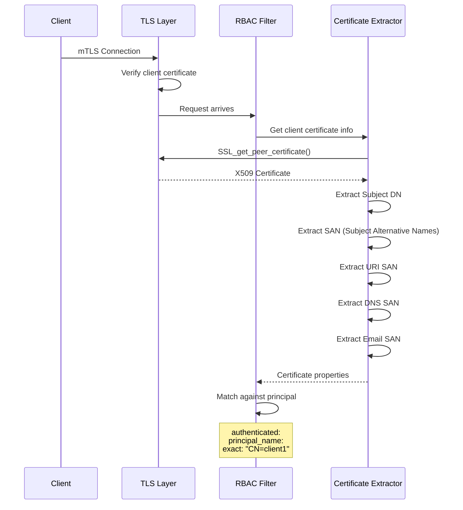

## Configuration Example - Complex Policy

```yaml
name: envoy.filters.http.rbac
typed_config:
  "@type": type.googleapis.com/envoy.extensions.filters.http.rbac.v3.RBAC
  rules:
    action: ALLOW
    policies:
      "admin-full-access":
        # Principals: Who can access
        principals:
          - and_ids:
              ids:
                # Must have valid mTLS certificate
                - authenticated:
                    principal_name:
                      exact: "CN=admin,OU=Engineering,O=Example Corp"

                # Must be from office network
                - source_ip:
                    address_prefix: "10.0.0.0"
                    prefix_len: 8

                # Must have admin role in JWT
                - metadata:
                    filter: "envoy.filters.http.jwt_authn"
                    path:
                      - key: "jwt_payload"
                      - key: "role"
                    value:
                      string_match:
                        exact: "admin"

        # Permissions: What can be accessed
        permissions:
          - and_rules:
              rules:
                # Admin paths
                - url_path:
                    path:
                      prefix: "/admin"

                # Allow all HTTP methods
                - any: true

      "api-read-only":
        principals:
          - or_ids:
              ids:
                # Valid API key
                - header:
                    name: "x-api-key"
                    present_match: true

                # Or valid JWT
                - metadata:
                    filter: "envoy.filters.http.jwt_authn"
                    path:
                      - key: "jwt_payload"
                    value:
                      present_match: true

        permissions:
          - and_rules:
              rules:
                # API paths
                - url_path:
                    path:
                      prefix: "/api"

                # Only GET and HEAD
                - or_rules:
                    rules:
                      - header:
                          name: ":method"
                          string_match:
                            exact: "GET"
                      - header:
                          name: ":method"
                          string_match:
                            exact: "HEAD"

                # NOT internal APIs
                - not_rule:
                    url_path:
                      path:
                        prefix: "/api/internal"

      "public-access":
        principals:
          - any: true  # Anyone

        permissions:
          - and_rules:
              rules:
                # Public paths only
                - url_path:
                    path:
                      prefix: "/public"

                # GET only
                - header:
                    name: ":method"
                    string_match:
                      exact: "GET"
```

## Policy Evaluation Optimization

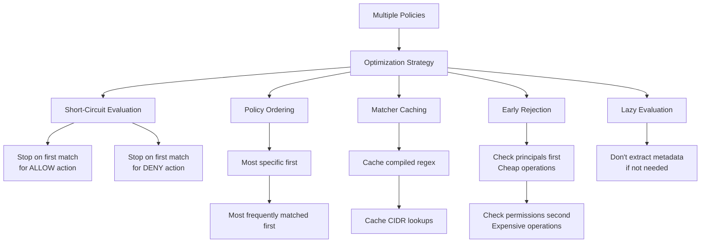

## Statistics and Observability

```yaml
# RBAC decision stats
http.rbac.allowed
http.rbac.denied

# Per-policy stats (if enabled)
http.rbac.policy.admin-full-access.allowed
http.rbac.policy.admin-full-access.denied

# Shadow mode stats
http.rbac.shadow_allowed
http.rbac.shadow_denied

# Network filter RBAC stats
listener.0.0.0.0_443.rbac.allowed
listener.0.0.0.0_443.rbac.denied
```

## Dynamic Metadata Integration

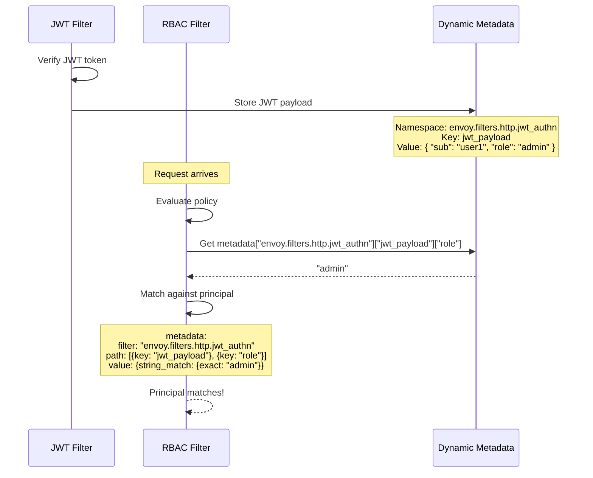

## Filter State Integration

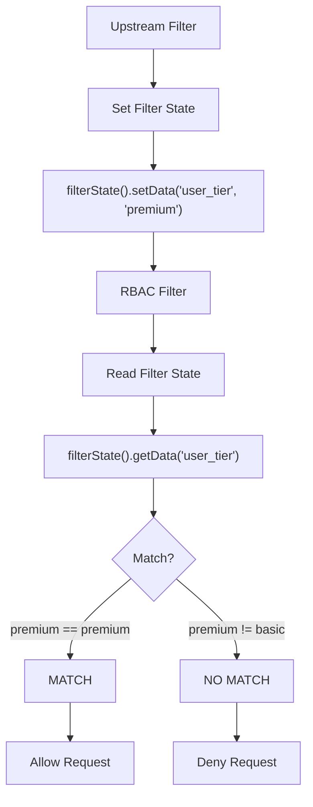

## Configuration Example - Network Filter RBAC

```yaml
listeners:
  - name: tcp_listener
    address:
      socket_address:
        address: 0.0.0.0
        port_value: 9999
    filter_chains:
      - filters:
          - name: envoy.filters.network.rbac
            typed_config:
              "@type": type.googleapis.com/envoy.extensions.filters.network.rbac.v3.RBAC
              stat_prefix: tcp_rbac
              rules:
                action: ALLOW
                policies:
                  "allow-internal":
                    permissions:
                      - any: true
                    principals:
                      - source_ip:
                          address_prefix: "10.0.0.0"
                          prefix_len: 8

                  "allow-vpn":
                    permissions:
                      - destination_port: 9999
                    principals:
                      - source_ip:
                          address_prefix: "172.16.0.0"
                          prefix_len: 12

          - name: envoy.filters.network.tcp_proxy
            typed_config:
              "@type": type.googleapis.com/envoy.extensions.filters.network.tcp_proxy.v3.TcpProxy
              stat_prefix: tcp
              cluster: backend_cluster
```

## Performance Characteristics

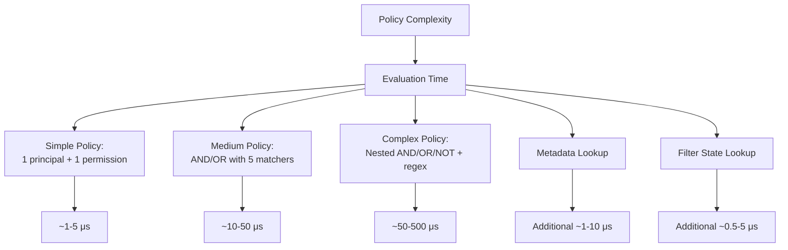

## Memory Usage

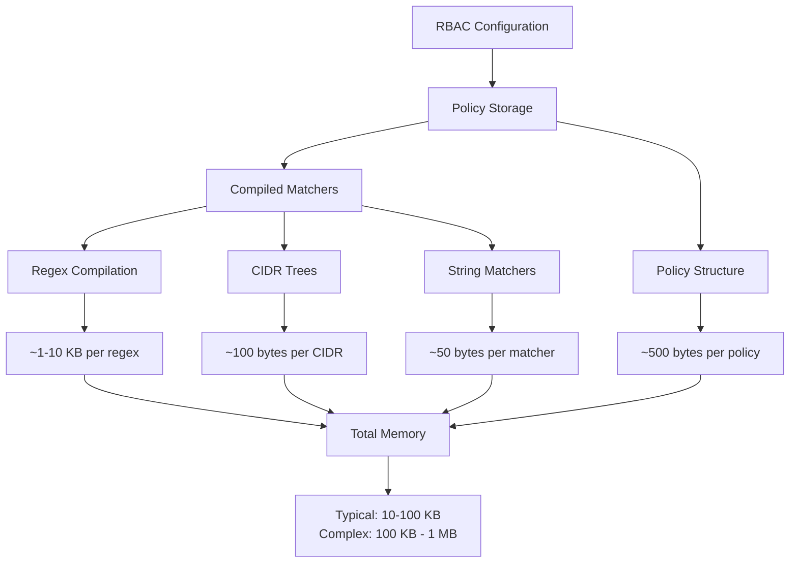

## Best Practices

### 1. Order Policies by Specificity

```yaml
policies:
  # Most specific first
  "super-admin":
    principals:
      - authenticated: { principal_name: { exact: "CN=superadmin" } }
      - source_ip: { address_prefix: "10.0.0.1", prefix_len: 32 }
    permissions:
      - any: true

  # Less specific
  "admin":
    principals:
      - authenticated: { principal_name: { suffix: ",OU=Admin" } }
    permissions:
      - url_path: { path: { prefix: "/admin" } }

  # Least specific
  "authenticated-users":
    principals:
      - authenticated: { principal_name: { present_match: true } }
    permissions:
      - url_path: { path: { prefix: "/app" } }
```

### 2. Use AND Before OR

```yaml
# GOOD: Check cheap conditions first
principals:
  - and_ids:
      ids:
        - source_ip: { ... }      # Cheap
        - authenticated: { ... }  # Medium
        - metadata: { ... }       # Expensive

# AVOID: Expensive operations first
principals:
  - and_ids:
      ids:
        - metadata: { ... }       # Expensive
        - source_ip: { ... }      # Cheap
```

### 3. Leverage Shadow Mode

```yaml
# Test policies without affecting traffic
shadow_rules:
  action: DENY
  policies:
    "new-policy-test":
      # ... policy definition ...

shadow_rules_stat_prefix: "rbac_shadow"
```

### 4. Use Descriptive Policy Names

```yaml
policies:
  "admin-write-operations":  # GOOD: Clear intent
    # ...

  "policy1":  # BAD: Not descriptive
    # ...
```

### 5. Monitor and Alert

```yaml
# Monitor denied requests
alert: RBACHighDenyRate
expr: rate(envoy_http_rbac_denied[5m]) > 10
annotations:
  summary: High RBAC deny rate
```

## Troubleshooting

### Debug RBAC Decisions

```bash
# Enable debug logging
curl -X POST "http://localhost:9901/logging?rbac=debug"

# Check RBAC stats
curl http://localhost:9901/stats | grep rbac

# View policy configuration
curl http://localhost:9901/config_dump | jq '.configs[] | select(.["@type"] | contains("RBAC"))'
```

### Common Issues

1. **All requests denied**
   - Check action is ALLOW (not DENY)
   - Verify at least one policy matches
   - Check principal and permission logic

2. **Specific requests denied unexpectedly**
   - Enable debug logging to see evaluation
   - Check NOT rules (might be inverting logic)
   - Verify metadata/filter state availability

3. **Performance degradation**
   - Check for complex regex matchers
   - Monitor policy evaluation time
   - Simplify policies if possible

4. **Metadata not matching**
   - Ensure upstream filter set metadata
   - Verify namespace and key path
   - Check metadata is available at RBAC evaluation time

## References

- [Envoy RBAC Filter Documentation](https://www.envoyproxy.io/docs/envoy/latest/configuration/http/http_filters/rbac_filter)
- [RBAC Network Filter](https://www.envoyproxy.io/docs/envoy/latest/configuration/listeners/network_filters/rbac_filter)
- [Authorization API](https://www.envoyproxy.io/docs/envoy/latest/api-v3/config/rbac/v3/rbac.proto)
