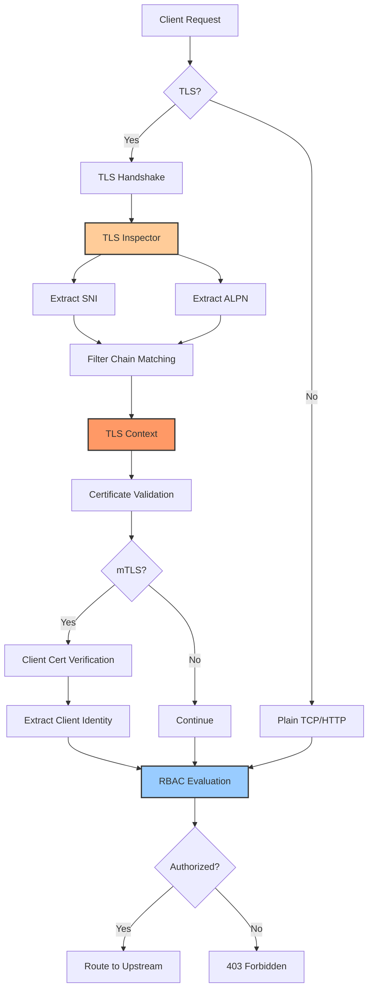
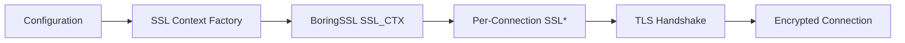
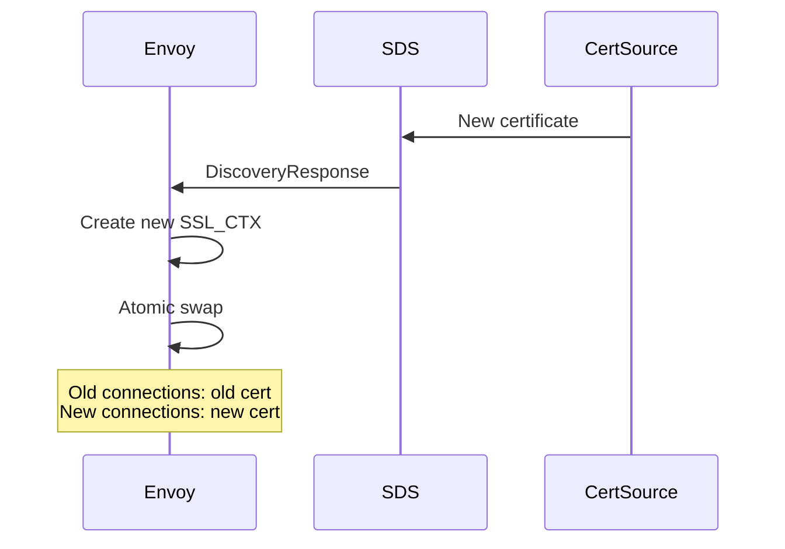
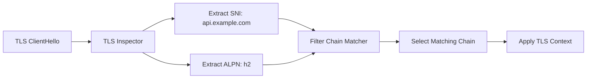
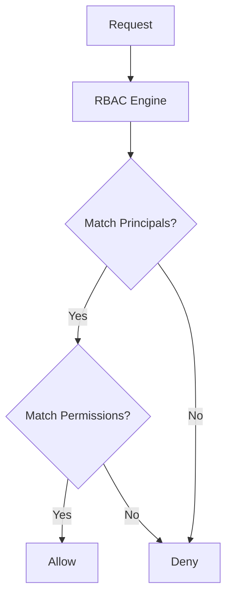
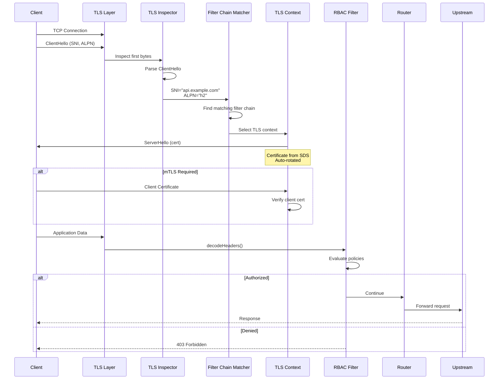

# Envoy TLS & Security Architecture

This directory contains comprehensive documentation on Envoy's TLS and security implementations, covering critical aspects for gateway and production deployments.

## Overview

Envoy provides enterprise-grade security features through its TLS implementation, dynamic certificate management, intelligent traffic routing, and local authorization enforcement. Understanding these components is essential for building secure, production-ready service meshes and API gateways.

## Security Architecture Overview



## Documentation Index

### 1. [TLS Context Implementation](01_tls_context_implementation.md)

Deep dive into how Envoy builds and manages SSL/TLS contexts for both downstream (client-facing) and upstream (backend) connections.

**Topics Covered:**
- SSL_CTX creation and lifecycle
- Certificate chain loading and validation
- Private key management (including HSM/KMS)
- Downstream vs Upstream TLS contexts
- Session resumption and caching
- Cipher suite selection
- TLS protocol version negotiation
- Memory management and context sharing

**Key Concepts:**


**When to Read:**
- Setting up mTLS for services
- Configuring custom cipher suites
- Troubleshooting TLS handshake failures
- Implementing certificate pinning
- Understanding TLS performance

### 2. [SDS Secret Updates](02_sds_secret_updates.md)

Complete guide to Secret Discovery Service (SDS) and dynamic certificate rotation without downtime.

**Topics Covered:**
- SDS protocol and architecture
- File-based vs gRPC-based SDS
- Dynamic certificate rotation (zero downtime)
- Certificate validation and verification
- Kubernetes secrets integration
- ACME/Let's Encrypt integration
- Monitoring certificate expiration
- Atomic context swapping

**Key Concepts:**


**When to Read:**
- Implementing automated certificate renewal
- Setting up cert-manager in Kubernetes
- Configuring Let's Encrypt integration
- Troubleshooting certificate rotation
- Planning zero-downtime cert updates

### 3. [ALPN & SNI Handling](03_alpn_sni_handling.md)

How Envoy uses TLS extensions (SNI and ALPN) to route traffic and select filter chains.

**Topics Covered:**
- TLS Inspector listener filter
- Filter chain matching algorithm
- SNI-based virtual hosting
- ALPN protocol negotiation
- Multi-protocol support (HTTP/1.1, HTTP/2, HTTP/3)
- Filter chain priority and ordering
- Source IP and destination port matching
- Performance optimization

**Key Concepts:**


**When to Read:**
- Hosting multiple domains on single IP
- Supporting HTTP/2 and HTTP/3
- Implementing SNI-based routing
- Troubleshooting filter chain selection
- Optimizing multi-tenant configurations

### 4. [RBAC Internals](04_rbac_internals.md)

Deep technical implementation of Role-Based Access Control (RBAC) filter and authorization enforcement.

**Topics Covered:**
- RBAC engine architecture
- Policy evaluation algorithms
- Principal and permission matching
- AND/OR/NOT logical combinators
- Certificate-based authentication
- Metadata and filter state integration
- Performance optimization strategies
- Network filter RBAC

**Key Concepts:**


**When to Read:**
- Implementing authorization policies
- Setting up mTLS-based access control
- Debugging RBAC decisions
- Optimizing policy performance
- Integrating with JWT claims

## Security Flow: End-to-End



## Common Use Cases

### Use Case 1: Multi-Tenant API Gateway

```yaml
# Multiple domains with different certificates
listeners:
  - name: https_listener
    address: { socket_address: { address: 0.0.0.0, port_value: 443 } }
    listener_filters:
      - name: envoy.filters.listener.tls_inspector
    filter_chains:
      # Tenant A
      - filter_chain_match:
          server_names: ["tenant-a.example.com"]
        transport_socket:
          name: envoy.transport_sockets.tls
          typed_config:
            "@type": type.googleapis.com/envoy.extensions.transport_sockets.tls.v3.DownstreamTlsContext
            common_tls_context:
              tls_certificate_sds_secret_configs:
                - name: tenant-a-cert
                  sds_config: { path_config_source: { path: /etc/envoy/sds/tenant-a.yaml } }
        filters:
          - name: envoy.filters.http.rbac
            # Tenant A specific policies
          - name: envoy.filters.http.router

      # Tenant B
      - filter_chain_match:
          server_names: ["tenant-b.example.com"]
        # ... similar config for tenant B
```

### Use Case 2: mTLS with Certificate-Based Authorization

```yaml
# Require and validate client certificates
downstream_tls_context:
  require_client_certificate: true
  common_tls_context:
    tls_certificates:
      - certificate_chain: { filename: /etc/ssl/server-cert.pem }
        private_key: { filename: /etc/ssl/server-key.pem }
    validation_context:
      trusted_ca: { filename: /etc/ssl/client-ca.pem }
      match_typed_subject_alt_names:
        - san_type: DNS
          matcher: { suffix: ".internal.example.com" }

# RBAC using certificate properties
rbac:
  rules:
    action: ALLOW
    policies:
      "service-a-access":
        principals:
          - authenticated:
              principal_name: { exact: "CN=service-a.internal.example.com" }
        permissions:
          - url_path: { path: { prefix: "/api/service-a" } }
```

### Use Case 3: Zero-Downtime Certificate Rotation

```yaml
# File-based SDS for automated rotation
tls_certificate_sds_secret_configs:
  - name: server_cert
    sds_config:
      path_config_source:
        path: /etc/envoy/sds/cert.yaml
        watched_directory: { path: /etc/envoy/sds }

# Cert renewal script (e.g., certbot)
# 1. Obtain new certificate
# 2. Write to temp file: /etc/envoy/sds/cert.yaml.tmp
# 3. Atomic rename: mv cert.yaml.tmp cert.yaml
# 4. Envoy automatically reloads (inotify event)
# 5. New connections use new cert, old connections continue
```

### Use Case 4: ALPN-Based Protocol Selection

```yaml
# Support both HTTP/2 and HTTP/1.1
filter_chains:
  # HTTP/2 optimized path
  - filter_chain_match:
      application_protocols: ["h2"]
    transport_socket:
      typed_config:
        common_tls_context:
          alpn_protocols: ["h2"]
    filters:
      - name: envoy.filters.network.http_connection_manager
        typed_config:
          http2_protocol_options:
            max_concurrent_streams: 100
            initial_stream_window_size: 65536

  # HTTP/1.1 fallback
  - filter_chain_match:
      application_protocols: ["http/1.1"]
    transport_socket:
      typed_config:
        common_tls_context:
          alpn_protocols: ["http/1.1", "http/1.0"]
    filters:
      - name: envoy.filters.network.http_connection_manager
        typed_config:
          codec_type: HTTP1
```

## Security Best Practices

### 1. TLS Configuration

✅ **DO:**
- Use TLS 1.2 minimum, prefer TLS 1.3
- Select modern cipher suites only
- Enable ALPN for protocol negotiation
- Implement certificate pinning for critical upstreams
- Use SDS for dynamic certificate rotation
- Monitor certificate expiration dates

❌ **DON'T:**
- Use TLS 1.0 or 1.1 (deprecated)
- Allow weak ciphers (RC4, DES, export ciphers)
- Disable certificate validation in production
- Hard-code certificates in configuration
- Ignore certificate expiration warnings

### 2. Certificate Management

✅ **DO:**
- Automate certificate renewal (ACME, cert-manager)
- Use separate certificates per environment
- Implement proper key storage (HSM, KMS)
- Monitor certificate metrics
- Test rotation in staging first
- Use overlapping validity periods

❌ **DON'T:**
- Manually rotate certificates in production
- Share private keys across environments
- Store private keys in version control
- Use self-signed certs in production
- Skip certificate validation testing

### 3. Authorization

✅ **DO:**
- Use ALLOW action (whitelist approach)
- Order policies by specificity
- Leverage shadow mode for testing
- Monitor denied requests
- Combine with authentication (JWT, mTLS)
- Use descriptive policy names

❌ **DON'T:**
- Use DENY action without careful consideration
- Create overly complex policies
- Skip testing policy changes
- Ignore RBAC statistics
- Forget to handle missing principals/permissions

### 4. Filter Chain Matching

✅ **DO:**
- Enable TLS Inspector for SNI/ALPN
- Order filter chains by specificity
- Use named filter chains for observability
- Provide default filter chain
- Test all matching scenarios

❌ **DON'T:**
- Forget TLS Inspector listener filter
- Rely on implicit matching order
- Skip filter chain naming
- Leave connections unmatched
- Assume SNI is always present

## Performance Considerations

### Latency Impact

| Component | Typical Latency | Notes |
|-----------|----------------|-------|
| TLS Handshake | 1-10ms | First connection only |
| TLS Inspector | 0.1-0.5ms | Per connection |
| Filter Chain Match | 0.01ms | Hash table lookup |
| RBAC Evaluation | 1-500μs | Depends on policy complexity |
| Certificate Validation | 0.5-2ms | Cached after first use |

### Memory Usage

| Component | Memory per Instance | Scalability |
|-----------|-------------------|-------------|
| SSL_CTX (context) | 10-50 KB | Shared across connections |
| SSL* (connection) | 5-20 KB | Per connection |
| RBAC Policies | 10-100 KB | Global, shared |
| Certificate Cache | 1-5 KB per cert | LRU cache |

### Optimization Tips

1. **Enable Session Resumption**
   ```yaml
   session_timeout: 3600s
   session_ticket_keys: { ... }
   ```

2. **Use SDS with Caching**
   ```yaml
   cache_duration: { seconds: 300 }
   ```

3. **Simplify RBAC Policies**
   - Avoid deep nesting of AND/OR
   - Check cheap conditions first
   - Use compiled matchers

4. **Leverage Connection Pooling**
   ```yaml
   # Reuse upstream TLS connections
   common_http_protocol_options:
     max_connection_duration: 300s
   ```

## Monitoring and Observability

### Key Metrics to Monitor

```yaml
# TLS Handshake metrics
listener.0.0.0.0_443.ssl.connection_error
listener.0.0.0.0_443.ssl.handshake
listener.0.0.0.0_443.ssl.session_reused

# Certificate expiration
listener.0.0.0.0_443.ssl.days_until_first_cert_expiring

# SDS updates
sds.server_cert.update_success
sds.server_cert.update_failure

# Filter chain matching
listener.0.0.0.0_443.tls_inspector.sni_found
listener.0.0.0.0_443.tls_inspector.alpn_found

# RBAC decisions
http.rbac.allowed
http.rbac.denied
```

### Alerting Examples

```yaml
# Certificate expiring soon
alert: TLSCertificateExpiringSoon
expr: envoy_ssl_days_until_first_cert_expiring < 30
severity: warning

# High TLS error rate
alert: HighTLSErrorRate
expr: rate(envoy_ssl_connection_error[5m]) > 10
severity: critical

# SDS update failures
alert: SDSUpdateFailure
expr: increase(envoy_sds_update_failure[10m]) > 0
severity: critical

# RBAC high deny rate
alert: RBACHighDenyRate
expr: rate(envoy_http_rbac_denied[5m]) > 100
severity: warning
```

## Troubleshooting Guide

### TLS Handshake Failures

```bash
# Enable TLS debug logging
curl -X POST "http://localhost:9901/logging?ssl=trace"

# Check TLS stats
curl http://localhost:9901/stats | grep ssl

# View active certificates
curl http://localhost:9901/certs

# Test TLS connection
openssl s_client -connect localhost:443 -servername api.example.com -alpn h2
```

### Certificate Rotation Issues

```bash
# Check SDS stats
curl http://localhost:9901/stats | grep sds

# View current secrets
curl http://localhost:9901/config_dump | jq '.configs[] | select(.["@type"] | contains("Secrets"))'

# Verify file permissions
ls -la /etc/envoy/sds/

# Check inotify limits
cat /proc/sys/fs/inotify/max_user_watches
```

### Filter Chain Matching Issues

```bash
# Check TLS inspector stats
curl http://localhost:9901/stats | grep tls_inspector

# View filter chain configuration
curl http://localhost:9901/config_dump | jq '.configs[0].dynamic_listeners[].active_state.listener.filter_chains[]'

# Enable connection logging
curl -X POST "http://localhost:9901/logging?connection=debug"
```

### RBAC Authorization Issues

```bash
# Enable RBAC debug logging
curl -X POST "http://localhost:9901/logging?rbac=debug"

# Check RBAC stats
curl http://localhost:9901/stats | grep rbac

# View RBAC configuration
curl http://localhost:9901/config_dump | jq '.configs[] | select(.["@type"] | contains("RBAC"))'
```

## Additional Resources

### Official Documentation
- [Envoy TLS Documentation](https://www.envoyproxy.io/docs/envoy/latest/intro/arch_overview/security/ssl)
- [Secret Discovery Service](https://www.envoyproxy.io/docs/envoy/latest/configuration/security/secret)
- [RBAC Filter](https://www.envoyproxy.io/docs/envoy/latest/configuration/http/http_filters/rbac_filter)

### Related Standards
- [TLS 1.3 (RFC 8446)](https://tools.ietf.org/html/rfc8446)
- [SNI (RFC 6066)](https://tools.ietf.org/html/rfc6066)
- [ALPN (RFC 7301)](https://tools.ietf.org/html/rfc7301)
- [ACME (RFC 8555)](https://tools.ietf.org/html/rfc8555)

### Tools
- [BoringSSL](https://boringssl.googlesource.com/boringssl/)
- [cert-manager](https://cert-manager.io/)
- [Let's Encrypt](https://letsencrypt.org/)

## Contributing

To add or update security documentation:

1. Follow the existing format and structure
2. Include detailed Mermaid diagrams
3. Provide working configuration examples
4. Document troubleshooting steps
5. Update this README with links

---

*Last Updated: 2026-02-28*
*Envoy Version: Latest (4.x)*
