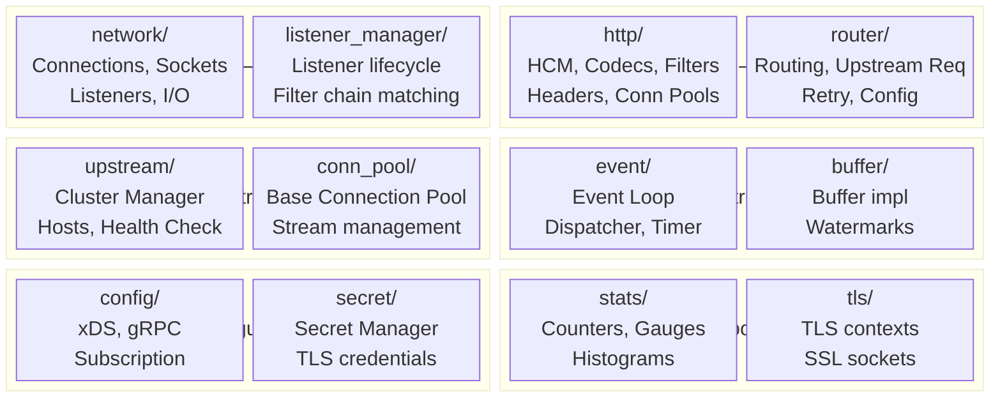
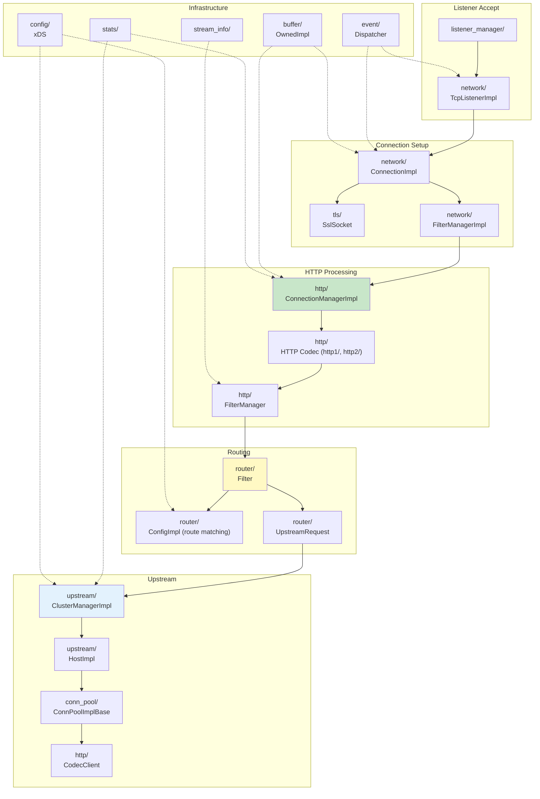
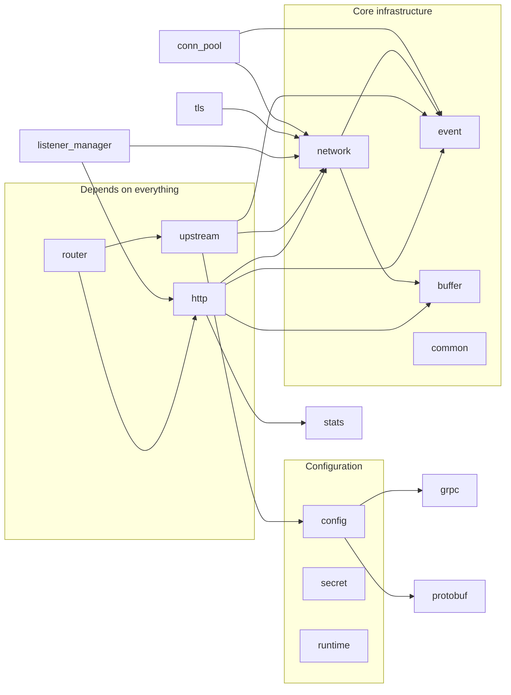

# Part 1: `source/common/` — Overview and Folder Map

## Introduction

The `source/common/` directory is the **core implementation layer** of Envoy. It contains the data plane runtime — connections, codecs, filters, routing, upstream management, and all supporting infrastructure. Every request Envoy processes flows through classes defined here.

This document provides an architectural map of the entire `source/common/` directory, how the folders relate to each other, and which are most important for understanding Envoy's request processing.

## Folder Architecture

## Complete Folder Catalog

### Critical Path Folders (Request Processing)

| Folder | Files | Purpose | Key Classes |
|--------|-------|---------|-------------|
| **`http/`** | ~100+ | HTTP connection management, codecs, filter chains, headers, connection pooling | `ConnectionManagerImpl`, `FilterManager`, `HeaderMapImpl`, `CodecClient` |
| **`network/`** | ~90+ | TCP connections, socket I/O, L4 filter management, listeners, addresses | `ConnectionImpl`, `FilterManagerImpl`, `TcpListenerImpl`, `IoSocketHandleImpl` |
| **`router/`** | ~57 | HTTP routing, upstream request forwarding, retry logic, route configuration | `Filter`, `UpstreamRequest`, `ConfigImpl`, `RetryStateImpl` |
| **`upstream/`** | ~60+ | Cluster management, host discovery, health checking, load balancing, outlier detection | `ClusterManagerImpl`, `HostImpl`, `ClusterInfoImpl`, `OutlierDetectorImpl` |
| **`listener_manager/`** | ~20 | Listener lifecycle, filter chain matching, active listeners/connections | `ListenerImpl`, `ActiveTcpListener`, `FilterChainManagerImpl` |
| **`conn_pool/`** | ~5 | Base connection pool logic (shared by HTTP/TCP) | `ConnPoolImplBase`, `ActiveClient` |

### Infrastructure Folders

| Folder | Files | Purpose | Key Classes |
|--------|-------|---------|-------------|
| **`event/`** | ~10 | Event loop, dispatcher, timers, deferred deletion | `DispatcherImpl`, `TimerImpl`, `FileEventImpl` |
| **`buffer/`** | ~8 | Zero-copy buffer implementation, watermarks | `OwnedImpl`, `WatermarkBuffer` |
| **`config/`** | ~20 | xDS subscription, gRPC mux, config utilities | `GrpcMuxImpl`, `SubscriptionFactoryImpl` |
| **`tls/`** | ~30 | TLS/SSL contexts, socket implementations, certificate handling | `ClientSslSocketFactory`, `ServerSslSocketFactory`, `ContextImpl` |
| **`stats/`** | ~25 | Statistics counters, gauges, histograms, tag extraction | `ThreadLocalStoreImpl`, `CounterImpl`, `GaugeImpl` |
| **`grpc/`** | ~15 | gRPC client implementations, async client | `AsyncClientImpl`, `GoogleAsyncClientImpl` |

### Supporting Folders

| Folder | Files | Purpose | Key Classes |
|--------|-------|---------|-------------|
| **`common/`** | ~20 | Shared utilities: hashing, logging, random, string ops | `Utility`, `MutexBasicLockable` |
| **`runtime/`** | ~5 | Runtime feature flags, RTDS | `SnapshotImpl`, `LoaderImpl` |
| **`secret/`** | ~8 | Secret/credential management, SDS | `SecretManagerImpl`, `SdsApi` |
| **`access_log/`** | ~5 | Access log implementation | `AccessLogManagerImpl` |
| **`stream_info/`** | ~8 | Per-request metadata, timing, flags | `StreamInfoImpl`, `FilterStateImpl` |
| **`tracing/`** | ~8 | Distributed tracing | `HttpTracerImpl` |
| **`formatter/`** | ~10 | Log/access log format strings | `SubstitutionFormatStringUtils` |
| **`matcher/`** | ~5 | Generic matching framework | `MatchTreeFactory` |
| **`protobuf/`** | ~8 | Protobuf utilities, message validation | `MessageUtil`, `UtilityImpl` |
| **`filter/`** | ~5 | Filter-related utilities | `ConfigDiscoveryFactory` |

### Specialized Folders

| Folder | Files | Purpose |
|--------|-------|---------|
| **`quic/`** | ~30 | QUIC/HTTP3 implementation |
| **`tcp_proxy/`** | ~5 | TCP proxy filter (L4 proxying) |
| **`tcp/`** | ~3 | TCP connection pool |
| **`rds/`** | ~3 | Route discovery service helpers |
| **`ssl/`** | ~3 | SSL utility types |
| **`websocket/`** | ~2 | WebSocket support |
| **`compression/`** | ~3 | Compression utilities |
| **`crypto/`** | ~3 | Crypto utilities |
| **`json/`** | ~3 | JSON parsing |
| **`jwt/`** | ~3 | JWT token utilities |
| **`html/`** | ~2 | HTML utility |
| **`io/`** | ~2 | I/O utilities |
| **`init/`** | ~3 | Initialization manager |
| **`local_info/`** | ~2 | Local node info |
| **`local_reply/`** | ~2 | Local reply mapping |
| **`memory/`** | ~3 | Memory allocation stats |
| **`orca/`** | ~2 | ORCA load report |
| **`profiler/`** | ~2 | CPU profiler |
| **`signal/`** | ~3 | Signal handling |
| **`singleton/`** | ~2 | Singleton manager |
| **`shared_pool/`** | ~2 | Object pool |
| **`thread/`** | ~2 | Thread utilities |
| **`thread_local/`** | ~2 | TLS (thread-local storage) |
| **`version/`** | ~2 | Version info |
| **`watchdog/`** | ~3 | Watchdog/deadlock detection |

## How Folders Relate — Request Flow

## Dependency Graph Between Folders

## Document Series Index

| Part | Document | Folders Covered |
|------|----------|----------------|
| [Part 1](01-overview.md) | Overview and Folder Map | All |
| [Part 2](02-http-connection-management.md) | HTTP Connection Management & Filter Manager | `http/` core |
| [Part 3](03-http-codecs-headers-pools.md) | HTTP Codecs, Headers, and Connection Pools | `http/` codecs, pools |
| [Part 4](04-network-connections-sockets.md) | Network Connections, Sockets, and I/O | `network/` core |
| [Part 5](05-network-listeners-filters.md) | Network Listeners, Filters, and Addresses | `network/` listeners |
| [Part 6](06-router-engine-config.md) | Routing Engine and Configuration | `router/` config |
| [Part 7](07-router-upstream-retry.md) | Upstream Request and Retry | `router/` upstream |
| [Part 8](08-upstream-cluster-manager.md) | Cluster Manager and Clusters | `upstream/` manager |
| [Part 9](09-upstream-hosts-health.md) | Hosts, Health Checking, and Outlier Detection | `upstream/` hosts |
| [Part 10](10-supporting-subsystems.md) | Supporting Subsystems | `event/`, `buffer/`, `config/`, etc. |
