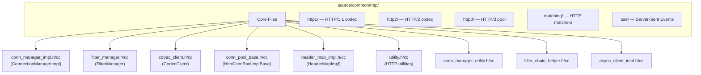
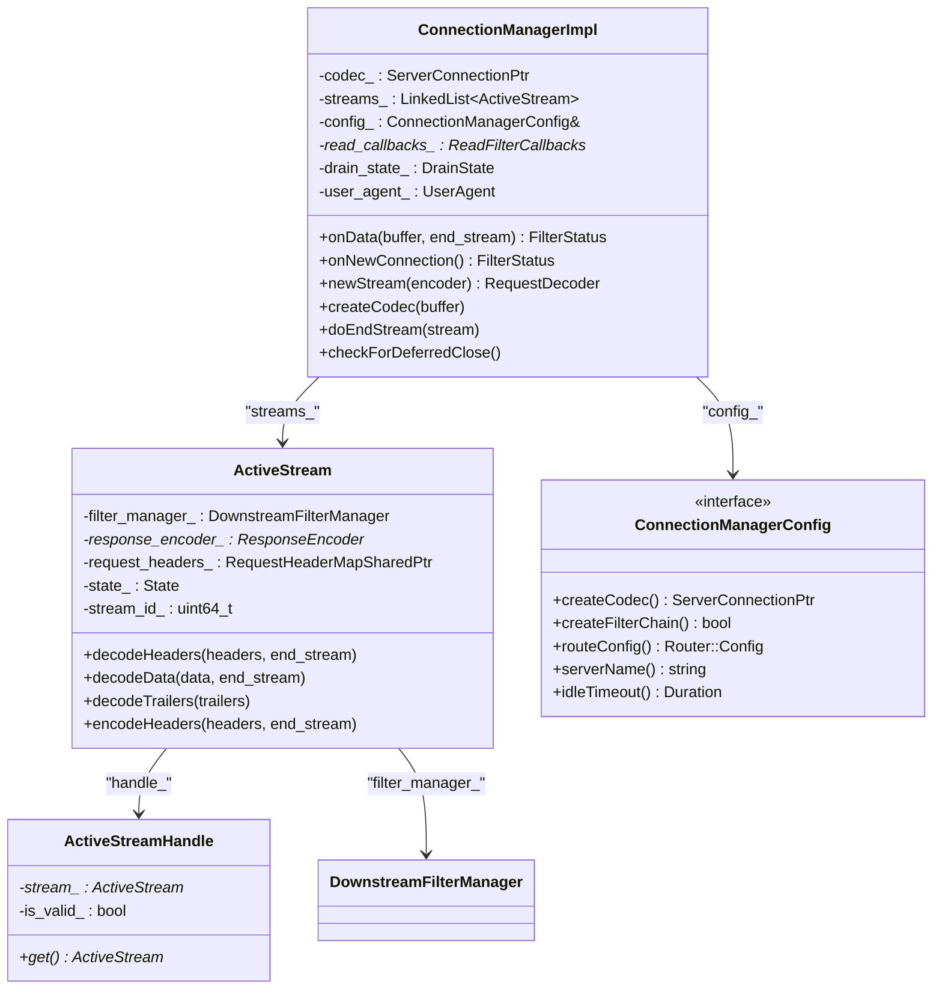
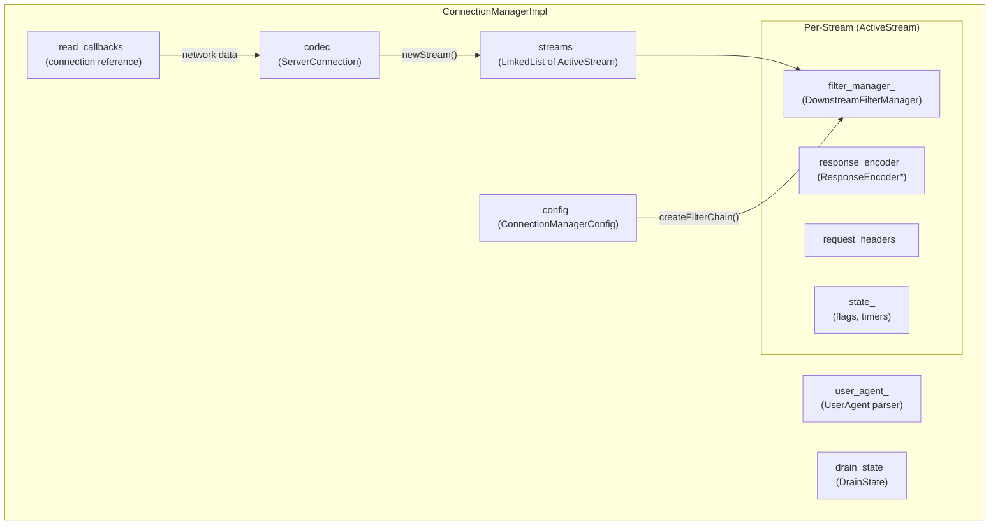
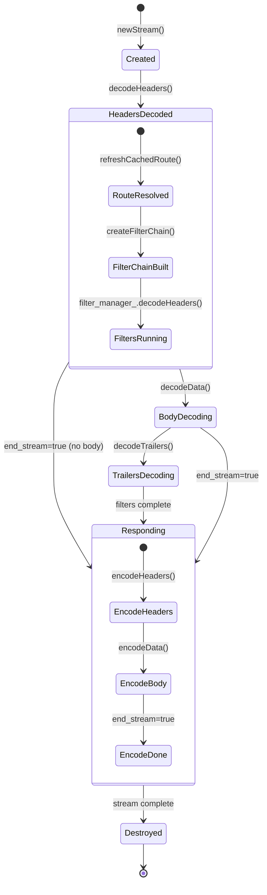
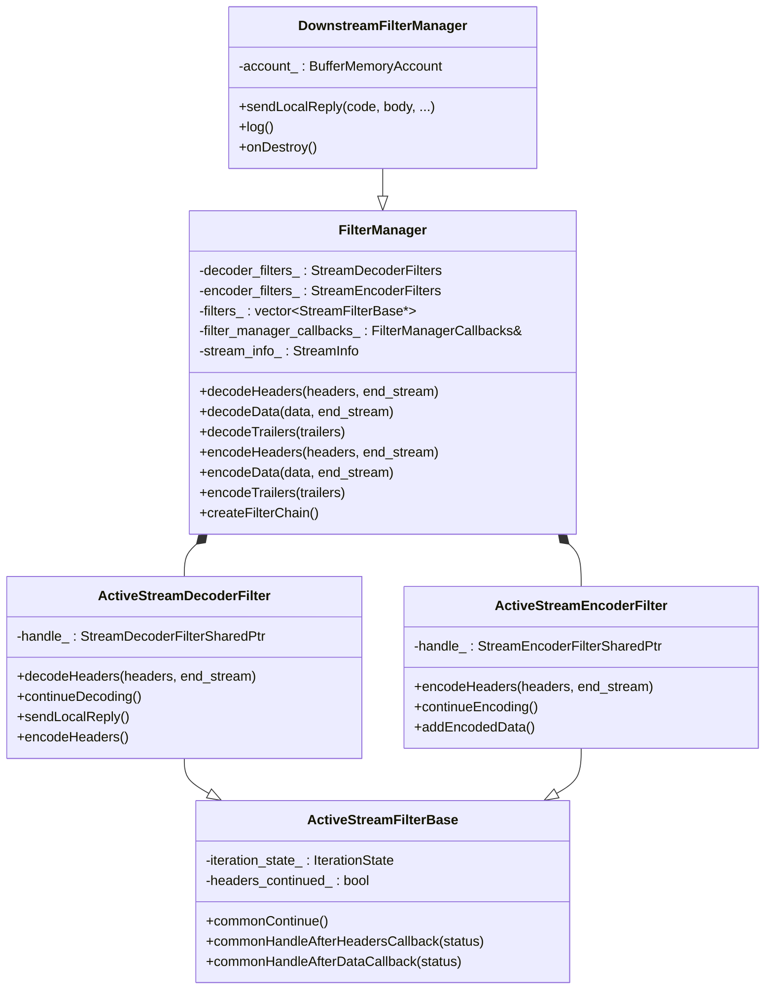
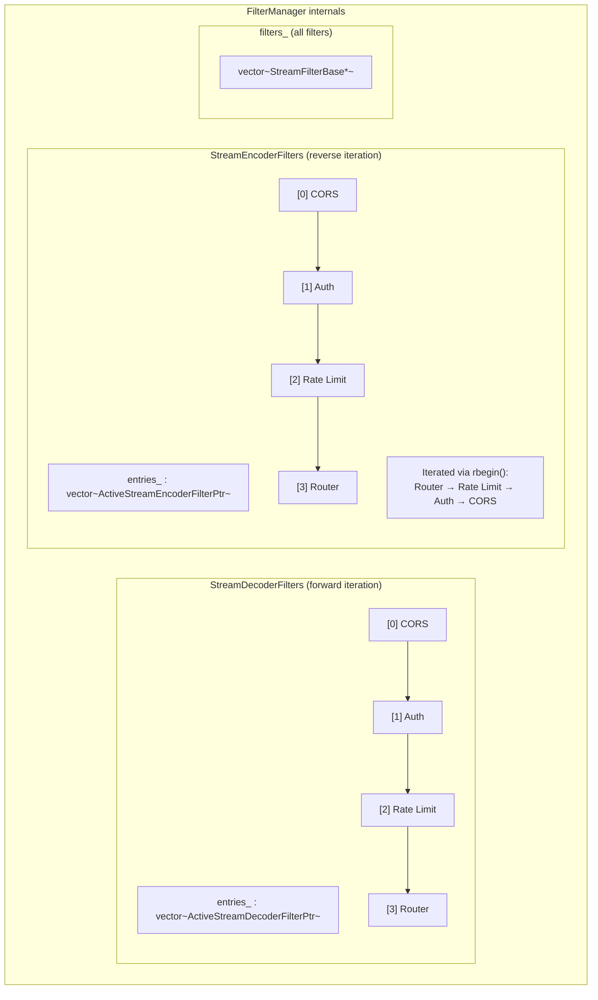
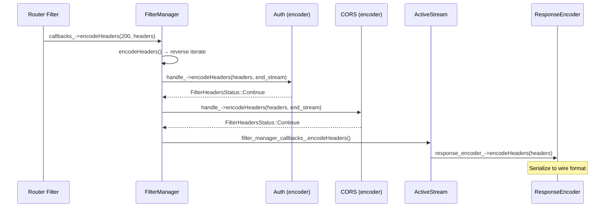
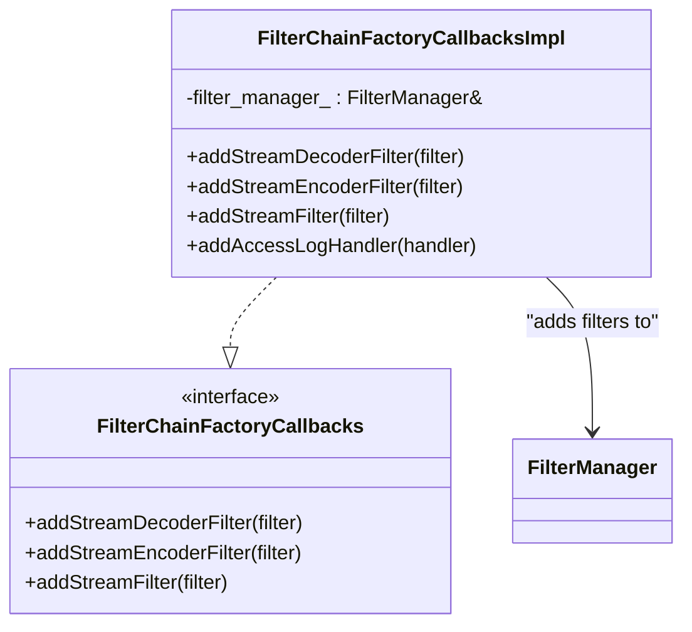
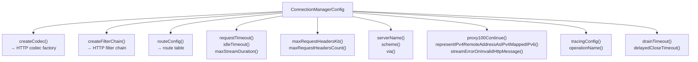

# Part 2: `source/common/http/` — Connection Management & Filter Manager

## Overview

The `http/` folder is the largest and most important folder in `source/common/`. It contains the HTTP Connection Manager, the HTTP filter chain manager, the HTTP codecs, header map implementations, connection pools, and all supporting HTTP infrastructure.

This document covers the two central classes: `ConnectionManagerImpl` and `FilterManager`.

## Folder Structure



## ConnectionManagerImpl — The HTTP Brain

### Class Diagram



### ConnectionManagerImpl Internal Architecture



### Key Methods — What They Do

| Method | File:Lines | Purpose |
|--------|-----------|---------|
| `onData()` | `conn_manager_impl.cc:415-467` | Receives raw bytes from network, dispatches to codec |
| `onNewConnection()` | `conn_manager_impl.cc:471-482` | HTTP/3 codec creation (protocol known at connection time) |
| `newStream()` | `conn_manager_impl.cc:324-379` | Creates `ActiveStream` for each new HTTP request |
| `createCodec()` | `conn_manager_impl.cc:394-414` | Lazy codec creation (HTTP/1, HTTP/2, or auto-detect) |
| `doEndStream()` | `conn_manager_impl.cc` | Cleans up a finished stream |
| `checkForDeferredClose()` | `conn_manager_impl.cc` | Closes connection when all streams are done (drain) |

### ActiveStream Lifecycle



## FilterManager — HTTP Filter Chain Engine

### Class Hierarchy



### Filter Chain Data Structures



### Decode Path — Step by Step

```mermaid
sequenceDiagram
    participant AS as ActiveStream
    participant FM as FilterManager
    participant F1 as CORS (decoder)
    participant F2 as Auth (decoder)
    participant F3 as Router (decoder)

    AS->>FM: decodeHeaders(headers, end_stream)
    FM->>FM: commonDecodePrefix() → start filter
    
    FM->>F1: handle_->decodeHeaders(headers, end_stream)
    F1-->>FM: FilterHeadersStatus::Continue
    FM->>FM: commonHandleAfterHeadersCallback(Continue)
    
    FM->>F2: handle_->decodeHeaders(headers, end_stream)
    F2-->>FM: FilterHeadersStatus::StopAllIterationAndBuffer
    Note over FM: Iteration paused; F2 does async auth
    
    Note over F2: Auth check completes
    F2->>FM: continueDecoding()
    FM->>FM: commonContinue() → doHeaders()
    
    FM->>F3: handle_->decodeHeaders(headers, end_stream)
    F3-->>FM: FilterHeadersStatus::StopIteration
    Note over F3: Router starts upstream request
```

### Encode Path — Step by Step



## FilterChainFactoryCallbacksImpl

This class bridges filter factory lambdas to the FilterManager:



## ConnectionManagerConfig — HCM Settings



## Key Supporting Classes

### conn_manager_utility.h

| Method | Purpose |
|--------|---------|
| `determineNextProtocol()` | Detects HTTP protocol from ALPN or data |
| `autoCreateCodec()` | Creates HTTP/1 or HTTP/2 codec based on detection |
| `mutateRequestHeaders()` | Adds `x-forwarded-for`, `x-request-id`, tracing headers |
| `mutateResponseHeaders()` | Adds `via` header, strips internal headers |
| `maybeNormalizePath()` | Normalizes URL path (RFC compliance) |
| `maybeNormalizeHost()` | Normalizes Host header |

### filter_chain_helper.h

| Class/Function | Purpose |
|---------------|---------|
| `FilterChainUtility::createFilterChainForFactories()` | Iterates filter factories to build chain |
| `FilterChainHelper` | Template for processing filter config with dependency checking |
| `MissingConfigFilter` | Placeholder filter when ECDS config not yet available |

### dependency_manager.h

| Class | Purpose |
|-------|---------|
| `DependencyManager` | Validates filter dependencies (e.g., filter A requires filter B before it) |

## File Catalog

| File | Key Classes | Purpose |
|------|-------------|---------|
| `conn_manager_impl.h/cc` | `ConnectionManagerImpl`, `ActiveStream` | HTTP connection manager (HCM) |
| `conn_manager_config.h` | `ConnectionManagerConfig`, stats structs | HCM configuration interface |
| `conn_manager_utility.h/cc` | `ConnectionManagerUtility` | Protocol detection, header mutation |
| `filter_manager.h/cc` | `FilterManager`, `DownstreamFilterManager`, `ActiveStream*Filter` | HTTP filter chain management |
| `filter_chain_helper.h/cc` | `FilterChainUtility`, `FilterChainHelper` | Filter chain building |
| `dependency_manager.h/cc` | `DependencyManager` | Filter dependency validation |
| `utility.h/cc` | `Url`, `PercentEncoding`, local reply helpers | HTTP utilities |
| `codes.h/cc` | HTTP status codes | Code definitions |
| `status.h/cc` | `Status` | Codec status type |
| `exception.h` | HTTP exceptions | Error types |
| `path_utility.h/cc` | Path utilities | Path normalization |
| `date_provider_impl.h/cc` | `DateProvider` | Date header caching |
| `user_agent.h/cc` | `UserAgent` | User-Agent parsing |
| `context_impl.h/cc` | HTTP context | HTTP context implementation |
| `request_id_extension_impl.h/cc` | Request ID extension | UUID-based request IDs |

---

**Next:** [Part 3 — HTTP Codecs, Headers, and Connection Pools](03-http-codecs-headers-pools.md)
