# Part 3: `source/common/http/` — Codecs, Headers, and Connection Pools

## Overview

This document covers the three other major subsystems in `source/common/http/`: the HTTP codecs (HTTP/1.1, HTTP/2, HTTP/3), the header map implementation, and the connection pooling layer.

## HTTP Codecs

### Codec Class Hierarchy

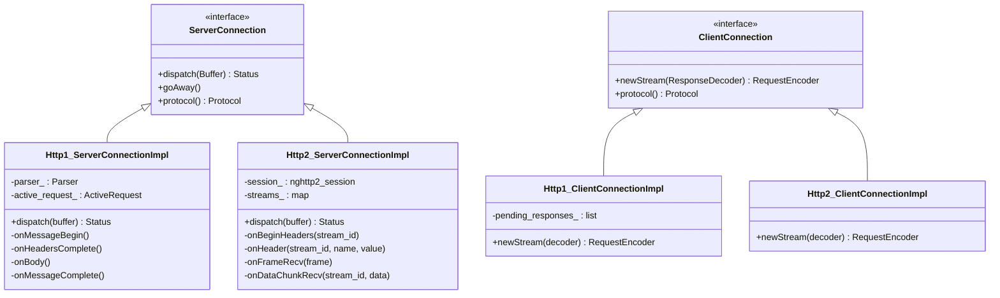

### HTTP/1.1 Codec (`http1/`)

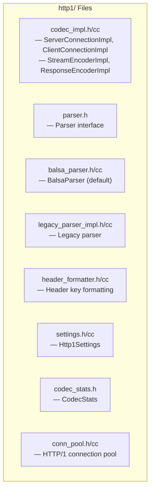

#### HTTP/1 Parsing Flow

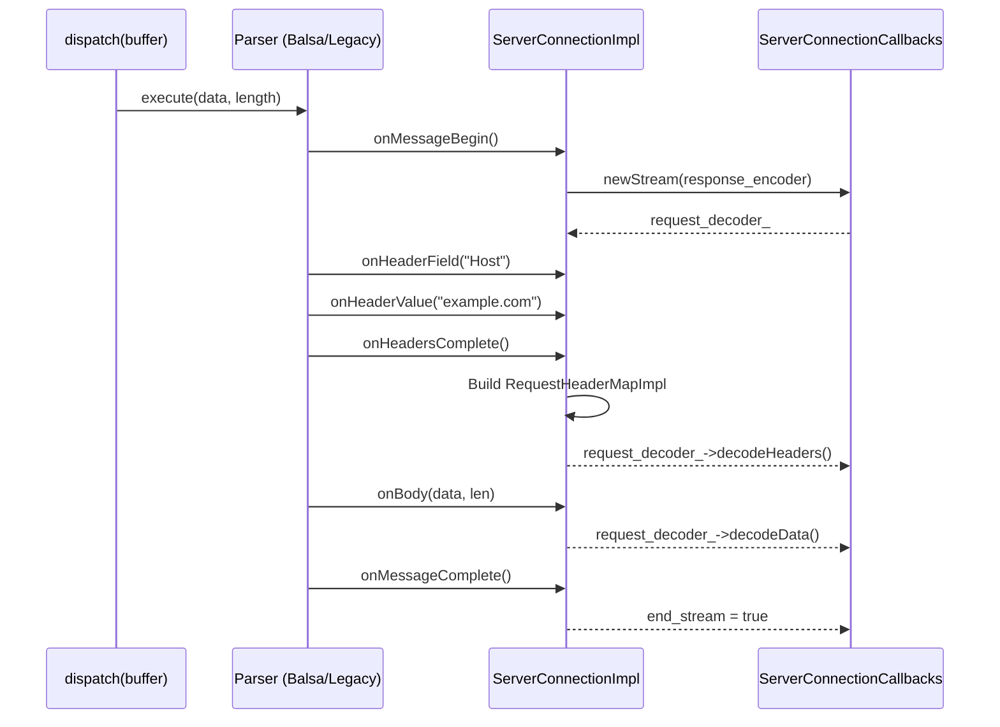

### HTTP/2 Codec (`http2/`)

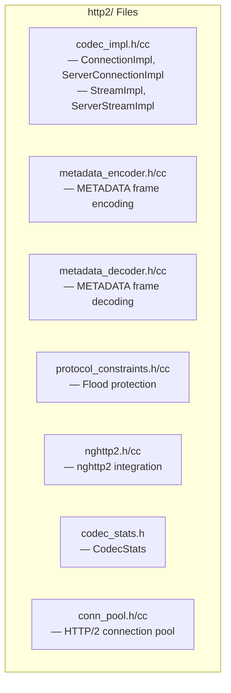

#### HTTP/2 Stream Management

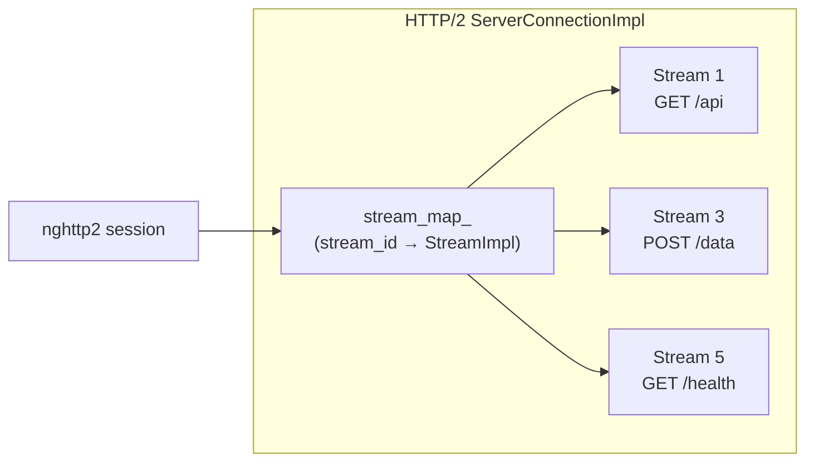

### HTTP/3 Pool (`http3/`)

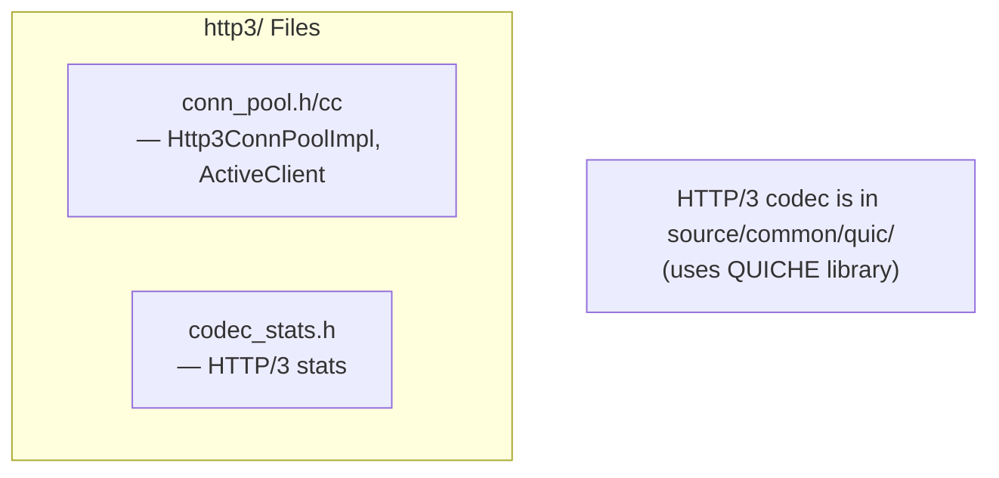

## CodecClient — Upstream HTTP Client

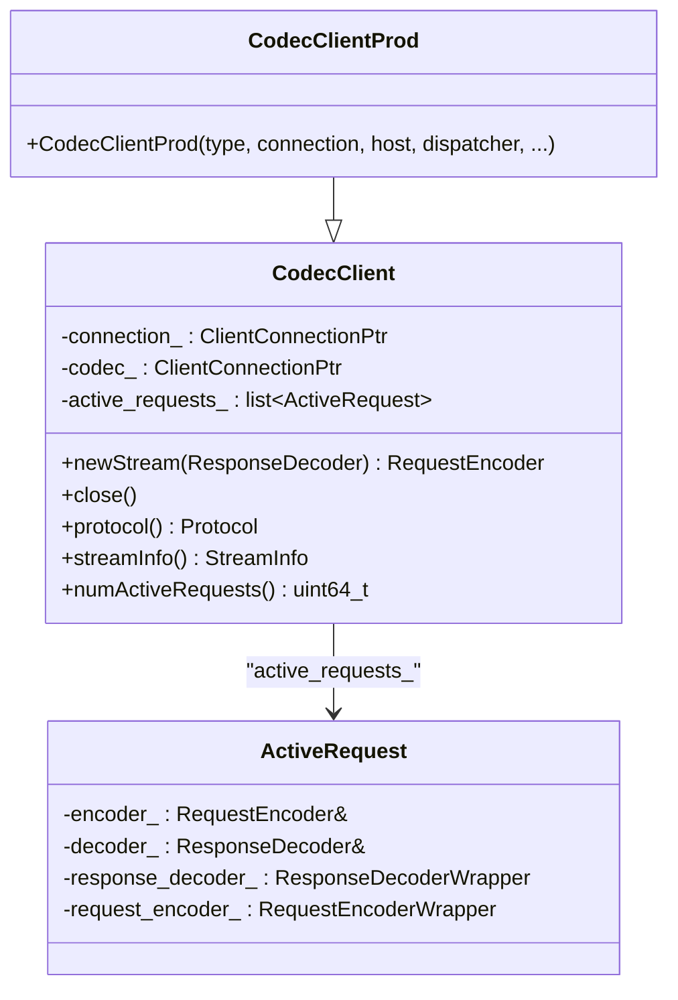

`CodecClient` wraps a network connection + HTTP codec into a single upstream HTTP client. It is used by connection pools to manage streams.

## Header Map Implementation

### HeaderMapImpl Architecture

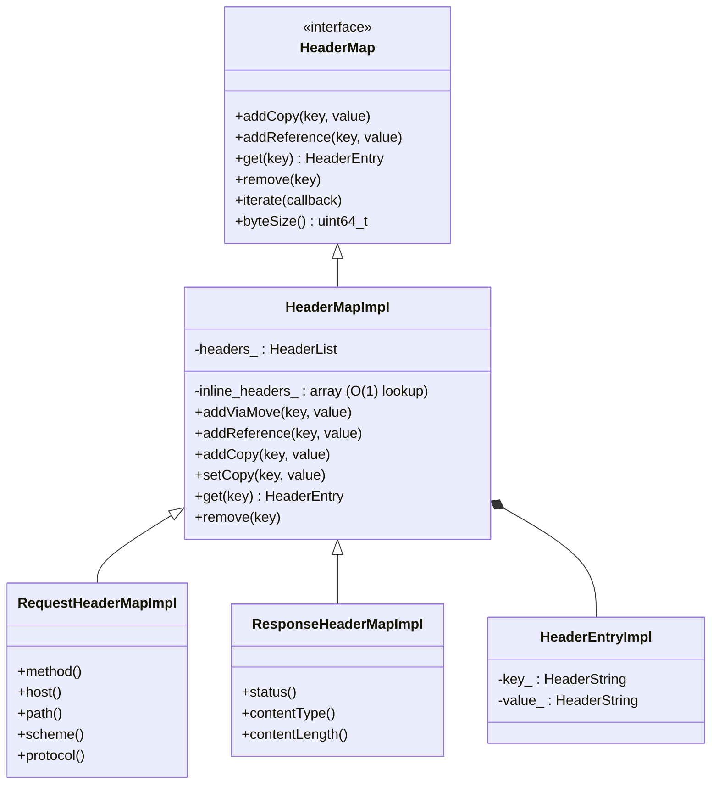

### How Header Lookup Works

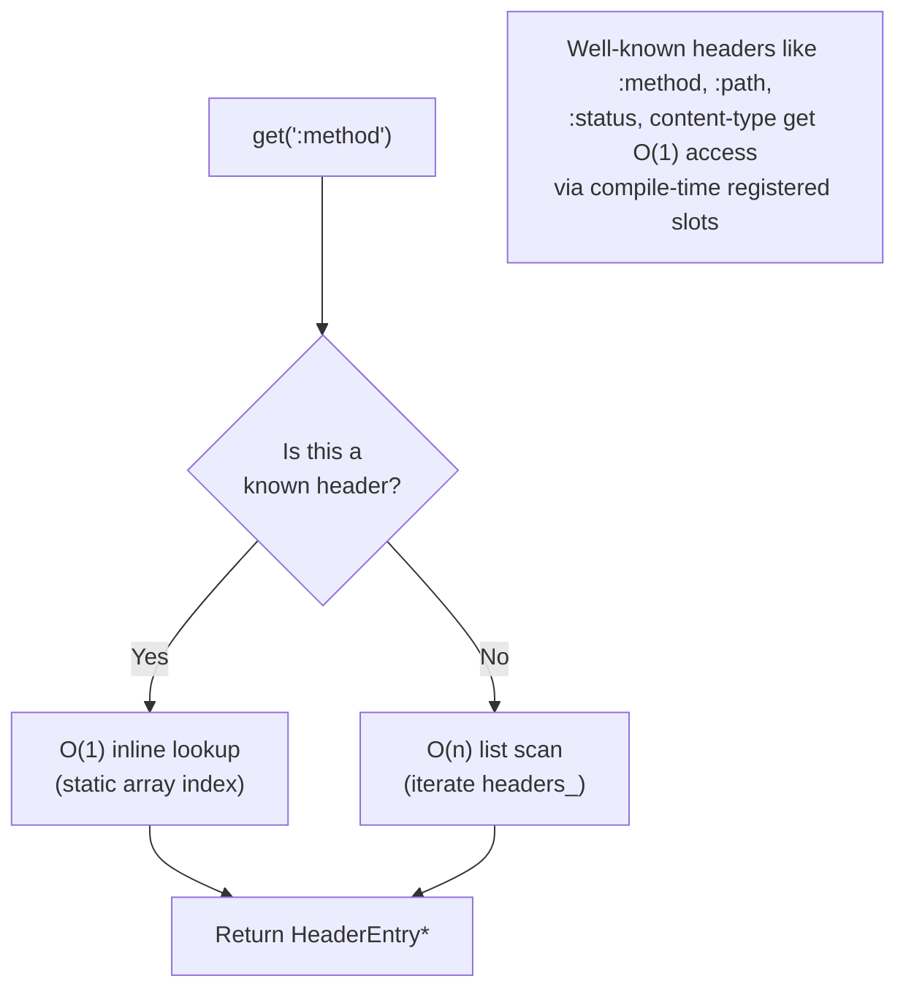

### Header Memory Layout

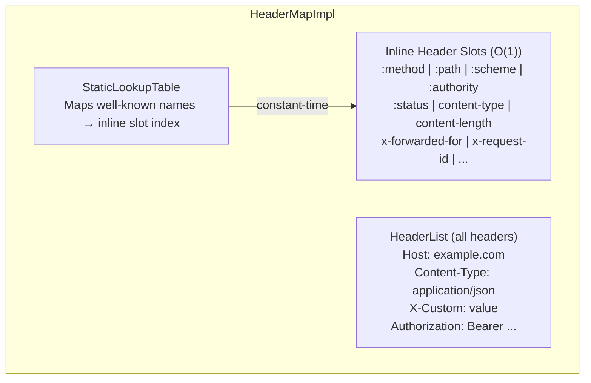

## Connection Pools

### Pool Class Hierarchy

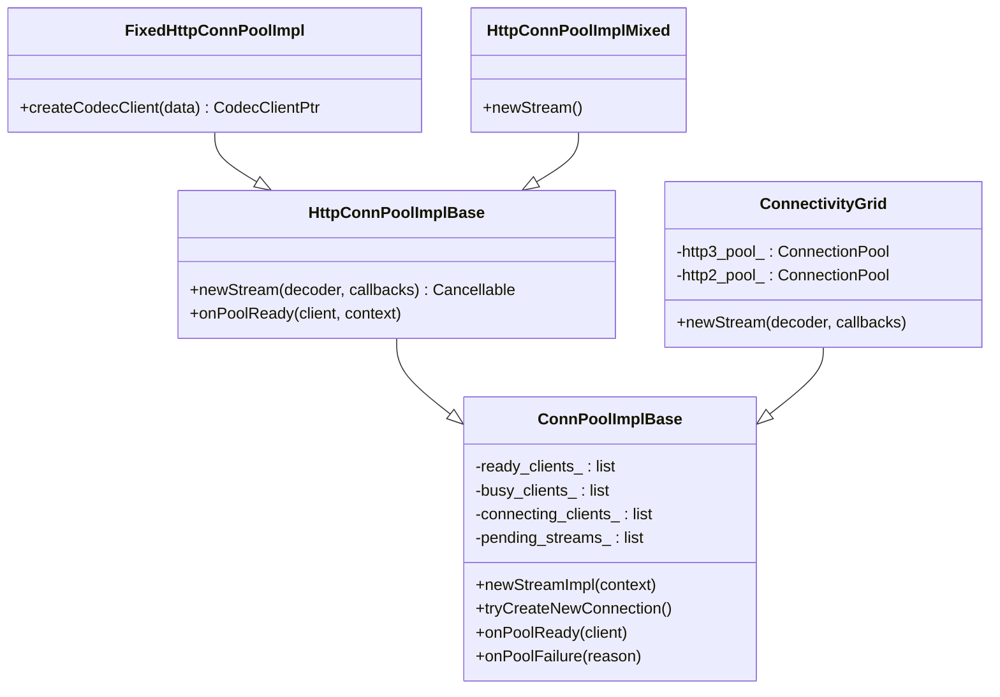

### Connection Pool Types

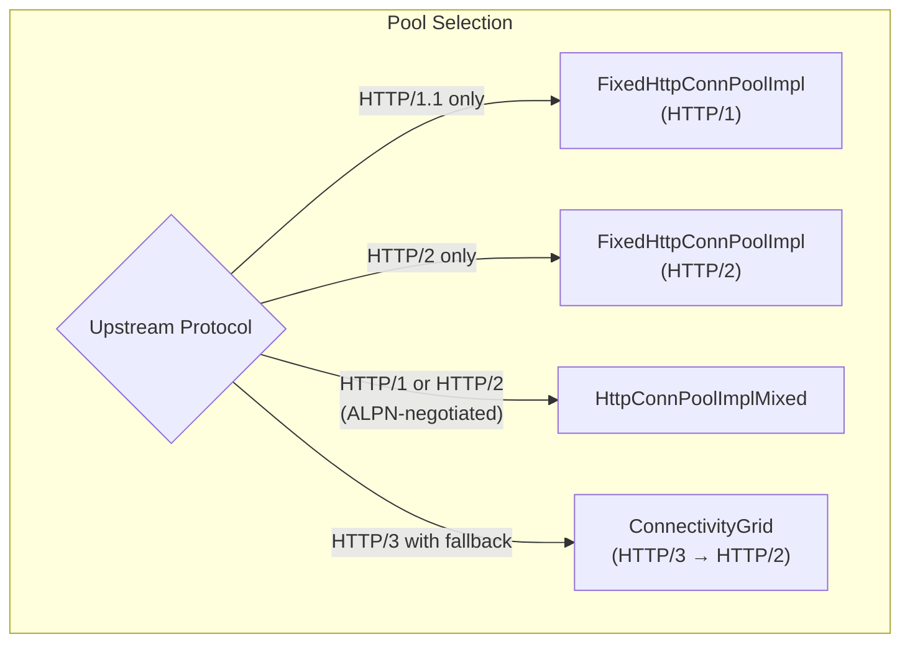

### ConnectivityGrid — HTTP/3 with Fallback

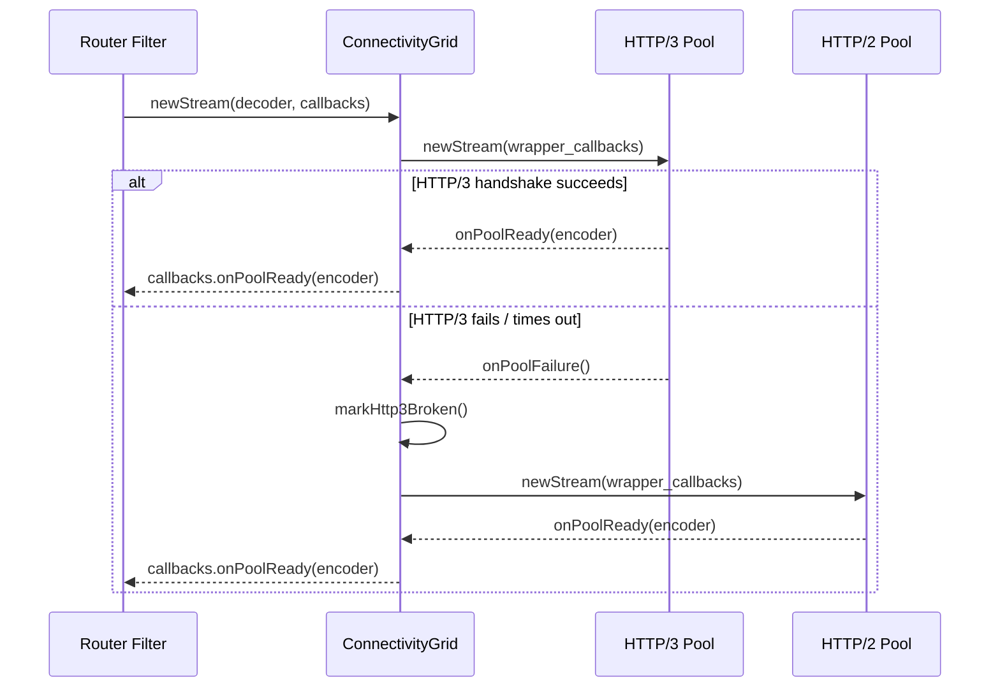

### Pool Client Lifecycle

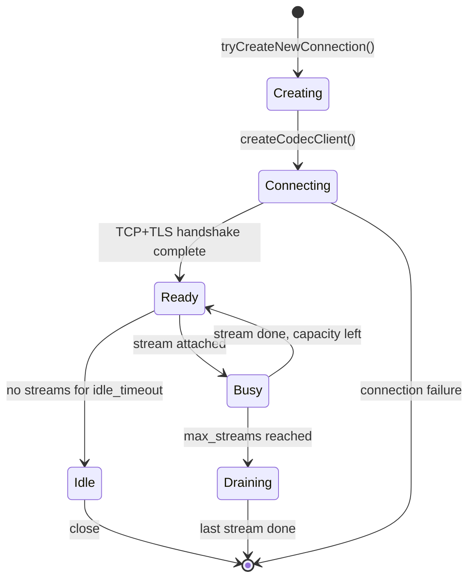

## Async Client

### AsyncClientImpl

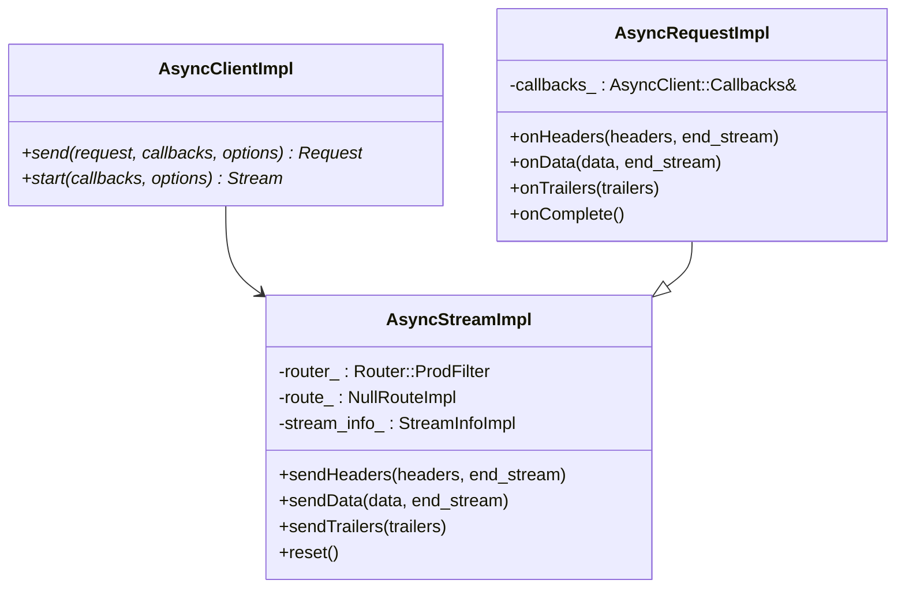

The async client lets Envoy internals (e.g., ext_authz, rate_limit) make HTTP requests without going through the full listener/HCM path. It creates a synthetic route and uses the Router filter directly.

## File Catalog

| File | Key Classes | Purpose |
|------|-------------|---------|
| `codec_client.h/cc` | `CodecClient`, `CodecClientProd`, `ActiveRequest` | Upstream HTTP client |
| `codec_wrappers.h` | `ResponseDecoderWrapper`, `RequestEncoderWrapper` | Codec lifecycle hooks |
| `codec_helper.h` | `StreamCallbackHelper`, `MultiplexedStreamImplBase` | Stream callback base |
| `conn_pool_base.h/cc` | `HttpConnPoolImplBase`, `ActiveClient`, `FixedHttpConnPoolImpl` | HTTP connection pool base |
| `conn_pool_grid.h/cc` | `ConnectivityGrid`, `WrapperCallbacks` | HTTP/3→HTTP/2 failover pool |
| `mixed_conn_pool.h/cc` | `HttpConnPoolImplMixed` | ALPN-negotiated pool |
| `header_map_impl.h/cc` | `HeaderMapImpl`, `RequestHeaderMapImpl`, `ResponseHeaderMapImpl` | Header map with O(1) inline headers |
| `headers.h` | `HeaderValues`, `CustomHeaderValues` | Well-known header names |
| `header_utility.h/cc` | `HeaderUtility` | Header matching/manipulation |
| `header_mutation.h/cc` | Header mutation | Header mutation extensions |
| `hash_policy.h/cc` | `HashPolicyImpl` | Load balancer hash from headers |
| `async_client_impl.h/cc` | `AsyncClientImpl`, `AsyncStreamImpl` | Internal async HTTP client |
| `message_impl.h` | `RequestMessageImpl`, `ResponseMessageImpl` | HTTP message wrappers |
| `http_server_properties_cache_impl.h/cc` | `HttpServerPropertiesCacheImpl` | Alt-Svc, HTTP/3 status cache |
| `http3_status_tracker_impl.h/cc` | HTTP/3 status tracker | HTTP/3 connectivity tracking |
| `null_route_impl.h/cc` | `NullRouteImpl` | Null route for async client |
| `http1/codec_impl.h/cc` | `Http1::ServerConnectionImpl`, `ClientConnectionImpl` | HTTP/1.1 codec |
| `http1/balsa_parser.h/cc` | `BalsaParser` | HTTP/1.1 parser |
| `http1/conn_pool.h/cc` | HTTP/1 pool | HTTP/1.1 connection pool |
| `http2/codec_impl.h/cc` | `Http2::ServerConnectionImpl`, `StreamImpl` | HTTP/2 codec (nghttp2) |
| `http2/protocol_constraints.h/cc` | `ProtocolConstraints` | HTTP/2 flood mitigation |
| `http2/conn_pool.h/cc` | HTTP/2 pool | HTTP/2 connection pool |
| `http3/conn_pool.h/cc` | `Http3ConnPoolImpl` | HTTP/3 connection pool |

---

**Previous:** [Part 2 — HTTP Connection Management](02-http-connection-management.md)  
**Next:** [Part 4 — Network Connections, Sockets, and I/O](04-network-connections-sockets.md)
