# Part 4: `source/common/network/` — Connections, Sockets, and I/O

## Overview

The `network/` folder implements Envoy's TCP/UDP networking layer. It provides the `Connection` abstraction, socket I/O, the L4 filter manager, transport socket wrappers, and address handling. Everything in the HTTP layer sits on top of these primitives.

## Folder Structure

```mermaid
graph TD
    subgraph "source/common/network/"
        Core["Connection & I/O"]
        Filters["L4 Filters"]
        Sockets["Sockets & Addresses"]
        Listeners["Listeners"]
        Support["Support"]
        Sub["dns_resolver/ | matching/"]
    end
    
    Core --> CI["connection_impl.h/cc"]
    Core --> CIB["connection_impl_base.h/cc"]
    Core --> IOH["io_socket_handle_impl.h/cc"]
    Core --> RBS["raw_buffer_socket.h/cc"]
    
    Filters --> FMI["filter_manager_impl.h/cc"]
    Filters --> FI["filter_impl.h"]
    Filters --> FM["filter_matcher.h/cc"]
    
    Sockets --> SI["socket_impl.h/cc"]
    Sockets --> AI["address_impl.h/cc"]
    Sockets --> CSI["connection_socket_impl.h"]
    Sockets --> LSI["listen_socket_impl.h/cc"]
    Sockets --> TSO["transport_socket_options_impl.h/cc"]
    
    Listeners --> TLI["tcp_listener_impl.h/cc"]
    Listeners --> BLI["base_listener_impl.h/cc"]
    Listeners --> ULI["udp_listener_impl.h/cc"]
    Listeners --> LFB["listener_filter_buffer_impl.h/cc"]
```

## ConnectionImpl — The TCP Connection

### Class Hierarchy

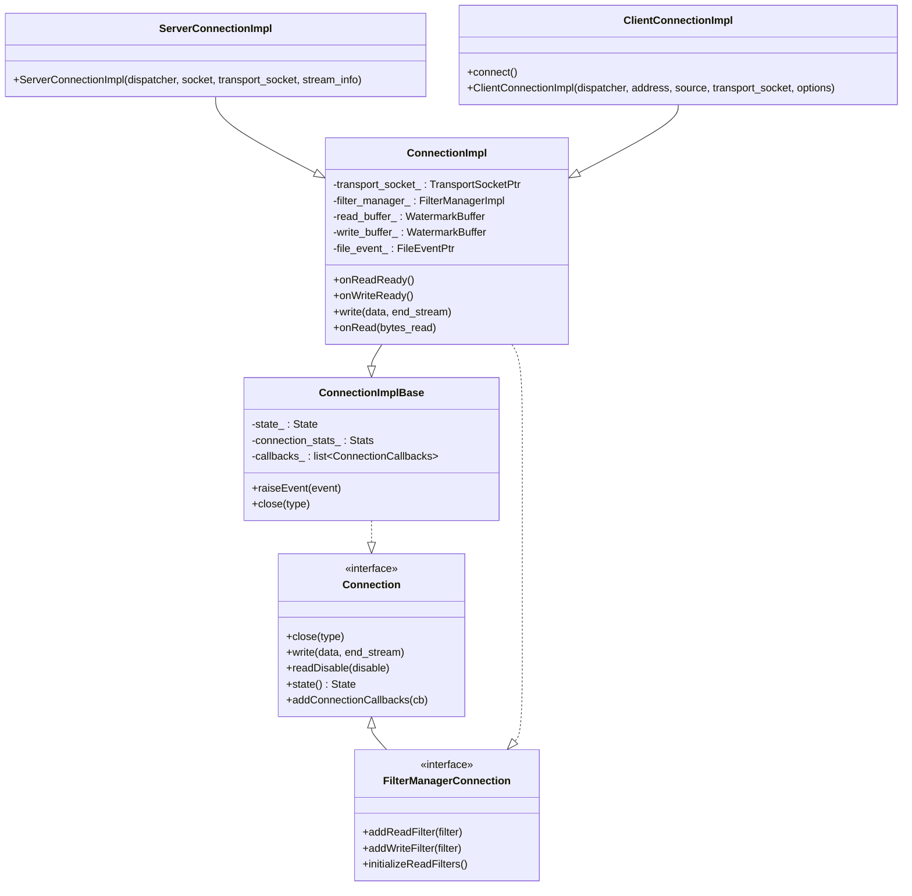

### ConnectionImpl Internal Structure

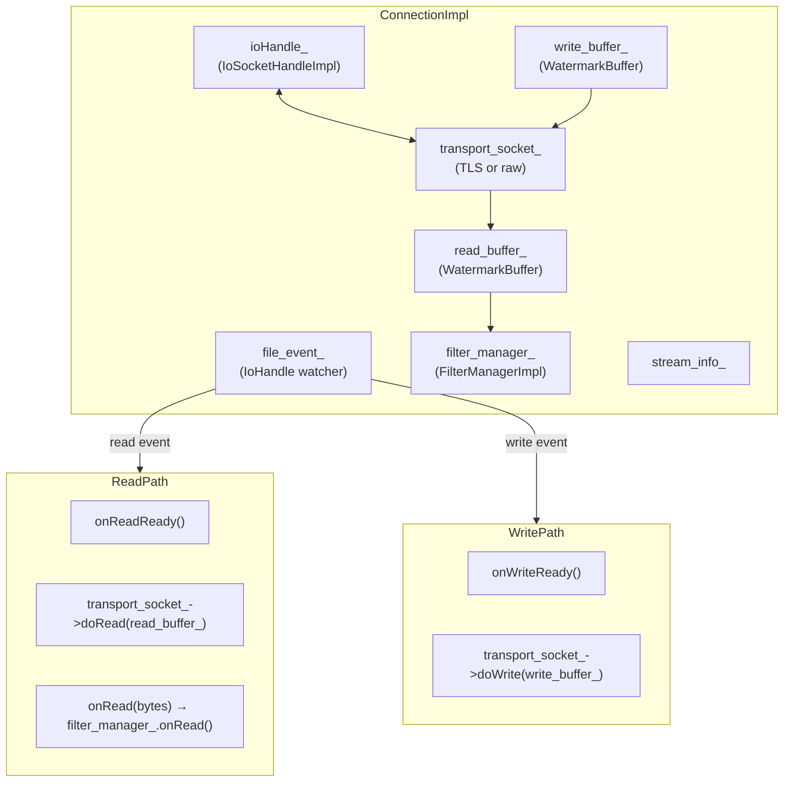

### Read and Write Paths

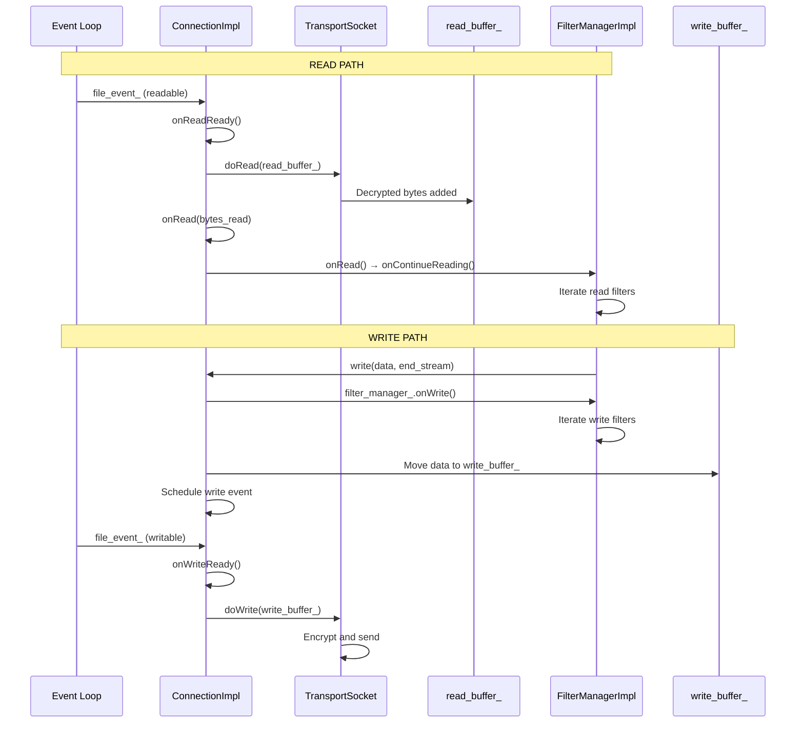

## IoSocketHandleImpl — System I/O

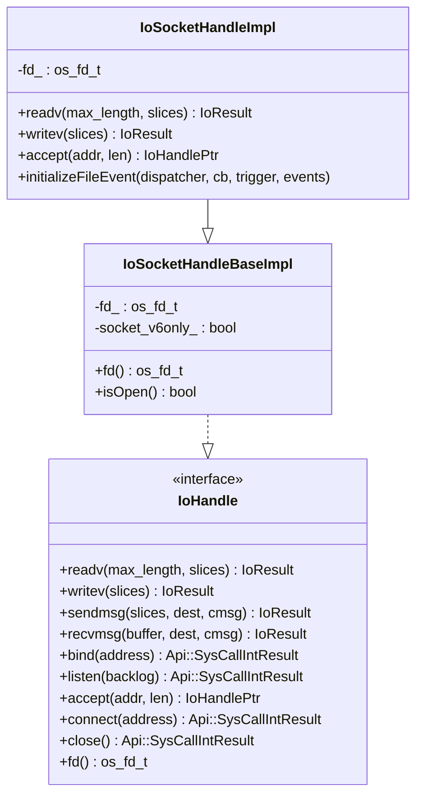

`IoSocketHandleImpl` is the primary I/O primitive — it wraps POSIX system calls (`readv`, `writev`, `sendmsg`, `accept`, `bind`, `listen`, `connect`) and integrates with the event loop via `initializeFileEvent()`.

## Socket and Address Types

### Socket Hierarchy

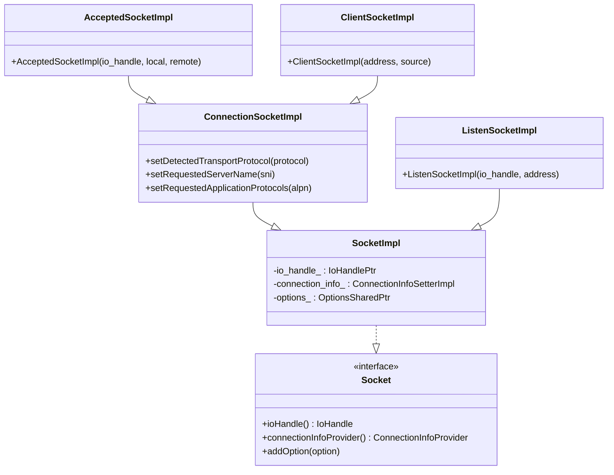

### Address Types

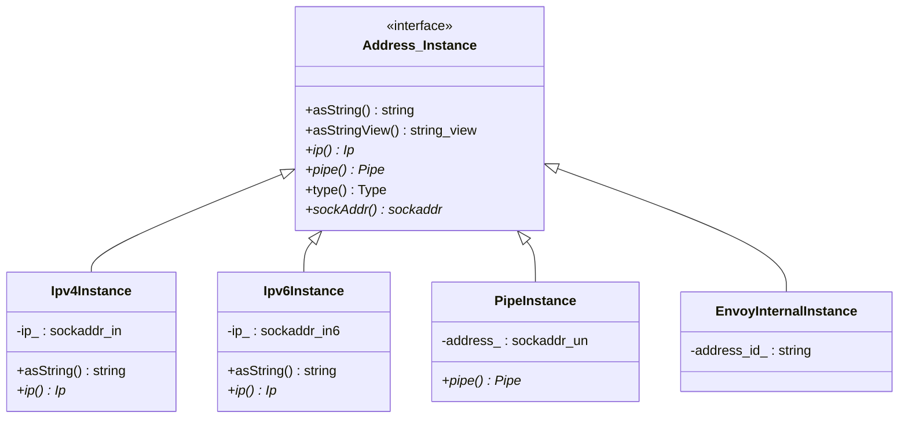

## Transport Sockets

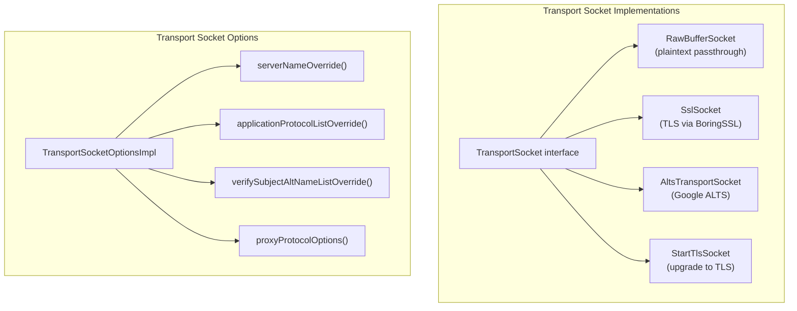

### RawBufferSocket

The simplest transport socket — direct passthrough:

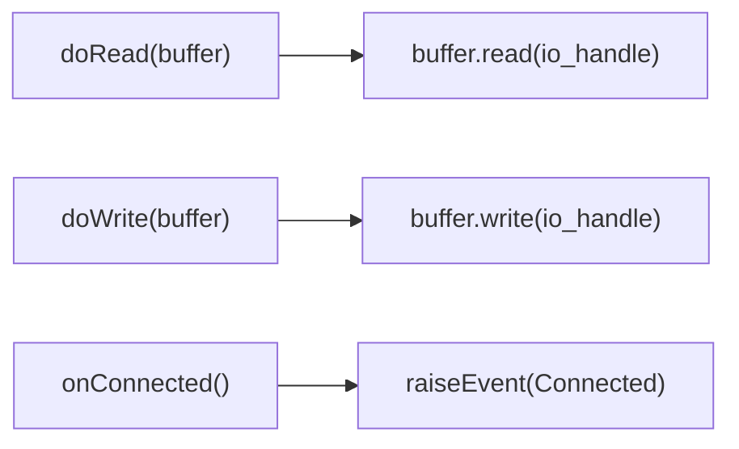

## FilterManagerImpl — L4 Filter Engine

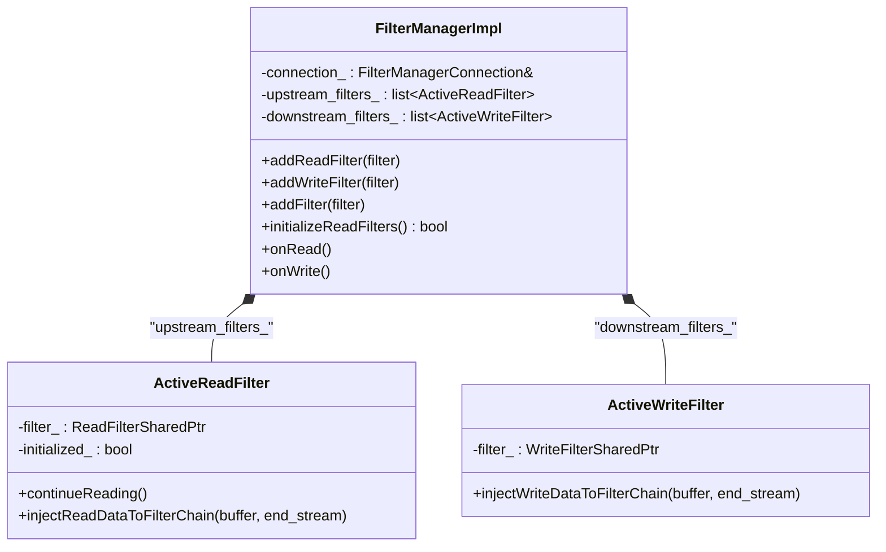

### Filter Ordering

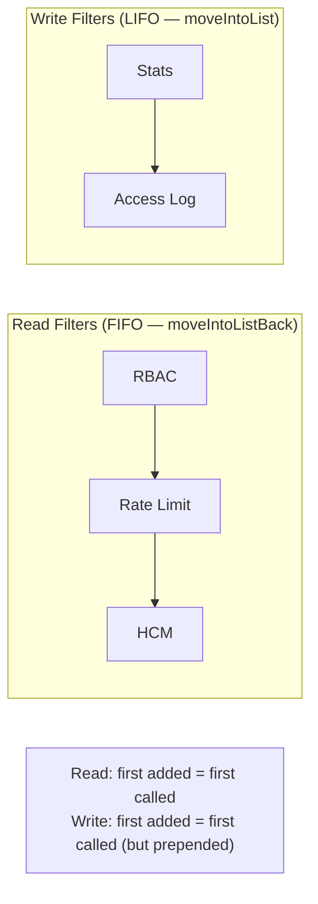

## Complete File Catalog

| File | Key Classes | Purpose |
|------|-------------|---------|
| `connection_impl.h/cc` | `ConnectionImpl`, `ServerConnectionImpl`, `ClientConnectionImpl` | TCP connection |
| `connection_impl_base.h/cc` | `ConnectionImplBase` | Connection base with callbacks and stats |
| `connection_socket_impl.h` | `ConnectionSocketImpl`, `AcceptedSocketImpl`, `ClientSocketImpl` | Socket wrappers |
| `filter_manager_impl.h/cc` | `FilterManagerImpl`, `ActiveReadFilter`, `ActiveWriteFilter` | L4 filter manager |
| `filter_impl.h` | `ReadFilterBaseImpl` | Base read filter (no-op) |
| `filter_matcher.h/cc` | `ListenerFilterMatcherBuilder`, matchers | Listener filter chain matching |
| `io_socket_handle_impl.h/cc` | `IoSocketHandleImpl` | POSIX socket I/O |
| `io_socket_handle_base_impl.h/cc` | `IoSocketHandleBaseImpl` | Base I/O handle |
| `socket_impl.h/cc` | `SocketImpl`, `ConnectionInfoSetterImpl` | Socket and connection info |
| `socket_interface_impl.h/cc` | `SocketInterfaceImpl` | Default socket interface |
| `socket_option_impl.h/cc` | `SocketOptionImpl` | Single socket option |
| `socket_option_factory.h/cc` | `SocketOptionFactory` | Common socket option factory |
| `address_impl.h/cc` | `Ipv4Instance`, `Ipv6Instance`, `PipeInstance`, `EnvoyInternalInstance` | Address types |
| `cidr_range.h/cc` | `CidrRange`, `IpList` | CIDR range matching |
| `lc_trie.h` | `LcTrie` | Level-compressed trie for CIDR lookup |
| `listen_socket_impl.h/cc` | `ListenSocketImpl`, `TcpListenSocket`, `UdpListenSocket` | Listen socket types |
| `tcp_listener_impl.h/cc` | `TcpListenerImpl` | TCP listener (accept loop) |
| `base_listener_impl.h/cc` | `BaseListenerImpl` | Base listener |
| `udp_listener_impl.h/cc` | `UdpListenerImpl` | UDP listener |
| `raw_buffer_socket.h/cc` | `RawBufferSocket`, `RawBufferSocketFactory` | Plain transport socket |
| `transport_socket_options_impl.h/cc` | `TransportSocketOptionsImpl`, `CommonUpstreamTransportSocketFactory` | Transport socket options |
| `utility.h/cc` | `Utility`, `UdpPacketProcessor` | Network utilities |
| `listener_filter_buffer_impl.h/cc` | `ListenerFilterBufferImpl` | Peek buffer for listener filters |
| `connection_balancer_impl.h/cc` | `ExactConnectionBalancerImpl` | Connection balancer |
| `happy_eyeballs_connection_impl.h/cc` | `HappyEyeballsConnectionImpl` | Happy Eyeballs v2 |
| `multi_connection_base_impl.h/cc` | `MultiConnectionBaseImpl` | Multi-address connections |
| `default_client_connection_factory.h/cc` | `DefaultClientConnectionFactory` | Default connection factory |
| `resolver_impl.h/cc` | `IpResolver` | Address resolution |
| `ip_address.h/cc` | `IPAddressObject` | IP filter state |
| `proxy_protocol_filter_state.h/cc` | `ProxyProtocolFilterState` | PROXY protocol state |
| `application_protocol.h/cc` | `ApplicationProtocols` | ALPN filter state |
| `upstream_server_name.h/cc` | `UpstreamServerName` | Upstream SNI state |
| `dns_resolver/dns_factory_util.h/cc` | DNS factory helpers | DNS resolver creation |
| `matching/data_impl.h` | `MatchingDataImpl` | Network matching data |

---

**Previous:** [Part 3 — HTTP Codecs, Headers, and Pools](03-http-codecs-headers-pools.md)  
**Next:** [Part 5 — Network Listeners, Filters, and Addresses](05-network-listeners-filters.md)
