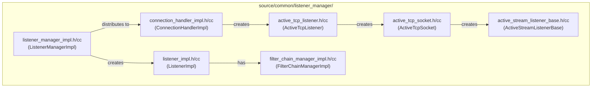
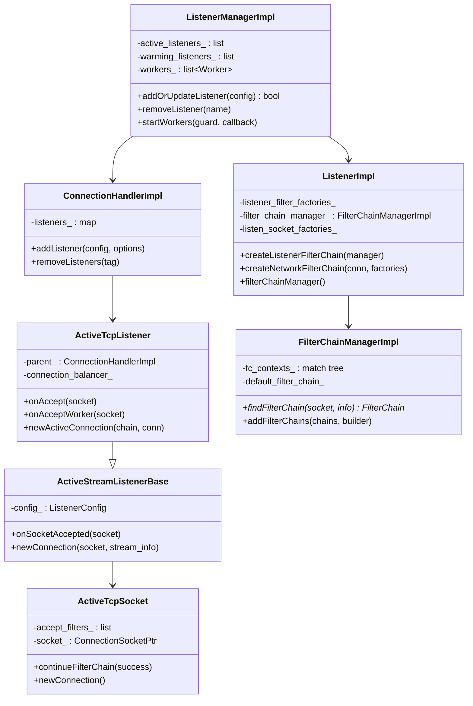
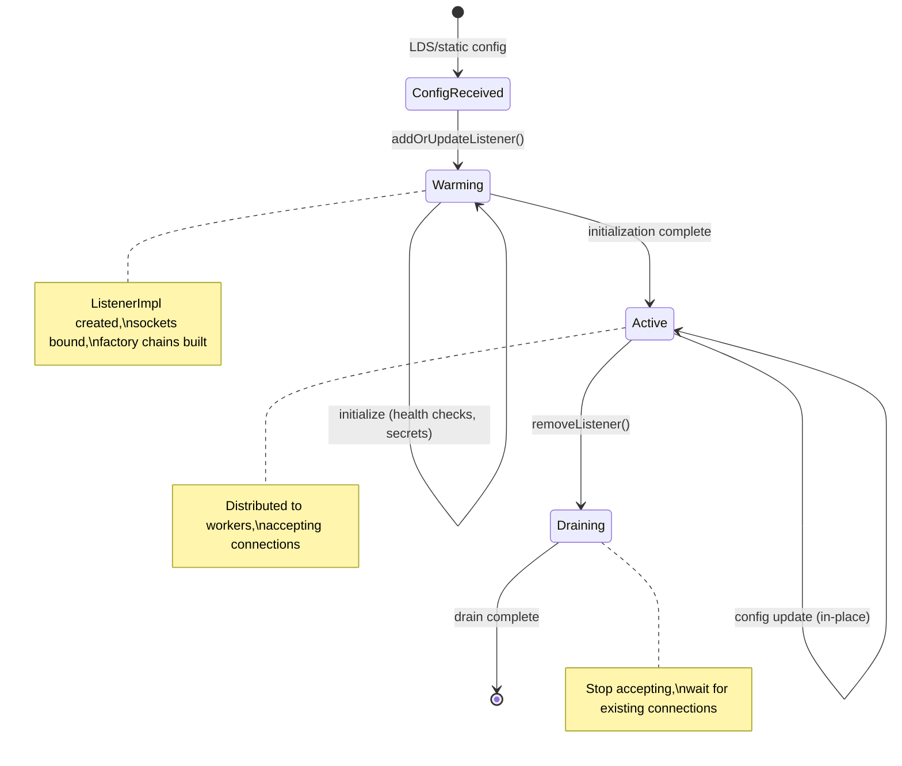
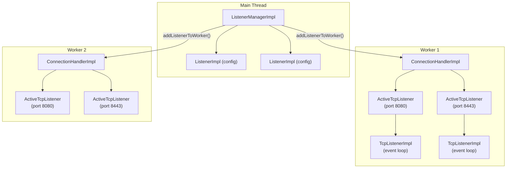
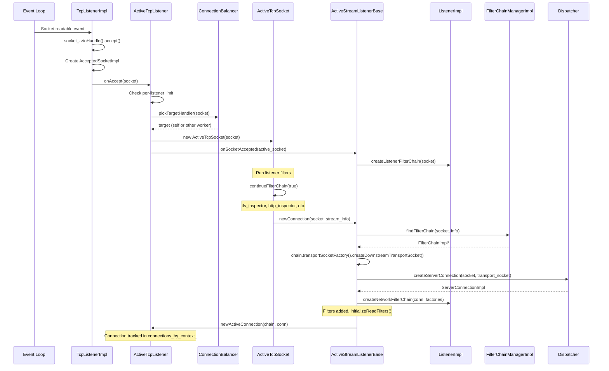
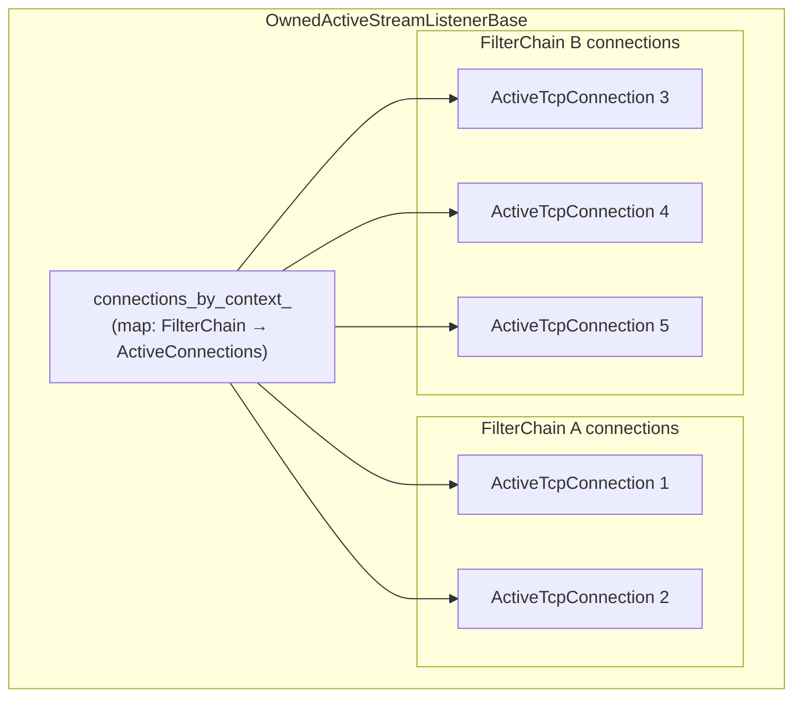
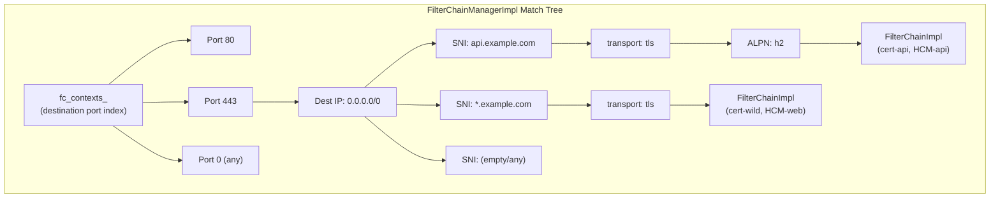
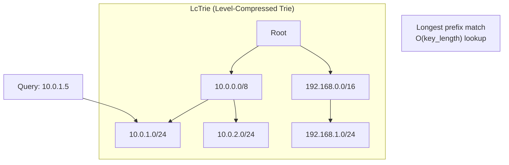
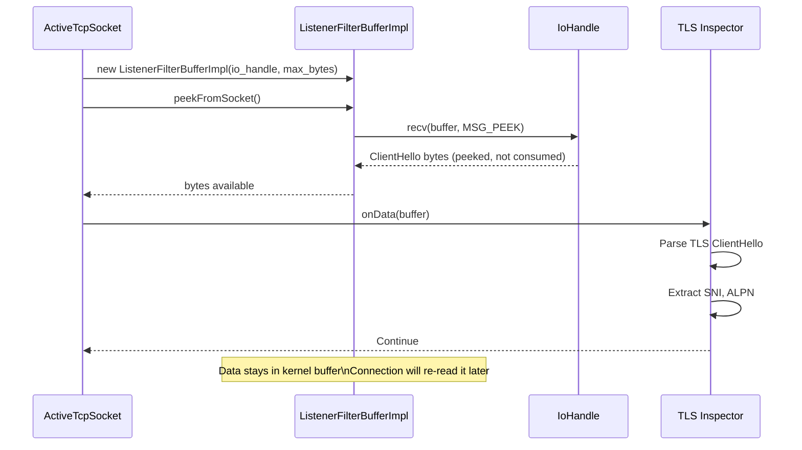

# Part 5: `source/common/network/` + `listener_manager/` — Listeners, Filters, and Active Connections

## Overview

This document covers the listener management layer — how listeners are created, how connections are accepted and distributed to workers, and how the `listener_manager/` folder orchestrates the lifecycle. This complements the `network/` folder's `TcpListenerImpl`.

## Listener Manager Architecture

## Class Relationships

## Listener Lifecycle

## Worker Thread Architecture

## Connection Accept Flow (Detailed)

## Active Connection Tracking

Connections are grouped by filter chain for efficient drain operations — when a filter chain is removed (e.g., TLS cert rotation), only connections using that chain need to be drained.

## Filter Chain Matching — Deep Dive

### LcTrie for IP Matching

The `lc_trie.h` implementation provides efficient longest-prefix-match for CIDR-based filter chain matching:

## Listener Filter Buffer

`ListenerFilterBufferImpl` provides a peek buffer for listener filters that need to read bytes without consuming them:

## File Catalog — listener_manager/

| File | Key Classes | Purpose |
|------|-------------|---------|
| `listener_manager_impl.h/cc` | `ListenerManagerImpl` | Listener lifecycle management |
| `listener_impl.h/cc` | `ListenerImpl`, `ListenSocketFactoryImpl` | Listener config and socket factory |
| `active_tcp_listener.h/cc` | `ActiveTcpListener` | Per-worker TCP listener |
| `active_tcp_socket.h/cc` | `ActiveTcpSocket` | Socket during listener filter processing |
| `active_stream_listener_base.h/cc` | `ActiveStreamListenerBase`, `OwnedActiveStreamListenerBase` | Connection creation base |
| `active_listener_base.h` | `ActiveListenerImplBase` | Active listener stats base |
| `filter_chain_manager_impl.h/cc` | `FilterChainManagerImpl`, `FilterChainImpl` | Filter chain matching and storage |
| `connection_handler_impl.h/cc` | `ConnectionHandlerImpl` | Per-worker connection handler |
| `lds_api.h/cc` | `LdsApiImpl` | Listener Discovery Service |

---

**Previous:** [Part 4 — Network Connections and Sockets](04-network-connections-sockets.md)  
**Next:** [Part 6 — Routing Engine and Configuration](06-router-engine-config.md)
