# Part 6: `source/common/router/` — Routing Engine and Configuration

## Overview

The `router/` folder contains two major subsystems: (1) the **route configuration** engine that matches requests to routes, virtual hosts, and clusters, and (2) the **Router filter** that executes the upstream request. This document focuses on the route configuration side.

## Route Configuration Architecture

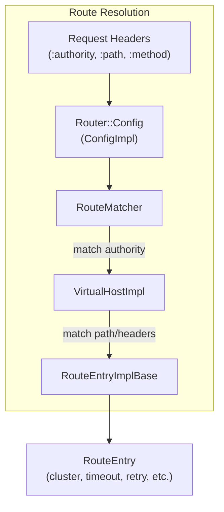

## Route Config Class Hierarchy

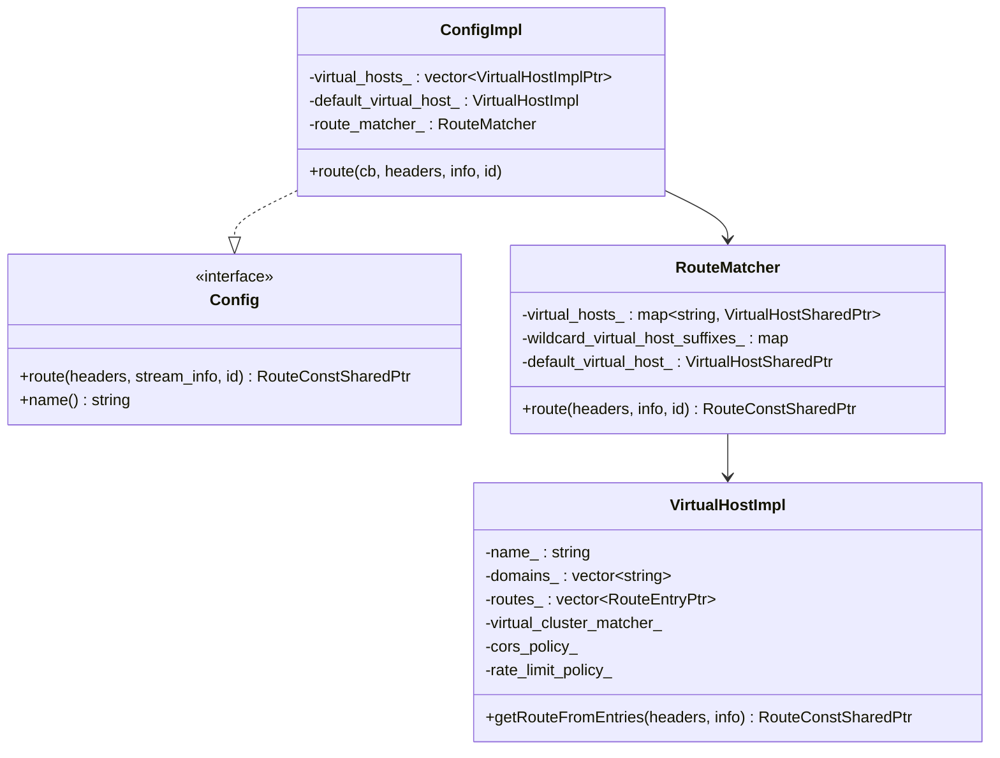

## Virtual Host Matching

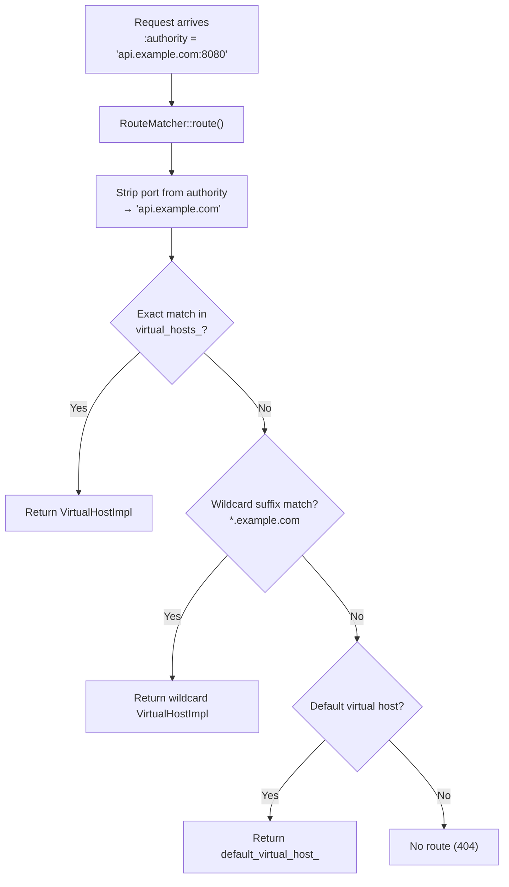

## Route Entry Types

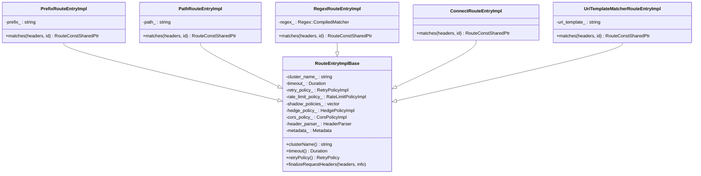

## Route Matching Flow

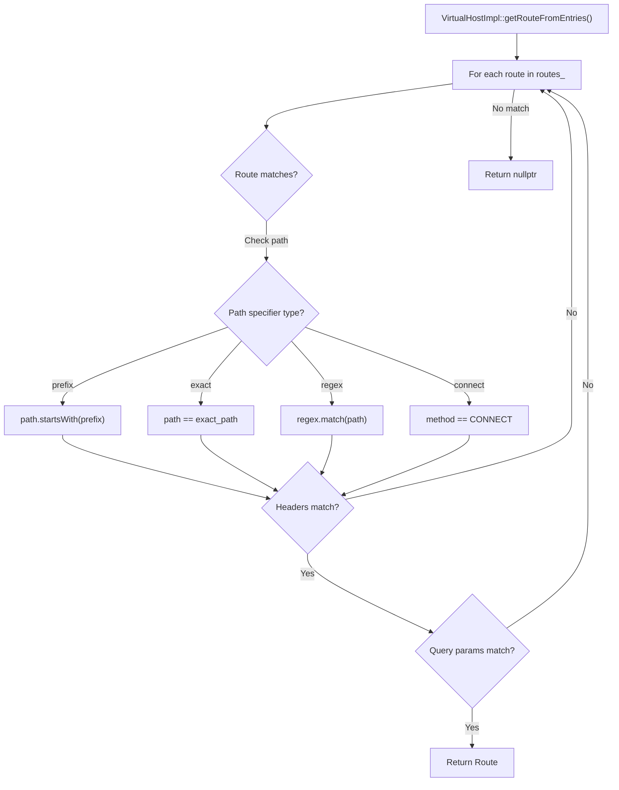

## Route Entry — What It Contains

```mermaid
graph TD
    RE["RouteEntryImplBase"]
    
    RE --> Cluster["clusterName()\n→ which upstream cluster"]
    RE --> Timeout["timeout()\n→ request timeout"]
    RE --> Retry["retryPolicy()\n→ retry config"]
    RE --> Shadow["shadowPolicies()\n→ traffic mirroring"]
    RE --> Hedge["hedgePolicy()\n→ hedged requests"]
    RE --> RateLimit["rateLimitPolicy()\n→ rate limit actions"]
    RE --> CORS["corsPolicy()\n→ CORS config"]
    RE --> Headers["headerParser()\n→ header add/remove"]
    RE --> Hash["hashPolicy()\n→ consistent hash"]
    RE --> Priority["priority()\n→ DEFAULT or HIGH"]
    RE --> Redirect["redirectEntry()\n→ redirect config"]
    RE --> InternalRedirect["internalRedirectPolicy()"]
    RE --> Decorator["decorator()\n→ tracing decoration"]
    RE --> MaxStream["maxStreamDuration()"]
    RE --> IdleTimeout["idleTimeout()"]
```

## Route Config Sources

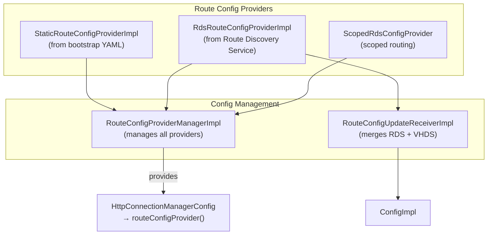

### RDS (Route Discovery Service)

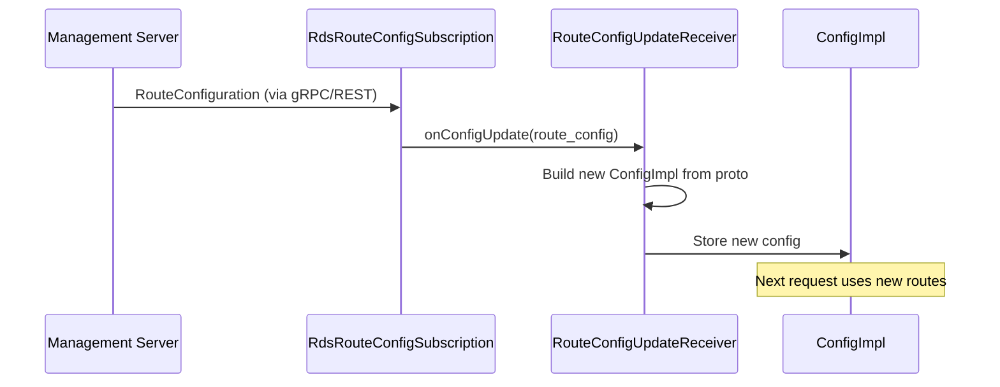

### Scoped Routes (SRDS)

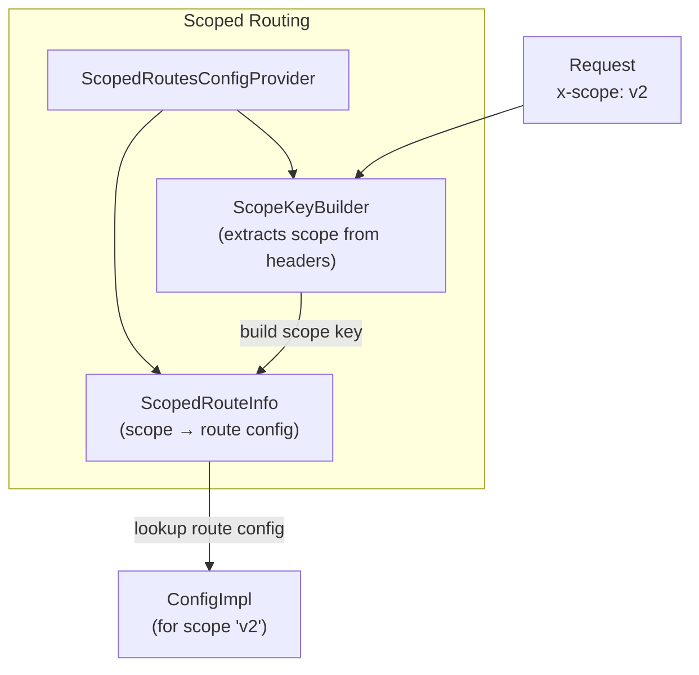

## Header Parser

`HeaderParser` adds/removes headers based on route configuration:

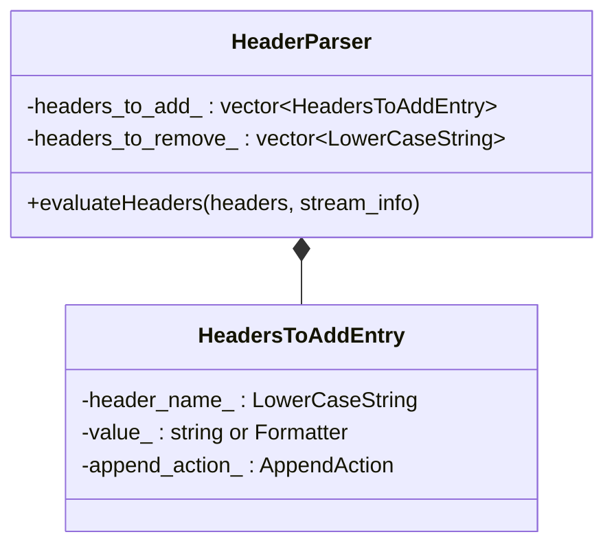

Headers can use `StreamInfo` substitution (e.g., `%UPSTREAM_HOST%`, `%REQ(header)%`).

## Per-Filter Config

Routes can carry per-filter configuration that overrides the global filter config:

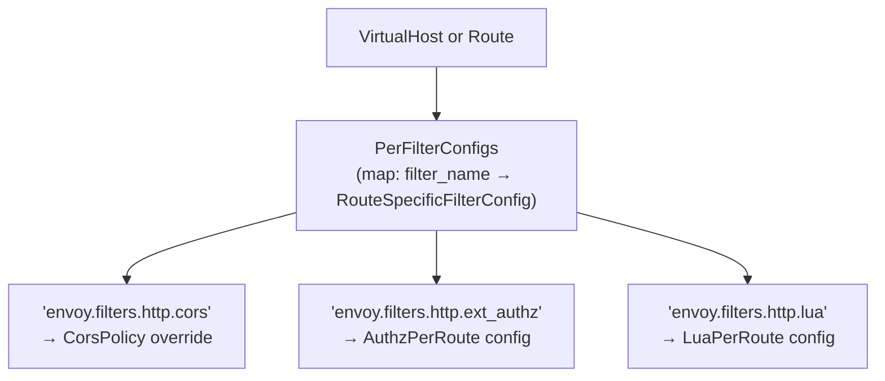

## File Catalog

| File | Key Classes | Purpose |
|------|-------------|---------|
| `config_impl.h/cc` | `ConfigImpl`, `RouteMatcher`, `VirtualHostImpl`, Route entries | Route configuration and matching |
| `config_utility.h/cc` | `ConfigUtility`, matchers | Route config helpers |
| `header_parser.h/cc` | `HeaderParser`, `HeadersToAddEntry` | Header add/remove on routes |
| `per_filter_config.h/cc` | `PerFilterConfigs` | Per-route filter config |
| `rds_impl.h/cc` | `RdsRouteConfigSubscription`, `RdsRouteConfigProviderImpl` | Route Discovery Service |
| `route_config_update_receiver_impl.h/cc` | `RouteConfigUpdateReceiverImpl` | RDS + VHDS merge |
| `static_route_provider_impl.h/cc` | `StaticRouteConfigProviderImpl` | Static route config |
| `route_provider_manager.h/cc` | `RouteConfigProviderManagerImpl` | Route provider lifecycle |
| `scoped_rds.h/cc` | `ScopedRdsConfigProvider`, `ScopedRoutesConfigProviderManager` | Scoped routing |
| `scoped_config_impl.h/cc` | `ScopeKeyBuilderImpl`, `ScopedConfigImpl` | Scope key extraction |
| `vhds.h/cc` | `VhdsSubscription` | Virtual Host Discovery Service |
| `delegating_route_impl.h/cc` | `DelegatingRouteBase`, `DynamicRouteEntry` | Route delegation/override |
| `context_impl.h/cc` | `ContextImpl`, `RouteStatsContextImpl` | Router stats context |
| `metadatamatchcriteria_impl.h/cc` | `MetadataMatchCriteriaImpl` | Metadata match for subsets |
| `router_ratelimit.h/cc` | `RateLimitPolicyImpl`, rate limit actions | Rate limit policy from route |
| `tls_context_match_criteria_impl.h/cc` | `TlsContextMatchCriteriaImpl` | TLS context matching |

---

**Previous:** [Part 5 — Network Listeners and Filters](05-network-listeners-filters.md)  
**Next:** [Part 7 — Upstream Request and Retry](07-router-upstream-retry.md)
