# Part 7: `source/common/router/` — Router Filter, Upstream Request, and Retry

## Overview

This document covers the runtime side of routing: the Router filter that forwards requests upstream, the `UpstreamRequest` that manages a single upstream attempt, the upstream codec filter, retry logic, and shadow writing.

## Router Filter Architecture

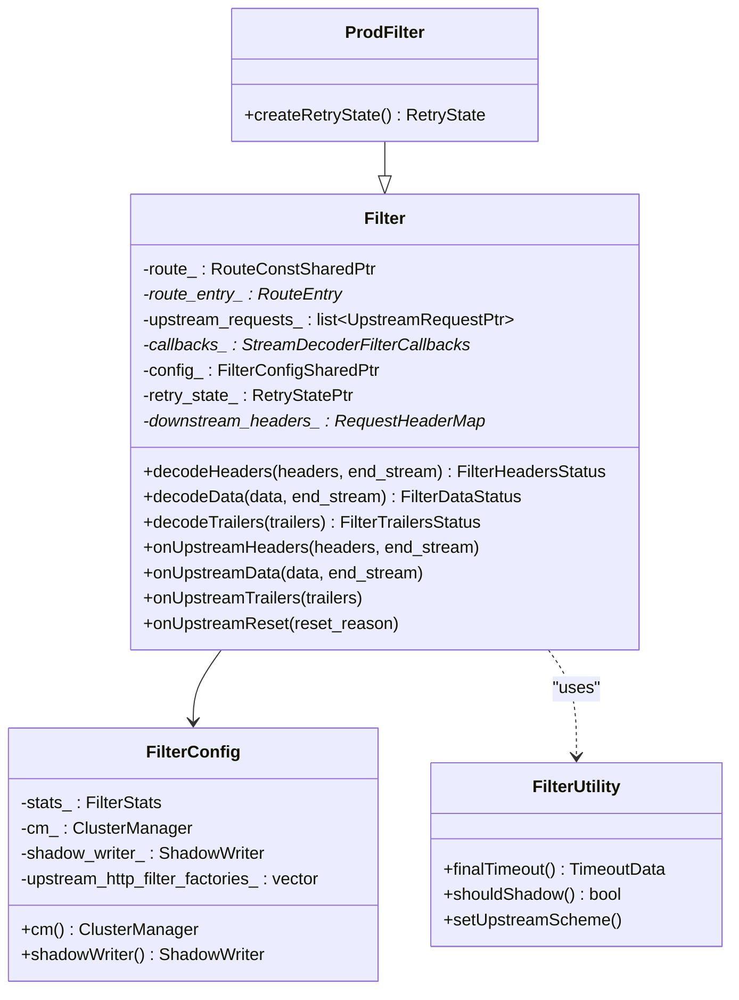

## Router Filter — decodeHeaders() Deep Dive

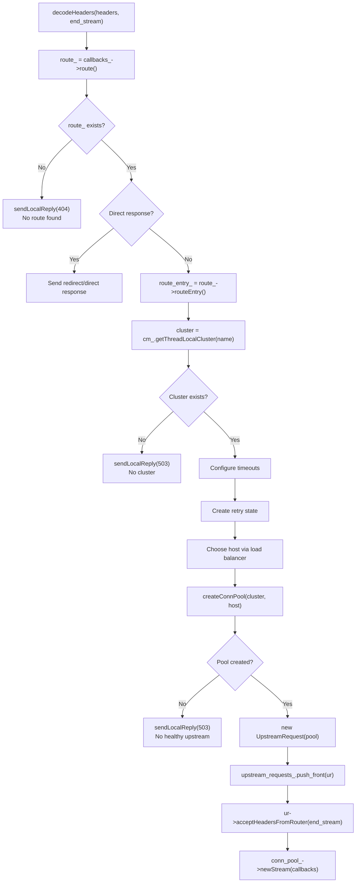

## UpstreamRequest — Per-Attempt Request

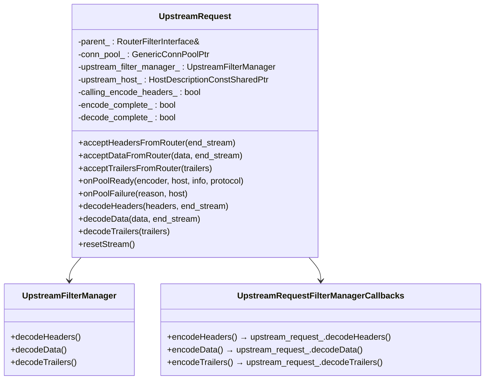

### UpstreamRequest Data Flow

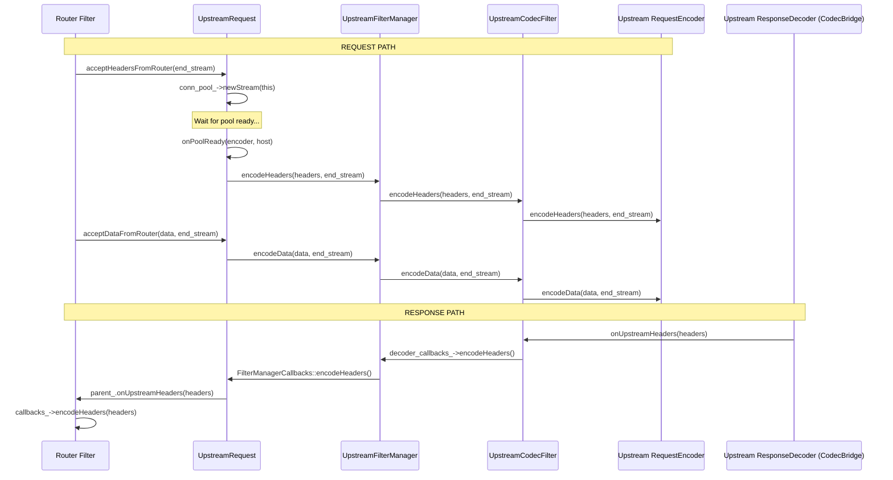

## UpstreamCodecFilter and CodecBridge

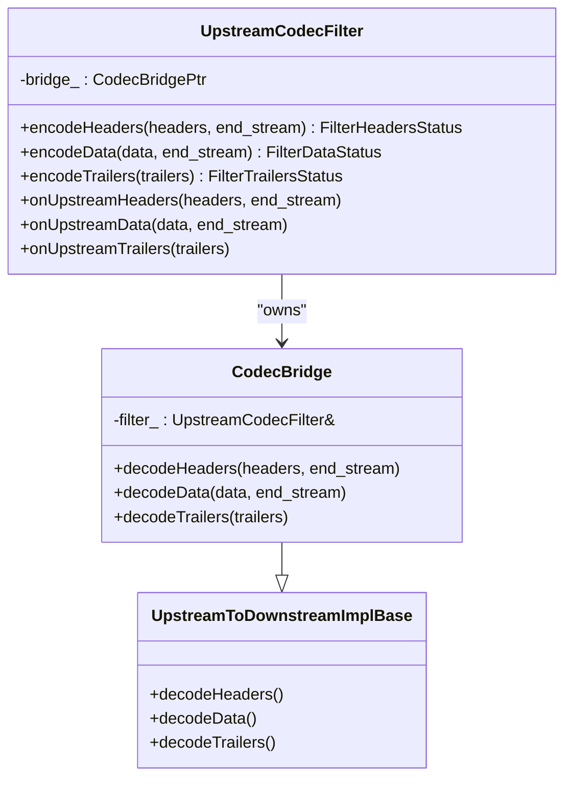

`UpstreamCodecFilter` is the terminal upstream filter — it encodes requests to the upstream codec and receives responses from it.

## Retry Logic

### RetryStateImpl

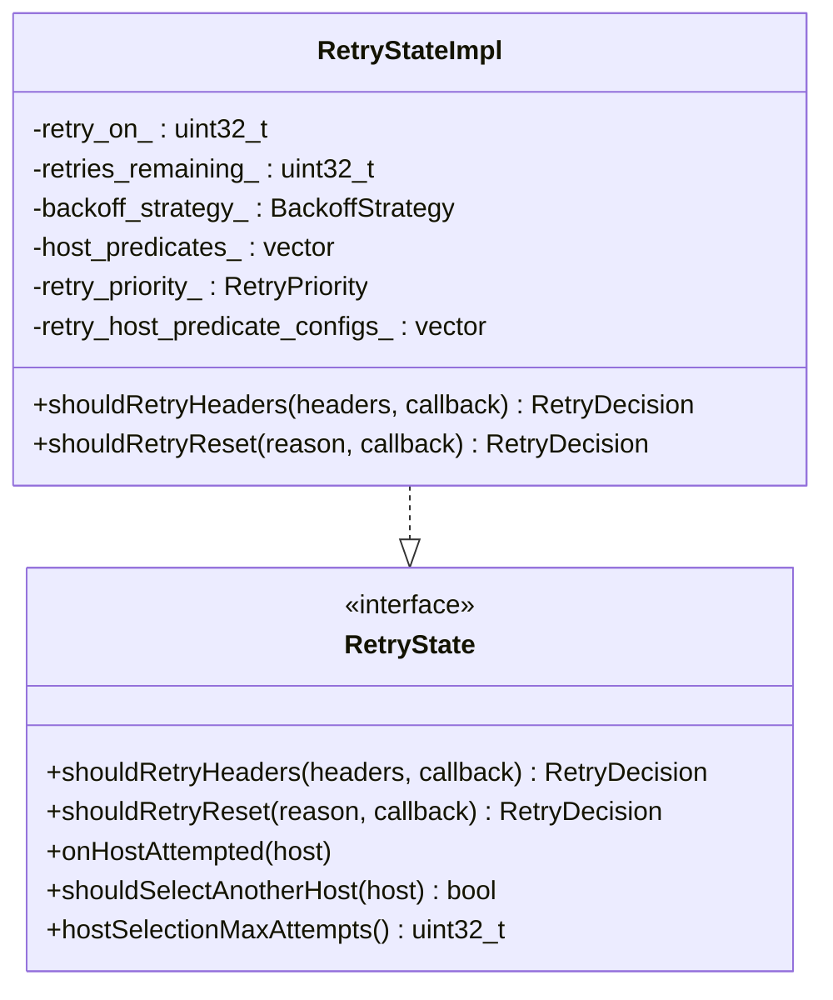

### Retry Decision Flow

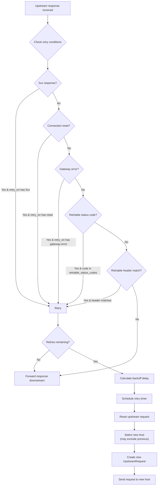

### Retry Backoff Strategy

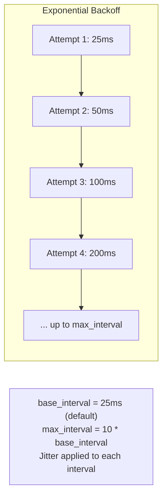

### Host Selection During Retries

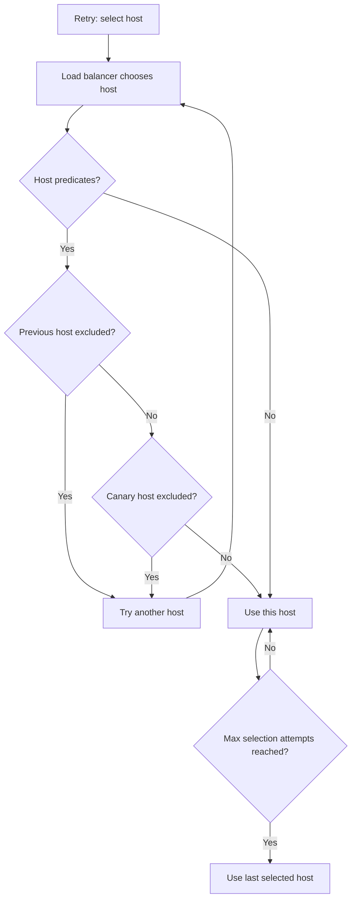

## Shadow Writing (Traffic Mirroring)

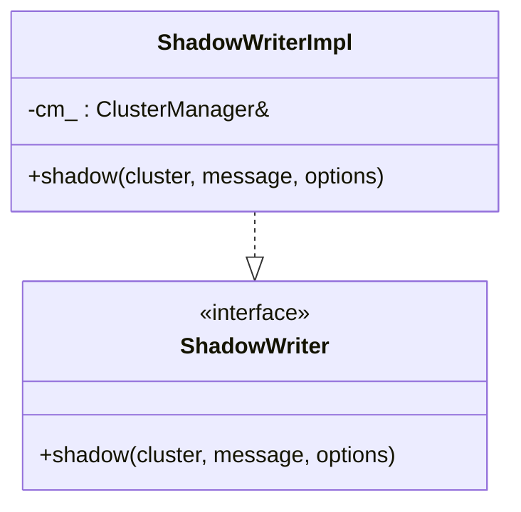

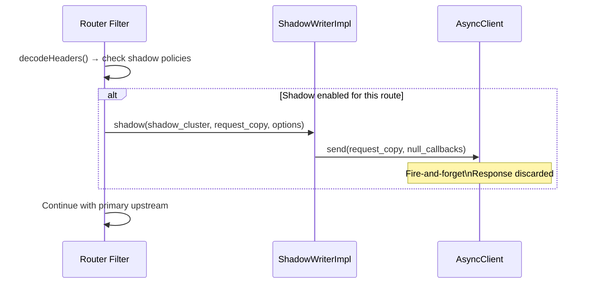

## Hedging

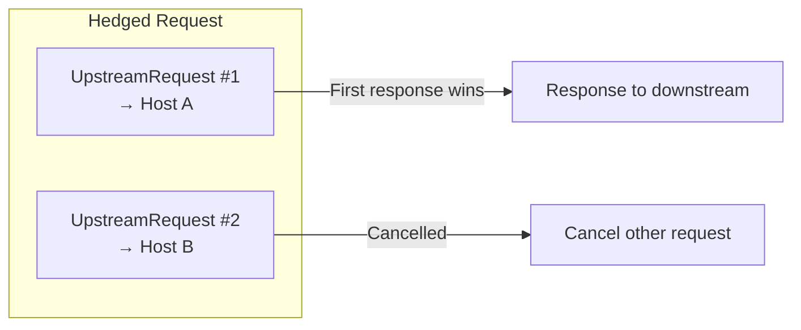

When hedging is enabled, the Router creates multiple `UpstreamRequest` objects simultaneously. The first successful response is forwarded; others are cancelled.

## File Catalog

| File | Key Classes | Purpose |
|------|-------------|---------|
| `router.h/cc` | `Filter`, `ProdFilter`, `FilterConfig`, `FilterUtility` | Router HTTP filter |
| `upstream_request.h/cc` | `UpstreamRequest`, `UpstreamFilterManager`, callbacks | Per-attempt upstream request |
| `upstream_codec_filter.h/cc` | `UpstreamCodecFilter`, `CodecBridge` | Terminal upstream filter |
| `upstream_to_downstream_impl_base.h` | `UpstreamToDownstreamImplBase` | Response bridge base |
| `retry_state_impl.h/cc` | `RetryStateImpl` | Retry logic |
| `retry_policy_impl.h/cc` | `RetryPolicyImpl` | Retry policy from config |
| `reset_header_parser.h/cc` | `ResetHeaderParserImpl` | Retry-After/X-RateLimit-Reset parsing |
| `shadow_writer_impl.h/cc` | `ShadowWriterImpl` | Traffic mirroring |
| `debug_config.h/cc` | `DebugConfig` | Router debug filter state |
| `string_accessor_impl.h` | `StringAccessorImpl` | String filter state |

---

**Previous:** [Part 6 — Routing Engine and Configuration](06-router-engine-config.md)  
**Next:** [Part 8 — Cluster Manager and Clusters](08-upstream-cluster-manager.md)
