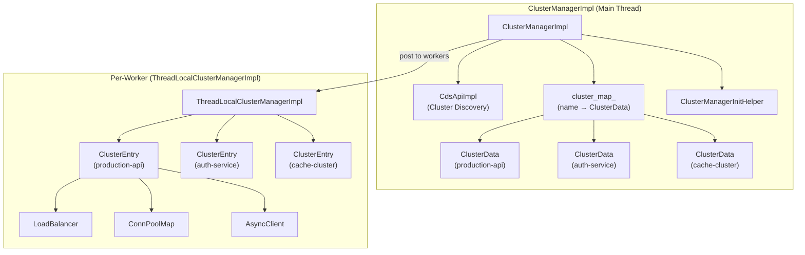
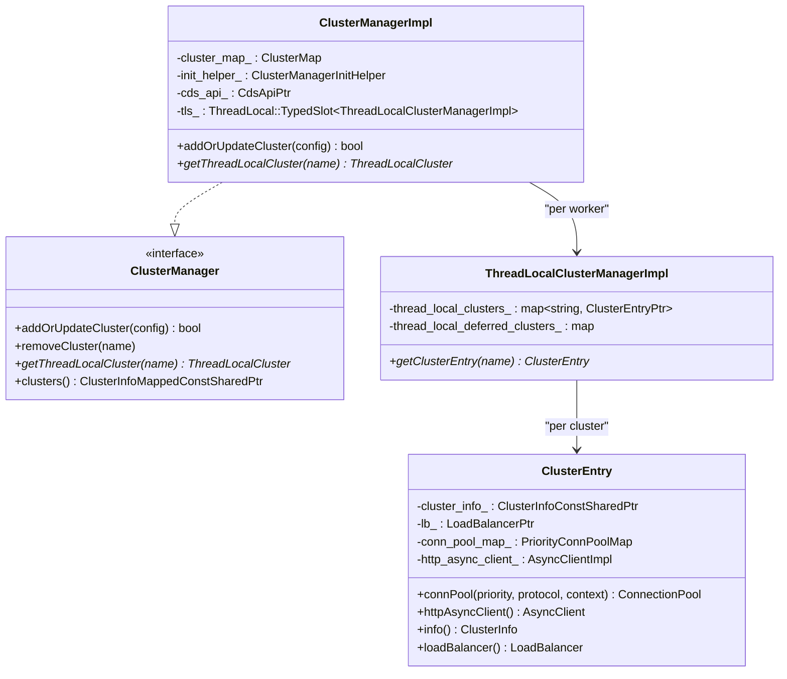
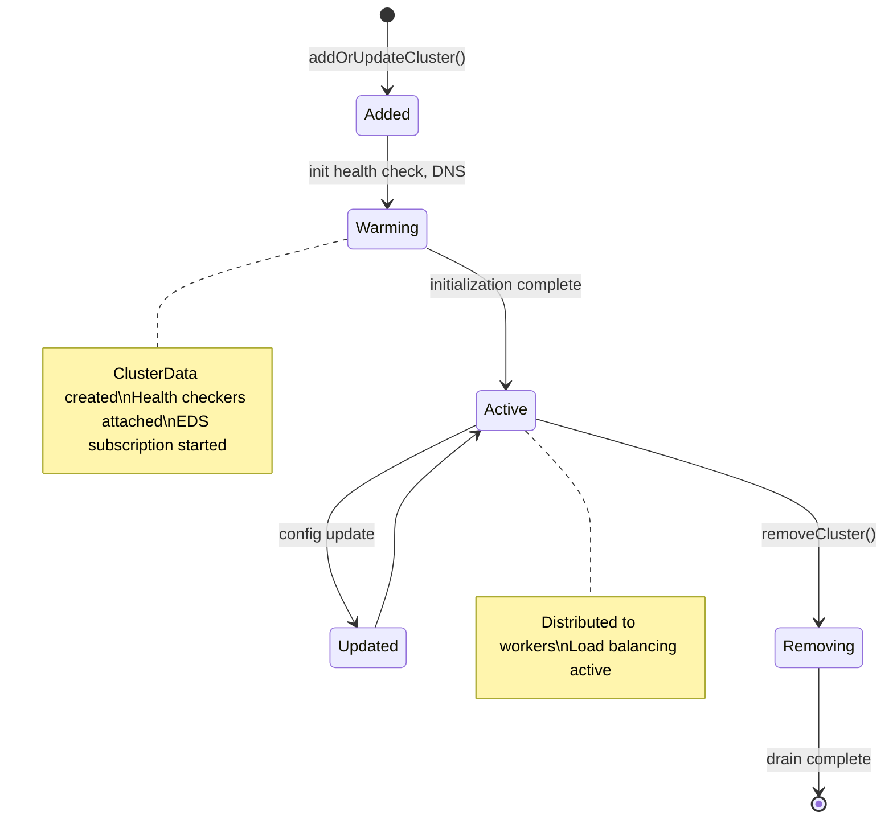
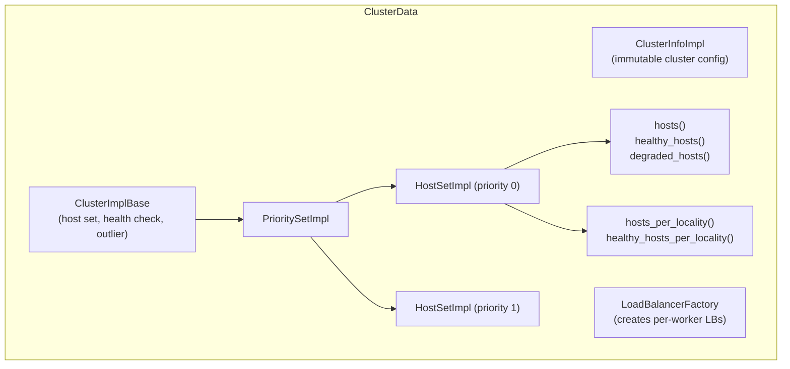
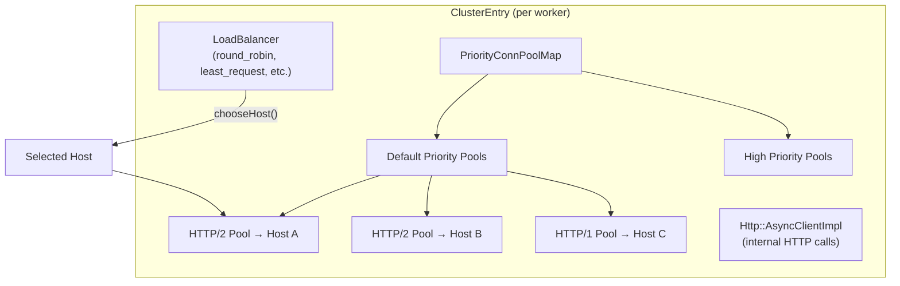
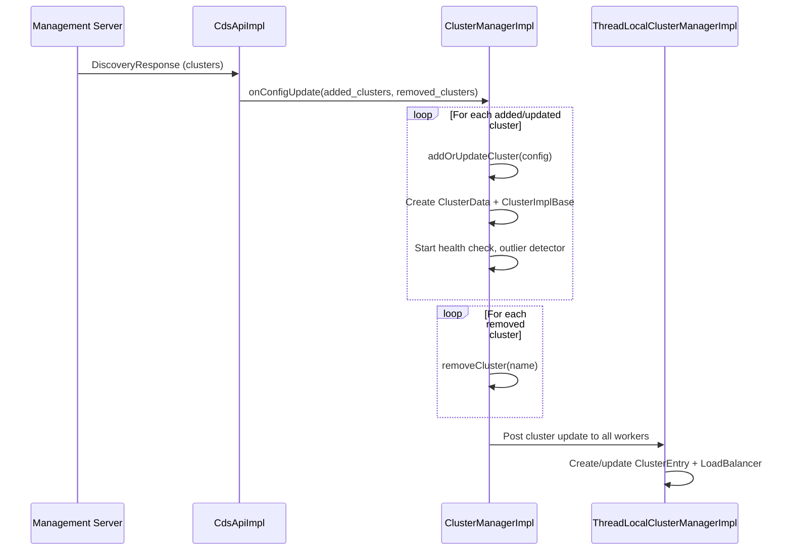
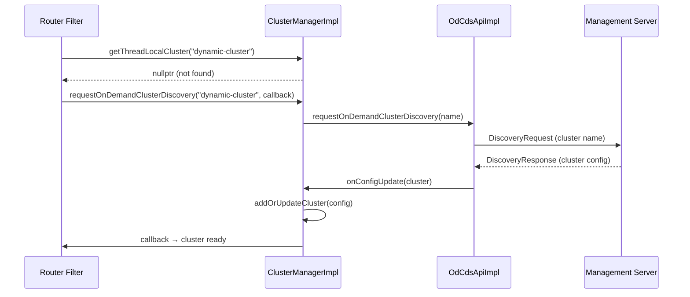
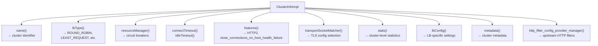
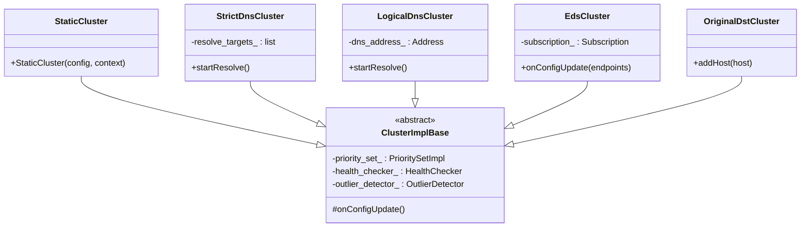
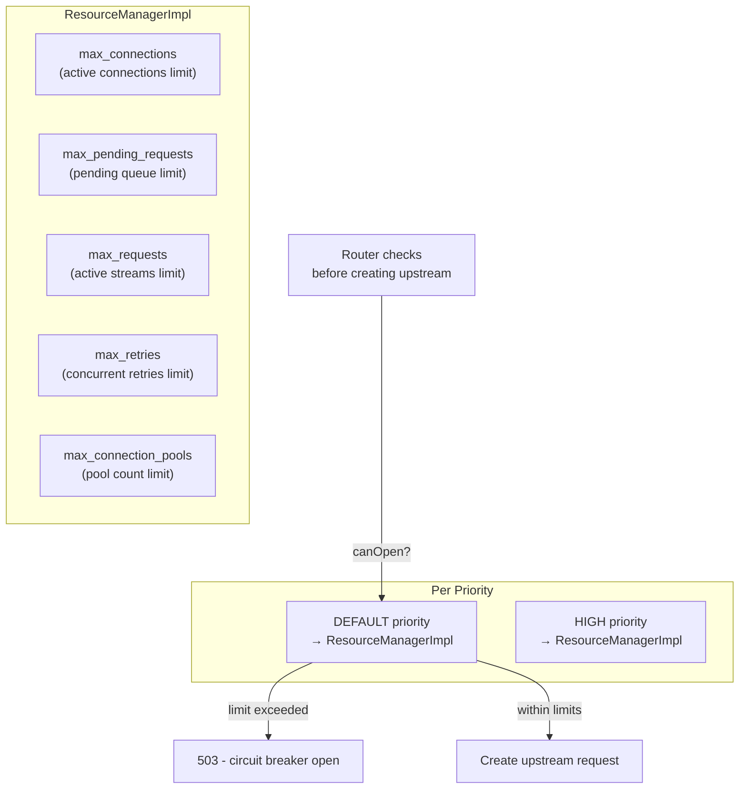

# Part 8: `source/common/upstream/` — Cluster Manager and Clusters

## Overview

The `upstream/` folder manages everything about upstream clusters: discovery (CDS/EDS), host management, health checking, load balancing, connection pooling, and outlier detection. The `ClusterManagerImpl` is the central orchestrator.

## Cluster Manager Architecture

## Class Hierarchy

## Cluster Lifecycle

## ClusterData — Central Cluster State

## Thread-Local Cluster (ClusterEntry)

Each worker thread has its own `ClusterEntry` with a private load balancer and connection pools:

## Cluster Discovery (CDS)

## On-Demand CDS (ODCDS)

## ClusterInfoImpl — Immutable Cluster Config

## Cluster Types

## Circuit Breakers (Resource Manager)

## File Catalog

| File | Key Classes | Purpose |
|------|-------------|---------|
| `cluster_manager_impl.h/cc` | `ClusterManagerImpl`, `ThreadLocalClusterManagerImpl`, `ClusterEntry`, `ClusterData` | Central cluster management |
| `upstream_impl.h/cc` | `HostImpl`, `HostSetImpl`, `PrioritySetImpl`, `ClusterInfoImpl`, `ClusterImplBase` | Host/cluster implementations |
| `cds_api_impl.h/cc` | `CdsApiImpl` | Cluster Discovery Service |
| `cds_api_helper.h/cc` | `CdsApiHelper` | CDS update helper |
| `od_cds_api_impl.h/cc` | `OdCdsApiImpl` | On-demand CDS |
| `cluster_factory_impl.h/cc` | `ClusterFactoryImplBase` | Cluster creation factory |
| `cluster_discovery_manager.h/cc` | `ClusterDiscoveryManager` | On-demand cluster callbacks |
| `cluster_update_tracker.h/cc` | `ClusterUpdateTracker` | Cluster add/remove tracking |
| `resource_manager_impl.h` | `ResourceManagerImpl`, `RetryBudgetImpl` | Circuit breakers |
| `conn_pool_map.h` | `ConnPoolMap` | Per-host connection pool map |
| `priority_conn_pool_map.h` | `PriorityConnPoolMap` | Priority-aware pool map |
| `transport_socket_match_impl.h/cc` | `TransportSocketMatcherImpl` | Transport socket selection |
| `prod_cluster_info_factory.h/cc` | `ProdClusterInfoFactory` | ClusterInfo creation |
| `load_balancer_factory_base.h` | `TypedLoadBalancerFactoryBase` | LB factory base |
| `load_balancer_context_base.h` | `LoadBalancerContextBase` | LB context base |
| `edf_scheduler.h` | `EdfScheduler` | Weighted round-robin scheduler |
| `wrsq_scheduler.h` | `WRSQScheduler` | Weighted random scheduler |
| `locality_pool.h/cc` | `LocalityPool` | Locality object pool |

---

**Previous:** [Part 7 — Router Upstream and Retry](07-router-upstream-retry.md)  
**Next:** [Part 9 — Hosts, Health Checking, and Outlier Detection](09-upstream-hosts-health.md)
