# Part 9: `source/common/upstream/` — Hosts, Health Checking, and Outlier Detection

## Overview

This document covers the host abstraction (how Envoy represents upstream endpoints), health checking (active probing), and outlier detection (passive monitoring). These systems work together to ensure traffic is only sent to healthy upstream hosts.

## Host Architecture

### Host Class Hierarchy

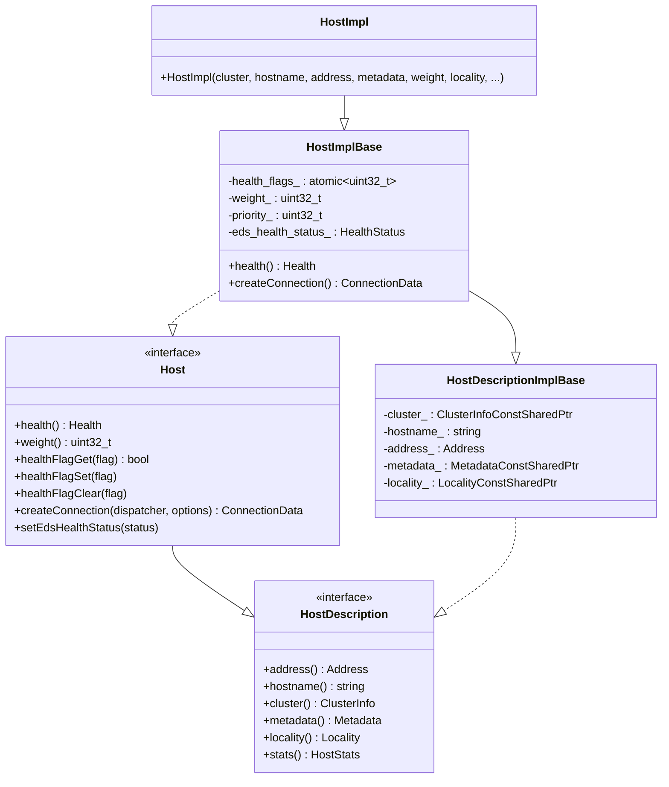

### Host Health Flags

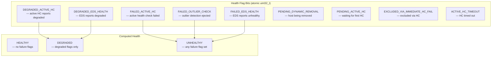

### Host Connection Creation

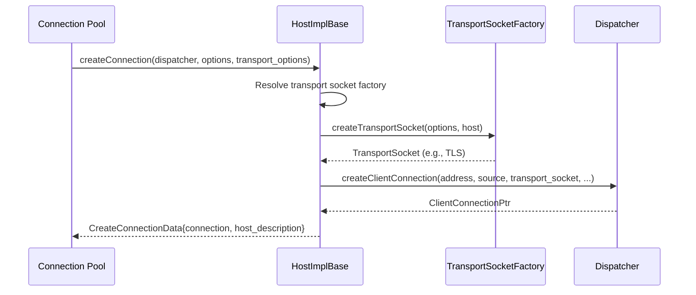

## Host Sets and Priority Sets

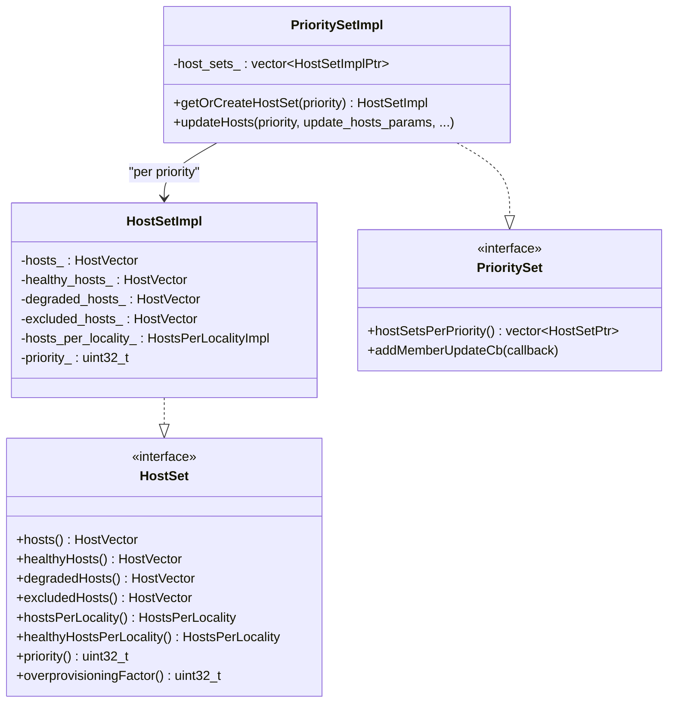

### Priority-Based Host Organization

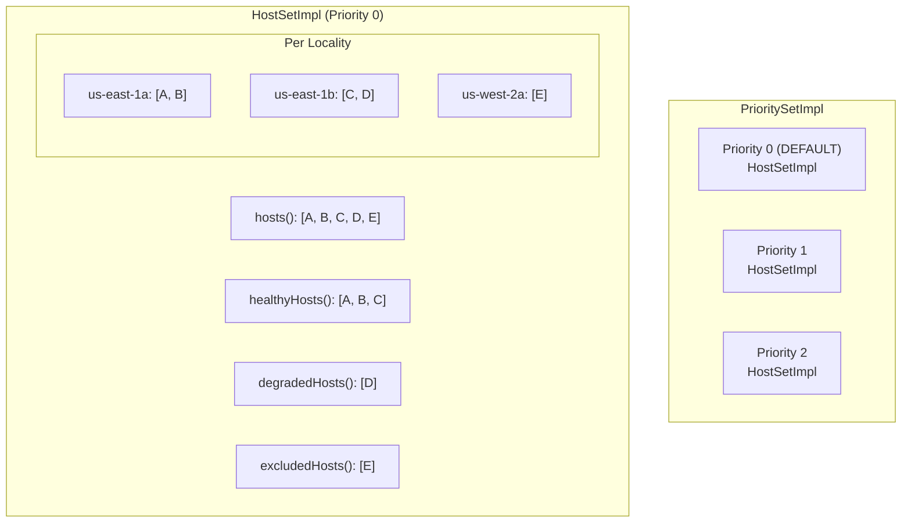

## Health Checking

### Health Checker Architecture

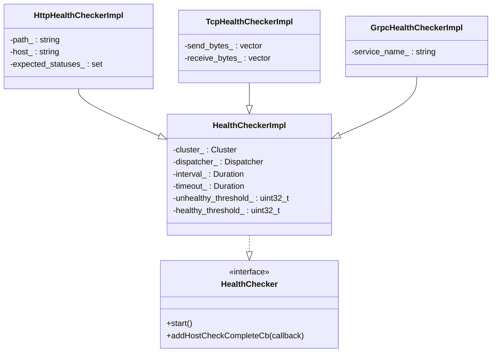

### Health Check Flow

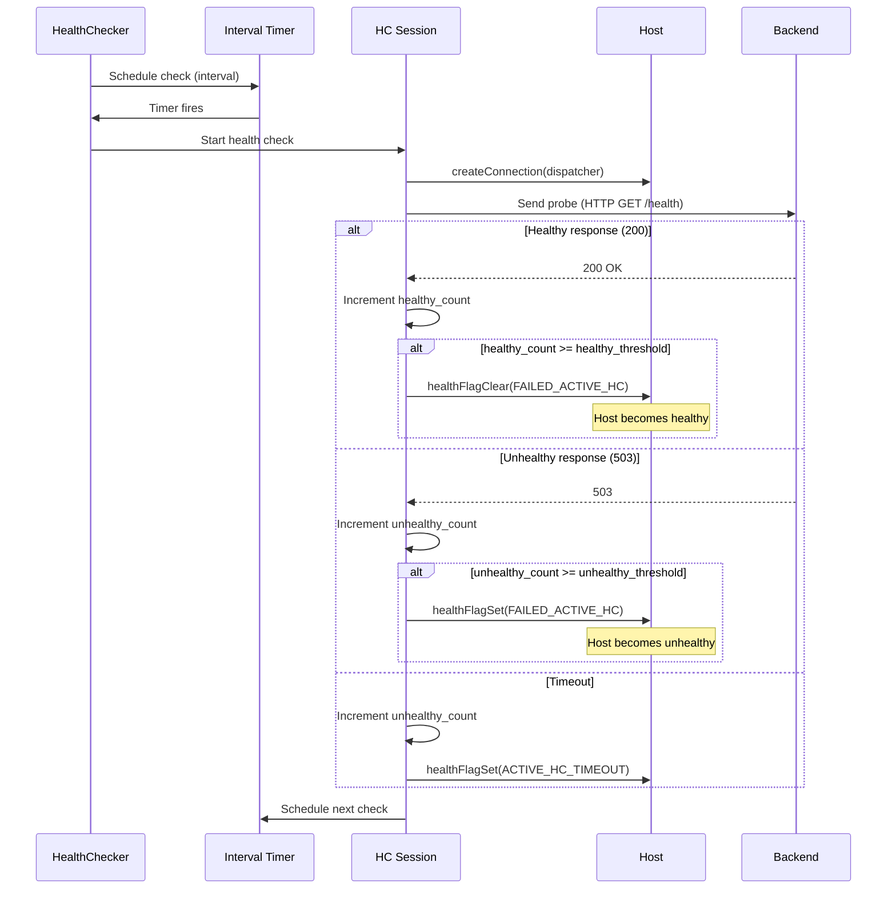

### Health State Transitions

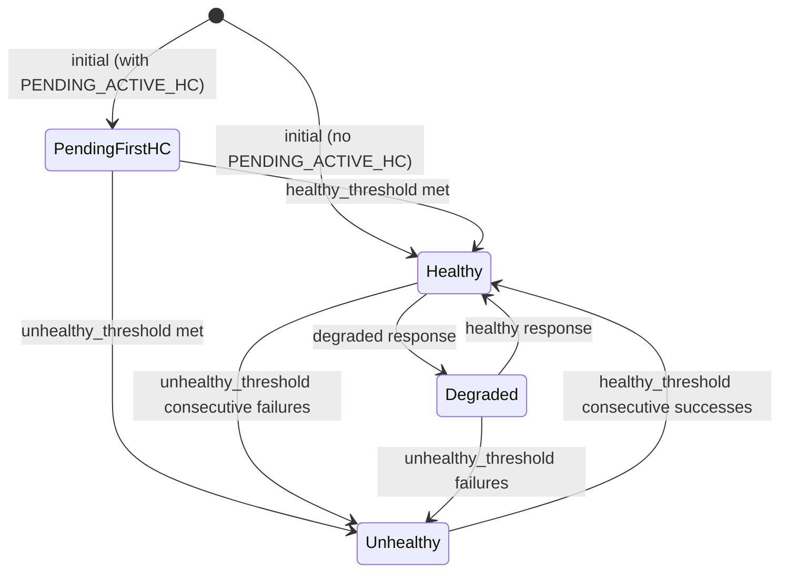

## Outlier Detection

### How It Works

Outlier detection is **passive** — it monitors actual request outcomes to detect misbehaving hosts and temporarily ejects them:

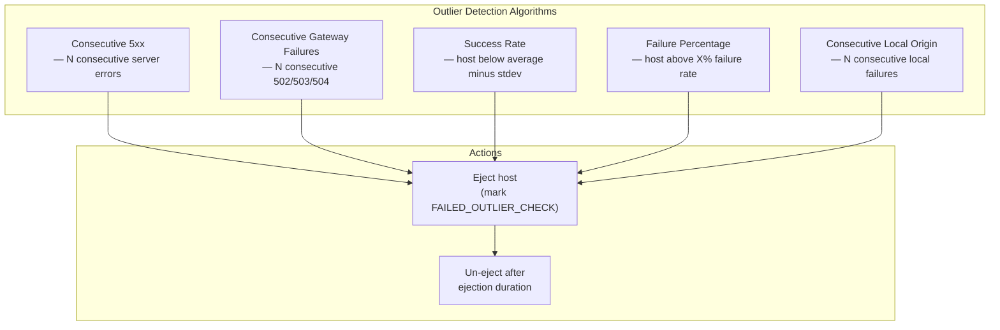

### Outlier Detector Class Diagram

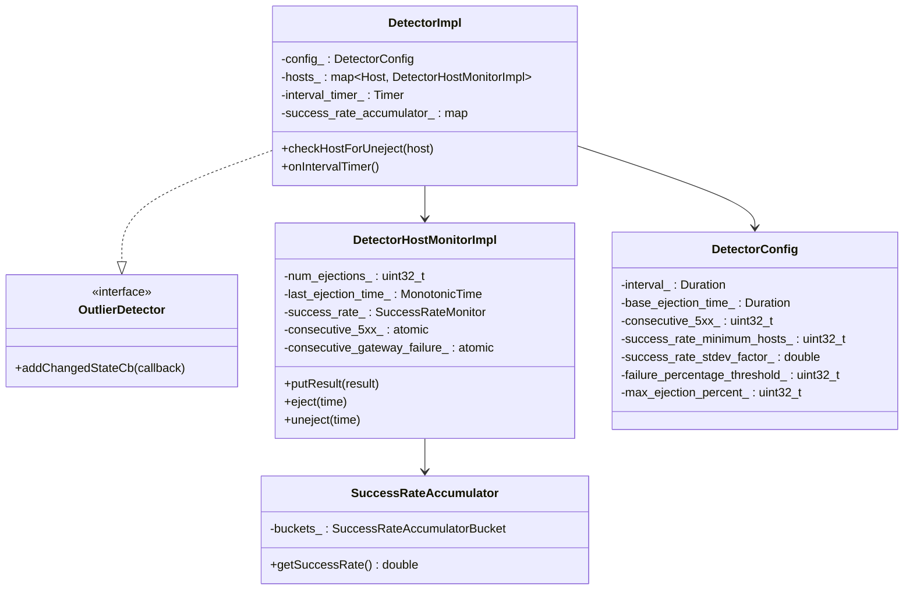

### Ejection and Un-ejection

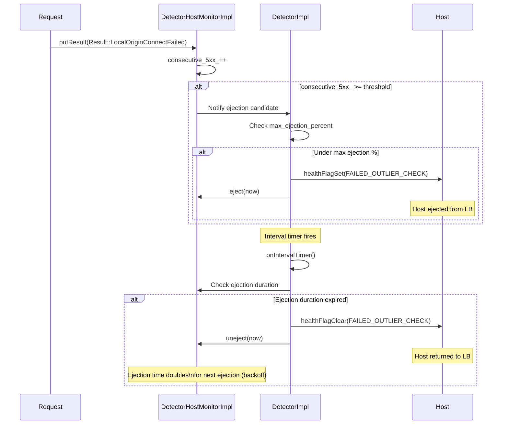

### Ejection Duration Backoff

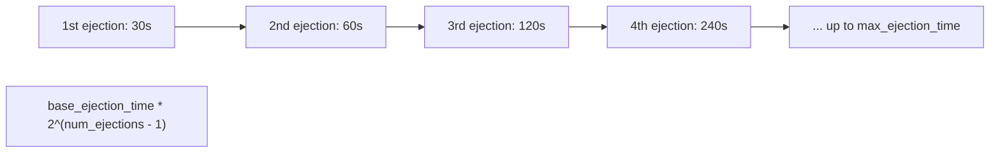

## How Health Check and Outlier Detection Interact

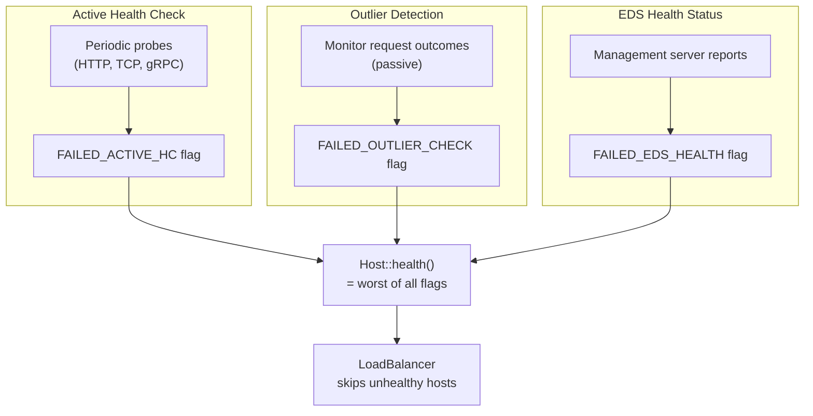

## File Catalog

| File | Key Classes | Purpose |
|------|-------------|---------|
| `upstream_impl.h/cc` | `HostImpl`, `HostImplBase`, `HostDescriptionImplBase`, `HostSetImpl`, `PrioritySetImpl`, `ClusterInfoImpl`, `ClusterImplBase` | Host and cluster implementations |
| `health_checker_impl.h/cc` | `HealthCheckerFactory`, `PayloadMatcher` | Health checker factory |
| `health_checker_event_logger.h/cc` | `HealthCheckEventLoggerImpl` | HC event logging |
| `health_discovery_service.h/cc` | `HdsDelegate`, `HdsCluster` | Health Discovery Service |
| `outlier_detection_impl.h/cc` | `DetectorImpl`, `DetectorHostMonitorImpl`, `DetectorConfig`, `SuccessRateAccumulator` | Outlier detection |
| `host_utility.h/cc` | `HostUtility` | Host helpers |
| `load_stats_reporter.h/cc` | `LoadStatsReporter` | Load Reporting Service |
| `default_local_address_selector.h/cc` | `DefaultUpstreamLocalAddressSelector` | Upstream source address |
| `upstream_factory_context_impl.h` | `UpstreamFactoryContextImpl` | Upstream filter factory context |
| `retry_factory.h` | `RetryExtensionFactoryContextImpl` | Retry extension context |

---

**Previous:** [Part 8 — Cluster Manager](08-upstream-cluster-manager.md)  
**Next:** [Part 10 — Supporting Subsystems](10-supporting-subsystems.md)
