# Part 10: Supporting Subsystems — Event Loop, Buffers, Config, Connection Pool, and More

## Overview

This document covers the foundational infrastructure folders that underpin the request path: the event loop (`event/`), buffer management (`buffer/`), xDS configuration (`config/`), the base connection pool (`conn_pool/`), TLS (`tls/`), and other supporting subsystems.

## Event Loop (`source/common/event/`)

### Dispatcher — The Heart of Envoy

Every Envoy worker thread runs a single-threaded event loop powered by libevent. The `Dispatcher` is the interface to this loop.

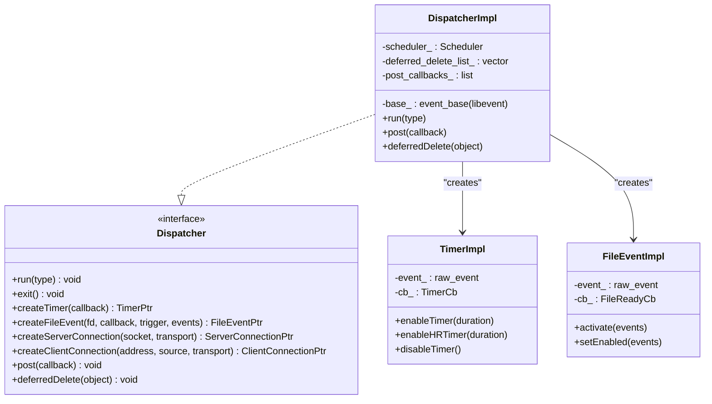

### Event Loop Architecture

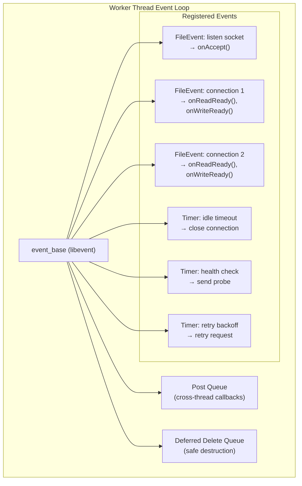

### Deferred Deletion

Objects that might be referenced during event processing can't be deleted immediately. `deferredDelete()` queues them for safe deletion at the end of the current event loop iteration:

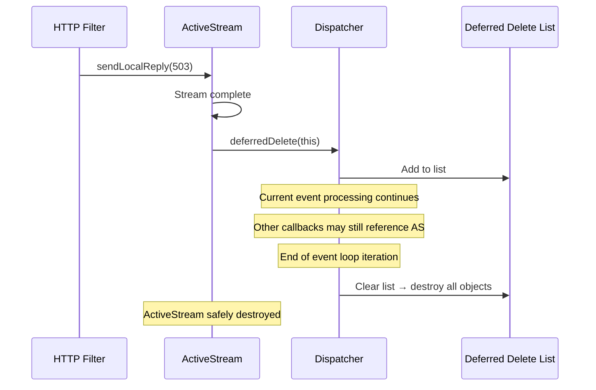

## Buffer (`source/common/buffer/`)

### Buffer Architecture

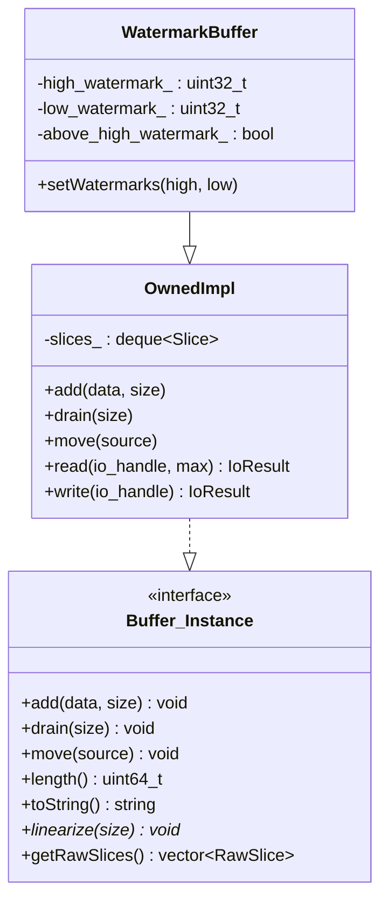

### Zero-Copy Buffer Design

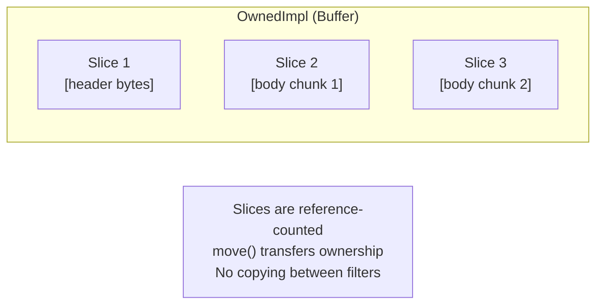

### Watermark Flow Control

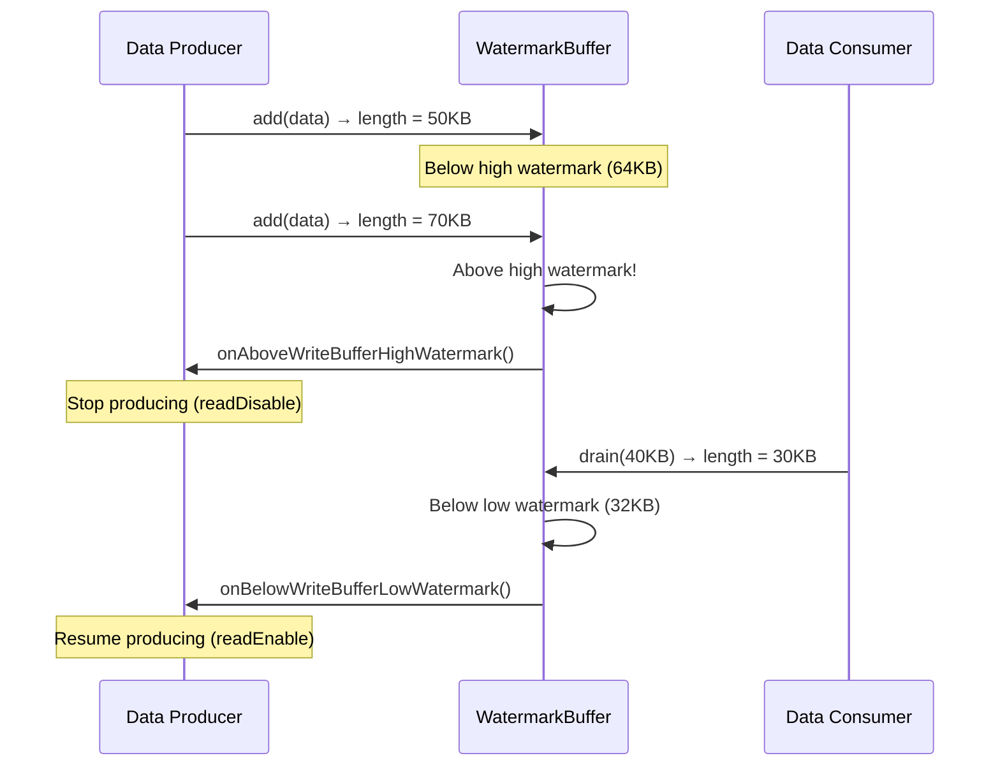

## Base Connection Pool (`source/common/conn_pool/`)

### ConnPoolImplBase

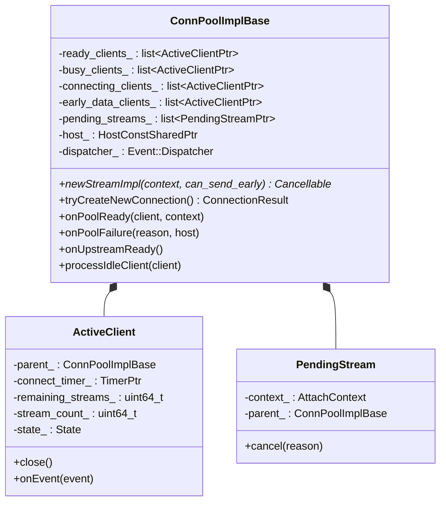

This base class is shared between HTTP and TCP connection pools. The HTTP-specific pool (`HttpConnPoolImplBase`) adds codec client creation on top of this.

### Pool Decision Flow

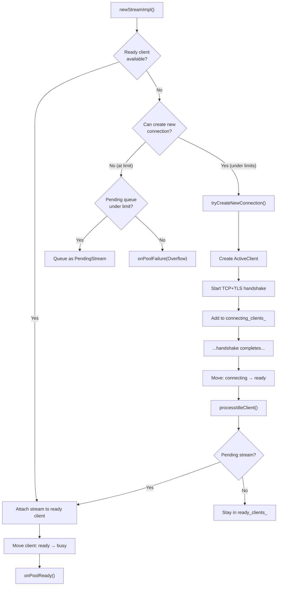

## Configuration / xDS (`source/common/config/`)

### xDS Subscription Architecture

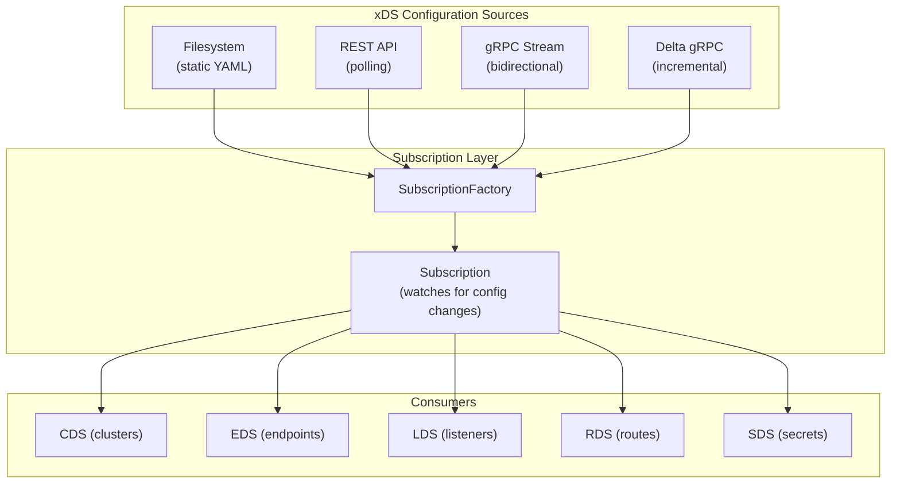

### gRPC Multiplexing

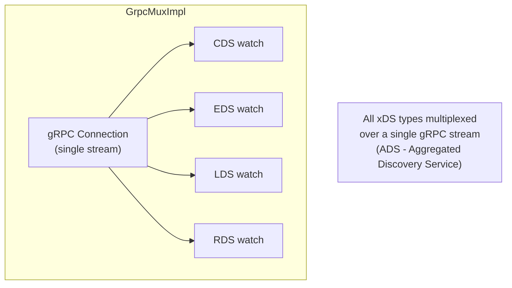

## TLS (`source/common/tls/`)

### TLS Architecture

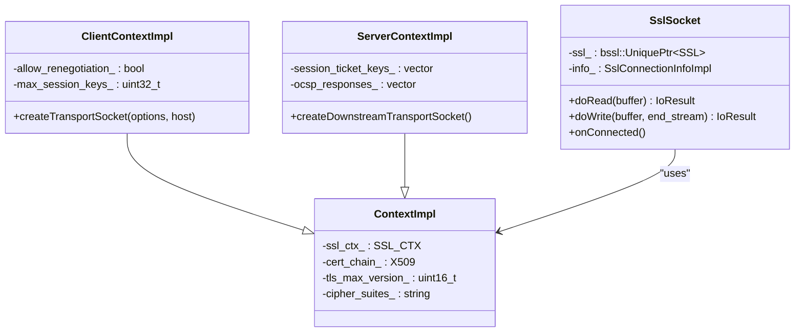

## Stats (`source/common/stats/`)

### Stats Architecture

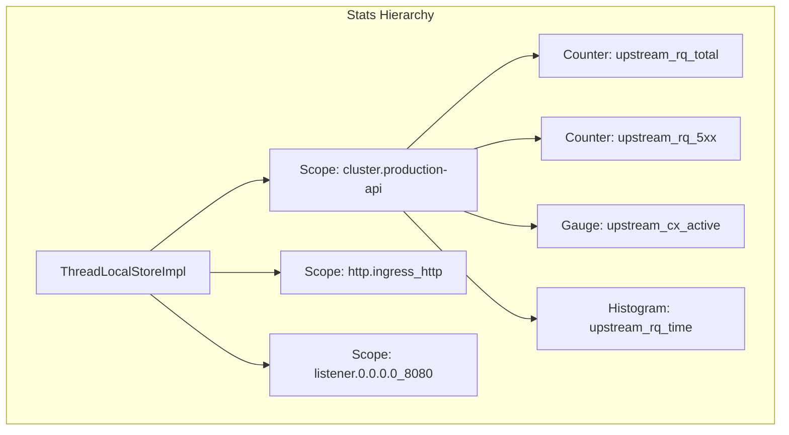

| Stat Type | Purpose | Thread Safety |
|-----------|---------|--------------|
| **Counter** | Monotonically increasing count | Atomic increment, TLS merge |
| **Gauge** | Current value (can go up/down) | Atomic set, TLS merge |
| **Histogram** | Distribution of values | Per-thread accumulation, periodic merge |
| **TextReadout** | String value | Mutex-protected |

## Other Important Folders

### `stream_info/` — Per-Request Metadata

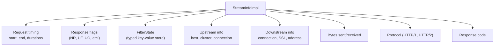

### `conn_pool/` — Base Connection Pool

| File | Key Classes | Purpose |
|------|-------------|---------|
| `conn_pool_base.h/cc` | `ConnPoolImplBase`, `ActiveClient`, `PendingStream` | Base pool (shared by HTTP and TCP) |

### `tracing/` — Distributed Tracing

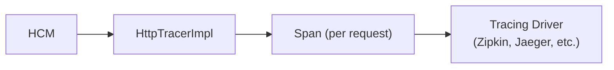

### `grpc/` — gRPC Client

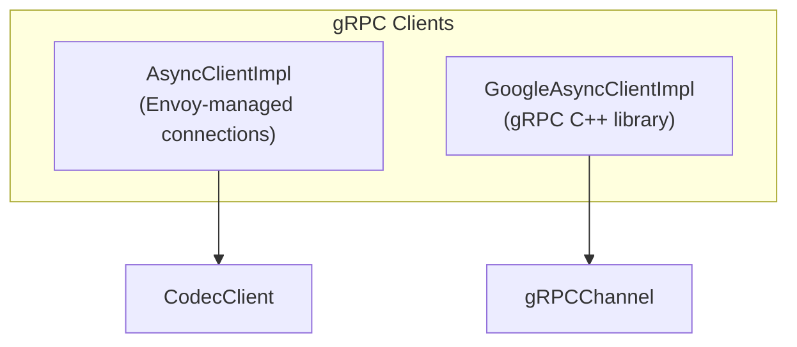

## Complete Folder Summary

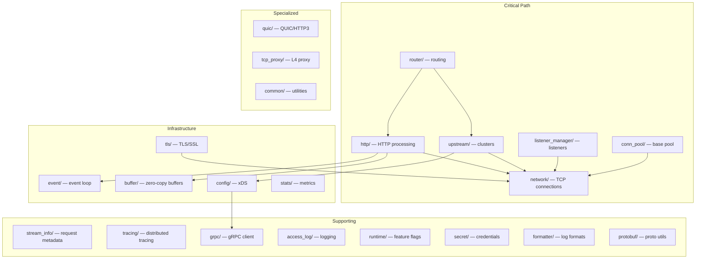

---

**Previous:** [Part 9 — Hosts, Health Checking, and Outlier Detection](09-upstream-hosts-health.md)  
**Back to:** [Part 1 — Overview](01-overview.md)
