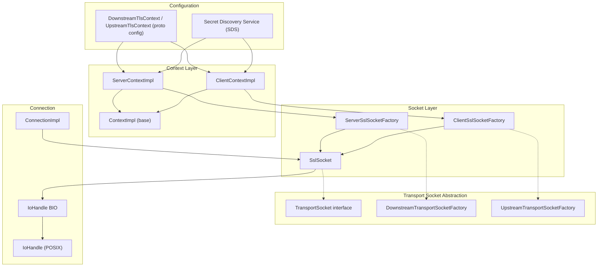
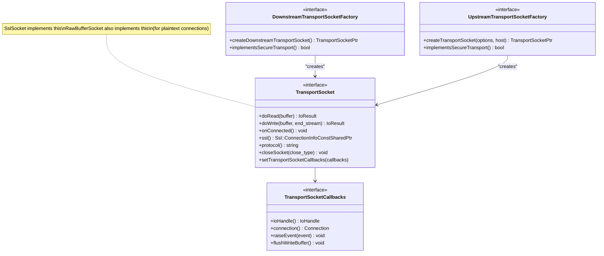
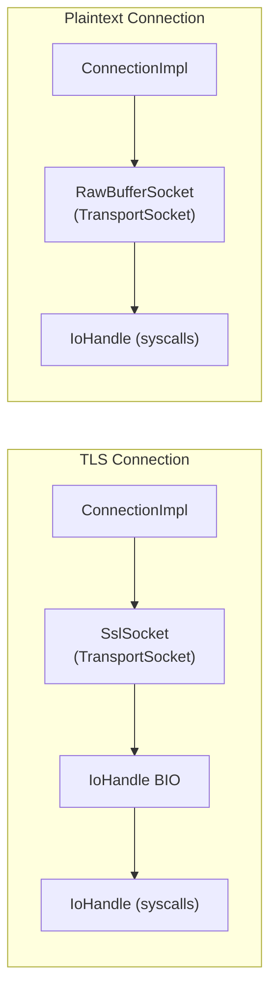
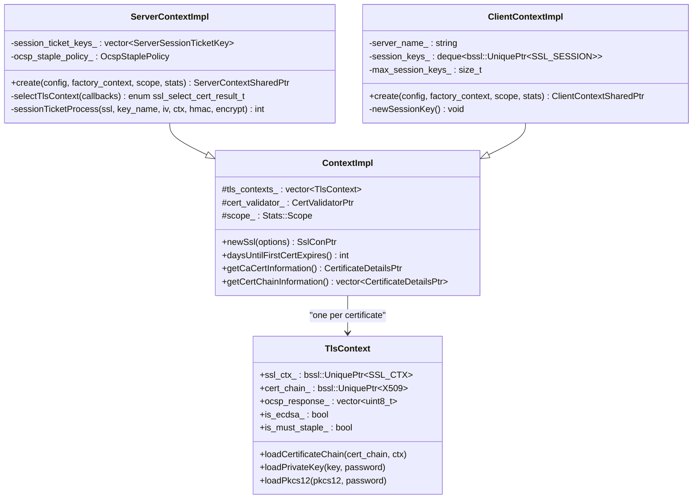
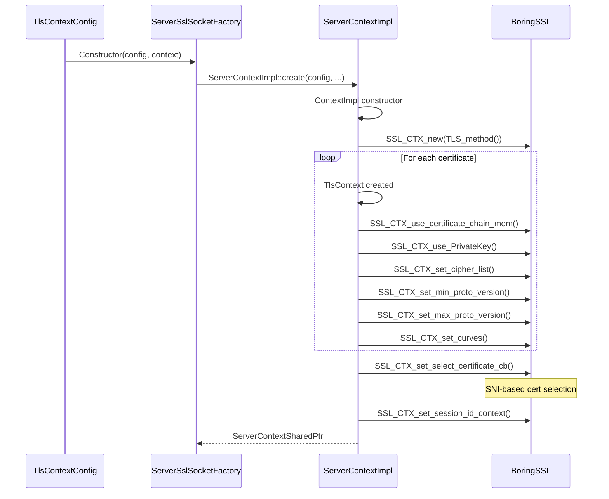
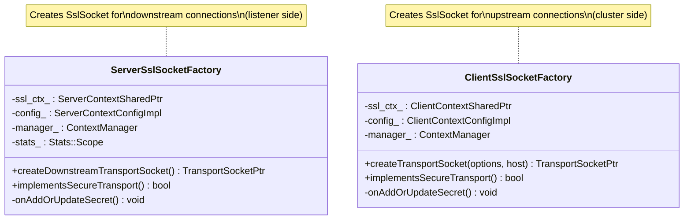
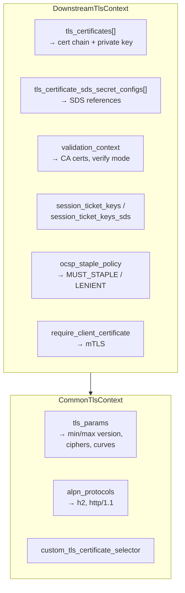
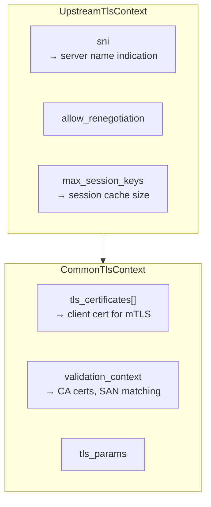
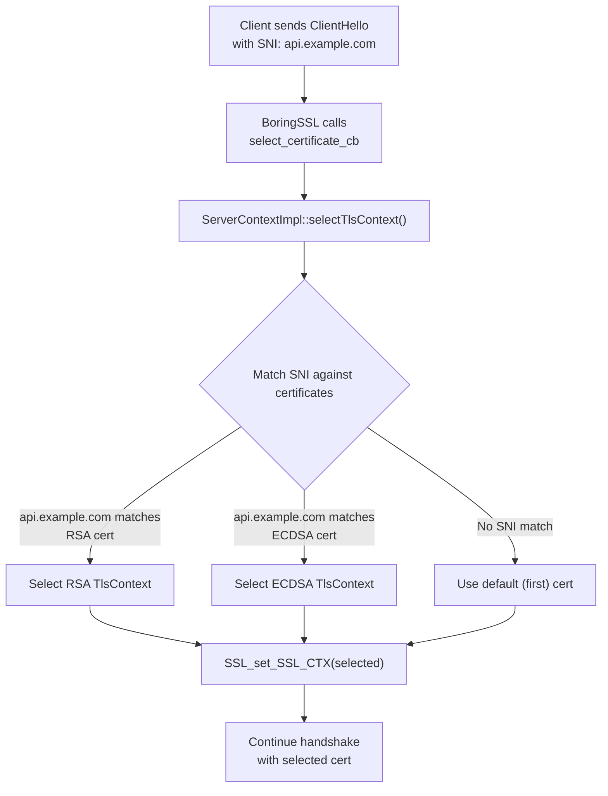

# Part 1: SSL/TLS — Architecture & Contexts

## Overview

Envoy's TLS implementation is built on BoringSSL and integrates with the transport socket abstraction layer. TLS is not embedded directly in connection logic — instead, it is a pluggable `TransportSocket` that wraps raw I/O. This allows clean separation between protocol handling (HTTP/1, HTTP/2) and encryption.

## TLS Architecture

## Transport Socket Abstraction

### TLS vs Plaintext

## TLS Context Hierarchy

### Context Creation Flow

## TLS Socket Factories

## TLS Context Configuration

### Server (Downstream)

### Client (Upstream)

## Multiple Certificates and SNI Selection

## Key Source Files

| File | Key Classes | Purpose |
|------|-------------|---------|
| `envoy/network/transport_socket.h` | `TransportSocket`, `TransportSocketCallbacks` | Transport socket interfaces |
| `source/common/tls/context_impl.h/cc` | `ContextImpl`, `TlsContext` | Base TLS context |
| `source/common/tls/server_context_impl.h/cc` | `ServerContextImpl` | Server TLS context |
| `source/common/tls/client_context_impl.h/cc` | `ClientContextImpl` | Client TLS context |
| `source/common/tls/server_ssl_socket.h/cc` | `ServerSslSocketFactory` | Downstream socket factory |
| `source/common/tls/client_ssl_socket.h/cc` | `ClientSslSocketFactory` | Upstream socket factory |
| `source/common/tls/ssl_socket.h/cc` | `SslSocket` | TLS transport socket |
| `source/common/tls/context_config_impl.h/cc` | `ClientContextConfigImpl` | Client config parsing |
| `source/common/tls/server_context_config_impl.h/cc` | `ServerContextConfigImpl` | Server config parsing |
| `source/extensions/transport_sockets/tls/downstream_config.cc` | `DownstreamSslSocketFactory` | Extension registration |
| `source/extensions/transport_sockets/tls/upstream_config.cc` | `UpstreamSslSocketFactory` | Extension registration |

---

**Next:** [Part 2 — Handshake, mTLS, and Certificate Validation](02-handshake-mtls-validation.md)
