# Part 2: SSL/TLS — Handshake, mTLS, and Certificate Validation

## SslSocket — The TLS Transport Socket

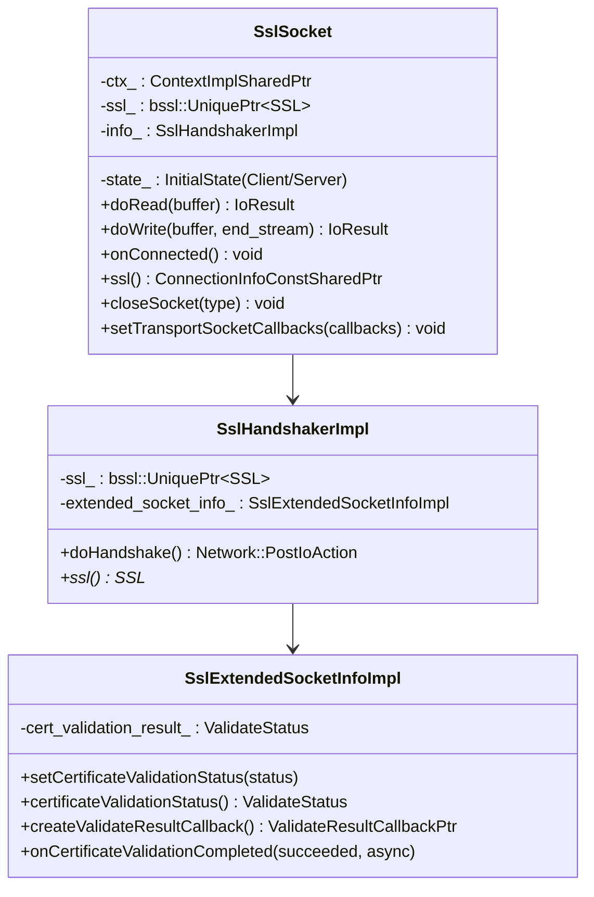

## TLS Handshake Flow

### Server-Side Handshake

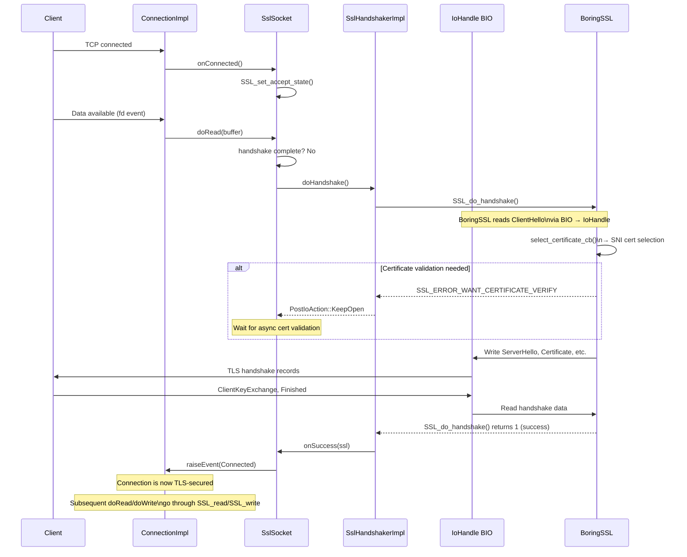

### Client-Side Handshake

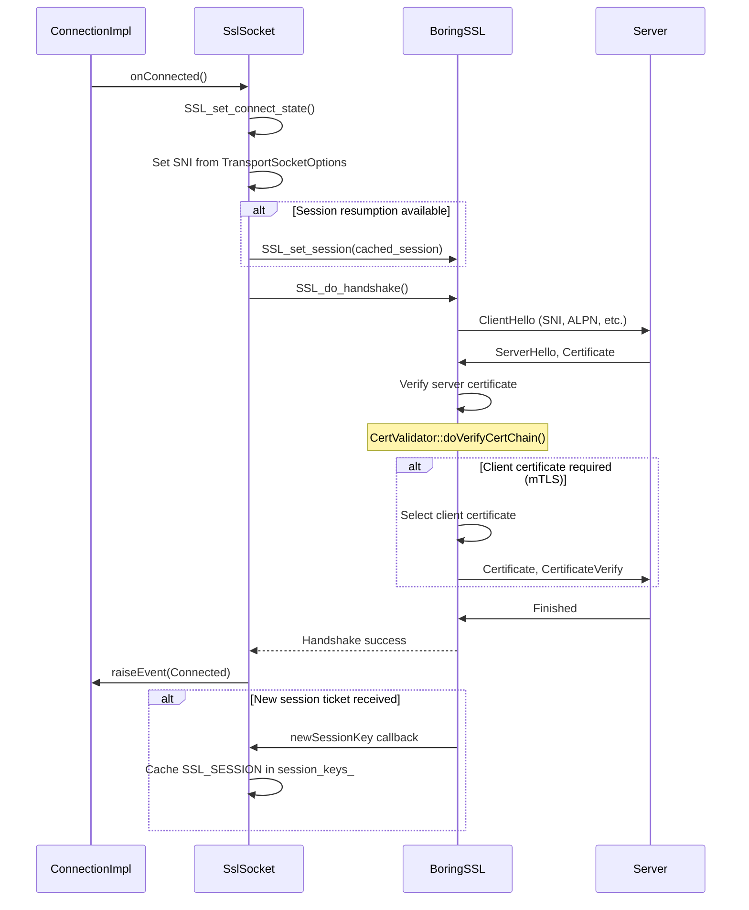

## Handshake Error Handling

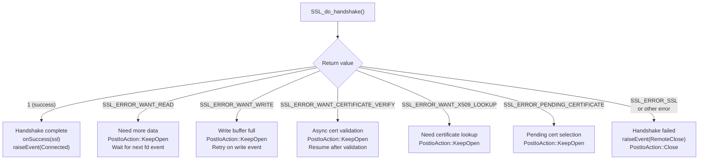

## mTLS (Mutual TLS)

### Architecture

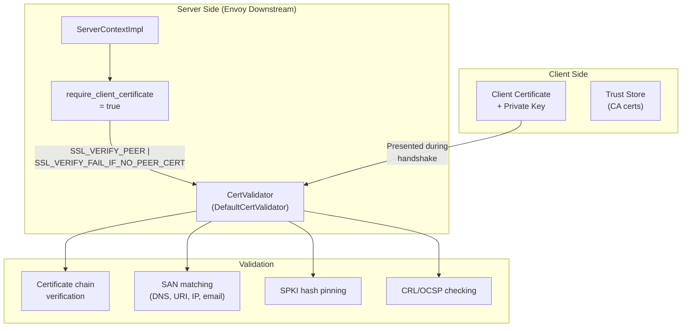

### mTLS Handshake Sequence

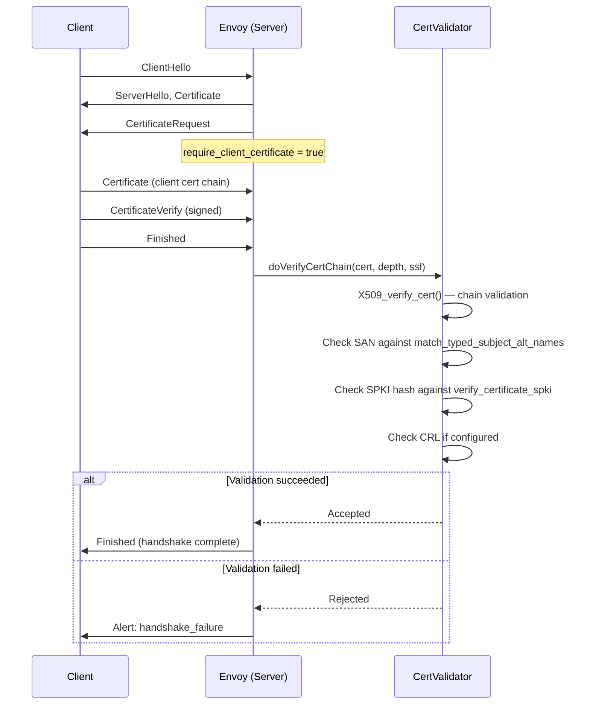

## Certificate Validation

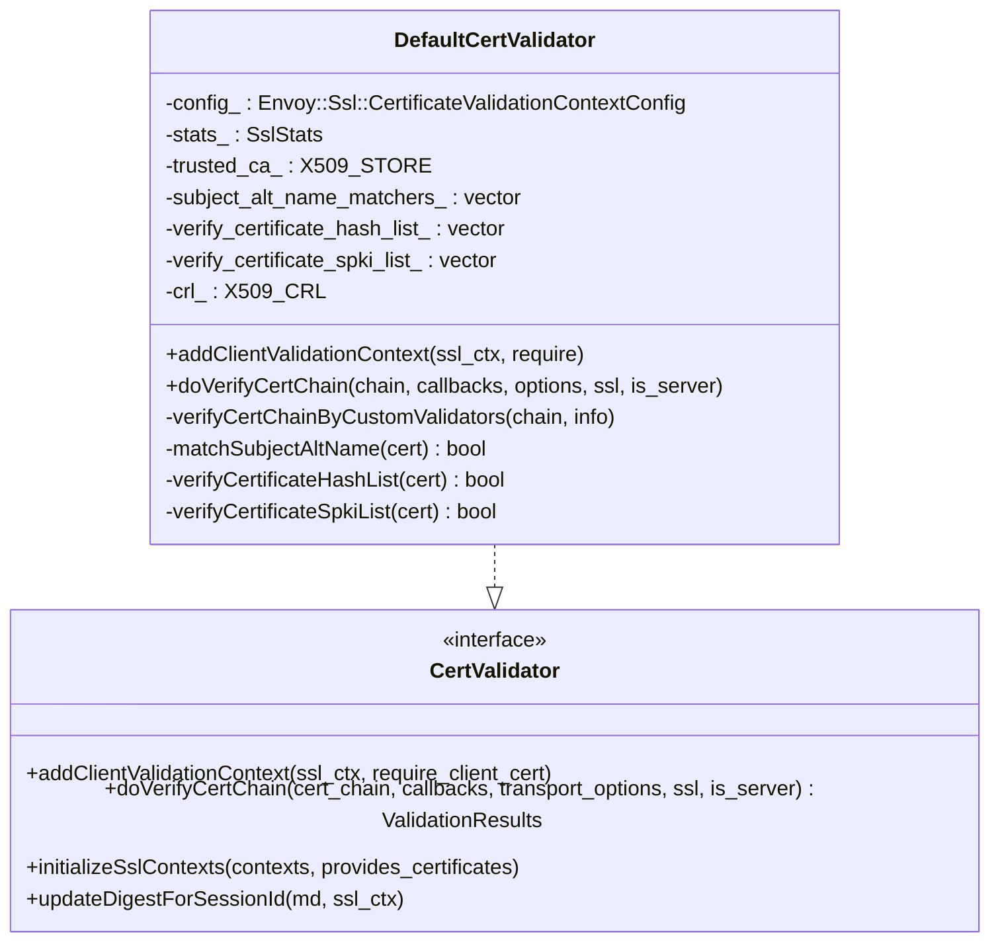

### Validation Steps

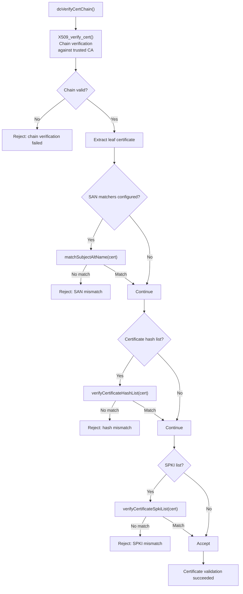

### SAN Matching Types

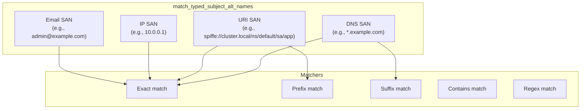

## tls_inspector Listener Filter

The `tls_inspector` inspects the TLS ClientHello without completing the handshake, extracting SNI and ALPN for filter chain matching.

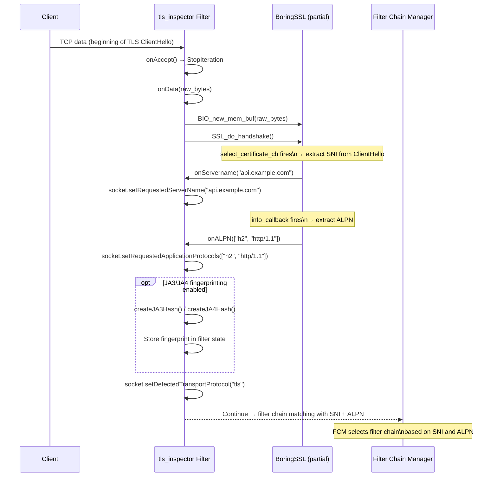

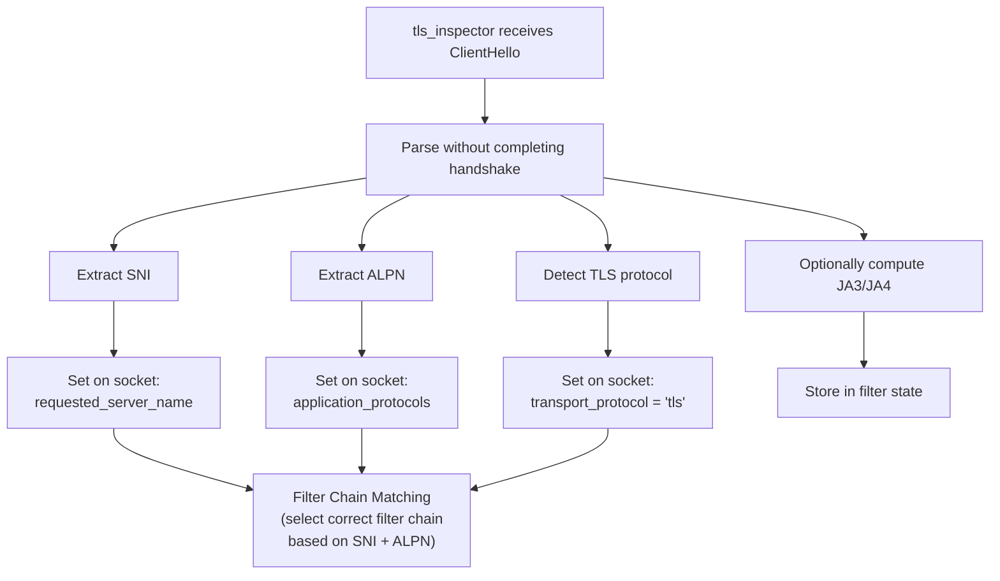

## I/O Through SslSocket

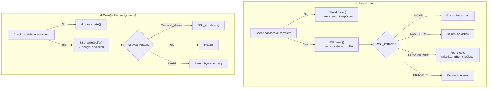

## Key Source Files

| File | Key Classes | Purpose |
|------|-------------|---------|
| `source/common/tls/ssl_socket.h/cc` | `SslSocket` | TLS transport socket |
| `source/common/tls/ssl_handshaker.h/cc` | `SslHandshakerImpl`, `SslExtendedSocketInfoImpl` | Handshake wrapper |
| `source/common/tls/io_handle_bio.h/cc` | BIO over IoHandle | Custom BIO for BoringSSL |
| `source/common/tls/cert_validator/default_validator.h/cc` | `DefaultCertValidator` | Certificate validation |
| `source/common/tls/cert_validator/cert_validator.h` | `CertValidator` | Validator interface |
| `source/extensions/filters/listener/tls_inspector/tls_inspector.h/cc` | `Filter` | ClientHello inspection |

---

**Previous:** [Part 1 — TLS Architecture & Contexts](01-architecture-contexts.md)  
**Next:** [Part 3 — SDS, Rotation, OCSP, and Session Resumption](03-sds-rotation-ocsp.md)
