# Part 3: SSL/TLS — SDS, Rotation, OCSP, and Session Resumption

## Secret Discovery Service (SDS)

### What SDS Provides

SDS delivers TLS secrets to Envoy dynamically via xDS, eliminating the need to store certificates on disk and enabling zero-downtime certificate rotation.

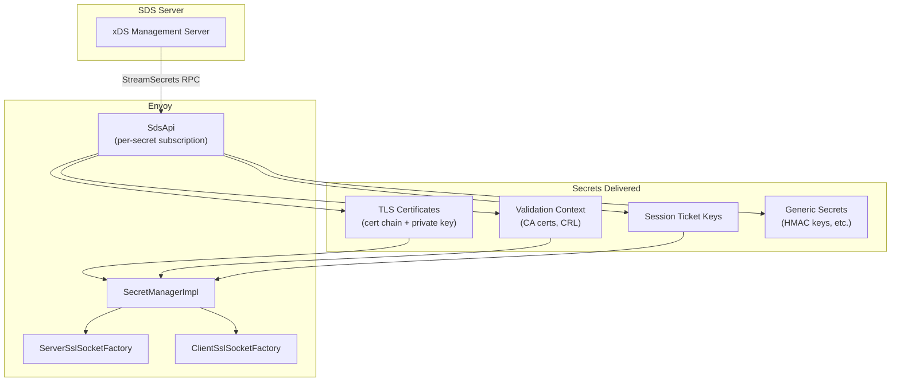

### SDS Class Hierarchy

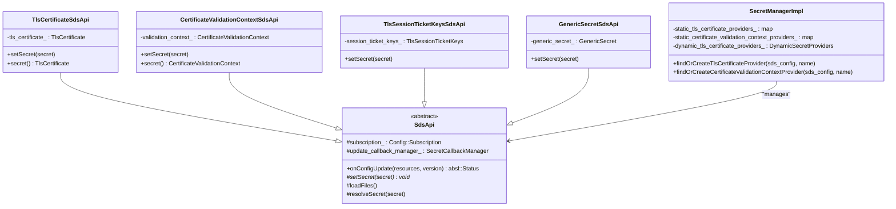

### SDS Update Flow

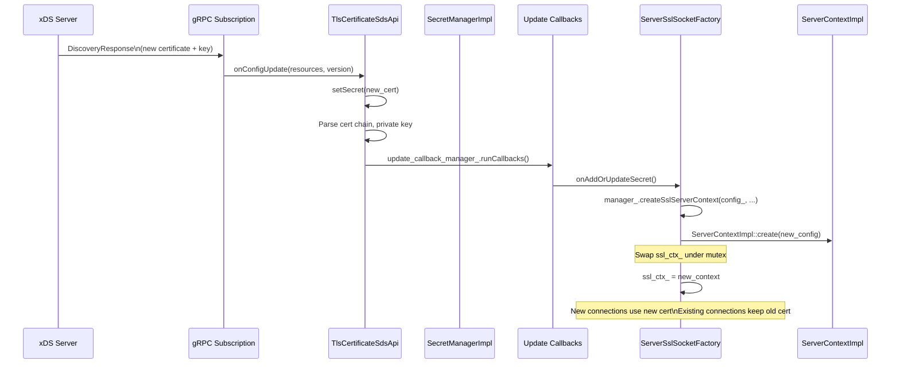

## Certificate Rotation

### SDS-Based Rotation

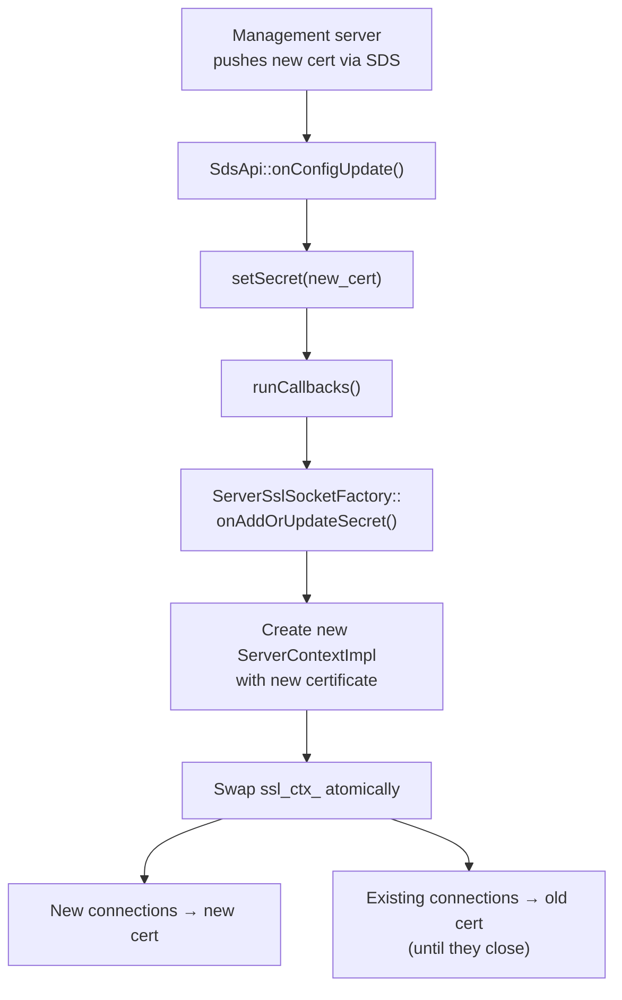

### File-Based Rotation (Watched Directory)

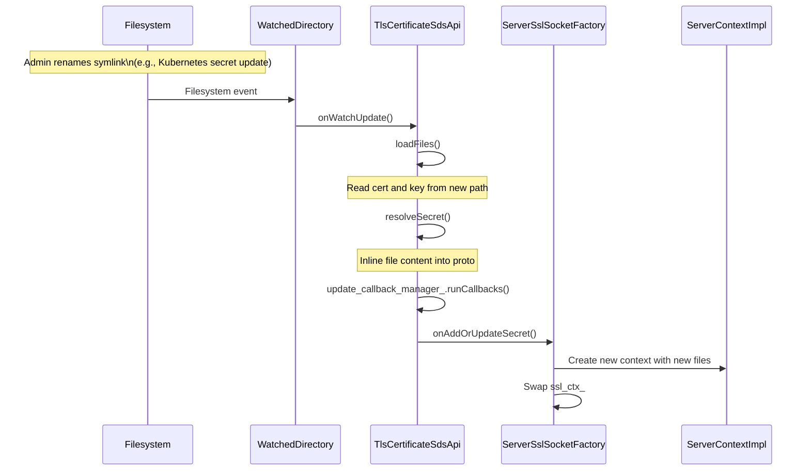

### Rotation Guarantees

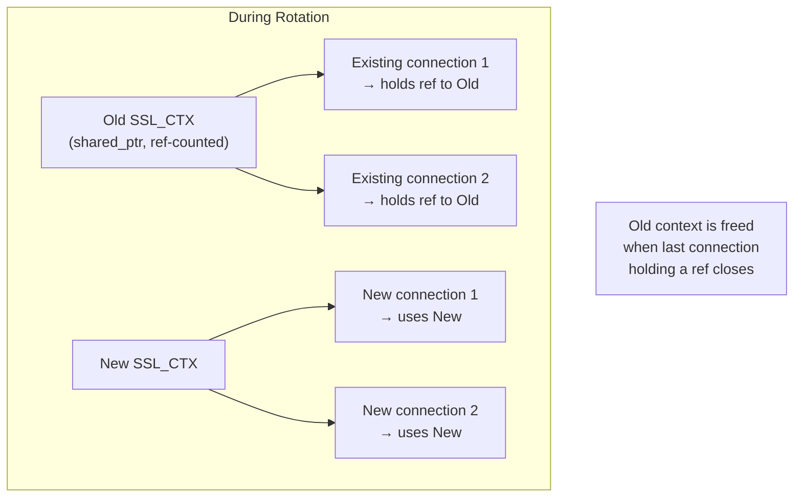

## OCSP Stapling

### What OCSP Stapling Does

OCSP (Online Certificate Status Protocol) stapling allows the server to include a pre-fetched OCSP response in the TLS handshake, proving the certificate hasn't been revoked without the client needing to contact the OCSP responder.

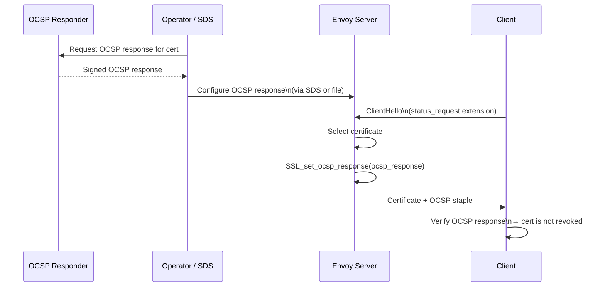

### OCSP Staple Policy

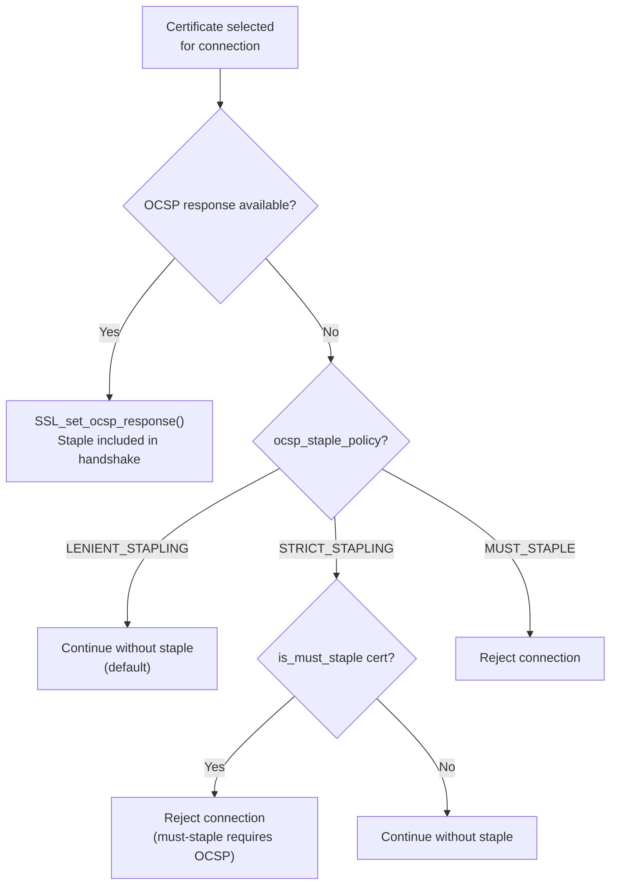

### OCSP Response Parsing

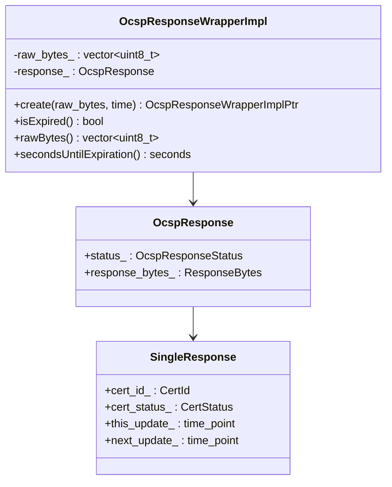

## Session Resumption

### Server-Side: Session Tickets (Stateless)

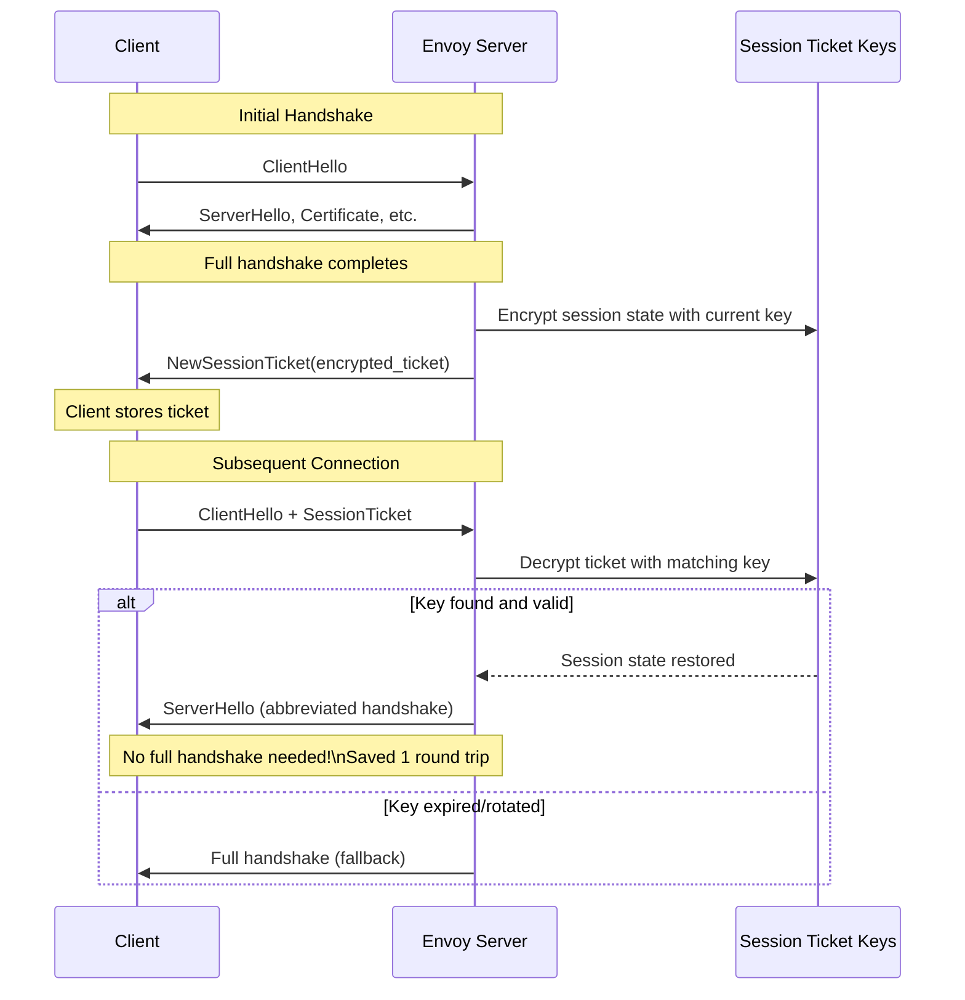

### Session Ticket Key Rotation

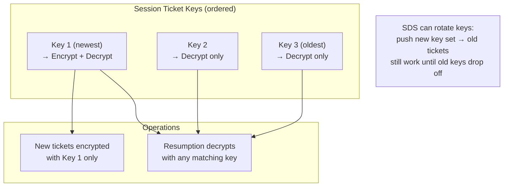

```
File: source/common/tls/server_context_impl.cc

sessionTicketProcess(ssl, key_name, iv, ctx, hmac, encrypt):
    if encrypt:
        Use first (newest) key to encrypt
        Set key_name = first_key.name
    else:
        Find key by key_name in session_ticket_keys_
        if found:
            Decrypt with that key
        else:
            Return 0 (ticket invalid, full handshake)
```

### Client-Side: Session Caching

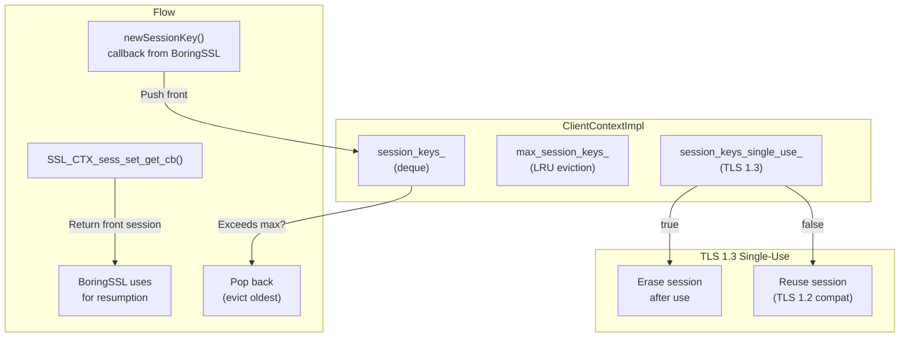

### Server-Side: Session ID Cache (Stateful)

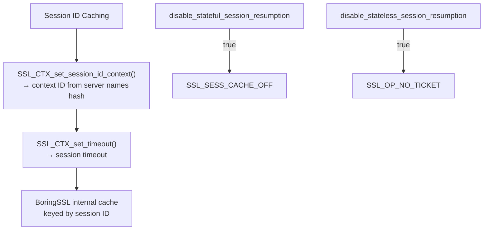

## Complete TLS Lifecycle

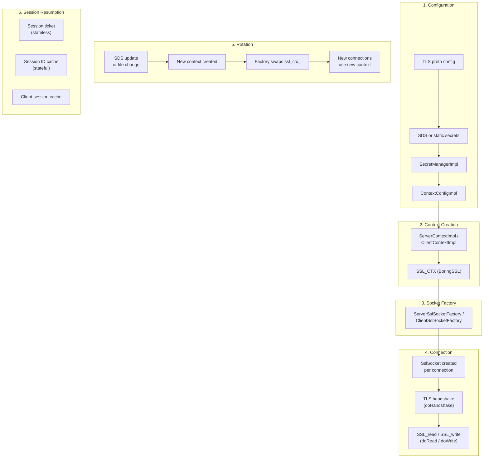

## TLS Stats

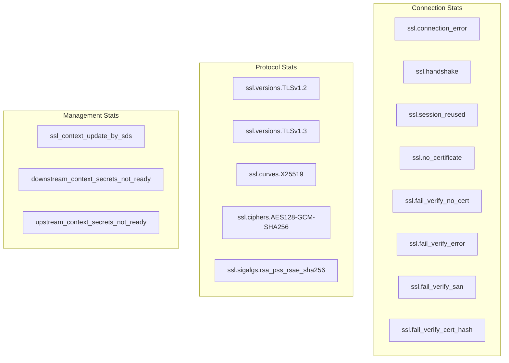

## Key Source Files

| File | Key Classes | Purpose |
|------|-------------|---------|
| `source/common/secret/sds_api.h/cc` | `SdsApi`, `TlsCertificateSdsApi` | SDS subscription and secret management |
| `source/common/secret/secret_manager_impl.h` | `SecretManagerImpl` | Central secret registry |
| `source/common/secret/secret_provider_impl.h/cc` | Secret providers | Static and dynamic providers |
| `source/common/tls/server_ssl_socket.h/cc` | `ServerSslSocketFactory` | Factory with rotation support |
| `source/common/tls/client_ssl_socket.h/cc` | `ClientSslSocketFactory` | Factory with rotation support |
| `source/common/tls/ocsp/ocsp.h/cc` | `OcspResponseWrapperImpl` | OCSP response parsing |
| `source/common/tls/server_context_impl.h/cc` | Session tickets, OCSP stapling | Server-specific TLS features |
| `source/common/tls/client_context_impl.h/cc` | Session cache | Client session resumption |
| `source/common/tls/context_impl.h/cc` | `ContextImpl`, `TlsContext` | Base TLS context |

---

**Previous:** [Part 2 — Handshake, mTLS, and Certificate Validation](02-handshake-mtls-validation.md)  
**Back to:** [Part 1 — TLS Architecture & Contexts](01-architecture-contexts.md)
