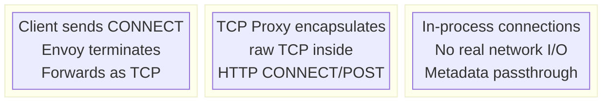
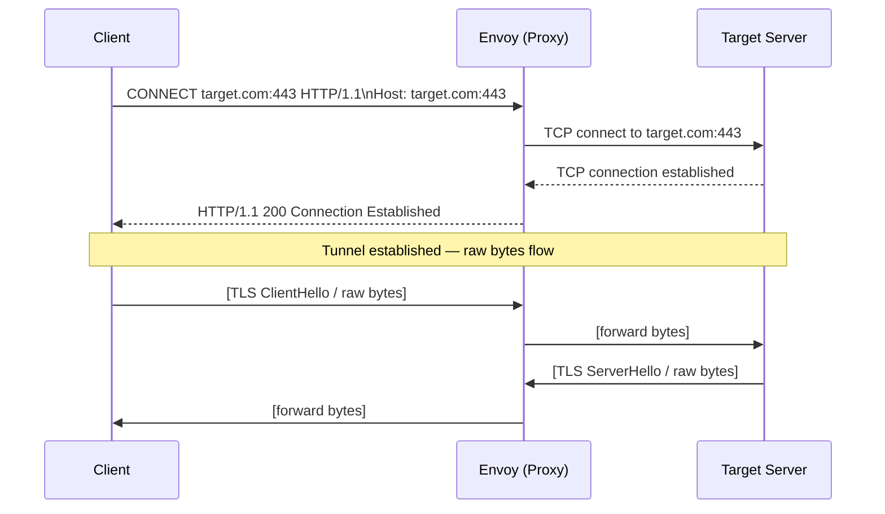
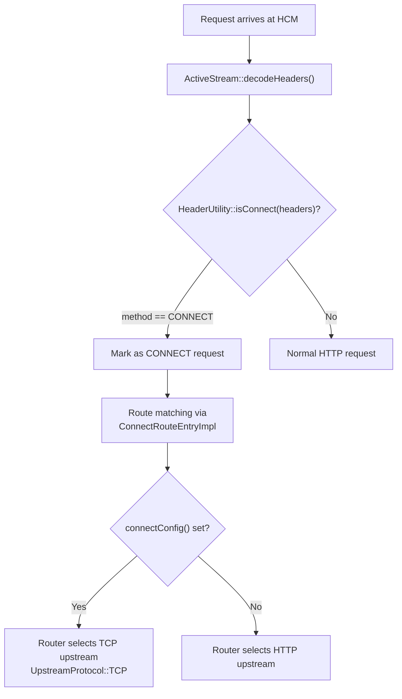
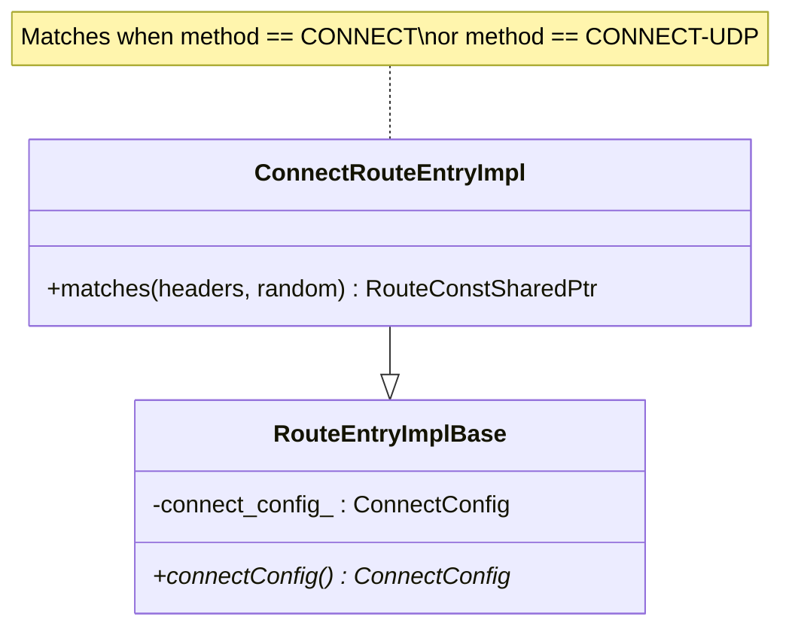
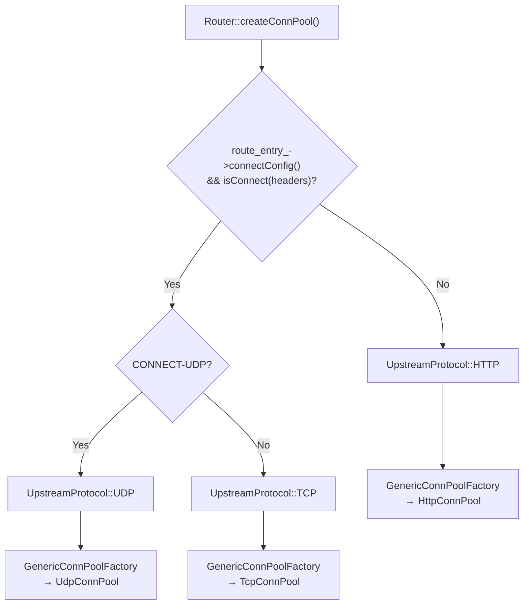
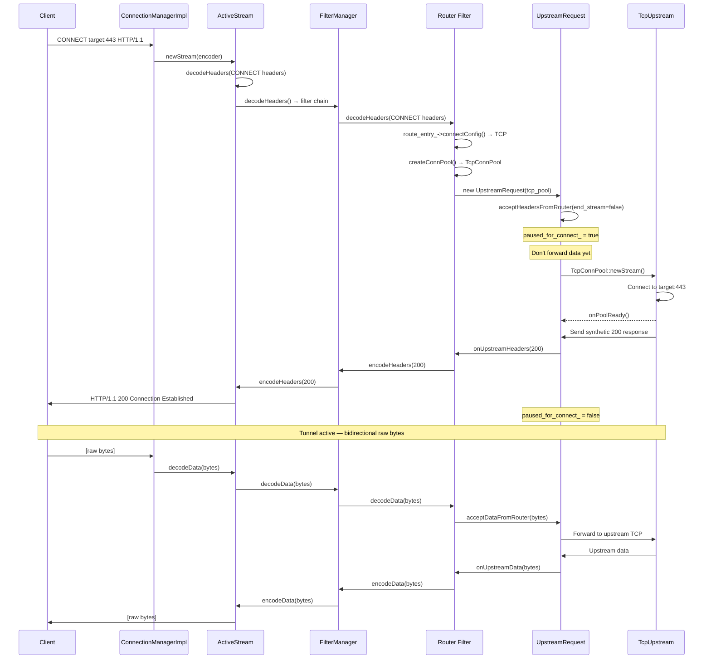
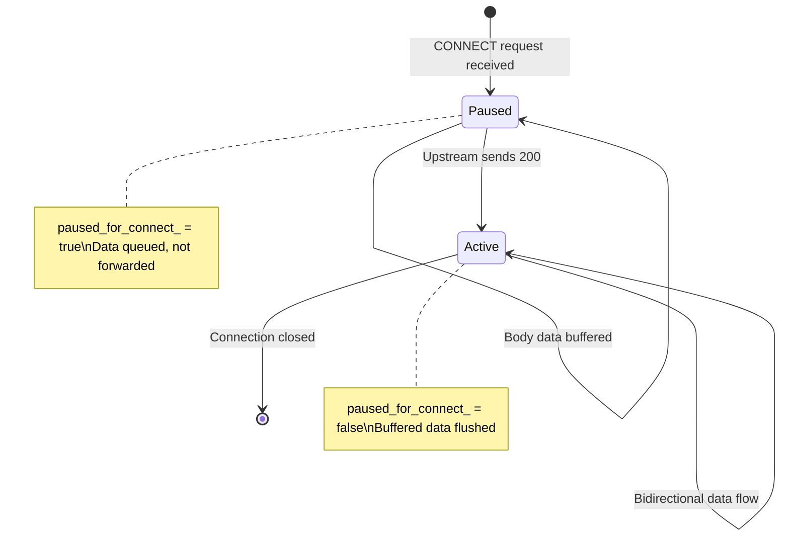
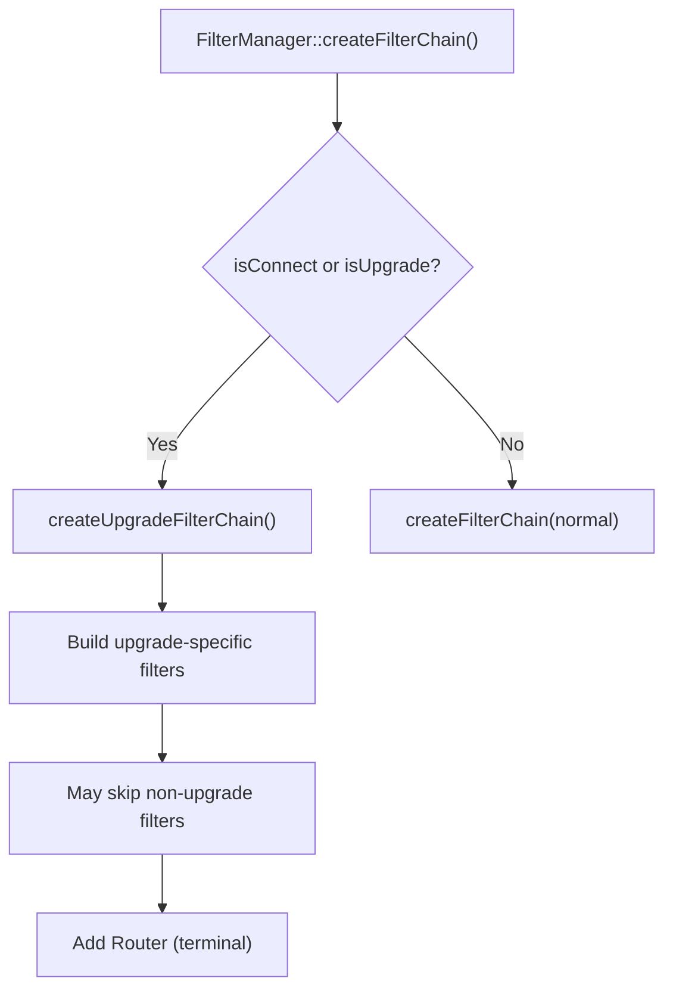

# Part 1: Reverse Tunneling — Overview & HTTP CONNECT

## Introduction

Envoy supports several tunneling mechanisms that allow TCP, UDP, and HTTP traffic to be encapsulated inside HTTP connections. This enables traversal through HTTP proxies, internal mesh routing without real network I/O, and protocol bridging. This document covers the foundational HTTP CONNECT mechanism.

## Tunneling Modes Overview

```mermaid
graph TB
    subgraph "Mode 1: Downstream CONNECT"
        C1["Client"] -->|"CONNECT host:port"| E1["Envoy HCM"]
        E1 -->|"Raw TCP"| U1["Upstream TCP"]
    end
    
    subgraph "Mode 2: Upstream TCP Tunneling"
        C2["Client"] -->|"Raw TCP"| E2["Envoy TCP Proxy"]
        E2 -->|"CONNECT host:port\nover HTTP/2"| P2["HTTP Proxy"]
        P2 -->|"Raw TCP"| U2["Upstream"]
    end
    
    subgraph "Mode 3: Internal Listener"
        C3["Downstream\nConnection"] -->|"envoy_internal address"| IL["Internal Listener\n(in-process)"]
        IL -->|"Metadata\npassthrough"| E3["Second filter chain"]
    end
```





## HTTP CONNECT — How It Works

### The CONNECT Method

HTTP CONNECT creates a tunnel through an HTTP proxy. The client sends a CONNECT request with the target host:port, and the proxy establishes a TCP connection to that target. After a `200` response, raw bytes flow bidirectionally.



### CONNECT Detection in Envoy



### CONNECT Route Matching



### Router CONNECT Pool Selection



## CONNECT Request Flow — Detailed



### Pause-for-CONNECT Mechanism

The Router doesn't forward request body until the upstream responds with `200`:



```
File: source/common/router/upstream_request.cc (lines 350-357)

acceptHeadersFromRouter():
    if isConnect(headers):
        paused_for_connect_ = true
        // Don't send body yet

File: source/common/router/upstream_codec_filter.cc (lines 143-146)

CodecBridge::decodeHeaders(response_headers):
    if is 2xx response:
        Unpause → forward buffered body data
```

## Upgrade Filter Chain for CONNECT

CONNECT is treated as an upgrade type. The HCM creates a special filter chain:



## Key Source Files

| File | Key Classes/Functions | Purpose |
|------|----------------------|---------|
| `source/common/http/header_utility.cc:178` | `isConnect()` | CONNECT detection |
| `source/common/router/config_impl.cc:1177` | `ConnectRouteEntryImpl` | CONNECT route matching |
| `source/common/router/router.cc:752-786` | `createConnPool()` | TCP vs HTTP pool selection |
| `source/common/router/upstream_request.cc:350` | `paused_for_connect_` | Pause body until 200 |
| `source/common/router/upstream_codec_filter.cc:143` | `decodeHeaders()` | Unpause on 2xx |
| `source/extensions/upstreams/http/tcp/` | `TcpUpstream`, `TcpConnPool` | TCP upstream for CONNECT |
| `source/common/http/filter_manager.cc:1448` | `createUpgradeFilterChain()` | CONNECT filter chain |

---

**Next:** [Part 2 — TCP-over-HTTP Tunneling](02-tcp-over-http-tunneling.md)
