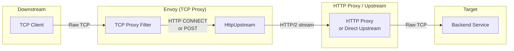
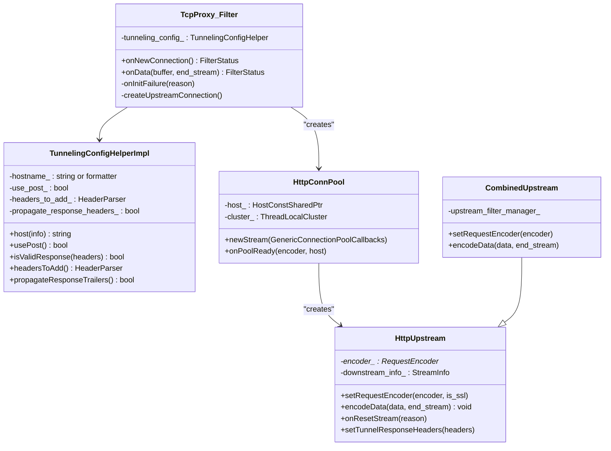
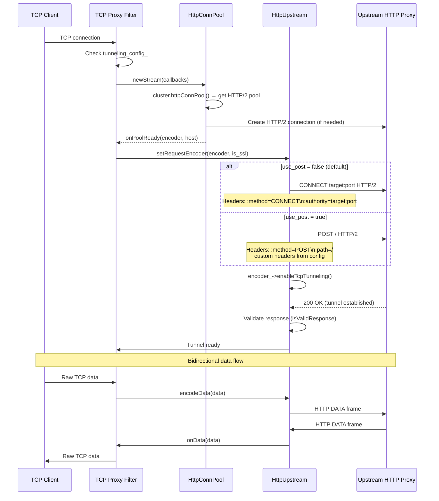
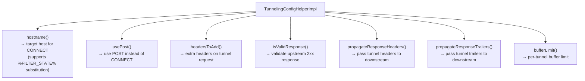
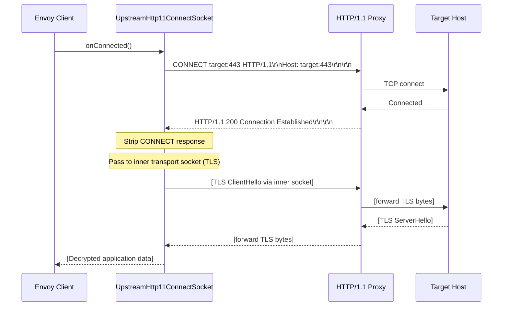
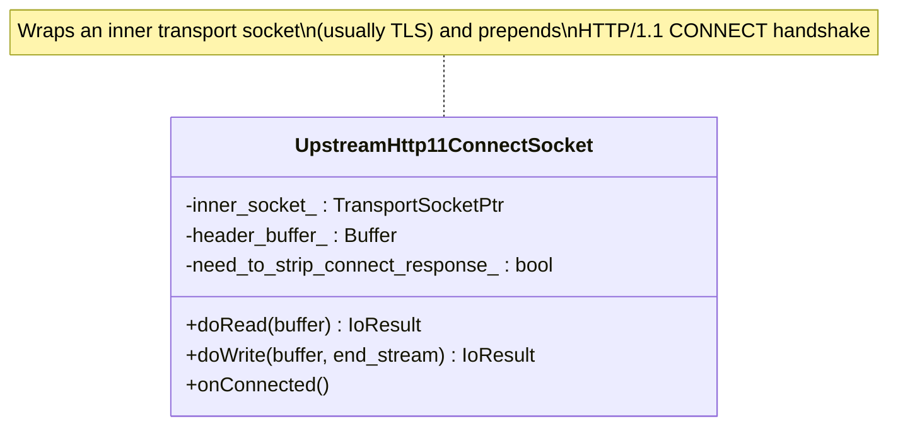
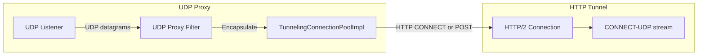
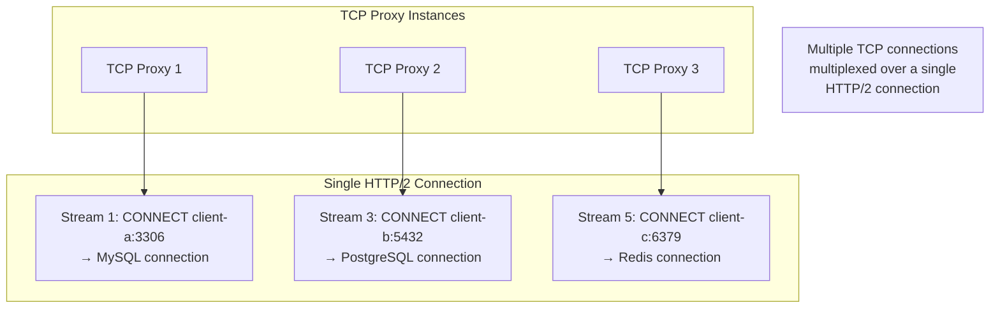

# Part 2: TCP-over-HTTP Tunneling

## Overview

TCP-over-HTTP tunneling allows Envoy to encapsulate raw TCP connections inside HTTP streams. This is primarily used when Envoy's TCP proxy needs to reach an upstream through an HTTP proxy, or when services need to tunnel arbitrary protocols over HTTP/2 multiplexed connections for efficiency.

## Architecture

## TCP Proxy Tunneling Classes

## TCP Proxy → HTTP CONNECT Tunnel Flow

## Tunneling Configuration

## HTTP/1.1 Proxy CONNECT (Transport Socket Level)

For connecting through an HTTP/1.1 forward proxy, Envoy uses a transport socket wrapper:

## UDP-over-HTTP Tunneling

Envoy also supports tunneling UDP traffic over HTTP:

## Multiplexing TCP Tunnels over HTTP/2

A key advantage of TCP-over-HTTP tunneling is multiplexing:

## Key Source Files

| File | Key Classes | Purpose |
|------|-------------|---------|
| `source/common/tcp_proxy/tcp_proxy.h` | `TunnelingConfigHelperImpl` | Tunneling config |
| `source/common/tcp_proxy/tcp_proxy.cc:724-760` | TCP proxy tunneling | Tunnel setup |
| `source/common/tcp_proxy/upstream.cc` | `HttpUpstream`, `HttpConnPool`, `CombinedUpstream` | HTTP tunnel upstream |
| `source/extensions/upstreams/http/tcp/upstream_request.cc` | `TcpUpstream`, `TcpConnPool` | TCP upstream for CONNECT |
| `source/extensions/transport_sockets/http_11_proxy/connect.cc` | `UpstreamHttp11ConnectSocket` | HTTP/1.1 proxy CONNECT |
| `source/extensions/filters/udp/udp_proxy/udp_proxy_filter.cc` | `TunnelingConnectionPoolImpl` | UDP tunneling |

---

**Previous:** [Part 1 — Overview & HTTP CONNECT](01-overview-http-connect.md)  
**Next:** [Part 3 — Internal Listeners & Reverse Connections](03-internal-listeners.md)
