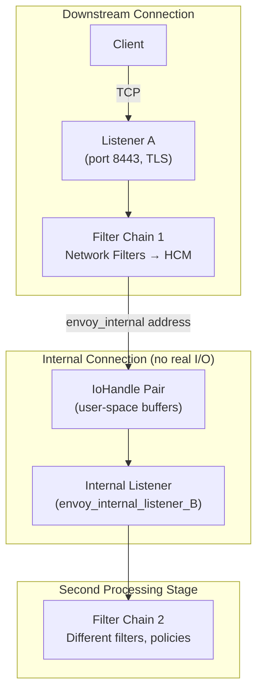
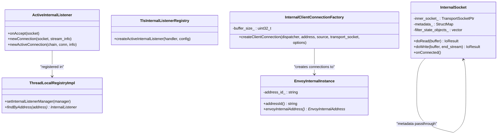
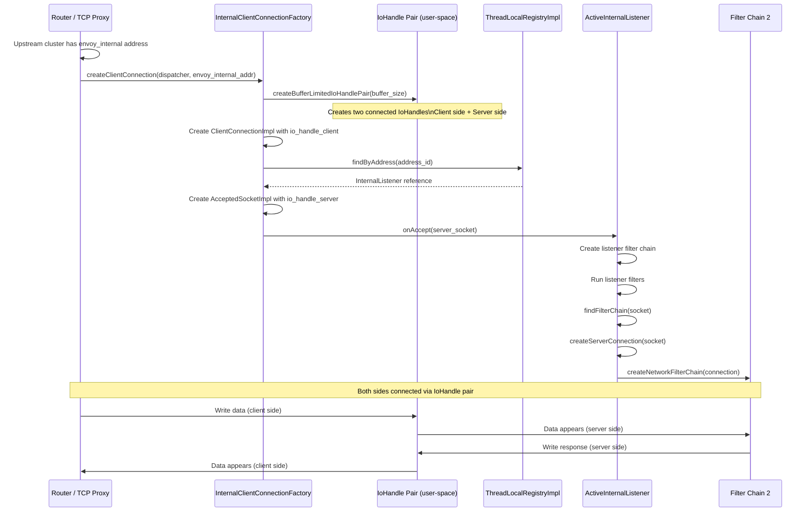
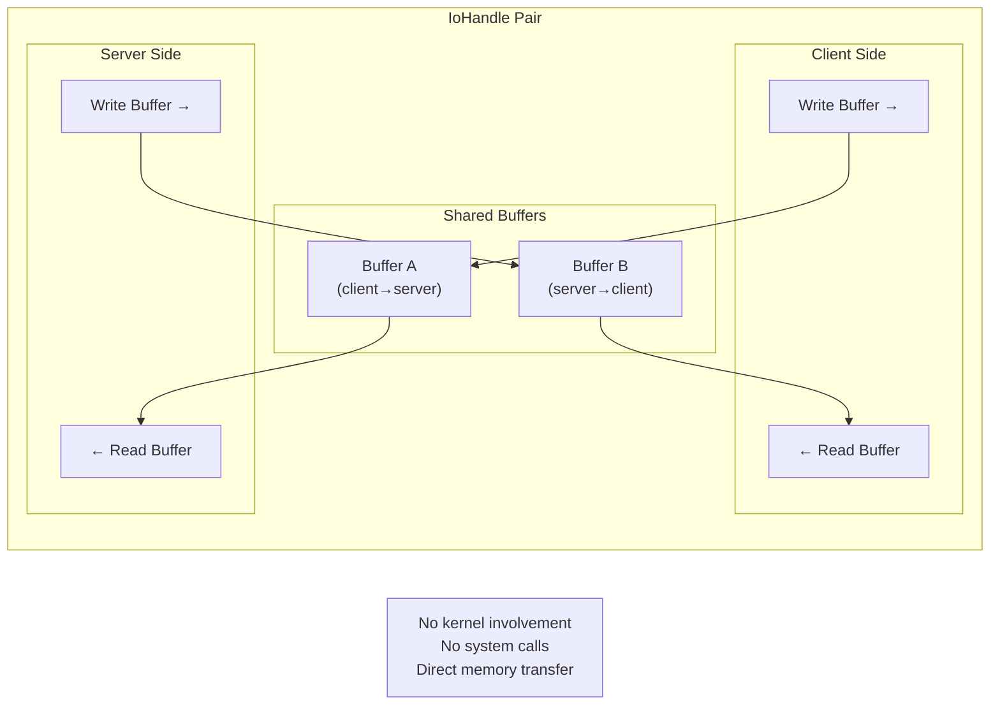
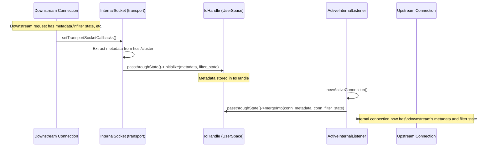
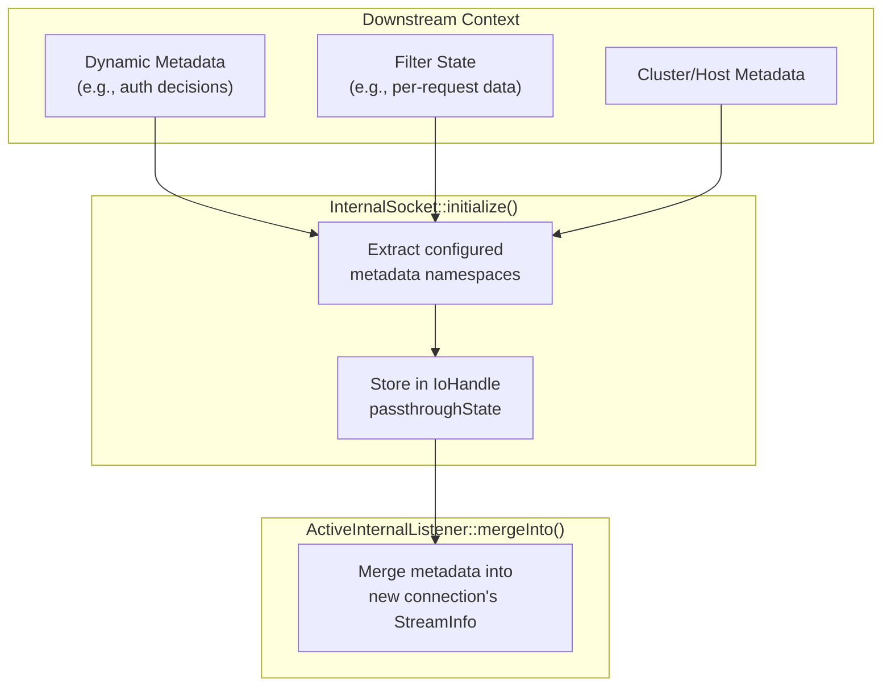
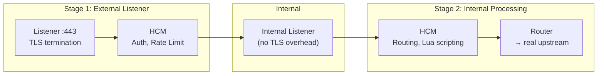
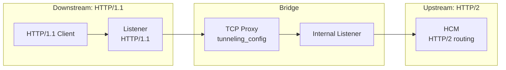
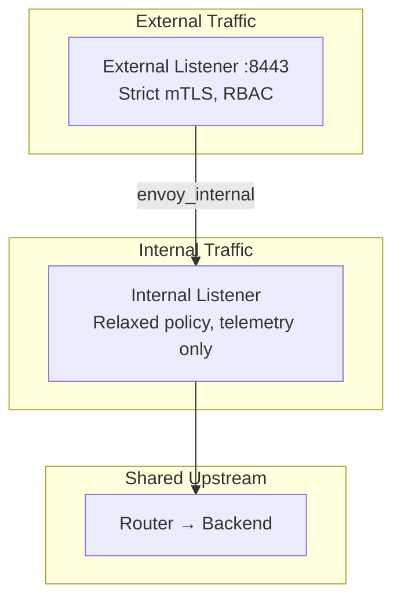
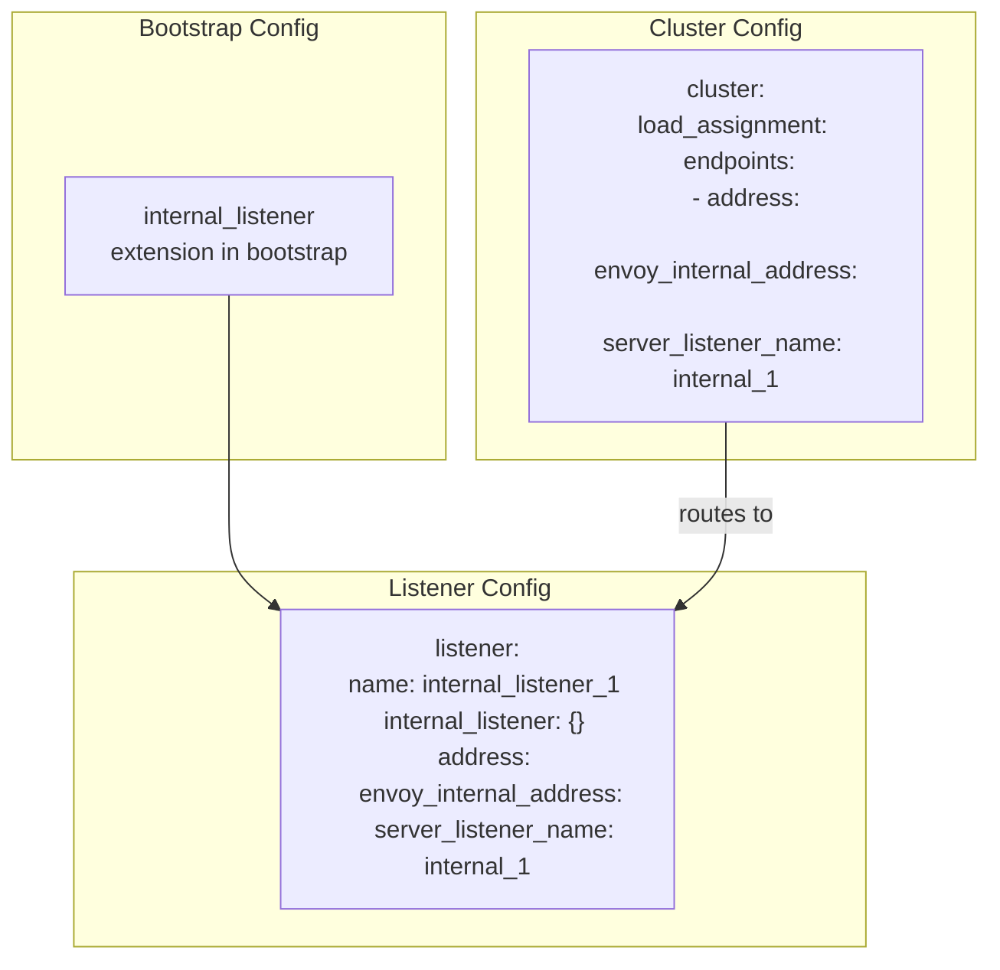

# Part 3: Internal Listeners & Reverse Connections

## Overview

Internal listeners enable **in-process connections** within a single Envoy instance. Instead of using real OS sockets and network I/O, internal listeners use user-space `IoHandle` pairs to pass data between two filter chains. This is the foundation for advanced features like chaining listeners, applying different filter policies, and passing metadata between processing stages.

## Architecture

## Key Classes

## Connection Flow — Step by Step

## IoHandle Pair — User-Space I/O

The IoHandle pair is created by `IoHandleFactory::createBufferLimitedIoHandlePair()`. Each side reads from one buffer and writes to the other, with configurable buffer limits for flow control.

## Internal Upstream Transport Socket

The `internal_upstream` transport socket passes metadata and filter state from the downstream connection to the internal listener:

### What Gets Passed Through

## Use Cases

### 1. Multi-Stage Processing

### 2. Protocol Bridging

### 3. Policy Separation

## Configuration Example

## Key Source Files

| File | Key Classes | Purpose |
|------|-------------|---------|
| `source/extensions/bootstrap/internal_listener/internal_listener_registry.cc` | `TlsInternalListenerRegistry`, `InternalListenerExtension` | Bootstrap extension |
| `source/extensions/bootstrap/internal_listener/thread_local_registry.cc` | `ThreadLocalRegistryImpl` | Per-worker listener registry |
| `source/extensions/bootstrap/internal_listener/active_internal_listener.cc` | `ActiveInternalListener` | Internal listener accepting connections |
| `source/extensions/bootstrap/internal_listener/client_connection_factory.cc` | `InternalClientConnectionFactory` | Creates internal connections |
| `source/extensions/transport_sockets/internal_upstream/internal_upstream.cc` | `InternalSocket`, `InternalSocketFactory` | Metadata passthrough transport socket |
| `source/extensions/io_socket/user_space/io_handle_impl.h` | User-space `IoHandle` | Buffer-based I/O handle pair |
| `source/common/network/address_impl.h:417` | `EnvoyInternalInstance` | Internal address type |
| `source/common/listener_manager/connection_handler_impl.cc:242` | `findByAddress()` | Internal listener lookup |

---

**Previous:** [Part 2 — TCP-over-HTTP Tunneling](02-tcp-over-http-tunneling.md)  
**Back to:** [Part 1 — Overview](01-overview-http-connect.md)
