# Network Filter Interfaces Documentation

## Overview

The `envoy/network/filter.h` file defines the **core filter interfaces** for Envoy's network layer. These interfaces enable pluggable processing of network connections at various stages - from initial connection acceptance through data transmission and connection closure.

This file is foundational to Envoy's extensibility, allowing developers to create custom filters for protocol processing, security, observability, and traffic manipulation.

---

## Table of Contents

1. [Architecture Overview](#architecture-overview)
2. [Filter Types](#filter-types)
3. [Filter Status Codes](#filter-status-codes)
4. [Network Filters](#network-filters)
5. [Listener Filters](#listener-filters)
6. [UDP Filters](#udp-filters)
7. [Filter Chains](#filter-chains)
8. [Usage Patterns](#usage-patterns)

---

## Architecture Overview

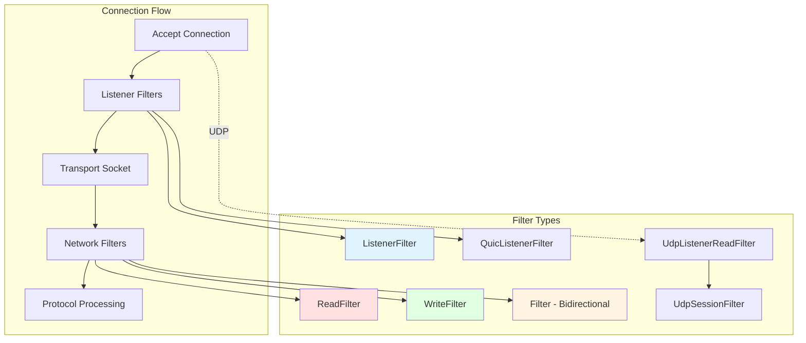

---

## Filter Types

Envoy supports multiple filter types for different protocols and processing stages:

```mermaid
classDiagram
    class FilterStatus {
        <<enumeration>>
        Continue
        StopIteration
    }

    class NetworkFilterCallbacks {
        +connection() Connection
        +socket() ConnectionSocket
    }

    class ReadFilter {
        +onData(Buffer, end_stream) FilterStatus
        +onNewConnection() FilterStatus
        +initializeReadFilterCallbacks(callbacks)
    }

    class WriteFilter {
        +onWrite(Buffer, end_stream) FilterStatus
        +initializeWriteFilterCallbacks(callbacks)
    }

    class Filter {
        <<bidirectional>>
    }

    class ListenerFilter {
        +onAccept(callbacks) FilterStatus
        +onData(buffer) FilterStatus
        +maxReadBytes() size_t
    }

    class QuicListenerFilter {
        +onAccept(callbacks) FilterStatus
        +onPeerAddressChanged(address) FilterStatus
        +onFirstPacketReceived(packet) FilterStatus
    }

    class UdpListenerReadFilter {
        +onData(UdpRecvData) FilterStatus
        +onReceiveError(error_code) FilterStatus
    }

    class UdpSessionFilter {
        +onNewSession() Status
        +onData(UdpRecvData) Status
        +onWrite(UdpRecvData) Status
    }

    NetworkFilterCallbacks <|-- ReadFilterCallbacks
    NetworkFilterCallbacks <|-- WriteFilterCallbacks
    ReadFilter ..|> Filter
    WriteFilter ..|> Filter

    style ReadFilter fill:#ffe1e1
    style WriteFilter fill:#e1ffe1
    style Filter fill:#fff4e1
```

---

## Filter Status Codes

Filters return status codes to control filter chain iteration:

```cpp
enum class FilterStatus {
    Continue,      // Continue to next filter
    StopIteration  // Stop processing further filters
};
```

### Status Code Flow

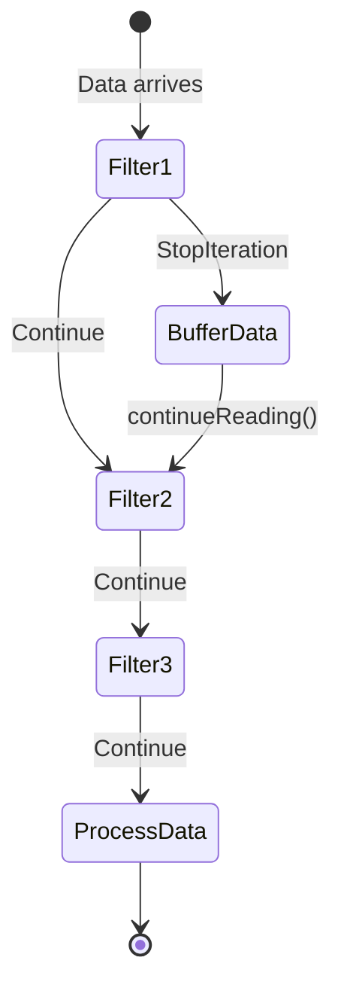

**Use Cases:**
- **Continue** - Normal processing, pass data to next filter
- **StopIteration** - Buffer data, perform async operations, or reject connection

---

## Network Filters

Network filters process data on established TCP connections. They operate on the connection's read and write paths.

### Read Filter Interface

**Purpose:** Process incoming data from downstream connections.

```cpp
class ReadFilter {
  public:
    // Called when new connection is established
    virtual FilterStatus onNewConnection() PURE;

    // Called when data is received
    virtual FilterStatus onData(Buffer::Instance& data, bool end_stream) PURE;

    // Initialize callbacks to filter manager
    virtual void initializeReadFilterCallbacks(ReadFilterCallbacks& callbacks) PURE;
};
```

**Lifecycle:**

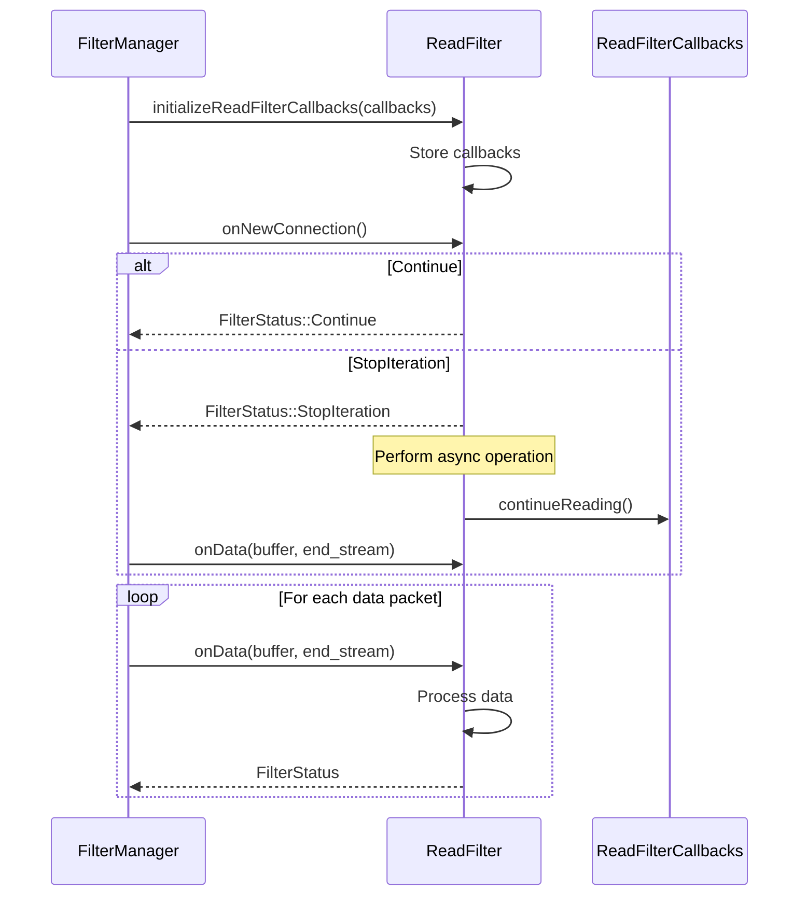

**Key Callbacks:**

```cpp
class ReadFilterCallbacks {
    // Continue filter chain after stopping
    virtual void continueReading() PURE;

    // Inject custom data to next filters
    virtual void injectReadDataToFilterChain(Buffer::Instance& data,
                                             bool end_stream) PURE;

    // Get/Set upstream host
    virtual Upstream::HostDescriptionConstSharedPtr upstreamHost() PURE;
    virtual void upstreamHost(Upstream::HostDescriptionConstSharedPtr) PURE;

    // Start TLS on upstream
    virtual bool startUpstreamSecureTransport() PURE;

    // Control connection close timing
    virtual void disableClose(bool disable) PURE;
};
```

### Write Filter Interface

**Purpose:** Process outgoing data to downstream connections.

```cpp
class WriteFilter {
  public:
    // Called when data is to be written
    virtual FilterStatus onWrite(Buffer::Instance& data, bool end_stream) PURE;

    // Initialize callbacks to filter manager
    virtual void initializeWriteFilterCallbacks(WriteFilterCallbacks&) {}
};
```

**Key Callbacks:**

```cpp
class WriteFilterCallbacks {
    // Inject custom data to next filters
    virtual void injectWriteDataToFilterChain(Buffer::Instance& data,
                                              bool end_stream) PURE;

    // Control connection close timing
    virtual void disableClose(bool disabled) PURE;
};
```

### Bidirectional Filter

For filters that need to process both read and write:

```cpp
class Filter : public WriteFilter, public ReadFilter {};
```

### Data Flow Through Network Filters

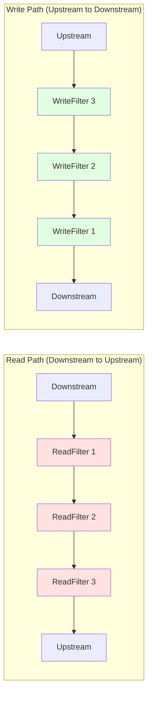

**Note:** Read filters execute in **FIFO** order, write filters in **LIFO** order.

---

## Listener Filters

Listener filters process connections **before** they're fully established. They operate on raw socket data before the network filter chain.

### TCP Listener Filter

```cpp
class ListenerFilter {
  public:
    // Called when connection is accepted
    virtual FilterStatus onAccept(ListenerFilterCallbacks& cb) PURE;

    // Called when data is available
    virtual FilterStatus onData(Network::ListenerFilterBuffer& buffer) PURE;

    // Called when connection closes (if filter stopped iteration)
    virtual void onClose() {};

    // How much data the filter needs to inspect
    virtual size_t maxReadBytes() const PURE;
};
```

**Use Cases:**
- **Protocol detection** (TLS, HTTP, custom protocols)
- **Early connection rejection** (IP filtering, rate limiting)
- **Connection metadata extraction** (SNI, ALPN)

### Listener Filter Lifecycle

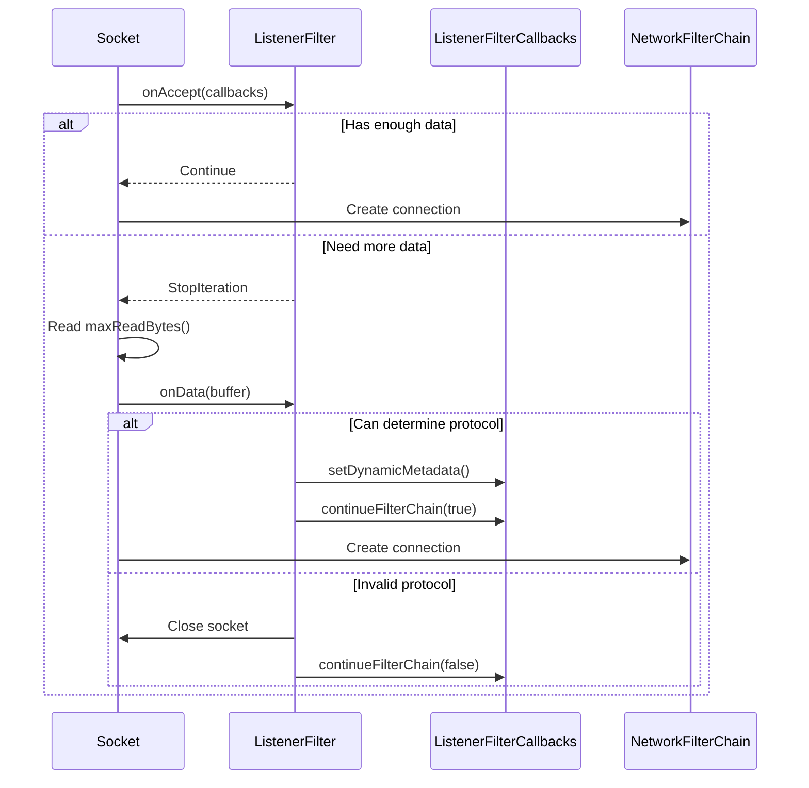

**Key Callbacks:**

```cpp
class ListenerFilterCallbacks {
    // Access the socket
    virtual ConnectionSocket& socket() PURE;

    // Set metadata for network filters
    virtual void setDynamicMetadata(const std::string& name,
                                   const Protobuf::Struct& value) PURE;

    // Continue or abort filter chain
    virtual void continueFilterChain(bool success) PURE;

    // Access stream info and filter state
    virtual StreamInfo::StreamInfo& streamInfo() PURE;
    virtual StreamInfo::FilterState& filterState() PURE;

    // Control original destination usage
    virtual void useOriginalDst(bool use_original_dst) PURE;
};
```

### QUIC Listener Filter

Specialized listener filter for QUIC connections:

```cpp
class QuicListenerFilter {
  public:
    // Called on connection acceptance
    virtual FilterStatus onAccept(ListenerFilterCallbacks& cb) PURE;

    // Check preferred address compatibility
    virtual bool isCompatibleWithServerPreferredAddress(
        const quiche::QuicheSocketAddress& server_preferred_address) const PURE;

    // Handle connection migration
    virtual FilterStatus onPeerAddressChanged(
        const quiche::QuicheSocketAddress& new_address,
        Connection& connection) PURE;

    // Process first packet
    virtual FilterStatus onFirstPacketReceived(
        const quic::QuicReceivedPacket&) PURE;
};
```

**QUIC-Specific Features:**
- Server preferred address negotiation
- Connection migration handling
- First packet inspection

---

## UDP Filters

UDP filters handle connectionless datagram processing.

### UDP Listener Read Filter

Processes datagrams at the listener level (before session creation):

```cpp
class UdpListenerReadFilter {
  public:
    // Process incoming datagram
    virtual FilterStatus onData(UdpRecvData& data) PURE;

    // Handle receive errors
    virtual FilterStatus onReceiveError(Api::IoError::IoErrorCode error_code) PURE;

  protected:
    UdpListenerReadFilter(UdpReadFilterCallbacks& callbacks);
    UdpReadFilterCallbacks* read_callbacks_;
};
```

### UDP Session Filters

For stateful UDP processing (e.g., QUIC, custom protocols):

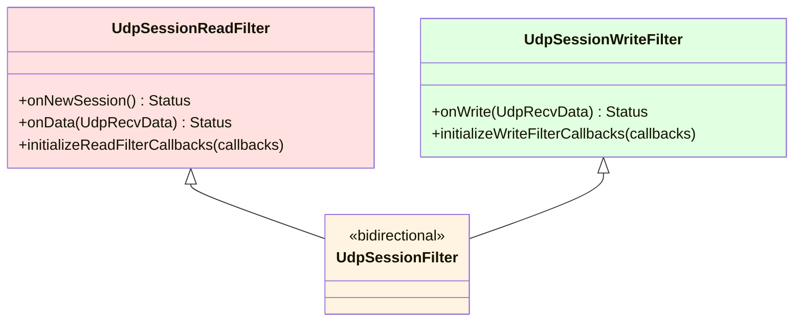

**Session Filter Interface:**

```cpp
class UdpSessionReadFilter {
  public:
    // Called when UDP session is first established
    virtual UdpSessionReadFilterStatus onNewSession() PURE;

    // Process datagram for this session
    virtual UdpSessionReadFilterStatus onData(Network::UdpRecvData& data) PURE;

    virtual void initializeReadFilterCallbacks(
        UdpSessionReadFilterCallbacks& callbacks) PURE;
};

class UdpSessionWriteFilter {
  public:
    // Process outgoing datagram
    virtual UdpSessionWriteFilterStatus onWrite(Network::UdpRecvData& data) PURE;

    virtual void initializeWriteFilterCallbacks(
        UdpSessionWriteFilterCallbacks& callbacks) PURE;
};
```

**Session Callbacks:**

```cpp
class UdpSessionFilterCallbacks {
    // Session identifier
    virtual uint64_t sessionId() const PURE;

    // Stream info for logging
    virtual StreamInfo::StreamInfo& streamInfo() PURE;

    // Inject datagram to filter chain
    virtual void injectDatagramToFilterChain(Network::UdpRecvData& data) PURE;
};
```

### UDP Filter Flow

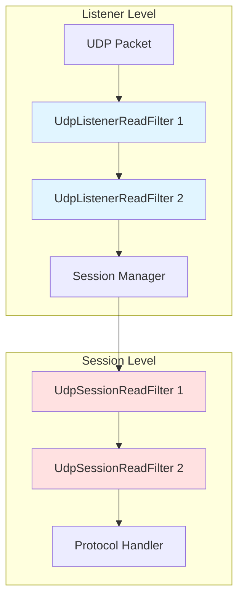

---

## Filter Chains

### Filter Chain Components

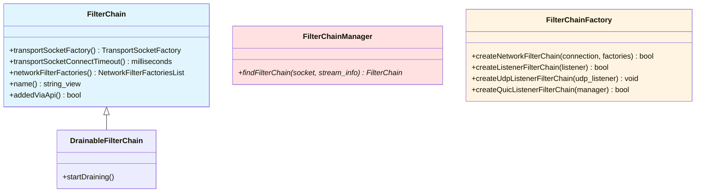

### Filter Chain Selection

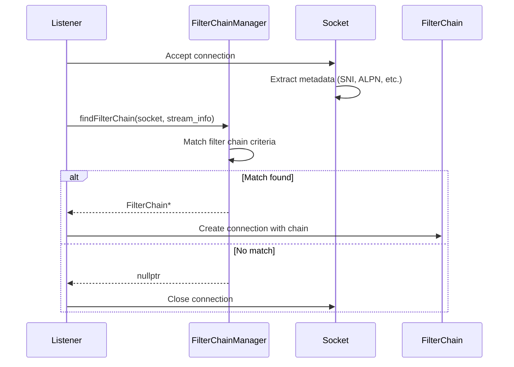

**Filter Chain Matching Criteria:**
- Destination IP/port
- Source IP/port
- SNI (Server Name Indication)
- ALPN (Application-Layer Protocol Negotiation)
- Transport protocol
- Custom metadata

### Filter Factories and Configuration

```cpp
// Factory callback to create filter instances
using FilterFactoryCb = std::function<void(FilterManager& filter_manager)>;

// Example: Creating a read filter
FilterFactoryCb createFilter = [](FilterManager& manager) {
    manager.addReadFilter(std::make_shared<MyReadFilter>());
};
```

**Filter Configuration Provider:**

```cpp
template <class FactoryCb>
using FilterConfigProvider =
    Envoy::Config::ExtensionConfigProvider<FactoryCb>;

using NetworkFilterFactoriesList =
    std::vector<FilterConfigProviderPtr<FilterFactoryCb>>;
```

This allows dynamic filter configuration updates without connection disruption.

---

## Usage Patterns

### Pattern 1: Protocol Detection (Listener Filter)

```cpp
class TlsInspector : public ListenerFilter {
    FilterStatus onAccept(ListenerFilterCallbacks& cb) override {
        // Need TLS handshake data
        return FilterStatus::StopIteration;
    }

    FilterStatus onData(ListenerFilterBuffer& buffer) override {
        if (buffer.rawSlice().len_ < 5) {
            return FilterStatus::StopIteration; // Need more data
        }

        // Parse TLS ClientHello
        std::string sni = extractSNI(buffer);
        std::string alpn = extractALPN(buffer);

        // Set metadata for filter chain selection
        cb.setDynamicMetadata("envoy.tls_inspector",
            createMetadata(sni, alpn));

        cb.continueFilterChain(true);
        return FilterStatus::Continue;
    }

    size_t maxReadBytes() const override { return 1024; }
};
```

### Pattern 2: Rate Limiting (Read Filter)

```cpp
class RateLimitFilter : public ReadFilter {
    FilterStatus onNewConnection() override {
        if (!rateLimiter_->allowConnection()) {
            // Reject connection
            callbacks_->connection().close(
                ConnectionCloseType::NoFlush);
            return FilterStatus::StopIteration;
        }
        return FilterStatus::Continue;
    }

    FilterStatus onData(Buffer::Instance& data, bool end_stream) override {
        if (!rateLimiter_->allowData(data.length())) {
            // Buffer data until quota available
            buffered_.move(data);
            return FilterStatus::StopIteration;
        }
        return FilterStatus::Continue;
    }

    void onQuotaAvailable() {
        // Resume processing
        callbacks_->injectReadDataToFilterChain(buffered_, false);
    }

    void initializeReadFilterCallbacks(
        ReadFilterCallbacks& callbacks) override {
        callbacks_ = &callbacks;
    }

private:
    ReadFilterCallbacks* callbacks_;
    Buffer::OwnedImpl buffered_;
    RateLimiterPtr rateLimiter_;
};
```

### Pattern 3: Async Operation (Read Filter)

```cpp
class AuthFilter : public ReadFilter {
    FilterStatus onNewConnection() override {
        // Start async auth check
        authClient_->verify(
            callbacks_->connection().remoteAddress(),
            [this](bool authorized) {
                if (authorized) {
                    callbacks_->continueReading();
                } else {
                    callbacks_->connection().close(
                        ConnectionCloseType::NoFlush);
                }
            });

        // Stop iteration until auth completes
        return FilterStatus::StopIteration;
    }

    FilterStatus onData(Buffer::Instance& data, bool end_stream) override {
        // Only called after continueReading()
        return FilterStatus::Continue;
    }

    void initializeReadFilterCallbacks(
        ReadFilterCallbacks& callbacks) override {
        callbacks_ = &callbacks;
    }

private:
    ReadFilterCallbacks* callbacks_;
    AuthClientPtr authClient_;
};
```

### Pattern 4: Protocol Transcoding (Bidirectional Filter)

```cpp
class ProtocolTranscoder : public Filter {
    // Read path: Transcode incoming protocol A to B
    FilterStatus onNewConnection() override {
        return FilterStatus::Continue;
    }

    FilterStatus onData(Buffer::Instance& data, bool end_stream) override {
        Buffer::OwnedImpl transcoded;
        transcodeAtoB(data, transcoded);

        // Replace data with transcoded version
        data.drain(data.length());
        data.move(transcoded);

        return FilterStatus::Continue;
    }

    // Write path: Transcode outgoing protocol B to A
    FilterStatus onWrite(Buffer::Instance& data, bool end_stream) override {
        Buffer::OwnedImpl transcoded;
        transcodeBtoA(data, transcoded);

        data.drain(data.length());
        data.move(transcoded);

        return FilterStatus::Continue;
    }

    void initializeReadFilterCallbacks(
        ReadFilterCallbacks& callbacks) override {
        read_callbacks_ = &callbacks;
    }

    void initializeWriteFilterCallbacks(
        WriteFilterCallbacks& callbacks) override {
        write_callbacks_ = &callbacks;
    }

private:
    ReadFilterCallbacks* read_callbacks_;
    WriteFilterCallbacks* write_callbacks_;
};
```

### Pattern 5: UDP Session Management

```cpp
class QuicSessionFilter : public UdpSessionFilter {
    UdpSessionReadFilterStatus onNewSession() override {
        // Initialize QUIC connection
        quicConn_ = createQuicConnection(
            read_callbacks_->sessionId());
        return UdpSessionReadFilterStatus::Continue;
    }

    UdpSessionReadFilterStatus onData(UdpRecvData& data) override {
        // Process QUIC packet
        quicConn_->processPacket(data);

        if (quicConn_->needsToSend()) {
            // Generate response
            auto response = quicConn_->generatePacket();
            write_callbacks_->injectDatagramToFilterChain(response);
        }

        return UdpSessionReadFilterStatus::Continue;
    }

    UdpSessionWriteFilterStatus onWrite(UdpRecvData& data) override {
        // Optionally modify outgoing packet
        return UdpSessionWriteFilterStatus::Continue;
    }

    void initializeReadFilterCallbacks(
        UdpSessionReadFilterCallbacks& callbacks) override {
        read_callbacks_ = &callbacks;
    }

    void initializeWriteFilterCallbacks(
        UdpSessionWriteFilterCallbacks& callbacks) override {
        write_callbacks_ = &callbacks;
    }

private:
    UdpSessionReadFilterCallbacks* read_callbacks_;
    UdpSessionWriteFilterCallbacks* write_callbacks_;
    QuicConnectionPtr quicConn_;
};
```

---

## Advanced Features

### Graceful Connection Closure Control

Filters can delay connection closure to complete operations:

```cpp
class GracefulCloseFilter : public ReadFilter {
    FilterStatus onData(Buffer::Instance& data, bool end_stream) override {
        if (end_stream && hasPendingWork()) {
            // Delay close until work completes
            callbacks_->disableClose(true);

            completePendingWork([this]() {
                // Re-enable close
                callbacks_->disableClose(false);
            });

            return FilterStatus::StopIteration;
        }
        return FilterStatus::Continue;
    }
};
```

### Direct Data Injection

Bypass normal buffering and inject data directly:

```cpp
void onAsyncDataArrived() {
    Buffer::OwnedImpl data = fetchFromCache();

    // Inject directly to next filter, bypassing connection buffer
    read_callbacks_->injectReadDataToFilterChain(data, false);
}
```

### Upstream Transport Switching

Switch from plain to TLS mid-connection (e.g., STARTTLS):

```cpp
FilterStatus onData(Buffer::Instance& data, bool end_stream) override {
    if (detectStartTlsCommand(data)) {
        // Switch upstream to secure transport
        if (read_callbacks_->startUpstreamSecureTransport()) {
            // Success - connection now encrypted
            return FilterStatus::Continue;
        }
    }
    return FilterStatus::Continue;
}
```

---

## Filter Manager Internals

### FilterManager Interface

```cpp
class FilterManager {
    // Add filters (LIFO for write, FIFO for read)
    virtual void addWriteFilter(WriteFilterSharedPtr filter) PURE;
    virtual void addFilter(FilterSharedPtr filter) PURE;
    virtual void addReadFilter(ReadFilterSharedPtr filter) PURE;

    // Remove filters
    virtual void removeReadFilter(ReadFilterSharedPtr filter) PURE;

    // Initialize filter chain
    virtual bool initializeReadFilters() PURE;

    // Add access logging
    virtual void addAccessLogHandler(
        AccessLog::InstanceSharedPtr handler) PURE;
};
```

### Filter Execution Order

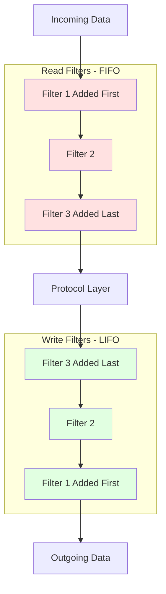

---

## Best Practices

### 1. Initialization

✅ **DO:** Perform lightweight setup in `initializeCallbacks()`
```cpp
void initializeReadFilterCallbacks(ReadFilterCallbacks& cb) override {
    callbacks_ = &cb;
    // Light initialization only
}
```

❌ **DON'T:** Perform I/O or complex operations in `initializeCallbacks()`
```cpp
void initializeReadFilterCallbacks(ReadFilterCallbacks& cb) override {
    callbacks_ = &cb;
    // WRONG: Heavy operation blocks connection setup
    loadLargeConfigFile();
    makeNetworkRequest();
}
```

✅ **DO:** Heavy operations in `onNewConnection()`
```cpp
FilterStatus onNewConnection() override {
    // OK: Can perform async operations here
    authClient_->authenticate(...);
    return FilterStatus::StopIteration;
}
```

### 2. Buffer Management

✅ **DO:** Move buffers when possible
```cpp
FilterStatus onData(Buffer::Instance& data, bool end_stream) override {
    buffered_.move(data); // Efficient
    return FilterStatus::StopIteration;
}
```

❌ **DON'T:** Copy unnecessarily
```cpp
FilterStatus onData(Buffer::Instance& data, bool end_stream) override {
    buffered_.add(data); // Copies data
    return FilterStatus::StopIteration;
}
```

### 3. Error Handling

✅ **DO:** Close connection gracefully on errors
```cpp
FilterStatus onData(Buffer::Instance& data, bool end_stream) override {
    if (!validateData(data)) {
        callbacks_->connection().close(ConnectionCloseType::FlushWrite);
        return FilterStatus::StopIteration;
    }
    return FilterStatus::Continue;
}
```

### 4. Metadata Usage

✅ **DO:** Use metadata for filter communication
```cpp
// Listener filter sets metadata
void onData(ListenerFilterBuffer& buffer) override {
    auto sni = extractSNI(buffer);
    cb.setDynamicMetadata("envoy.tls", {"sni": sni});
}

// Network filter reads metadata
void onNewConnection() override {
    auto& metadata = callbacks_->streamInfo().dynamicMetadata();
    auto sni = metadata.filter_metadata().at("envoy.tls")
                       .fields().at("sni").string_value();
}
```

### 5. State Management

✅ **DO:** Store state in filter state
```cpp
class MyFilter : public ReadFilter {
    FilterStatus onNewConnection() override {
        auto state = std::make_unique<MyState>();
        callbacks_->streamInfo().filterState()->setData(
            "my_filter_state",
            std::move(state),
            StreamInfo::FilterState::StateType::ReadOnly);
        return FilterStatus::Continue;
    }
};
```

---

## Common Pitfalls

### Pitfall 1: Forgetting to Continue

❌ **WRONG:**
```cpp
FilterStatus onData(Buffer::Instance& data, bool end_stream) override {
    asyncOperation([](Result result) {
        // Filter chain never continues!
    });
    return FilterStatus::StopIteration;
}
```

✅ **CORRECT:**
```cpp
FilterStatus onData(Buffer::Instance& data, bool end_stream) override {
    asyncOperation([this](Result result) {
        callbacks_->continueReading(); // Resume processing
    });
    return FilterStatus::StopIteration;
}
```

### Pitfall 2: Using Callbacks After StopIteration

❌ **WRONG:**
```cpp
FilterStatus onData(Buffer::Instance& data, bool end_stream) override {
    // Process data...
    callbacks_->continueReading(); // Continue early
    // DON'T modify data after continuing!
    data.add("extra");
    return FilterStatus::Continue;
}
```

### Pitfall 3: Lifetime Issues

❌ **WRONG:**
```cpp
void initializeReadFilterCallbacks(ReadFilterCallbacks& cb) override {
    // Storing reference - DANGEROUS if filter manager changes
    callbacks_ref_ = cb;
}
```

✅ **CORRECT:**
```cpp
void initializeReadFilterCallbacks(ReadFilterCallbacks& cb) override {
    // Store pointer - safe
    callbacks_ = &cb;
}
```

---

## Testing Filters

### Mock Objects

Envoy provides mock implementations for testing:

```cpp
#include "test/mocks/network/mocks.h"

TEST(MyFilterTest, TestOnData) {
    NiceMock<Network::MockReadFilterCallbacks> callbacks;
    MyFilter filter;
    filter.initializeReadFilterCallbacks(callbacks);

    Buffer::OwnedImpl data("test");
    EXPECT_EQ(FilterStatus::Continue,
              filter.onData(data, false));
}
```

### Integration Tests

```cpp
class MyFilterIntegrationTest : public BaseIntegrationTest {
    void SetUp() override {
        config_helper_.addFilter(R"EOF(
            name: my_filter
            typed_config:
                "@type": type.googleapis.com/my.filter.Config
        )EOF");
        BaseIntegrationTest::initialize();
    }
};

TEST_F(MyFilterIntegrationTest, TestEndToEnd) {
    IntegrationTcpClientPtr client = makeTcpConnection();
    client->write("test");
    client->waitForData("response");
}
```

---

## Performance Considerations

### Memory

- **Avoid copies** - Use `move()` for buffers
- **Pool allocations** - Reuse filter instances if possible
- **Limit buffering** - Only buffer what's necessary

### CPU

- **Minimize per-packet work** - Cache parsed data
- **Use efficient data structures** - Avoid linear searches
- **Batch operations** - Process multiple packets together when possible

### Latency

- **Avoid blocking** - Use async operations
- **Return Continue quickly** - Don't stall filter chain
- **Optimize hot paths** - Profile and optimize common cases

---

## Summary

The `filter.h` interfaces provide:

1. **Network Filters** - Process connection data (TCP)
2. **Listener Filters** - Pre-connection processing
3. **UDP Filters** - Datagram processing (connectionless and session-based)
4. **Filter Chains** - Composable processing pipelines
5. **Flexible Control** - Stop/continue iteration, inject data, control timing

These interfaces enable:
- Protocol detection and routing
- Security enforcement (auth, rate limiting)
- Observability (metrics, tracing)
- Traffic manipulation (transcoding, transformation)
- Custom protocol implementation

---

## Related Documentation

- [Network Connection Architecture](./CONNECTION.md)
- [Filter Configuration](../../source/extensions/filters/network/README.md)
- [HTTP Filter Interfaces](../http/filter.h)
- [Extension Development Guide](../../source/extensions/README.md)

---

*Last Updated: 2026-03-21*
