# Network Listener Interfaces Documentation

## Overview

The `envoy/network/listener.h` file defines the **core listener interfaces** for Envoy's network layer. Listeners are the entry points for accepting incoming network connections (TCP, UDP, QUIC, internal). This file provides the abstractions for:

- Socket management and lifecycle
- Connection acceptance and rejection
- UDP packet handling and routing
- Listener configuration and metadata
- Worker thread coordination

---

## Table of Contents

1. [Architecture Overview](#architecture-overview)
2. [Core Concepts](#core-concepts)
3. [Listener Types](#listener-types)
4. [Socket Management](#socket-management)
5. [Configuration Interfaces](#configuration-interfaces)
6. [Callback Interfaces](#callback-interfaces)
7. [UDP-Specific Components](#udp-specific-components)
8. [Lifecycle and State Management](#lifecycle-and-state-management)

---

## Architecture Overview

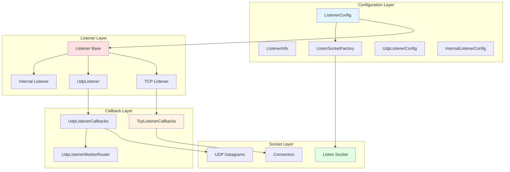

---

## Core Concepts

### What is a Listener?

A **Listener** in Envoy is an abstraction that:
1. **Binds** to a network address (IP:port)
2. **Accepts** incoming connections or packets
3. **Routes** traffic to appropriate filter chains
4. **Manages** connection lifecycle and flow control

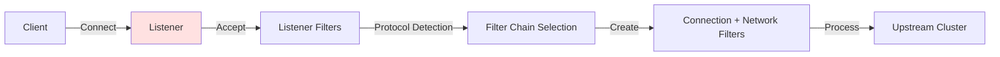

### Listener Responsibilities

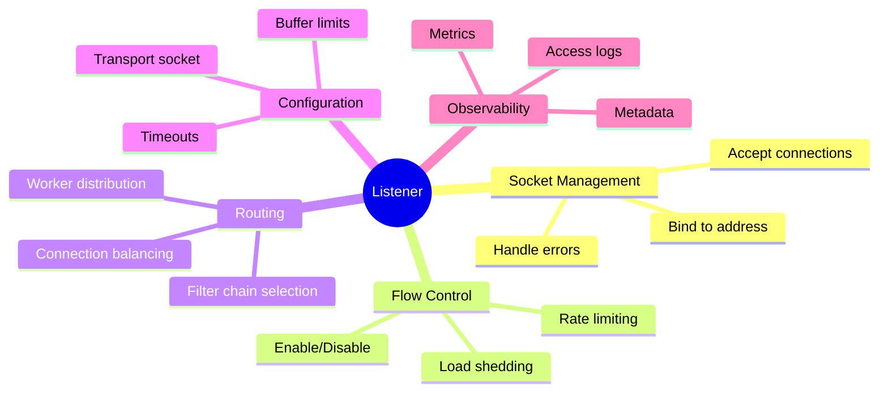

---

## Listener Types

### 1. TCP Listener (Default)

**Purpose:** Accept TCP connections and create full-duplex streams.

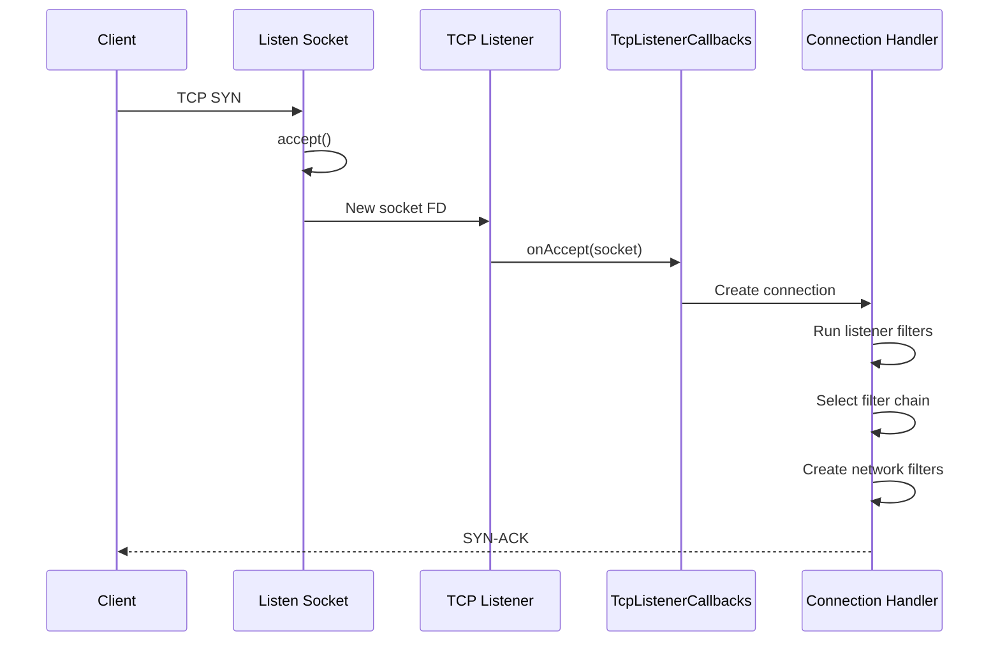

**Key Features:**
- Full connection state management
- Bidirectional data streams
- Filter chain per connection
- Connection-level access logging

### 2. UDP Listener

**Purpose:** Handle connectionless UDP datagrams.

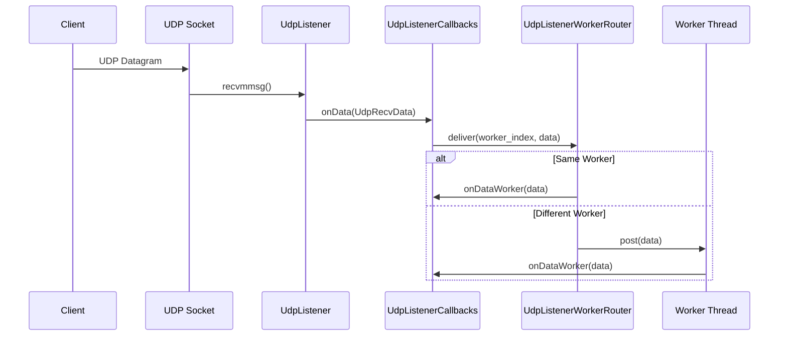

**Key Features:**
- Connectionless processing
- Multi-worker packet routing
- Session-based filtering (optional)
- Batch packet processing (recvmmsg)

### 3. Internal Listener

**Purpose:** Accept connections from within the same process (no actual sockets).

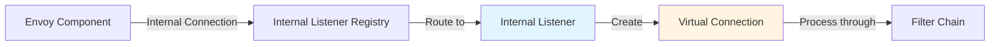

**Key Features:**
- No network I/O overhead
- Process-internal communication
- Same filter chain semantics
- Used for internal routing

### 4. QUIC Listener (UDP-based)

**Purpose:** Handle QUIC protocol (UDP with connection semantics).

**Key Features:**
- UDP transport with reliability
- Multiplexed streams
- Built-in encryption
- Connection migration support

---

## Socket Management

### ListenSocketFactory

**File:** Lines 42-84

**Purpose:** Creates and manages the actual OS-level listen sockets.

```cpp
class ListenSocketFactory {
  public:
    // Get socket for a specific worker
    virtual SocketSharedPtr getListenSocket(uint32_t worker_index) PURE;

    // Type of socket (Stream, Datagram, etc.)
    virtual Socket::Type socketType() const PURE;

    // Listening address
    virtual const Address::InstanceConstSharedPtr& localAddress() const PURE;

    // Clone for address sharing
    virtual ListenSocketFactoryPtr clone() const PURE;

    // Close all sockets (for draining)
    virtual void closeAllSockets() PURE;

    // Final initialization before workers use socket
    virtual absl::Status doFinalPreWorkerInit() PURE;
};
```

### Socket Creation and Distribution

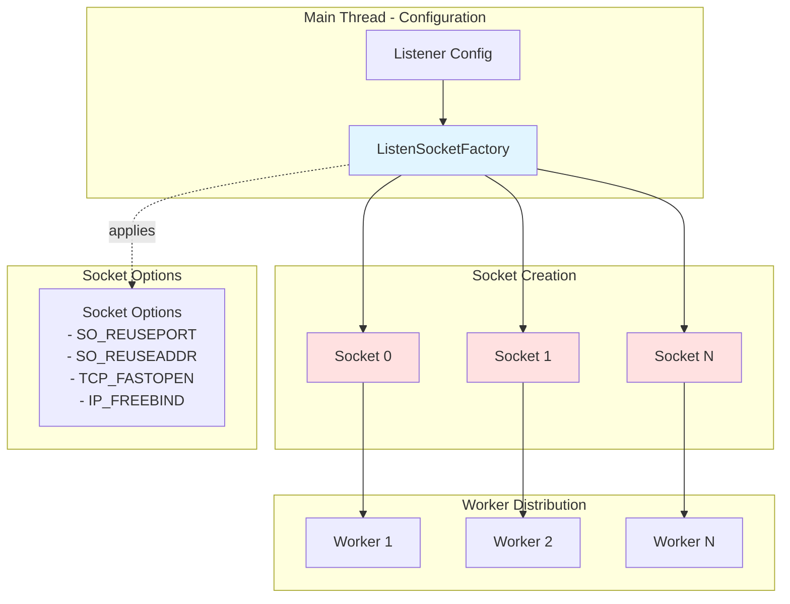

### Socket Sharing Strategies

**Strategy 1: Shared Socket (SO_REUSEPORT disabled)**
```
One socket FD, all workers accept() from same FD
├── Worker 1 ──┐
├── Worker 2 ──┤ accept() from shared FD
└── Worker N ──┘
```

**Strategy 2: Per-Worker Socket (SO_REUSEPORT enabled)**
```
Each worker has its own socket on same port
├── Worker 1 ── Socket FD 1 on port X
├── Worker 2 ── Socket FD 2 on port X
└── Worker N ── Socket FD N on port X
```

### Socket Lifecycle

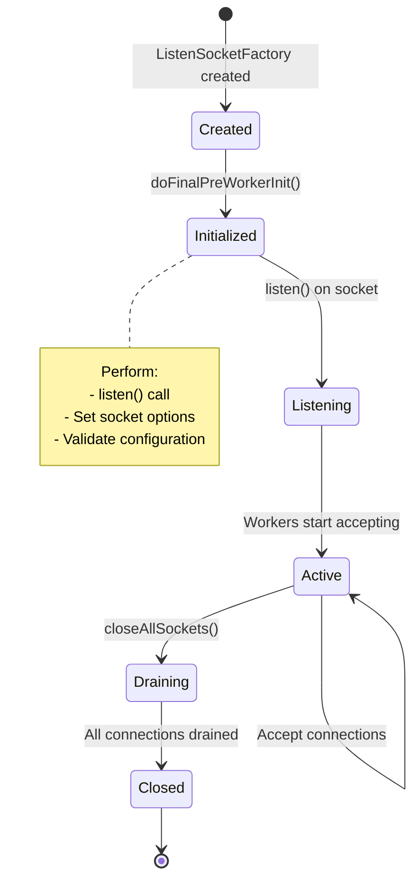

---

## Configuration Interfaces

### ListenerConfig

**File:** Lines 177-304

**Purpose:** Complete configuration for a single listener instance.

```cpp
class ListenerConfig {
  public:
    // Filter chain management
    virtual FilterChainManager& filterChainManager() PURE;
    virtual FilterChainFactory& filterChainFactory() PURE;

    // Socket management
    virtual std::vector<ListenSocketFactoryPtr>& listenSocketFactories() PURE;

    // Behavioral configuration
    virtual bool bindToPort() const PURE;
    virtual bool handOffRestoredDestinationConnections() const PURE;
    virtual uint32_t perConnectionBufferLimitBytes() const PURE;
    virtual std::chrono::milliseconds listenerFiltersTimeout() const PURE;
    virtual bool continueOnListenerFiltersTimeout() const PURE;

    // Identification
    virtual uint64_t listenerTag() const PURE;
    virtual const std::string& name() const PURE;
    virtual const ListenerInfoConstSharedPtr& listenerInfo() const PURE;

    // Protocol-specific
    virtual UdpListenerConfigOptRef udpListenerConfig() PURE;
    virtual InternalListenerConfigOptRef internalListenerConfig() PURE;

    // Resource management
    virtual ConnectionBalancer& connectionBalancer(const Address::Instance&) PURE;
    virtual ResourceLimit& openConnections() PURE;

    // Observability
    virtual Stats::Scope& listenerScope() PURE;
    virtual const AccessLog::InstanceSharedPtrVector& accessLogs() const PURE;

    // Tuning
    virtual uint32_t tcpBacklogSize() const PURE;
    virtual uint32_t maxConnectionsToAcceptPerSocketEvent() const PURE;

    // Overload management
    virtual bool ignoreGlobalConnLimit() const PURE;
    virtual bool shouldBypassOverloadManager() const PURE;
};
```

### Configuration Components

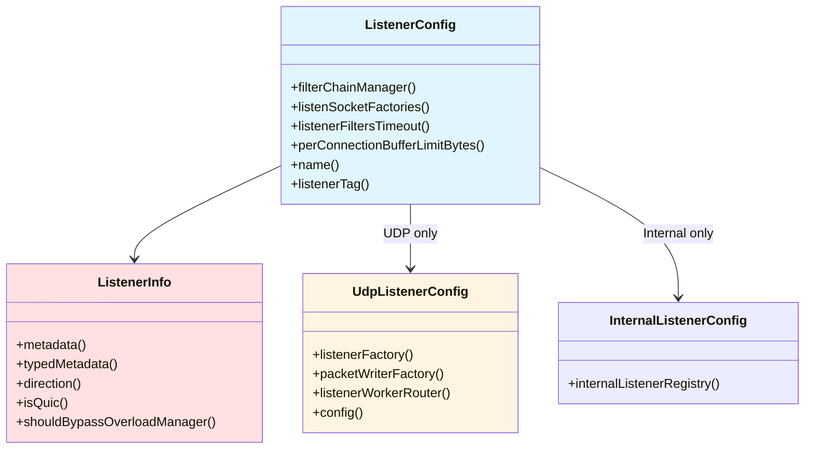

### ListenerInfo - Metadata and Properties

**File:** Lines 139-172

```cpp
class ListenerInfo {
  public:
    // Configuration metadata
    virtual const envoy::config::core::v3::Metadata& metadata() const PURE;
    virtual const Envoy::Config::TypedMetadata& typedMetadata() const PURE;

    // Traffic direction (INBOUND, OUTBOUND, UNSPECIFIED)
    virtual envoy::config::core::v3::TrafficDirection direction() const PURE;

    // Protocol type
    virtual bool isQuic() const PURE;

    // Overload behavior
    virtual bool shouldBypassOverloadManager() const PURE;
};
```

**Use Cases:**
- **Metadata:** Store custom attributes for routing/filtering
- **Direction:** Distinguish inbound vs outbound listeners
- **isQuic:** Enable QUIC-specific optimizations
- **shouldBypassOverloadManager:** Critical listeners that shouldn't be throttled

---

## Callback Interfaces

### TcpListenerCallbacks

**File:** Lines 309-334

**Purpose:** Handle events from TCP listener.

```cpp
class TcpListenerCallbacks {
  public:
    // New connection accepted
    virtual void onAccept(ConnectionSocketPtr&& socket) PURE;

    // Connection rejected
    enum class RejectCause {
        GlobalCxLimit,      // Global connection limit reached
        OverloadAction,     // Overload manager rejected
    };
    virtual void onReject(RejectCause cause) PURE;

    // Batch acceptance complete
    virtual void recordConnectionsAcceptedOnSocketEvent(
        uint32_t connections_accepted) PURE;
};
```

### TCP Accept Flow

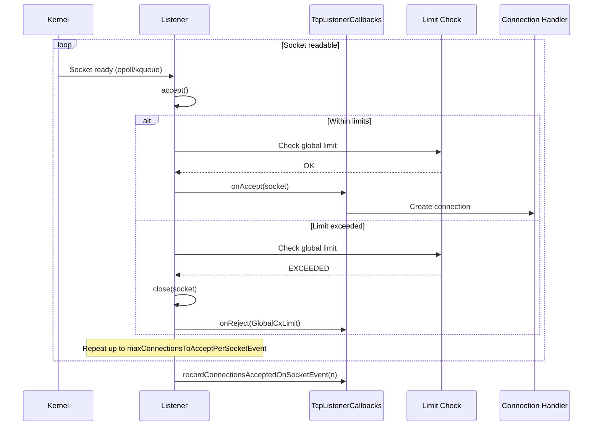

### UdpListenerCallbacks

**File:** Lines 377-453

**Purpose:** Handle UDP datagram events.

```cpp
class UdpListenerCallbacks {
  public:
    // New datagram received
    virtual void onData(UdpRecvData&& data) PURE;

    // Datagrams dropped (overflow/truncation)
    virtual void onDatagramsDropped(uint32_t dropped) PURE;

    // Socket ready for read
    virtual void onReadReady() PURE;

    // Socket ready for write
    virtual void onWriteReady(const Socket& socket) PURE;

    // Receive error
    virtual void onReceiveError(Api::IoError::IoErrorCode error_code) PURE;

    // Packet writer for sending
    virtual UdpPacketWriter& udpPacketWriter() PURE;

    // Worker identification
    virtual uint32_t workerIndex() const PURE;

    // Datagram received on target worker
    virtual void onDataWorker(Network::UdpRecvData&& data) PURE;

    // Post datagram to this worker
    virtual void post(Network::UdpRecvData&& data) PURE;

    // Expected packets per event loop
    virtual size_t numPacketsExpectedPerEventLoop() const PURE;

    // CMSG configuration for QUIC
    virtual const IoHandle::UdpSaveCmsgConfig& udpSaveCmsgConfig() const PURE;
};
```

---

## UDP-Specific Components

### UdpRecvData - Received Packet Structure

**File:** Lines 339-360

```cpp
struct UdpRecvData {
    struct LocalPeerAddresses {
        Address::InstanceConstSharedPtr local_;   // Local address
        Address::InstanceConstSharedPtr peer_;    // Peer address
    };

    LocalPeerAddresses addresses_;
    Buffer::InstancePtr buffer_;                   // Packet data
    MonotonicTime receive_time_;                   // Receive timestamp
    uint8_t tos_;                                  // Type of Service
    Buffer::OwnedImpl saved_cmsg_;                 // Control messages (QUIC)
};
```

### UdpSendData - Outgoing Packet Structure

**File:** Lines 365-372

```cpp
struct UdpSendData {
    const Address::Ip* local_ip_;                  // Source IP
    const Address::Instance& peer_address_;        // Destination
    Buffer::Instance& buffer_;                     // Packet data
};
```

### UdpListener Interface

**File:** Lines 496-537

```cpp
class UdpListener : public virtual Listener {
  public:
    // Event dispatcher
    virtual Event::Dispatcher& dispatcher() PURE;

    // Local address
    virtual const Network::Address::InstanceConstSharedPtr&
        localAddress() const PURE;

    // Send datagram
    virtual Api::IoCallUint64Result send(const UdpSendData& data) PURE;

    // Flush buffered data
    virtual Api::IoCallUint64Result flush() PURE;

    // Trigger read event
    virtual void activateRead() PURE;
};
```

### UDP Packet Flow

```mermaid
graph TB
    subgraph "Receive Path"
        Socket[UDP Socket]
        RecvMMsg[recvmmsg - Batch Read]
        UdpRecv[UdpRecvData Array]
        Router[UdpListenerWorkerRouter]
        W1[Worker 1]
        W2[Worker 2]
        WN[Worker N]
    end

    subgraph "Send Path"
        SendReq[Send Request]
        Writer[UdpPacketWriter]
        SendMMsg[sendmmsg - Batch Write]
        OutSocket[UDP Socket]
    end

    Socket --> RecvMMsg
    RecvMMsg --> UdpRecv
    UdpRecv --> Router
    Router -->|deliver()| W1
    Router -->|post()| W2
    Router -->|post()| WN

    SendReq --> Writer
    Writer --> SendMMsg
    SendMMsg --> OutSocket

    style RecvMMsg fill:#e1f5ff
    style Router fill:#ffe1e1
    style Writer fill:#fff4e1
```

### UdpListenerWorkerRouter

**File:** Lines 542-564

**Purpose:** Route UDP packets to the correct worker thread.

```cpp
class UdpListenerWorkerRouter {
  public:
    // Register worker's callbacks
    virtual void registerWorkerForListener(UdpListenerCallbacks& listener) PURE;

    // Unregister worker's callbacks
    virtual void unregisterWorkerForListener(UdpListenerCallbacks& listener) PURE;

    // Route packet to destination worker
    virtual void deliver(uint32_t dest_worker_index, UdpRecvData&& data) PURE;
};
```

### Worker Routing Strategies

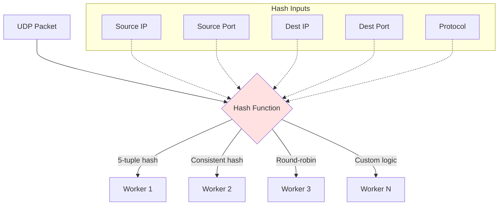

**Routing Goals:**
- **Affinity:** Same flow to same worker (session consistency)
- **Load balancing:** Even distribution across workers
- **Locality:** Minimize cross-worker posts

### UDP Batch Processing

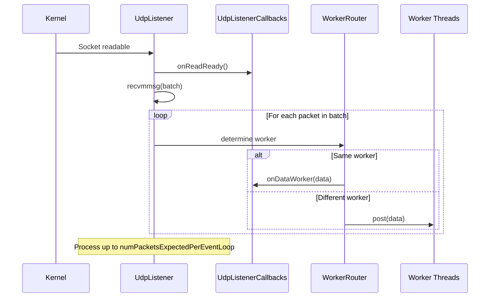

---

## Lifecycle and State Management

### Listener States

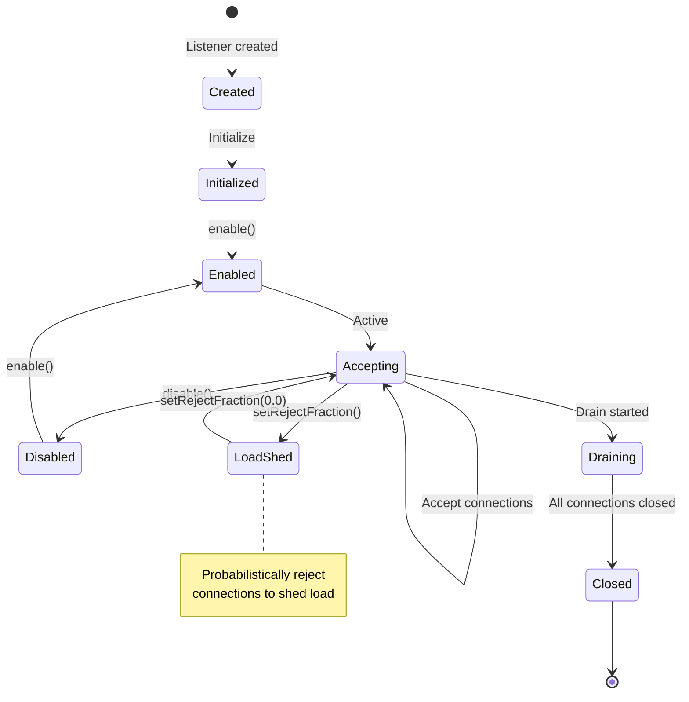

### Listener Control Interface

**File:** Lines 460-489

```cpp
class Listener {
  public:
    // Stop accepting new connections
    virtual void disable() PURE;

    // Resume accepting new connections
    virtual void enable() PURE;

    // Set fraction of connections to reject [0.0, 1.0]
    virtual void setRejectFraction(UnitFloat reject_fraction) PURE;

    // Configure load shed points
    virtual void configureLoadShedPoints(
        Server::LoadShedPointProvider& load_shed_point_provider) PURE;

    // Check overload bypass
    virtual bool shouldBypassOverloadManager() const PURE;
};
```

### Enable/Disable Flow

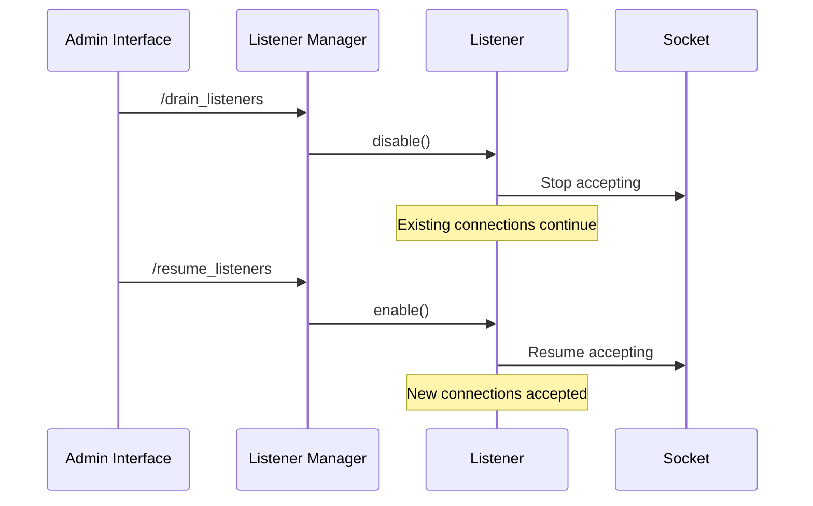

### Load Shedding

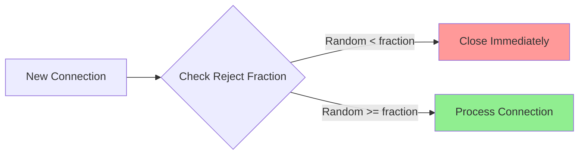

**Example Usage:**
```cpp
// Shed 30% of load
listener->setRejectFraction(0.3);

// No load shedding
listener->setRejectFraction(0.0);

// Shed all new connections
listener->setRejectFraction(1.0);
```

---

## Connection Acceptance Limits

### Global Connection Limit

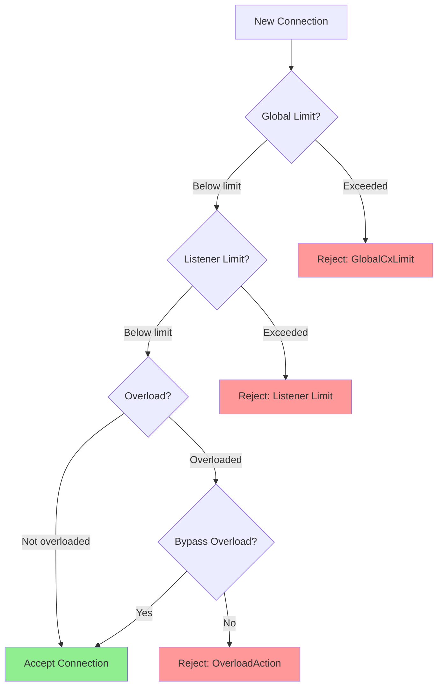

### Per-Socket Event Limits

**Purpose:** Prevent starvation of other events in the event loop.

```cpp
// Configuration
virtual uint32_t maxConnectionsToAcceptPerSocketEvent() const PURE;

// Default: Accept all available connections
constexpr uint32_t DefaultMaxConnectionsToAcceptPerSocketEvent = UINT32_MAX;
```

**Example:**
```yaml
listeners:
  - name: http_listener
    max_connections_to_accept_per_socket_event: 10
```

This limits accepting to 10 connections per socket event, ensuring:
- Other listeners get processing time
- Timer events don't starve
- Fairness across listeners

---

## Listener Filter Timeout

### Timeout Behavior

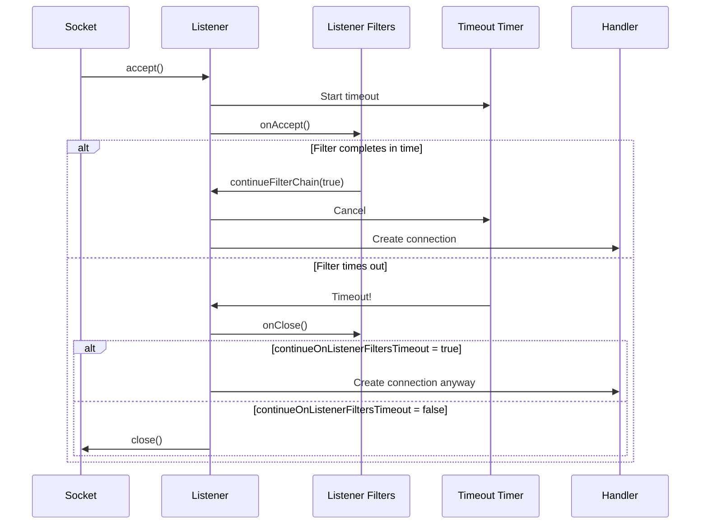

**Configuration:**
```cpp
// Timeout duration
virtual std::chrono::milliseconds listenerFiltersTimeout() const PURE;

// Whether to create connection on timeout
virtual bool continueOnListenerFiltersTimeout() const PURE;
```

**Use Cases:**
- **TLS inspection:** Timeout if ClientHello takes too long
- **Protocol detection:** Give up if insufficient data
- **Rate limiting:** Fail slow clients

---

## Access Logging

### Listener-Level Access Logs

```cpp
// Get configured access logs
virtual const AccessLog::InstanceSharedPtrVector& accessLogs() const PURE;
```

**Log Events:**
- Connection accepted
- Connection rejected
- Connection closed
- Bytes sent/received

**Example Configuration:**
```yaml
listeners:
  - name: http_listener
    access_log:
      - name: envoy.access_loggers.file
        typed_config:
          "@type": type.googleapis.com/envoy.extensions.access_loggers.file.v3.FileAccessLog
          path: /var/log/envoy/listener_access.log
          format: "[%START_TIME%] %BYTES_RECEIVED% %BYTES_SENT%\n"
```

---

## Integration with Other Components

### Listener → Connection Handler → Workers

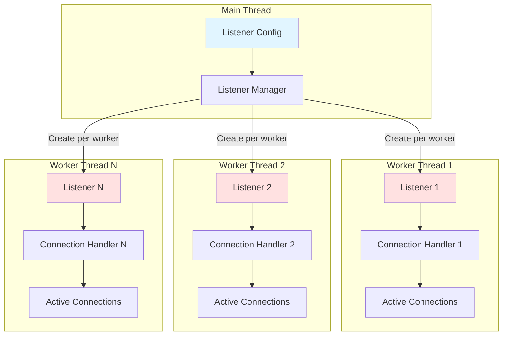

### Complete Connection Acceptance Flow

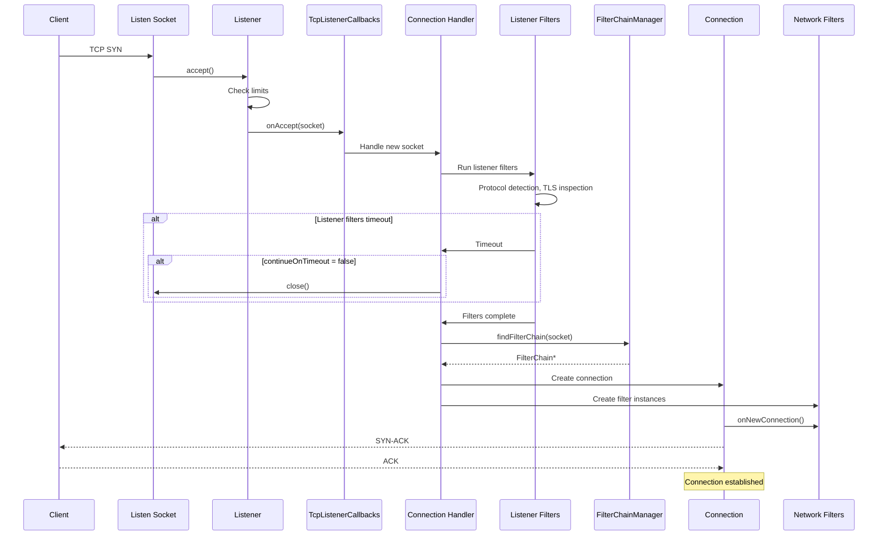

---

## Performance Considerations

### TCP Accept Batching

**Problem:** Too many accept() calls can starve other events.

**Solution:** Limit accepts per socket event.

```cpp
maxConnectionsToAcceptPerSocketEvent: 100
```

**Tradeoffs:**
- **Higher limit:** Lower latency for bursts, risk of starvation
- **Lower limit:** Better fairness, higher latency for bursts

### UDP Batch Processing

**Problem:** Processing packets one-by-one is inefficient.

**Solution:** Use `recvmmsg()` to read multiple packets at once.

```cpp
// Estimate packets per event loop
virtual size_t numPacketsExpectedPerEventLoop() const PURE;
```

**Benefits:**
- Fewer system calls
- Better cache locality
- Higher throughput

### Socket Options

**Critical options for performance:**

```cpp
// Enable SO_REUSEPORT for load balancing
SO_REUSEPORT: true

// Enable TCP Fast Open
TCP_FASTOPEN: true

// Allow binding to non-local addresses
IP_FREEBIND: true

// Set TCP backlog size
tcpBacklogSize: 1024
```

### Connection Balancing

**Purpose:** Distribute connections evenly across worker threads.

```cpp
virtual ConnectionBalancer& connectionBalancer(
    const Network::Address::Instance& address) PURE;
```

**Strategies:**
- **Exact Balance:** Strict round-robin
- **Least Connections:** Balance by connection count
- **No Balance:** Let kernel decide (SO_REUSEPORT)

---

## Testing Support

### Mock Implementations

```cpp
#include "test/mocks/network/mocks.h"

// Mock listener
MockListener listener;
EXPECT_CALL(listener, disable());
EXPECT_CALL(listener, enable());

// Mock callbacks
MockTcpListenerCallbacks callbacks;
EXPECT_CALL(callbacks, onAccept(_))
    .WillOnce([](ConnectionSocketPtr&& socket) {
        // Verify socket properties
    });

// Mock UDP listener
MockUdpListener udp_listener;
EXPECT_CALL(udp_listener, send(_))
    .WillReturn(Api::IoCallUint64Result{bytes_sent, error_code});
```

### Integration Testing

```cpp
class ListenerIntegrationTest : public BaseIntegrationTest {
    void SetUp() override {
        config_helper_.addConfigModifier([](envoy::config::bootstrap::v3::Bootstrap& bootstrap) {
            auto* listener = bootstrap.mutable_static_resources()->mutable_listeners(0);
            listener->set_name("test_listener");
            // Configure listener
        });
        BaseIntegrationTest::initialize();
    }
};

TEST_F(ListenerIntegrationTest, TestAccept) {
    auto client = makeTcpConnection(lookupPort("listener_0"));
    ASSERT_TRUE(client->connected());
}
```

---

## Common Patterns

### Pattern 1: Custom Listener Filter Timeout

```cpp
class MyListenerFilter : public ListenerFilter {
    FilterStatus onAccept(ListenerFilterCallbacks& cb) override {
        // Need more data
        return FilterStatus::StopIteration;
    }

    FilterStatus onData(ListenerFilterBuffer& buffer) override {
        if (buffer.rawSlice().len_ >= min_bytes_) {
            // Have enough data
            processProtocol(buffer);
            cb.continueFilterChain(true);
            return FilterStatus::Continue;
        }
        // Still need more data
        return FilterStatus::StopIteration;
    }

    size_t maxReadBytes() const override { return min_bytes_; }

private:
    size_t min_bytes_ = 1024;
};
```

### Pattern 2: UDP Session Management

```cpp
class QuicListener : public UdpListenerCallbacks {
    void onData(UdpRecvData&& data) override {
        // Hash to session
        auto session_id = hashAddresses(data.addresses_);
        auto session = sessions_.find(session_id);

        if (session == sessions_.end()) {
            // New session
            session = createSession(std::move(data));
            sessions_[session_id] = session;
        } else {
            // Existing session
            session->processPacket(std::move(data));
        }
    }

private:
    absl::flat_hash_map<uint64_t, SessionPtr> sessions_;
};
```

### Pattern 3: Load Shedding Based on Metrics

```cpp
class AdaptiveListener {
    void updateLoadSheddingFraction() {
        auto cpu_usage = stats_.cpuUsage();
        auto memory_usage = stats_.memoryUsage();

        float reject_fraction = 0.0;
        if (cpu_usage > 0.9 || memory_usage > 0.9) {
            reject_fraction = 0.5;  // Shed 50%
        } else if (cpu_usage > 0.8 || memory_usage > 0.8) {
            reject_fraction = 0.2;  // Shed 20%
        }

        listener_->setRejectFraction(reject_fraction);
    }
};
```

---

## Best Practices

### ✅ DO

1. **Configure appropriate timeouts**
   ```yaml
   listener_filters_timeout: 5s
   continue_on_listener_filters_timeout: false
   ```

2. **Limit accepts per socket event**
   ```yaml
   max_connections_to_accept_per_socket_event: 100
   ```

3. **Use SO_REUSEPORT for high throughput**
   ```yaml
   enable_reuse_port: true
   ```

4. **Set appropriate TCP backlog**
   ```yaml
   tcp_backlog_size: 1024  # Based on expected connection rate
   ```

5. **Configure access logs for troubleshooting**
   ```yaml
   access_log:
     - name: envoy.access_loggers.file
       typed_config: { ... }
   ```

### ❌ DON'T

1. **Don't disable timeouts without reason**
   ```yaml
   listener_filters_timeout: 0  # BAD: No timeout
   ```

2. **Don't ignore connection limits**
   ```yaml
   ignore_global_conn_limit: true  # BAD: Can overwhelm system
   ```

3. **Don't bypass overload manager carelessly**
   ```yaml
   bypass_overload_manager: true  # BAD: Can cause cascading failures
   ```

4. **Don't forget to handle UDP packet loss**
   ```cpp
   // BAD: Assuming all packets arrive
   // GOOD: Handle missing packets, out-of-order delivery
   ```

---

## Summary

The `listener.h` interfaces provide:

1. **Socket Management** - Create, configure, and manage listen sockets
2. **Connection Acceptance** - Handle TCP connections, UDP packets
3. **Configuration** - Comprehensive listener settings
4. **Callbacks** - Event notifications for connection lifecycle
5. **Load Control** - Enable/disable, reject fractions, limits
6. **Multi-protocol Support** - TCP, UDP, QUIC, internal

These interfaces enable:
- High-performance connection handling
- Flexible protocol support
- Fine-grained flow control
- Worker thread coordination
- Observability and debugging

---

## Related Documentation

- [Filter Interfaces](./FILTER_INTERFACES.md) - Network filter interfaces
- [Connection Interfaces](./connection.h) - Connection management
- [Address Interfaces](./address.h) - Network address abstractions
- [Server Configuration](../../source/server/README.md) - Server setup

---

*Last Updated: 2026-03-21*
