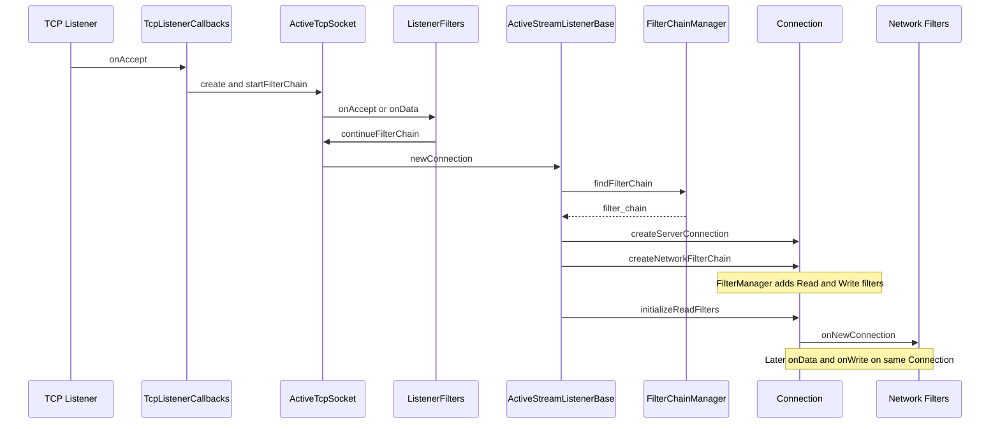
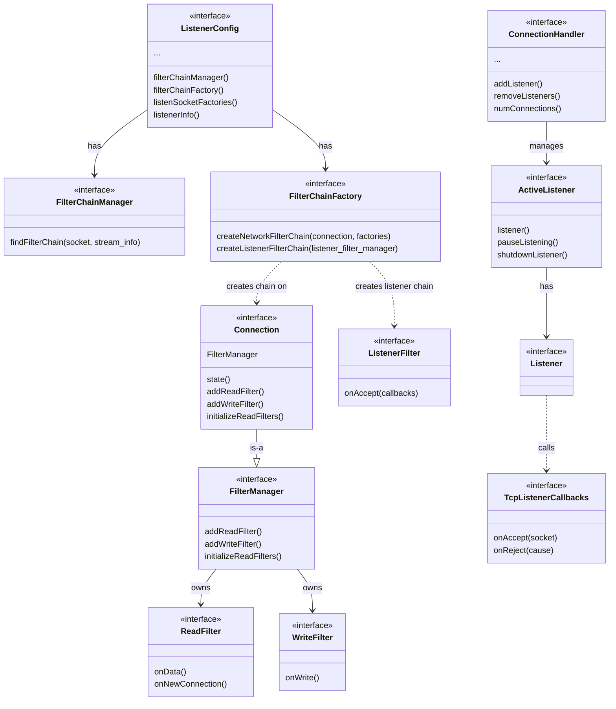

# Envoy Network API

This directory contains the **interface (API) headers** for Envoy's network layer. It defines listeners, connections, filters, sockets, and addressing—all as abstract interfaces. Implementations live in `source/common/network/`, `source/common/listener_manager/`, and extension code.

**Layout:** This folder is **flat** (no subdirectories). Headers are grouped below by responsibility.

---

## Where Implementations Live

| Area | Interface (this folder) | Implementation |
|------|--------------------------|----------------|
| Listeners & connection handling | `listener.h`, `connection_handler.h` | `source/common/listener_manager/` (e.g. `active_tcp_listener.cc`, `active_stream_listener_base.cc`, `active_tcp_socket.cc`) |
| Connections & filter manager | `connection.h`, `filter.h` | `source/common/network/connection_impl.cc`, `filter_manager_impl.cc` |
| Sockets & I/O | `socket.h`, `listen_socket.h`, `io_handle.h` | `source/common/network/socket_impl.cc`, `io_socket_handle_impl.cc` |
| Addresses & DNS | `address.h`, `dns_resolver.h`, `resolver.h` | `source/common/network/address_impl.cc`, `dns_resolver_impl.cc` |
| Transport (TLS, etc.) | `transport_socket.h` | `source/common/network/transport_socket_impl.cc`, TLS in `source/common/ssl/` |

---

## Core Classes (by responsibility)

### Listeners and configuration

- **`ListenerConfig`** – Configuration for one listener: filter chain manager, filter chain factory, listen socket factories, buffer limits, drain/overload behavior, etc.
- **`ListenSocketFactory`** – Supplies the listen socket(s) per worker (shared or per-worker with `reuse_port`).
- **`Listener`** – The object that actually listens (TCP/UDP); created per worker from `ListenerConfig`.
- **`ListenerInfo`** – Metadata and traffic direction for the listener.
- **`TcpListenerCallbacks`** – Callbacks from the TCP listener: `onAccept(ConnectionSocketPtr)`, `onReject()`, etc.
- **`UdpListenerCallbacks`** – Callbacks for UDP: `onData(UdpRecvData)`, `onReadReady()`, etc.
- **`ConnectionHandler`** – Adds/removes listeners, tracks connection counts, stop/disable/enable listeners, reject fraction. **`ConnectionHandler::ActiveListener`** – One active listener (TCP or UDP) per tag.
- **`TcpConnectionHandler`** – TCP-specific: `dispatcher()`, `createListener()`, `getBalancedHandlerByAddress()` for original-dst handoff.
- **`UdpConnectionHandler`** – UDP-specific: get UDP listener callbacks by tag/address.
- **`FilterChainManager`** – Find a filter chain for a given socket/stream info (e.g. by SNI, ALPN, source IP).
- **`FilterChainFactory`** – Builds filter chains: `createNetworkFilterChain(Connection&, ...)`, `createListenerFilterChain(ListenerFilterManager&)`, and UDP/QUIC variants.

### Connections and filters

- **`Connection`** – Abstract connection; extends `FilterManager` and `ScopeTrackedObject`. Read/write buffers, open/close, events, SSL, etc. **Implementations:** `ConnectionImpl` / `ServerConnectionImpl` in `source/common/network/connection_impl.cc`.
- **`FilterManager`** – Adds read/write filters, initializes read filters (`onNewConnection()`), drives filter iteration. The **Connection** object is the filter manager for a network connection.
- **`ReadFilter`** – `onData()`, `onNewConnection()`, `initializeReadFilterCallbacks()`. Invoked in **FIFO** order.
- **`WriteFilter`** – `onWrite()`, `initializeWriteFilterCallbacks()`. Invoked in **LIFO** order.
- **`Filter`** – Combined read + write filter.
- **`NetworkFilterCallbacks`** / **`ReadFilterCallbacks`** / **`WriteFilterCallbacks`** – Callbacks from the filter manager to filters (connection, socket, `continueReading()`, inject data, etc.).
- **`FilterChainFactory`** – Creates the network filter chain on a new connection (see above).
- **`FilterFactoryCb`** – Lambda that installs one or more network filters into a `FilterManager`; built at config time, run at connection-accept time.

### Listener filters (pre-connection)

- **`ListenerFilter`** – Runs **before** a `Connection` is created: `onAccept(ListenerFilterCallbacks&)`, optionally `onData()` for peeking. Used for TLS inspector, proxy protocol, original dst, etc.
- **`ListenerFilterCallbacks`** – Socket, metadata, filter state, `continueFilterChain(bool)`, etc.
- **`ListenerFilterManager`** – Interface implemented by the object that runs listener filters (e.g. `ActiveTcpSocket` in `source/common/listener_manager/active_tcp_socket.cc`).
- **`ListenerFilterBuffer`** – Buffers/peeks data for listener filters that need to read before continuing.

### Sockets and I/O

- **`Socket`** – Base socket API: options, `ioHandle()`, `close()`, `connectionInfoProvider()`.
- **`ConnectionSocket`** – Socket used for a connection; adds `setDetectedTransportProtocol()`, `setRequestedServerName()`, ALPN, etc. (used for filter chain matching).
- **`ListenSocket`** – Socket used for listening (server).
- **`ListenSocketFactory`** – See above; provides listen sockets per worker.
- **`IoHandle`** – Low-level I/O (read, write, duplicate, etc.); wraps file descriptors / events.
- **`SocketInterface`** – Factory for creating sockets (used so tests can inject mock sockets).

### Addresses and resolution

- **`Address::Instance`** – IP/pipe address; v4/v6, `asString()`, etc.
- **`Address::InstanceConstSharedPtr`** – Shared pointer to const address.
- **`Resolver`** – Resolves address protos to `Address::Instance`.
- **`DnsResolver`** – Async DNS resolution.

### Transport and TLS

- **`TransportSocket`** – Wraps I/O for TLS (or other transport): `doRead()`, `doWrite()`, `onConnected()`.
- **`TransportSocketCallbacks`** – Callbacks from transport socket to connection (e.g. raise event, flush write).

### Other

- **`ConnectionBalancer`** – Decides which worker handles a connection (e.g. by address).
- **`DrainDecision`** – Whether to drain-close a connection.
- **`ClientConnectionFactory`** – Creates outbound client connections.
- **`HashPolicy`** – Hash for connection balancing / consistent hashing.
- **`proxy_protocol.h`** – Proxy protocol types.
- **`exception.h`** – Network-related exceptions.
- **`post_io_action.h`** – What to do after I/O (e.g. re-enable read).

---

## Where Network Filter Code Runs When a Connection Is Accepted

Flow is: **accept → listener filters → filter chain match → create Connection → create network filter chain → run filters on the Connection**.

1. **Accept**  
   The OS listen socket delivers a new connection. The **TCP listener** (implementation in `source/common/listener_manager/`) invokes **`TcpListenerCallbacks::onAccept(ConnectionSocketPtr)`**.

2. **Listener filter chain**  
   The handler that implements `TcpListenerCallbacks` is the **active TCP listener**. For each accepted socket it creates an **`ActiveTcpSocket`** and runs the **listener filter chain**:
   - `ListenerConfig::filterChainFactory().createListenerFilterChain(*active_socket)` installs listener filters on the `ActiveTcpSocket`.
   - Then `active_socket->startFilterChain()` runs: each **ListenerFilter**’s `onAccept()` (and optionally `onData()` for peeking) is called. Filters can stop iteration to wait for more data (e.g. TLS inspector reading ClientHello).
   - When the listener filter chain completes, `ActiveTcpSocket::newConnection()` is called.

3. **Filter chain match and Connection creation**  
   In **`ActiveStreamListenerBase::newConnection()`** (in `source/common/listener_manager/active_stream_listener_base.cc`):
   - **`config_->filterChainManager().findFilterChain(*socket, *stream_info)`** picks the filter chain (using SNI, ALPN, source IP, etc.).
   - A **server connection** is created: **`dispatcher().createServerConnection(std::move(socket), transport_socket, *stream_info)`**. That yields a **`Network::Connection`** (implemented as **`ServerConnectionImpl`** in `source/common/network/connection_impl.cc`). This connection object **is** the **FilterManager** for the network filters.
   - **Network filter chain creation:**  
     **`config_->filterChainFactory().createNetworkFilterChain(*server_conn_ptr, filter_chain->networkFilterFactories())`**  
     That call (implemented in `source/common/listener_manager/listener_impl.cc` via **`ListenerImpl::createNetworkFilterChain()`**) uses **`Configuration::FilterChainUtility::buildFilterChain(connection, filter_factories)`** to instantiate each network filter factory and add the resulting **ReadFilter**/ **WriteFilter** to the **Connection** (the `FilterManager`).
   - **`initializeReadFilters()`** is then called on the connection, which calls **`onNewConnection()`** on each read filter in order.

4. **Where network filter code runs**  
   - **Ownership:** The **Connection** (`ServerConnectionImpl`) owns the **FilterManager** (see `source/common/network/filter_manager_impl.cc`). All network filter instances (e.g. TCP proxy, HTTP connection manager) are stored and driven by this manager.
   - **Read path:** When data arrives, the connection’s I/O path eventually calls into the filter manager, which iterates **read filters** in order and invokes **`ReadFilter::onData()`** (and initially **`ReadFilter::onNewConnection()`**).
   - **Write path:** When writing, the filter manager iterates **write filters** in reverse order and invokes **`WriteFilter::onWrite()`**.

So: **network filter code runs in the process that owns the accepted connection**, on the **Connection**’s **FilterManager**, which lives in **`source/common/network/filter_manager_impl.cc`**, and is invoked from the **Connection** implementation in **`source/common/network/connection_impl.cc`**. Listener filter code runs earlier, in **`source/common/listener_manager/active_tcp_socket.cc`**, before any **Connection** exists.

---

## UML Diagrams (Mermaid)

### High-level: From accept to network filters

### Core interfaces (simplified class diagram)

### Listener filter vs network filter flow

```mermaid
flowchart LR
    subgraph accept["Accept"]
        A[New socket accepted]
    end
    subgraph listener_filters["Listener filters - ActiveTcpSocket"]
        B[TLS Inspector - Proxy Protocol]
        C[continueFilterChain]
    end
    subgraph match_create["Filter chain match and Connection"]
        D[findFilterChain]
        E[createServerConnection]
        F[createNetworkFilterChain]
        G[initializeReadFilters]
    end
    subgraph network_filters["Network filters on Connection"]
        H[TCP Proxy - HCM]
        I[onNewConnection then onData onWrite]
    end

    A --> B
    B --> C
    C --> D
    D --> E
    E --> F
    F --> G
    G --> H
    H --> I
```

---

## File summary (this directory)

| File | Main purpose |
|------|-----------------------------|
| `address.h` | IP/pipe addresses, `Address::Instance`, `Ipv4`/`Ipv6`. |
| `connection.h` | `Connection`, `ConnectionCallbacks`, `ConnectionEvent`, close types. |
| `connection_balancer.h` | Balance connections across workers. |
| `connection_handler.h` | `ConnectionHandler`, `ActiveListener`, `TcpConnectionHandler`, `UdpConnectionHandler`. |
| `client_connection_factory.h` | Factory for creating outbound client connections. |
| `dns.h` / `dns_resolver.h` | DNS resolution types and async resolver. |
| `drain_decision.h` | Drain/close decision interface. |
| `exception.h` | Network exceptions. |
| `filter.h` | `ReadFilter`, `WriteFilter`, `Filter`, `FilterManager`, `FilterChainFactory`, listener/QUIC/UDP filter interfaces, callbacks. |
| `hash_policy.h` | Hashing for load balancing. |
| `io_handle.h` | Low-level I/O handle. |
| `listen_socket.h` | `ListenSocket`, `ConnectionSocket`, socket option names. |
| `listener.h` | `ListenerConfig`, `ListenSocketFactory`, `ListenerInfo`, `TcpListenerCallbacks`, `UdpListenerCallbacks`, `UdpRecvData`. |
| `listener_filter_buffer.h` | Buffer for listener filters that peek data. |
| `post_io_action.h` | Post-I/O action (e.g. re-enable read). |
| `proxy_protocol.h` | Proxy protocol types. |
| `resolver.h` | Address resolution. |
| `socket.h` | `Socket`, options, `ConnectionInfoProvider`. |
| `socket_interface.h` | Socket creation abstraction. |
| `transport_socket.h` | Transport (e.g. TLS) socket and callbacks. |
| `udp_packet_writer_handler.h` | UDP packet writer factory. |
| `parent_drained_callback_registrar.h` | Drain callback registration. |
