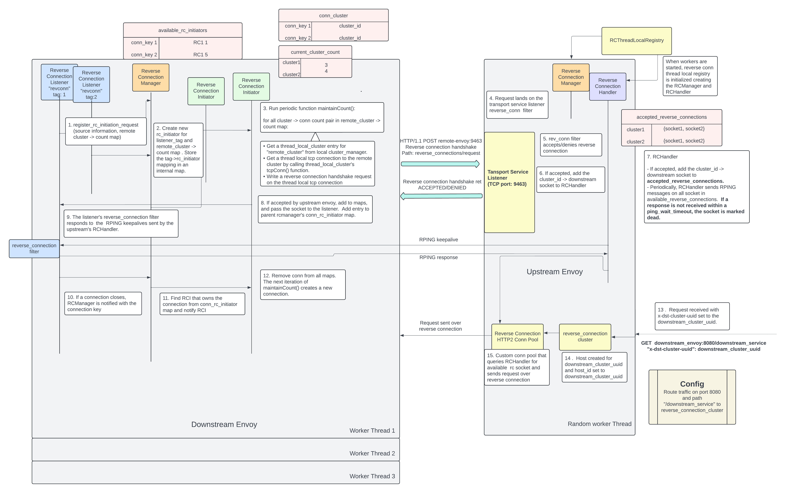

# Running the Sandbox for reverse connections

## Steps to run sandbox

1. Build envoy with reverse connections feature:
   - ```./ci/run_envoy_docker.sh './ci/do_ci.sh bazel.release.server_only'```
2. Build envoy docker image:
   - ```docker build -f ci/Dockerfile-envoy-image -t envoy:latest .```
3. Launch test containers.
   - ```docker-compose -f examples/reverse_connection/docker-compose.yaml up```
4. The reverse example configuration in on-prem-envoy.yaml initiates 2 reverse connections per envoy thread to cloud envoy as shown in the listener config:

    ```yaml    
            reverse_connection_listener_config:
            "@type": type.googleapis.com/envoy.extensions.reverse_connection.reverse_connection_listener_config.v3.ReverseConnectionListenerConfig
            src_cluster_id: on-prem
            src_node_id: on-prem-node
            src_tenant_id: on-prem
            remote_cluster_to_conn_count:
            - cluster_name: cloud
                reverse_connection_count: 2
    ```

5. Verify that the reverse connections are established by sending requests to the reverse conn API:
   On on-prem envoy, the expected output is a list of envoy clusters to which reverse connections have been
   established, in this instance, just "cloud".

    ```bash
    [basundhara.c@basundhara-c ~]$ curl localhost:9000/reverse_connections               
    {"accepted":[],"connected":["cloud"]} 
    ``` 
   On cloud-envoy, the expected output is a list on nodes that have initiated reverse connections to it,
   in this case, "on-prem-node".
   
   ```bash
    [basundhara.c@basundhara-c ~]$ curl localhost:9001/reverse_connections                  
    {"accepted":["on-prem-node"],"connected":[]}
   ``` 

6. Test reverse connection:
   - Perform http request for the service behind on-prem envoy, to cloud-envoy. This request will be sent
   over a reverse connection.

    ```bash
    [basundhara.c@basundhara-c ~]$ curl -H "x-remote-node-id: on-prem-node" -H "x-dst-cluster-uuid: on-prem" http://localhost:8081/on_prem_service  
    Server address: 172.21.0.3:80
    Server name: 281282e5b496
    Date: 26/Nov/2024:04:04:03 +0000
    URI: /on_prem_service
    Request ID: 726030e25e52db44a6c06061c4206a53
    ```

## Reverse Connection Description

## Scenario

Reverse Connections allow users to access downstream services in a private network from apps in a public network by caching and re-using client connection sockets. The following describes the use case:

- There is a management service in a public network, that connects to several cluster managers, each in a private network
- Both the management service (upstream) and cluster managers (downstream) have envoy proxy running.
- Services behind upstream envoy cannot access downstream services using forward connections (because downstream services are in a private network) and use "reverse connections" instead. The downstream envoy initiates HTTPs connections to upstream envoy, following which upstream envoy caches the client connection socket -> downstream cluster identifier. Upon receiving a HTTPs request for a downstream service, the upstream envoy picks an available "reverse connection" or cached connection socket for the downstream cluster and uses it to send the request.

## Workflow



### Part 1: Reverse Connection Bootstrap Extension brings up Reverse Connection Entities

1. The bootstrap extension "envoy.bootstrap.reverse_connection" brings up several reverse connection entities described later. These entities need to initialized thread locally after the workers are initialized. To achieve this, a [ReverseConnRegistry](https://github.com/nutanix/envoyproxy-envoy/blob/32140613bad06aa124a6da0552aa64111f2469b8/source/extensions/bootstrap/reverse_connection/reverse_conn_global_registry.h#L20) singleton is defined as part of the bootstrap extension, which owns a thread local TLS slot. The TLS slot wraps over functors to create a [RCThreadLocalRegistry](https://github.com/nutanix/envoyproxy-envoy/blob/32140613bad06aa124a6da0552aa64111f2469b8/source/extensions/bootstrap/reverse_connection/reverse_conn_thread_local_registry.h#L14), which wraps over the thread local entities we need to create.
The Server implementation checks if the bootstrap extension is present, and if so, [calls get() on the TLS slot](https://github.com/nutanix/envoyproxy-envoy/blob/aece887928c6755ed6a54c8a25078a785b971a33/source/server/server.cc#L813), thus initializing the entities on each worker thread.

### Part 2: Reverse Conn Filter
The [reverse_conn filter](https://github.com/nutanix/envoyproxy-envoy/blob/32140613bad06aa124a6da0552aa64111f2469b8/source/extensions/filters/http/reverse_conn/reverse_conn_filter.cc#L28) serves as the common API endpoint servicing reverse connection related requests. On upstream envoy, It accepts reverse connection requests from initiator envoy. On both upstream and downstream envoy, it responds to GET calls for reverse connection related statistics. This filter should be attached to a listener and must be present in the config for both upstream and downstream envoy.


### Part 3: Adding a Reverse Connection Listener to kick off the reverse connection workflow

1. Reverse connections are initiated with the addition of HTTP listeners with a [reverse_connection_listener_config](https://github.com/nutanix/envoyproxy-envoy/blob/32140613bad06aa124a6da0552aa64111f2469b8/api/envoy/config/listener/v3/listener.proto#L386). The reverse_connection_listener_config is defined in a [proto](https://github.com/nutanix/envoyproxy-envoy/blob/32140613bad06aa124a6da0552aa64111f2469b8/api/envoy/extensions/reverse_connection/reverse_connection_listener_config/v3/reverse_connection_listener_config.proto) and is registered as part of [envoy.reverse_connection.reverse_connection_listener_config](https://github.com/nutanix/envoyproxy-envoy/blob/32140613bad06aa124a6da0552aa64111f2469b8/source/extensions/extensions_build_config.bzl#L341) extension. It defines the parameters used while initiating reverse connections:

```yaml
      reverse_connection_listener_config:
        "@type": type.googleapis.com/envoy.extensions.reverse_connection.reverse_connection_listener_config.v3.ReverseConnectionListenerConfig
        src_cluster_id: on-prem # Cluster identifier of the initiating downstream envoy
        src_node_id: on-prem-node # Node identifier of the initiator envoy. One cluster may have multiple nodes
        src_tenant_id: on-prem # Optional; Tenant identifier of the initiator envoy.
        remote_cluster_to_conn_count: # List of upstream clusters to which reverse connections need to be created
          - cluster_name: cloud
            reverse_connection_count: 2
```

2. The reverse conn config for the listener is [parsed in ListenerImpl](https://github.com/nutanix/envoyproxy-envoy/blob/aece887928c6755ed6a54c8a25078a785b971a33/source/common/listener_manager/listener_impl.cc#L601) and a [ReverseConnectionListenerConfig](https://github.com/nutanix/envoyproxy-envoy/blob/aece887928c6755ed6a54c8a25078a785b971a33/envoy/network/listener.h#L142) is created. The ReverseConnectionListenerConfig implementation is defined in an extension. The 


3. After the workers are started, the per worker Connection Handler, while adding each listener to the worker, checks if the listener has a ReverseConnectionListenerConfig attached. If so, it creates a [ActiveReverseConnectionListener](https://github.com/nutanix/envoyproxy-envoy/blob/aece887928c6755ed6a54c8a25078a785b971a33/source/common/listener_manager/connection_handler_impl.cc#L83). The ActiveReverseConnectionListener will not bind to port and will initiate reverse connections instead.

4. The Reverse Connection listener must have the [envoy.filters.listener.reverse_connection](https://github.com/nutanix/envoyproxy-envoy/blob/32140613bad06aa124a6da0552aa64111f2469b8/source/extensions/filters/listener/reverse_connection/reverse_connection.cc#L27) listener filter attached. This filter responds to RPING keepalives sent by the upstream envoy on reverse connection sockets, and marks sockets dead when keepalives are not received on them.

### Part 4: Reverse Connection Initiation: Role of Reverse Connection Entities

The following three thread local entities are used for reverse connection initiation and maintainenance:

#### ReverseConnectionInitiator (RCInitiator)
 Thread local entity created unique for each [Listener Tag](https://github.com/envoyproxy/envoy/blob/0a17f272c17c506a5ed9fdf6030470574c0b8444/source/common/listener_manager/listener_impl.h#L424). On being created, the RCInitiator [initiates](https://github.com/nutanix/envoyproxy-envoy/blob/32140613bad06aa124a6da0552aa64111f2469b8/source/extensions/bootstrap/reverse_connection/reverse_connection_initiator.cc#L110) "reverse_connection_count" connections to each "cluster_name" in the listener's ReverseConnectionListenerConfig. Upon connection closure, it is invoked to re-initiate connections.

#### ReverseConnectionManager(RCManager)
A single thread local resource that manages the lifecycle of all ReverseConnectionInitiators. The [RCManager](https://github.com/nutanix/envoyproxy-envoy/blob/32140613bad06aa124a6da0552aa64111f2469b8/source/extensions/bootstrap/reverse_connection/reverse_connection_manager_impl.cc#L8) is initialized as part of the 
RCThreadLocalRegistry during bootstrap, and maintains a [available_rc_initiators map](https://github.com/nutanix/envoyproxy-envoy/blob/32140613bad06aa124a6da0552aa64111f2469b8/source/extensions/bootstrap/reverse_connection/reverse_connection_manager_impl.h#L115) of the RCInitiators created for each listener tag, and a [connection_to_rc_initiator_map](https://github.com/nutanix/envoyproxy-envoy/blob/32140613bad06aa124a6da0552aa64111f2469b8/source/extensions/bootstrap/reverse_connection/reverse_connection_manager_impl.h#L109) storing each reverse connection's unique connection identifier to the RCInitiator that created and owns it.
The RCManager provides a couple of important APIs:
* registerRCInitiatornitiators(listener, remote_cluster_to_conns...): Creates a new RCInitiator if not present, for the listener tag of listener, and stores it in "available_rc_initiators" map.
* unregisterRCInitiatornitiator( listener): Finds the RCInitiator that was created for the listener, calls its destructor. This empties the RCInitiator's internal maps and thereby closes the connections that had been initiated by the RCInitiator.
* notifyConnectionClose(connectionKey..): Find the RCInitiator that owns the connection with key connectionKey by looking up in "connection_to_rc_initiator_map", and invoke it to close the connection.

#### ReverseConnectionHandler(RCHandler)
The [RCHandler](https://github.com/nutanix/envoyproxy-envoy/blob/32140613bad06aa124a6da0552aa64111f2469b8/source/extensions/bootstrap/reverse_connection/reverse_connection_handler_impl.h#L22) thread local socket manager that functions only on the responder envoy side. It stores mappings of initiator node/cluster information with the corresponding reverse connection sockets. It sends RPING keepalives on sockets for each accepted reverse connection and marks them dead in case of closures.

1. The ActiveReverseConnectionListener calls the RCManager's registerRCInitiatornitiators API to create a RCInitiator, unique for the listener tag. The RCInitiator, upon initialization runs a periodic function maintainConnCount(), that checks iterates through the passed remote_cluster_to_conns map and initiates "reverse_connection_count" connections to each "cluster_name".  For each cluster, the RCInitiator obtains a thread local cluster entry by calling the cluster manager's [getThreadLocalCluster()](https://github.com/envoyproxy/envoy/blob/0a17f272c17c506a5ed9fdf6030470574c0b8444/source/server/config_validation/cluster_manager.h#L49) and then obtains an existing [tcp Connection](https://github.com/nutanix/envoyproxy-envoy/blob/32140613bad06aa124a6da0552aa64111f2469b8/source/extensions/bootstrap/reverse_connection/reverse_connection_initiator.cc#L220) to that cluster. The underlying connection is extracted and a [ReverseConnectionHandshake HTTP POST request is written to it](https://github.com/nutanix/envoyproxy-envoy/blob/32140613bad06aa124a6da0552aa64111f2469b8/source/extensions/bootstrap/reverse_connection/reverse_connection_initiator.cc#L392). This handshake contains information about the initiator envoy (node_id,cluster_id etc). The connectionKey of this connection is defined as the local socket address (IP:port pair) and is obtained from the ClientConnectionPtr's [ConnectionSocket](https://github.com/envoyproxy/envoy/blob/0a17f272c17c506a5ed9fdf6030470574c0b8444/envoy/network/listen_socket.h#L29). The RCI adds a [read filter](https://github.com/nutanix/envoyproxy-envoy/blob/32140613bad06aa124a6da0552aa64111f2469b8/source/extensions/bootstrap/reverse_connection/reverse_connection_initiator.cc#L392) to the ClientConnection so that responses from the responder envoy can be intercepted. It also maintains an internal map of cluster -> connection count to re-initiate in case of closure.

2. The reverse_conn filter described in Part 2 intercepts HTTP requests, and if a handshake is received, extracts the source information, and performs some verifications. The source node_ID is a mandatory field in the reverse connection handshake and if that is not present, the handshake is rejected. A reverse connection handshake return HTTP message is sent to the initiator.

3. If accepted, the reverse_conn filter extracts the raw downstream [Connection](https://github.com/nutanix/envoyproxy-envoy/blob/32140613bad06aa124a6da0552aa64111f2469b8/source/extensions/filters/http/reverse_conn/reverse_conn_filter.cc#L110) and calls the RCHandler to [cache the socket](https://github.com/nutanix/envoyproxy-envoy/blob/32140613bad06aa124a6da0552aa64111f2469b8/source/extensions/bootstrap/reverse_connection/reverse_connection_handler_impl.cc#L129).

4. The RCHandler adds the node_id -> ConnectionSocketPtr mapping to the accepted_reverse_connections map, and then does a couple of things:
- It triggers a [periodic function](https://github.com/nutanix/envoyproxy-envoy/blob/32140613bad06aa124a6da0552aa64111f2469b8/source/extensions/bootstrap/reverse_connection/reverse_connection_handler_impl.cc#L525) to send RPING keepalives on all accepted connection sockets.
- It obtains the underlying FD from the connection socket and adds creates a [File Event](https://github.com/nutanix/envoyproxy-envoy/blob/32140613bad06aa124a6da0552aa64111f2469b8/source/extensions/bootstrap/reverse_connection/reverse_connection_handler_impl.cc#L185) to respond to RPING replies from the initiator envoy upon file read. If a ping response is not received within a user defined timeout, the socket is marked dead.

5. On the initiator envoy's side, the RCInitiator's read filter [intercepts the reverse connection handshake](https://github.com/nutanix/envoyproxy-envoy/blob/32140613bad06aa124a6da0552aa64111f2469b8/source/extensions/bootstrap/reverse_connection/reverse_connection_initiator.h#L251) return message and checks whether it was accepted. If not, it closes the ClientConnection. If not, it resets file events on the connection socket, and then sets the connection_reused_ flag for the connection to to true. This is so that a [connection closure](https://github.com/nutanix/envoyproxy-envoy/blob/aece887928c6755ed6a54c8a25078a785b971a33/source/common/network/connection_impl.cc#L145) is skipped for a reverse connection. The RCInitiator -> connection info is added to the RCManager's connection_to_rc_initiator_map, after which the connection socket is [passed to the initiating listener, reverse_conn_listener](https://github.com/nutanix/envoyproxy-envoy/blob/32140613bad06aa124a6da0552aa64111f2469b8/source/extensions/bootstrap/reverse_connection/reverse_connection_initiator.cc#L305).

6. On the initiator end, the "envoy.filters.listener.reverse_connection" filter described in Part 3, Step 4, responds to RPING keepalives sent on the socket.

### Part 5: Serving upstream -> downstream requests using reverse connections

In order to differentiate between requests that need to be sent via a reverse connection vs those to be sent through forward connections, a new cluster type [REVERSE_CONNECTION](https://github.com/nutanix/envoyproxy-envoy/blob/32140613bad06aa124a6da0552aa64111f2469b8/api/envoy/config/cluster/v3/cluster.proto#L80) has been defined. The Cluster Manager [checks](https://github.com/nutanix/envoyproxy-envoy/blob/aece887928c6755ed6a54c8a25078a785b971a33/source/common/upstream/cluster_manager_impl.cc#L2376) whether the connection is intended for a reverse connection cluster, and if so, calls a [custom HTTP/2 conn pool](https://github.com/nutanix/envoyproxy-envoy/blob/32140613bad06aa124a6da0552aa64111f2469b8/source/extensions/bootstrap/reverse_connection/conn_pool.cc#L19). This custom conn pool's calls RCHandler and creates a new connection over a cached socket, instead of creating a new forward connection to downstream envoy. This connection is defined in the abstraction [ReversedClientConnectionImpl](https://github.com/nutanix/envoyproxy-envoy/blob/aece887928c6755ed6a54c8a25078a785b971a33/source/common/network/reversed_connection_impl.cc#L8), in which the connect() method is overriden since it is created over a previously cached socket.