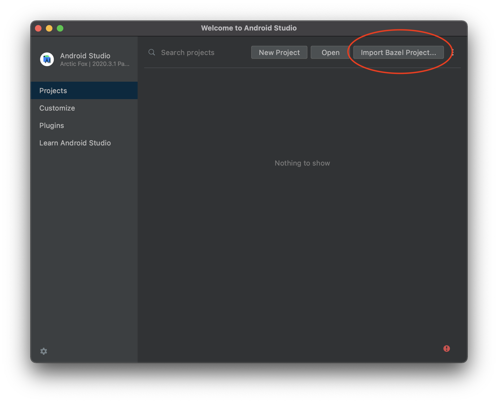
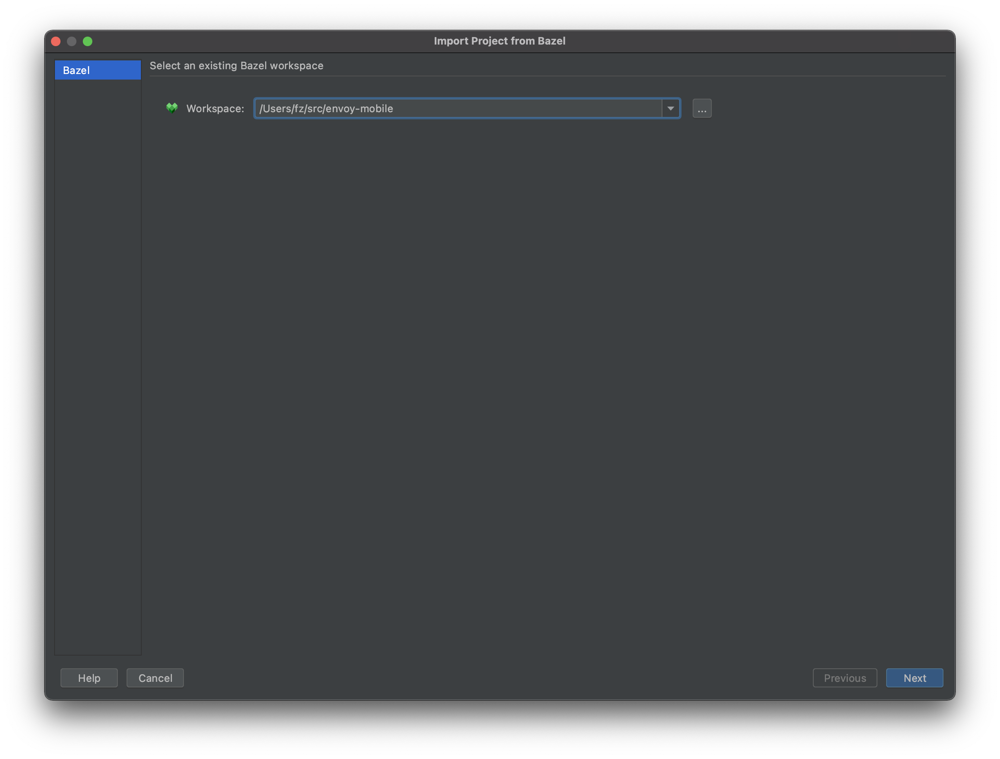
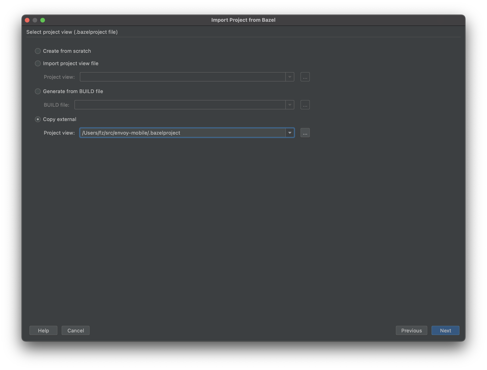
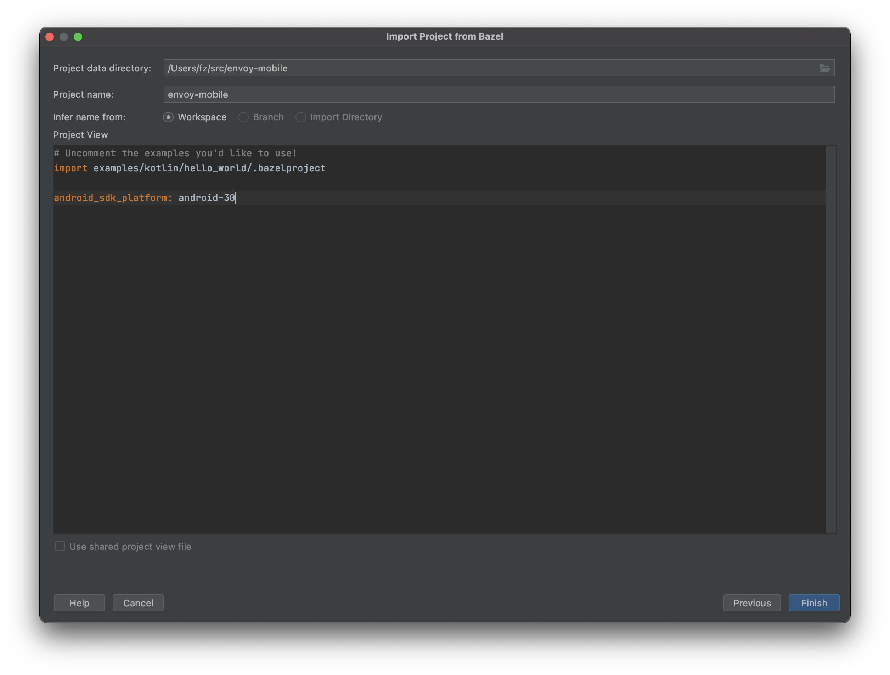
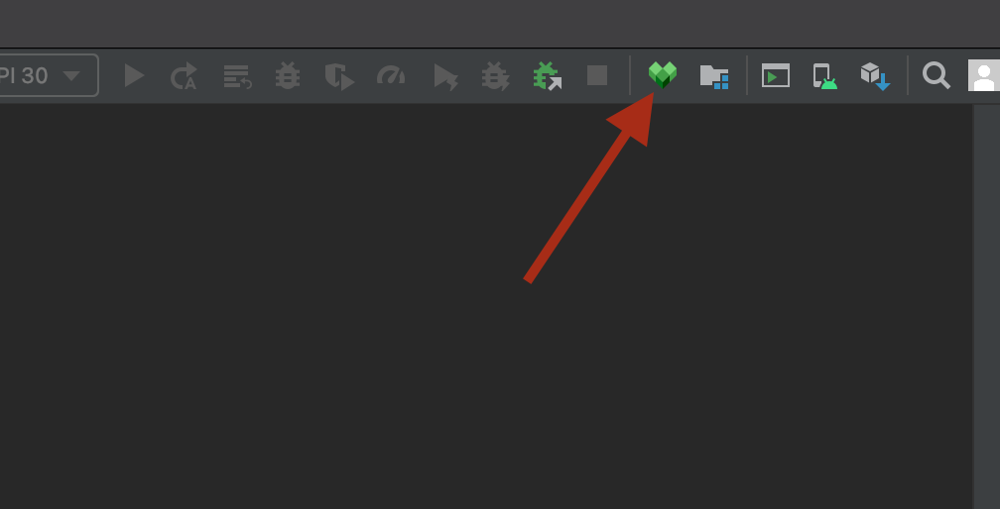
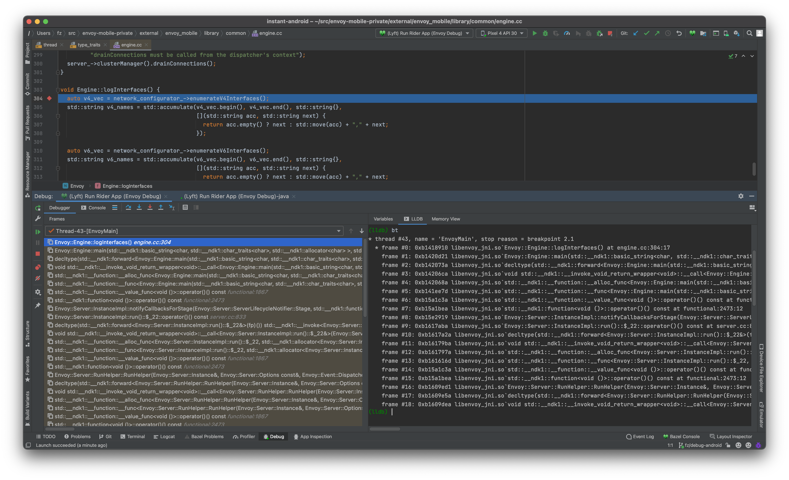

.. _debugging_android_instructions:

Debugging the Hello World App (Android)
=======================================

Goals
-----

- As a developer you can compile your `envoy-mobile` repository and the generated `.aar` will be automatically recognized by Android Studio
- `envoy-mobile` can be compiled to a single arch for debugging
- While breaking on a C++ function, Android Studio should present the source file and highlight the line where the breakpoint hit with all scope information
- The workflow works both on emulator and device

Setting up the environment
--------------------------

Before we start, you'll need to download Android Studio and the `Bazel plugin <https://plugins.jetbrains.com/plugin/9185-bazel>`_, you can find it in Preferences -> Plugins
.

1. Go `here <https://developer.android.com/studio/>`_ and install Android Studio.
2. Install the bazel plugin

Adding Envoy-Mobile Project into Android Studio
-----------------------------------------------

With your environment setup, open Android Studio.

1. Add a new bazel project by clicking here:

2. Select your repository root path as follows and hit Next:

3. Import the bazelproject file from the root and hit Next:

4. You'll see a screen similar to this. Click Finish.

5. Once Android Studio completes loading click on the Bazel Sync icon:

Entering a debugging session
----------------------------

With the project ready, you can now start debugging with Android Studio.

1. Compile your envoy-mobile with debug symbols to the architecture of the device or emulator you are about to run.

For example:
::

    $ ./bazelw build android_dist --config=android --fat_apk_cpu=x86 -c dbg

Android supported archs are `arm64_v8a`, `armeabi-v7a`, `x86`, `x86_64`.

2. From Android Studio select the `Example App x86 (Debug)` configuration and hit the debug icon. Note: if you don't see this option go to "Add configuration" and it'll be there on the Bazel category, just select it and hit Ok.
3. Optionally you could create symbolic breakpoints before running by going to the Debugger tab.

Your environment should look like this at this point:

