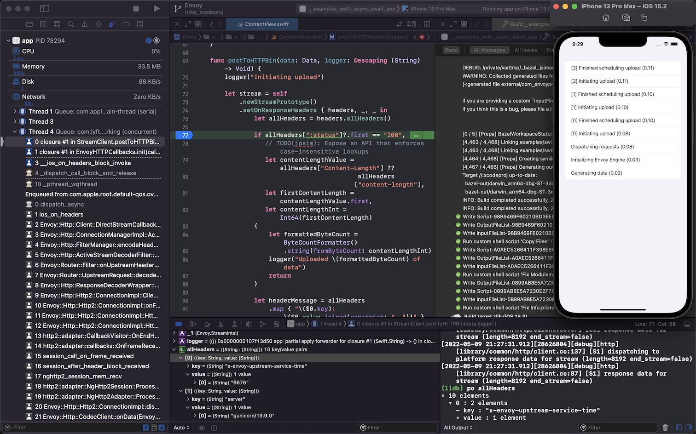
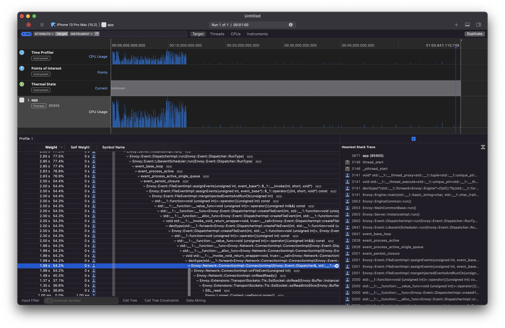

.. _debugging_ios_instructions:

Build & run the example iOS apps
=======================================

*Note: This document assumes that you have installed the
:ref:`iOS build requirements <ios_requirements>`_.*

The fastest way to build and run the sample iOS apps is to run the
following command::

    ./bazelw run //examples/swift/hello_world:app

This will build and run the Hello World iOS app in a new iOS Simulator.

.. _using_xcode:

Using the Xcode GUI
-------------------

Envoy Mobile makes use of the
`rules_xcodeproj <https://github.com/buildbuddy-io/rules_xcodeproj>`_
project to add support for many of Xcode's development, debugging and
profiling features to Envoy Mobile.

To start, run ``./bazelw run //:xcodeproj`` to generate an Xcode project
and ``xed .`` to open it in Xcode (or double-click ``Envoy.xcodeproj``
in Finder).

In Xcode's scheme selector, pick the app target you want to build (e.g.
``Hello World App``), pick a Simulator to run it on,
then hit cmd-R to build and run.

From there, most Xcode features should just work for all transitively
compiled source files in C/C++/Objective-C/Objective-C++/Swift:

* Auto-complete
* Syntax highlighting
* Go to definition
* Breakpoints
* LLDB console
* Thread navigator
* Symbols
* Metrics like CPU/memory/networking/energy
* Profiling with Instruments

|xcode_breakpoint| |instruments|

Running on a real iPhone
------------------------

You can build and run the example iOS apps on a physical iPhone by
following these steps:

1. Set the ``TEAM_ID`` value in ``examples/BUILD`` to your Apple
   Developer Team ID found in the
   `Apple Developer Portal <https://developer.apple.com/account/#!/membership>`_.
2. If needed, change the ``PROFILE_NAME`` value to the name shown by
   clicking the (i) next to "Xcode Managed Profile" in Xcode's
   "Signing and Capabilities" tab.
3. Follow the same steps as defined in the
   :ref:`Using the Xcode GUI <using_xcode>` section above, but
   targeting your device instead of a simulator.
