# Envoy Access Log Architecture

## Overview

The Envoy access log subsystem provides a flexible, high-performance mechanism for logging HTTP and TCP traffic. It consists of two main components:

1. **Access Log Filters** - Determine whether a request should be logged based on various criteria
2. **Access Log Manager** - Manages log files and handles asynchronous writing with buffering

---

## System Architecture

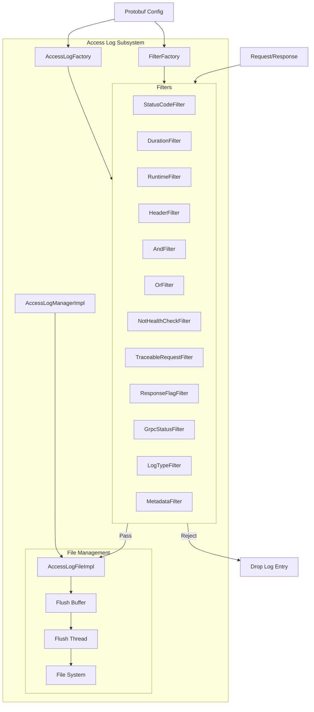

---

## Component Details

### 1. Filter System

The filter system provides a composable way to determine which requests should be logged.

#### Filter Class Hierarchy

```mermaid
classDiagram
    class Filter {
        <<interface>>
        +evaluate(context, info) bool
    }

    class ComparisonFilter {
        -config_: ComparisonFilter
        -runtime_: Runtime::Loader
        +compareAgainstValue(lhs) bool
    }

    class StatusCodeFilter {
        +evaluate(context, info) bool
    }

    class DurationFilter {
        +evaluate(context, info) bool
    }

    class OperatorFilter {
        -filters_: vector~FilterPtr~
    }

    class AndFilter {
        +evaluate(context, info) bool
    }

    class OrFilter {
        +evaluate(context, info) bool
    }

    class RuntimeFilter {
        -runtime_: Runtime::Loader
        -random_: RandomGenerator
        -runtime_key_: string
        -percent_: FractionalPercent
        +evaluate(context, info) bool
    }

    class HeaderFilter {
        -header_data_: HeaderDataPtr
        +evaluate(context, info) bool
    }

    class ResponseFlagFilter {
        -configured_flags_: vector~bool~
        +evaluate(context, info) bool
    }

    class GrpcStatusFilter {
        -statuses_: GrpcStatusHashSet
        -exclude_: bool
        +evaluate(context, info) bool
    }

    class NotHealthCheckFilter {
        +evaluate(context, info) bool
    }

    class TraceableRequestFilter {
        +evaluate(context, info) bool
    }

    class LogTypeFilter {
        -types_: LogTypeHashSet
        -exclude_: bool
        +evaluate(context, info) bool
    }

    class MetadataFilter {
        -present_matcher_: PresentMatcher
        -value_matcher_: ValueMatcherPtr
        -path_: vector~string~
        -default_match_: bool
        +evaluate(context, info) bool
    }

    Filter <|-- ComparisonFilter
    Filter <|-- OperatorFilter
    Filter <|-- RuntimeFilter
    Filter <|-- HeaderFilter
    Filter <|-- ResponseFlagFilter
    Filter <|-- GrpcStatusFilter
    Filter <|-- NotHealthCheckFilter
    Filter <|-- TraceableRequestFilter
    Filter <|-- LogTypeFilter
    Filter <|-- MetadataFilter

    ComparisonFilter <|-- StatusCodeFilter
    ComparisonFilter <|-- DurationFilter
    OperatorFilter <|-- AndFilter
    OperatorFilter <|-- OrFilter
```

#### Filter Types

| Filter Type | Purpose | Key Logic |
|------------|---------|-----------|
| **StatusCodeFilter** | Filter based on HTTP response code | Compares response code against configured value (GE, EQ, LE, NE) |
| **DurationFilter** | Filter based on request duration | Compares request duration in milliseconds against configured value |
| **RuntimeFilter** | Probabilistic filtering using runtime flags | Uses random sampling with configurable percentage |
| **HeaderFilter** | Filter based on request/response headers | Matches headers using configured patterns |
| **AndFilter** | Logical AND of sub-filters | All sub-filters must evaluate to true |
| **OrFilter** | Logical OR of sub-filters | At least one sub-filter must evaluate to true |
| **NotHealthCheckFilter** | Exclude health check requests | Returns true if request is NOT a health check |
| **TraceableRequestFilter** | Include only traceable requests | Checks if request was service-forced traced |
| **ResponseFlagFilter** | Filter based on Envoy response flags | Checks if specific response flags are set |
| **GrpcStatusFilter** | Filter based on gRPC status codes | Matches or excludes specific gRPC status codes |
| **LogTypeFilter** | Filter based on access log type | Matches or excludes specific log types |
| **MetadataFilter** | Filter based on dynamic metadata | Matches metadata keys and values |

---

### 2. Filter Evaluation Flow

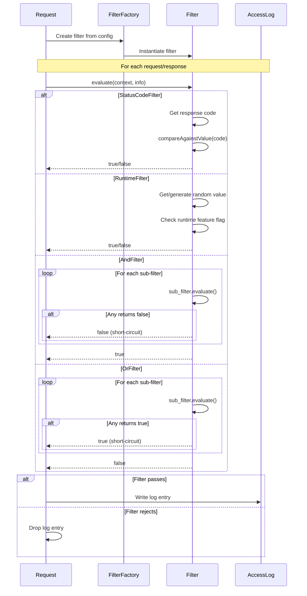

---

### 3. Access Log Manager

The `AccessLogManagerImpl` manages multiple log files and coordinates writing.

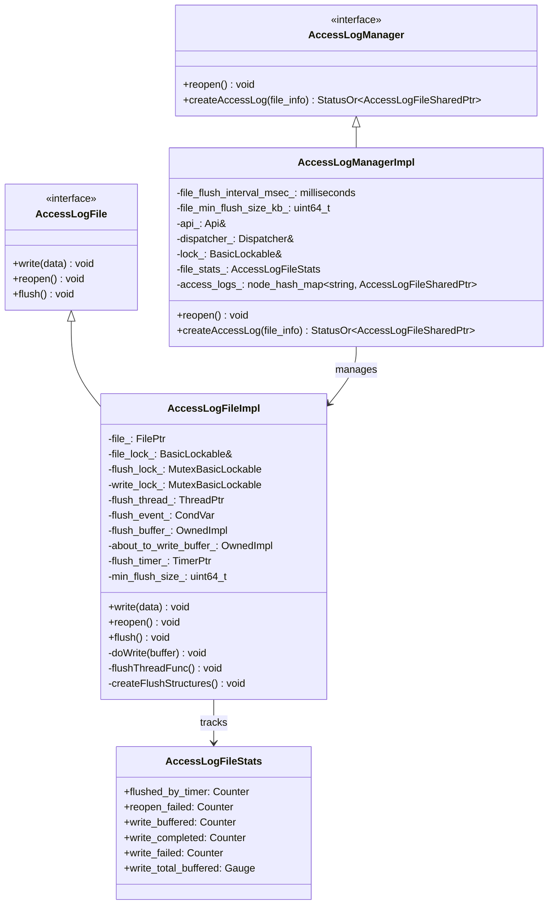

---

### 4. Threading Model

The `AccessLogFileImpl` uses a sophisticated multi-threaded design for high performance without blocking worker threads.

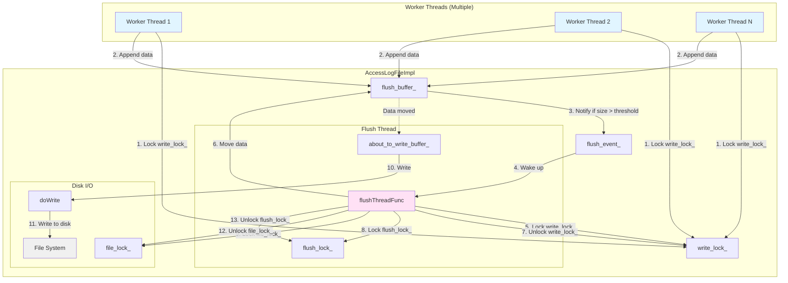

#### Lock Hierarchy

The locks are always acquired in this order to prevent deadlock:

1. **write_lock_** - Protects flush_buffer_ and coordination flags
2. **flush_lock_** - Protects about_to_write_buffer_ and flush operations
3. **file_lock_** - Cross-process lock for actual disk writes

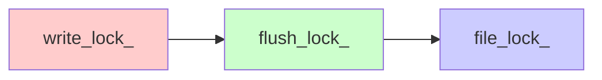

---

### 5. Write Flow

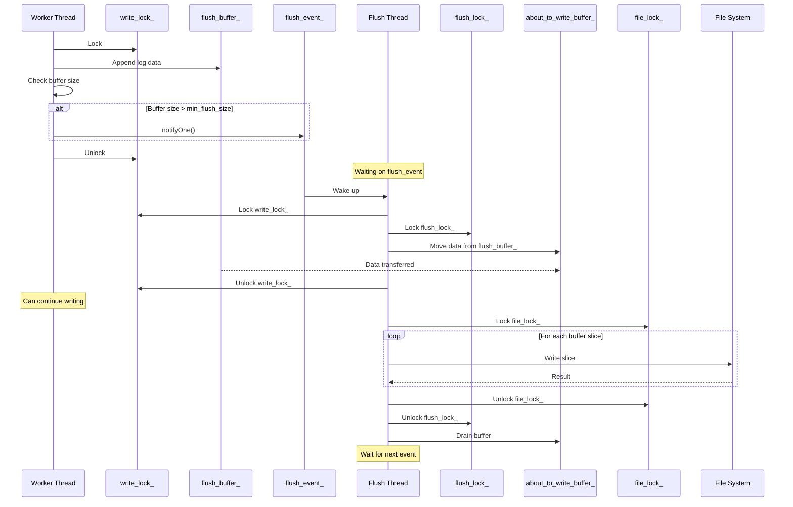

---

### 6. Flush Triggers

The flush thread is triggered by multiple conditions:

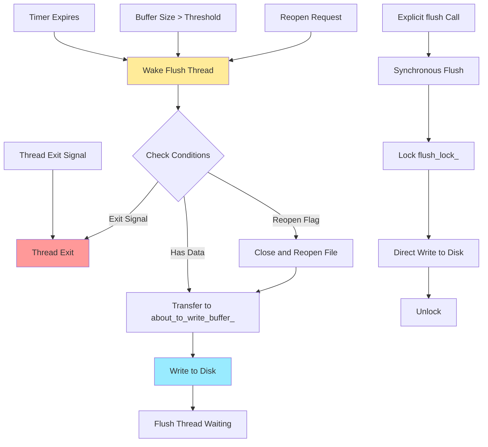

---

### 7. File Reopening Mechanism

File reopening is used for log rotation without blocking workers:

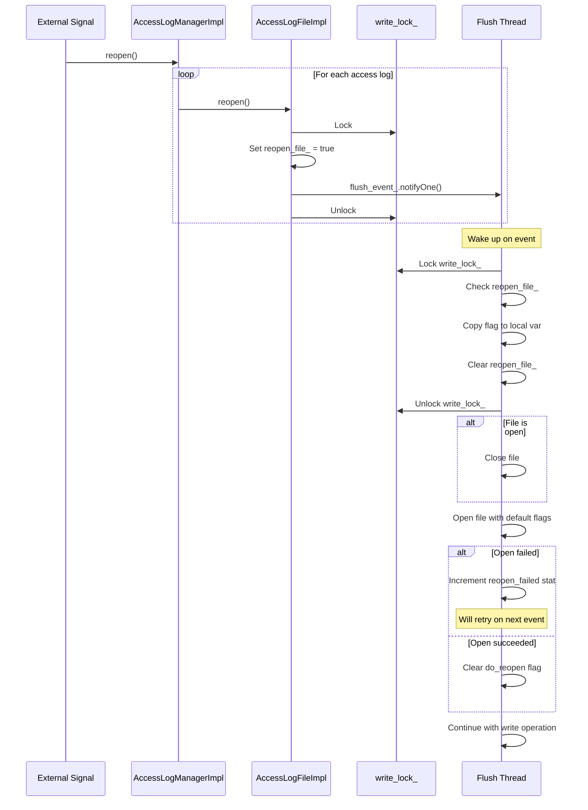

---

### 8. Factory Pattern

Both filters and access log instances use the factory pattern:

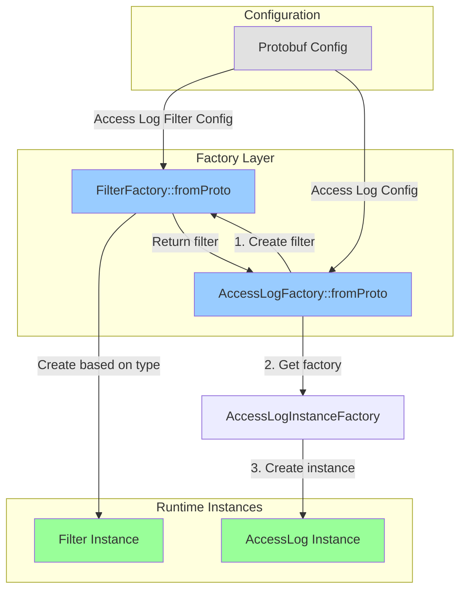

#### Filter Factory Logic

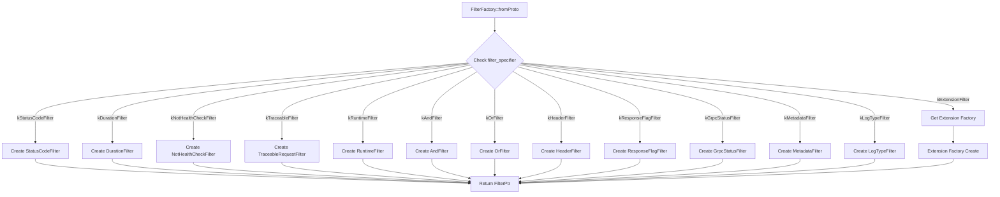

---

### 9. Statistics Tracking

The system tracks various statistics for monitoring:

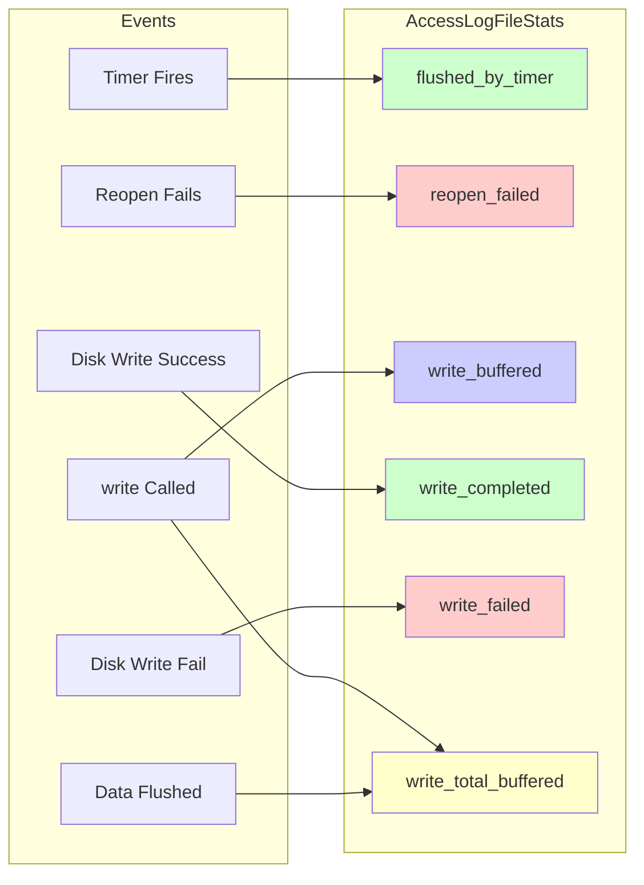

---

### 10. Comparison Filter Operators

The `ComparisonFilter` base class supports multiple comparison operators:

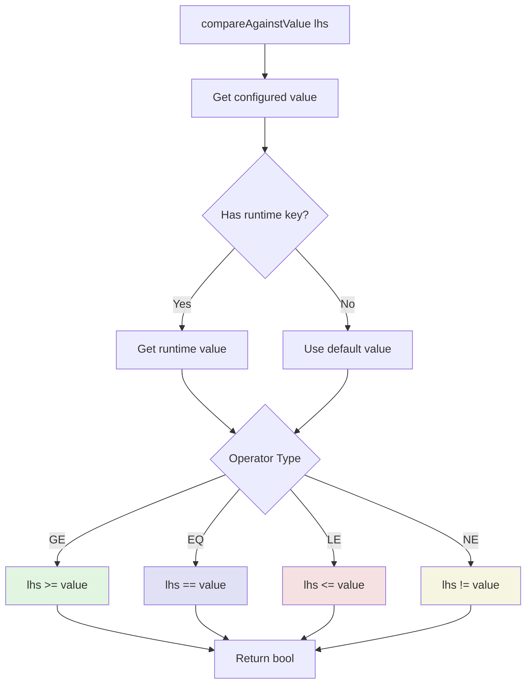

---

### 11. Buffer Management Strategy

The dual-buffer design minimizes lock contention:

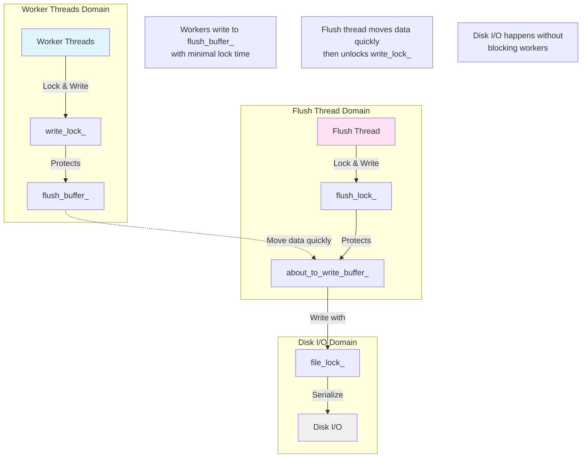

---

### 12. Key Design Patterns

#### Pattern 1: Double Buffering
- Workers write to `flush_buffer_`
- Flush thread quickly moves data to `about_to_write_buffer_`
- Disk I/O happens from `about_to_write_buffer_` without blocking workers

#### Pattern 2: Lazy Initialization
- Flush thread is created on first write
- Reduces resource usage for unused log files

#### Pattern 3: Condition Variable for Coordination
- Flush thread waits on `flush_event_`
- Woken by: timer, buffer threshold, reopen request, or exit signal
- Avoids busy-waiting and provides good responsiveness

#### Pattern 4: Cross-Process File Locking
- `file_lock_` is provided externally (process-wide)
- Enables safe log writing during hot restart
- Multiple processes can write to same file without corruption

#### Pattern 5: Factory Pattern with Type Registration
- Filters and access logs use factory pattern
- Extensible through plugin mechanism
- Configuration-driven instantiation

---

## Performance Characteristics

### Write Path Latency


- **Worker thread latency**: ~250ns (fast path)
- **No blocking on disk I/O**: Workers never wait for disk
- **Batched writes**: Multiple log entries flushed together
- **Minimal lock contention**: Separate locks for different operations

---

## Error Handling

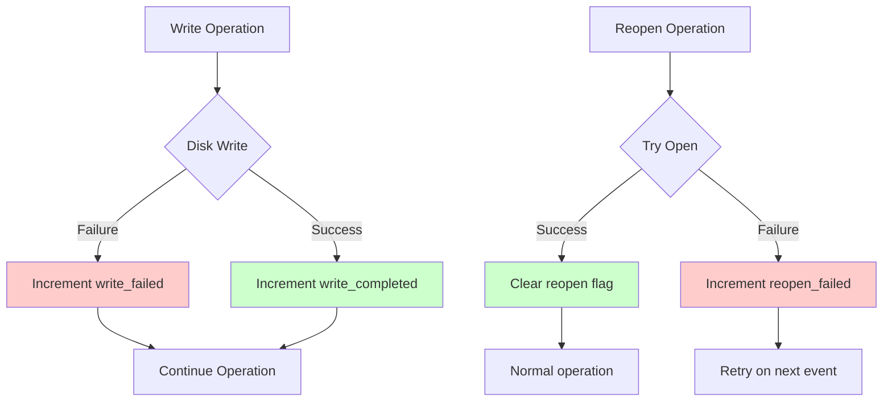

---

## Configuration Example

```yaml
access_log:
- name: envoy.access_loggers.file
  typed_config:
    "@type": type.googleapis.com/envoy.extensions.access_loggers.file.v3.FileAccessLog
    path: /var/log/envoy/access.log
    filter:
      and_filter:
        filters:
        - status_code_filter:
            comparison:
              op: GE
              value:
                default_value: 400
        - duration_filter:
            comparison:
              op: GE
              value:
                default_value: 1000
        - not_health_check_filter: {}
```

This configuration logs requests that:
- Have status code >= 400 AND
- Duration >= 1000ms AND
- Are not health checks

---

## Summary

The Envoy access log system is designed for:

1. **High Performance**: Async I/O, buffering, minimal lock contention
2. **Flexibility**: Composable filters, pluggable backends
3. **Reliability**: Cross-process safe, graceful error handling
4. **Observability**: Rich statistics tracking

The architecture separates concerns:
- **Filters** decide what to log
- **Manager** coordinates multiple logs
- **File Implementation** handles performant writing

This design allows Envoy to log millions of requests per second without impacting request processing latency.
