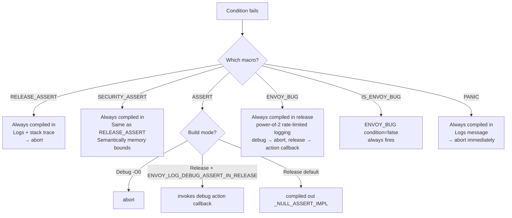

# Assertion & Bug Macros — `assert.h`

**File:** `source/common/common/assert.h`

Defines Envoy's hierarchy of assertion and fault-signalling macros. Each macro differs
in which build modes it compiles in, what action it takes on failure, and whether it
uses exponential back-off to suppress repeated logging.

---

## Macro Hierarchy



---

## Macro Reference

| Macro | Compiled in | Failure action (debug) | Failure action (release) |
|---|---|---|---|
| `RELEASE_ASSERT(X, details)` | Always | `abort()` | `abort()` |
| `SECURITY_ASSERT(X, details)` | Always | `abort()` | `abort()` |
| `ASSERT(X)` / `ASSERT(X, details)` | Debug only (or with flag) | `abort()` | debug-action callback (if flag set) |
| `SLOW_ASSERT(X)` | Debug + `ENVOY_LOG_DEBUG_ASSERT_IN_RELEASE` only | `abort()` | — |
| `KNOWN_ISSUE_ASSERT(X, details)` | Same as `ASSERT`; can be disabled via `ENVOY_DISABLE_KNOWN_ISSUE_ASSERTS` | `abort()` | debug-action callback |
| `ENVOY_BUG(condition, details)` | Always (release too) | `abort()` | log + callback (power-of-2 rate-limited) |
| `IS_ENVOY_BUG(details)` | Always | `abort()` | log + callback |
| `PANIC(msg)` | Always | `abort()` | `abort()` |
| `PANIC_DUE_TO_PROTO_UNSET` | Always | `abort()` | `abort()` |
| `PANIC_DUE_TO_CORRUPT_ENUM` | Always | `abort()` | `abort()` |
| `PANIC_ON_PROTO_ENUM_SENTINEL_VALUES` | Always (switch case) | `abort()` | `abort()` |

---

## `ASSERT` vs `ENVOY_BUG` — Key Distinction

```
ASSERT: programmer invariant — should NEVER fire in correct code.
        Compiled out in release by default.
        Use for things like "this pointer can't be null here".

ENVOY_BUG: unexpected condition that may fire in production.
           Always compiled in. Rate-limited to log on power-of-2 hits
           (1st, 2nd, 4th, 8th...) per unique source location.
           Use for xDS config violations, protocol errors, unexpected states.
```

### `ENVOY_BUG` Power-of-Two Rate Limiting

`shouldLogAndInvokeEnvoyBugForEnvoyBugMacroUseOnly(bug_name)` maintains an
`absl::flat_hash_map<string, uint64_t>` of hit counts keyed by `"file:line"`.
Returns `true` only when `hit_count` is a power of two (1, 2, 4, 8…), avoiding
log spam from frequently-triggered bugs in hot paths.

---

## `_ASSERT_IMPL` — Common Implementation

```cpp
#define _ASSERT_IMPL(CONDITION, CONDITION_STR, ACTION, DETAILS) \
    do {                                                          \
        if (!(CONDITION)) {                                       \
            ENVOY_LOG_TO_LOGGER(..., critical, "assert failure: {}", CONDITION_STR); \
            EnvoyBugStackTrace st;                                \
            st.capture();   // absl::GetStackTrace, skip_count=1 \
            st.logStackTrace();                                   \
            ACTION;          // abort() or callback              \
        }                                                         \
    } while (false)
```

All assert macros share this implementation, parametrized by `ACTION`.
`CONDITION_STR = #X` so macro expansions in the condition are not themselves
expanded in the log message (e.g., `"EAGAIN"` not `"11"`).

---

## `EnvoyBugStackTrace`

Captures up to 16 stack frames via `absl::GetStackTrace` (skipping the capture
call itself), then symbolizes each frame via `absl::Symbolize`. Logged to the
`envoy_bug` logger at `error` level. Used by both `ASSERT` and `ENVOY_BUG` macros.

---

## Action Registration (`ActionRegistration`)

Tests and crash-reporting infrastructure can register callbacks that fire on
assertion/ENVOY_BUG failures in non-debug builds:

```cpp
// Register handler for ASSERT failures (non-debug release builds with flag)
ActionRegistrationPtr handle =
    Assert::addDebugAssertionFailureRecordAction([](const char* location) {
        my_crash_reporter.report(location);
    });

// Register handler for ENVOY_BUG failures
ActionRegistrationPtr handle2 =
    Assert::addEnvoyBugFailureRecordAction([](const char* location) {
        my_stat_counter.increment(location);
    });
// handle/handle2 go out of scope → callbacks unregistered
```

`ActionRegistrationPtr` is RAII — the callback is removed when the returned
object is destroyed. Only one action of each type can be registered at a time.

---

## Proto-Specific Panic Macros

| Macro | Use case |
|---|---|
| `PANIC_DUE_TO_PROTO_UNSET` | `oneof` case not set — switch fell through |
| `PANIC_DUE_TO_CORRUPT_ENUM` | Enum value outside valid range |
| `PANIC_ON_PROTO_ENUM_SENTINEL_VALUES` | `case INT32_MAX: case INT32_MIN:` in switch — catches proto sentinel values without using `default:` |

---

## Build Mode Summary

| Flag | Effect |
|---|---|
| `NDEBUG` not defined | Debug build: all `ASSERT`s active, all failures abort |
| `NDEBUG` defined (default release) | `ASSERT` compiled out; `ENVOY_BUG` always active |
| `ENVOY_LOG_DEBUG_ASSERT_IN_RELEASE` | `ASSERT` + `SLOW_ASSERT` compiled into release; use action callback |
| `ENVOY_LOG_FAST_DEBUG_ASSERT_IN_RELEASE` | `ASSERT` only (not `SLOW_ASSERT`) compiled into release |
| `ENVOY_DISABLE_KNOWN_ISSUE_ASSERTS` | `KNOWN_ISSUE_ASSERT` compiled out regardless of build mode |
| `ENVOY_CONFIG_COVERAGE` | `ENVOY_BUG` logs but never aborts (prevents flaky coverage forks) |
