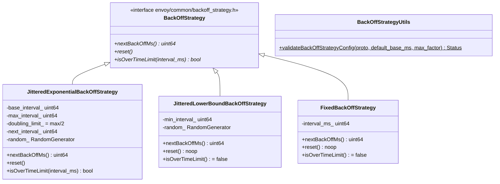

# Backoff Strategies — `backoff_strategy.h`

**File:** `source/common/common/backoff_strategy.h`

Three concrete implementations of `BackOffStrategy` for controlling reconnect/retry
timing. Used by gRPC streams, xDS reconnection, DNS retries, health check backoff,
and any place in Envoy that needs to retry with delay.

---

## Class Overview



---

## `JitteredExponentialBackOffStrategy` — Fully Jittered Exponential

Each call to `nextBackOffMs()` returns a **random** value in `[0, next_interval_)`,
then doubles `next_interval_` up to `max_interval_`. This is **full jitter**
(not equal jitter) as described in the AWS architecture blog.

### Algorithm

```
State: next_interval_ (starts at base_interval_)

nextBackOffMs():
    result = random.random() % next_interval_  // uniform in [0, next_interval_)
    if next_interval_ <= doubling_limit_:       // doubling_limit_ = max_interval_ / 2
        next_interval_ *= 2
    else:
        next_interval_ = max_interval_
    return result

reset():
    next_interval_ = base_interval_
```

### Example: base=250ms, max=30000ms

| Call | `next_interval_` before | Result range |
|---|---|---|
| 1 | 250 | [0, 250) |
| 2 | 500 | [0, 500) |
| 3 | 1000 | [0, 1000) |
| 4 | 2000 | [0, 2000) |
| ... | ... | ... |
| 8 | 30000 | [0, 30000) |
| 9+ | 30000 (capped) | [0, 30000) |

`isOverTimeLimit(ms)` returns `true` if `ms > max_interval_` — used to detect
that a retry has exceeded the maximum allowed retry age.

**Why full jitter?** Spreading reconnect times across `[0, cap]` prevents
thundering-herd reconnects when many clients lose connection simultaneously.

---

## `JitteredLowerBoundBackOffStrategy` — Bounded Random

Returns a random value in `[min_interval, 1.5 * min_interval)`:

```
result = min_interval_ + (random() % (min_interval_ / 2))
```

No exponential growth, no max interval. Used when you want slight randomization
around a fixed period but don't want exponential blowup. Suitable for polling-like
retries where a fixed-ish interval is appropriate.

`reset()` is a no-op (no state to reset). `isOverTimeLimit` always returns `false`.

---

## `FixedBackOffStrategy` — Constant Delay

Returns exactly `interval_ms_` on every call:

```cpp
nextBackOffMs() → interval_ms_  // always the same
```

No jitter, no growth. Used in tests or scenarios where deterministic timing is
needed. `reset()` is a no-op.

---

## `BackOffStrategyUtils::validateBackOffStrategyConfig`

Validates a `envoy.config.core.v3.BackoffStrategy` proto before constructing a
strategy:

```cpp
absl::Status status = BackOffStrategyUtils::validateBackOffStrategyConfig(
    proto,
    /*default_base_interval_ms=*/250,
    /*max_interval_factor=*/10  // max_interval defaults to base * 10
);
```

Returns `InvalidArgument` if `max_interval < base_interval`. Used during
xDS config validation to reject misconfigured backoff before creating the strategy.

---

## Proto Field Mapping

`envoy.config.core.v3.BackoffStrategy` fields:

| Proto field | C++ member | Default |
|---|---|---|
| `base_interval` | `base_interval_ms` | `default_base_interval_ms` param |
| `max_interval` | `max_interval_ms` | `base_interval_ms * max_interval_factor` |

---

## Usage in Envoy

| Subsystem | Strategy | Config |
|---|---|---|
| gRPC stream reconnection | `JitteredExponentialBackOffStrategy` | base=1s, max=120s |
| xDS (ADS/SotW) reconnect | `JitteredExponentialBackOffStrategy` | base=500ms, max=60s |
| DNS resolver retry | `JitteredExponentialBackOffStrategy` | configured per resolver |
| Health checker | `JitteredExponentialBackOffStrategy` | configured per health check |
| gRPC access log retry | `JitteredExponentialBackOffStrategy` | configurable |
| Redis connection retry | `JitteredExponentialBackOffStrategy` | base=1s, max=30s |
