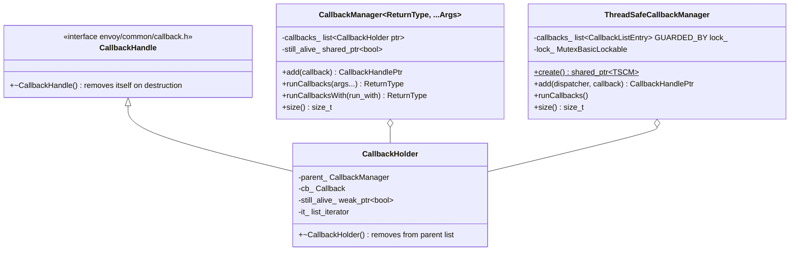
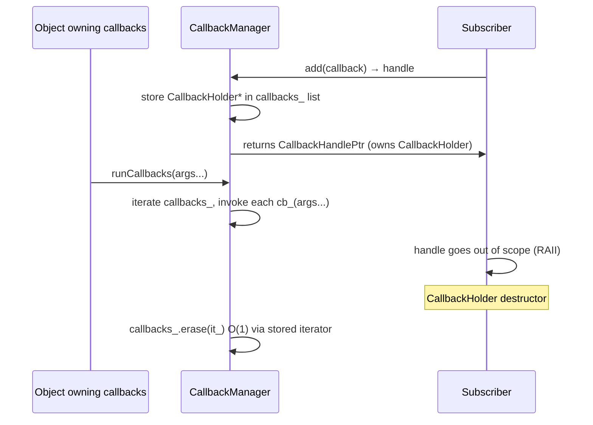
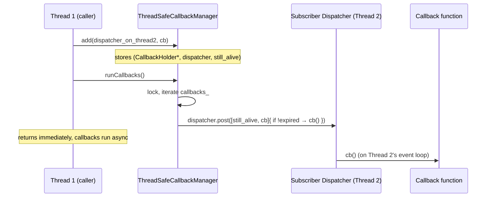

# Callback Manager — `callback_impl.h`

**File:** `source/common/common/callback_impl.h`

Two complementary callback managers used throughout Envoy for observer/event patterns:
`CallbackManager<ReturnType, Args...>` for single-thread use, and
`ThreadSafeCallbackManager` for cross-thread notification.

---

## Class Overview



---

## `CallbackManager<ReturnType, Args...>`

Single-threaded callback list. All methods must be called from the same thread.

### Lifecycle



### Thread Safety

**Not thread-safe.** All `add`, `runCallbacks`, and handle destruction must happen
on the same thread. `CallbackHolder::~CallbackHolder` uses `still_alive_.expired()`
(weak_ptr check) to detect if the manager has already been destroyed, preventing
use-after-free when callbacks outlive their manager.

### Safe Self-Removal During Iteration

```
runCallbacks iterates with: auto current = *(it++);
```
Pre-incrementing the iterator before invoking the callback means a callback can
destroy its own handle (`RAII`) and splice itself out of `callbacks_` safely.
However, destroying *another* callback's handle during iteration is **not safe** —
that would invalidate the iterator `it` already in use.

### `ReturnType` Specialization

When `ReturnType = absl::Status`, `runCallbacks` stops iteration and returns
the first non-OK status (`RETURN_IF_NOT_OK`). For `void`, all callbacks are invoked
unconditionally.

### `runCallbacksWith`

Generates fresh arguments per callback via a factory lambda, useful when arguments
are expensive to construct or must be re-built for each subscriber:

```cpp
manager.runCallbacksWith([]() -> std::tuple<Foo, Bar> {
    return {compute_foo(), compute_bar()};
});
```

---

## `ThreadSafeCallbackManager`

Cross-thread callback manager. Callbacks are registered with a `Dispatcher`, so when
`runCallbacks()` is called from any thread, each callback is **posted** to its
registration dispatcher rather than invoked inline.

### Design



**Must be held as `shared_ptr`** — `create()` factory enforces this. The
`shared_ptr<ThreadSafeCallbackManager>` is stored in each `CallbackHolder` to keep
the manager alive while there are pending posted callbacks.

### Cancellation Safety

Each `CallbackHolder` holds its own `shared_ptr<bool> still_alive`. When the holder
is destroyed (handle dropped), `still_alive` becomes orphaned (shared_ptr refcount
drops to 0 → bool destroyed). The posted lambda checks `if (!still_alive.expired())`
before invoking the callback — protecting against calling back into a destroyed object.

---

## Usage Patterns in Envoy

| Use case | Manager type | Example |
|---|---|---|
| Cluster update listeners (same thread) | `CallbackManager<void, ClusterInfo>` | `ClusterManagerImpl` notifying health checkers |
| Runtime feature flag watchers | `CallbackManager<void>` | `Runtime::Loader::addUpdateCallback` |
| Worker-to-main thread notifications | `ThreadSafeCallbackManager` | Overload manager callbacks across workers |
| LDS/RDS update callbacks | `CallbackManager<absl::Status>` | Stops propagation on first error |

### RAII Handle Pattern

The `ABSL_MUST_USE_RESULT` annotation on `add()` enforces storing the handle:

```cpp
// WRONG — handle immediately destroyed, callback never fires
manager.add(my_callback);  // compiler warning

// CORRECT
auto handle_ = manager.add(my_callback);  // stored as member
```
