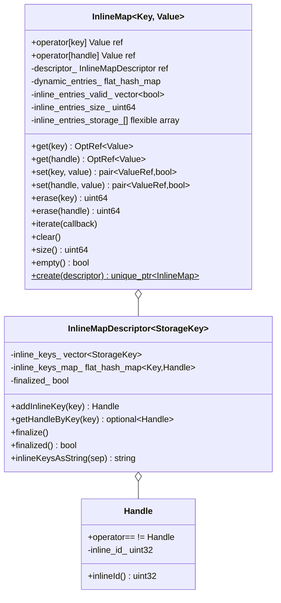

# Inline Map — `inline_map.h`

**File:** `source/common/common/inline_map.h`

`InlineMap<Key, Value>` is a hybrid hash map that stores a subset of
**pre-registered** keys in a flat array (zero-hash lookups), while dynamically-keyed
entries fall back to an `absl::flat_hash_map`. Designed for per-request filter state
and similar hot maps where the majority of keys are known at startup.

---

## Motivation

Standard hash maps (`absl::flat_hash_map`) hash every key on every lookup. For filter
state — where keys are filter names known at process startup — this overhead is
avoidable. `InlineMap` registers keys at bootstrap time and assigns them integer
`Handle`s (array indices). At runtime, `get(handle)` is a direct array subscript
with **zero hashing**.

```
InlineMapDescriptor:  {"filter.A" → Handle(0), "filter.B" → Handle(1)}

InlineMap:
  inline_entries_[0]  =  filter.A's state object  (array index — no hash)
  inline_entries_[1]  =  filter.B's state object  (array index — no hash)
  dynamic_entries_    =  {"unexpected.key" → ...}  (absl::flat_hash_map)
```

---

## Class Overview



---

## Two-Phase Setup

### Phase 1 — Register keys (bootstrap)

```cpp
InlineMapDescriptor<std::string> descriptor;

// Register known keys — must happen BEFORE finalize()
// Typically in global variable initialization:
auto handle_filter_a = descriptor.addInlineKey("envoy.filters.http.router");
auto handle_filter_b = descriptor.addInlineKey("envoy.filters.http.jwt");

// Seal the descriptor — no more keys can be added
descriptor.finalize();
```

`addInlineKey` is idempotent — calling it twice with the same key returns the same
`Handle`. Attempting to add after `finalize()` triggers a `RELEASE_ASSERT`.

### Phase 2 — Create map (per-request)

```cpp
auto map = InlineMap<std::string, MyState>::create(descriptor);

// Fast O(1) handle-based set/get:
map->set(handle_filter_a, MyState{...});
auto& state = map->get(handle_filter_a);  // direct array access

// Dynamic key fallback (slower, hash-based):
map->set("some.dynamic.key", DynState{...});
```

---

## Memory Layout

`InlineMap` uses a **flexible array member** (`inline_entries_storage_[]`) allocated
via a custom `operator new` that adds `N * sizeof(Value)` bytes to the allocation:

```cpp
static std::unique_ptr<InlineMap> create(TypedInlineMapDescriptor& descriptor) {
    return std::unique_ptr<InlineMap>(
        new (descriptor.inlineKeysNum() * sizeof(Value)) InlineMap(descriptor));
}
```

This places inline entries in a contiguous block immediately after the object,
improving cache locality. `Value` objects are placement-new'd into this storage
and explicitly destructed when erased or when the map is destroyed.

```
[ InlineMap fields | inline_entries_storage_: [Value 0][Value 1]...[Value N-1] ]
```

`inline_entries_valid_[i]` is a `std::vector<bool>` tracking which slots are
currently occupied (placement-new'd and not yet destructed).

---

## Lookup Performance

```
get(Handle):   O(1) — array index into inline_entries_storage_
get(key):      O(1) expected — checks dynamic_entries_ hash map first,
               then checks inline_keys_map_ to see if key has a handle
set(Handle):   O(1) — placement new into array slot
erase(Handle): O(1) — explicit destructor call + valid flag clear
iterate:       O(D + N) where D = dynamic entries, N = inline entries count
```

For `get(key)` the hash is computed once and reused for both the dynamic map lookup
and the inline key map lookup, avoiding double hashing.

---

## `set` Return Value

```cpp
auto [ref, inserted] = map->set(handle, value);
// ref:      reference to the value (new or existing)
// inserted: true if a new entry was created,
//           false if the key already existed (ref points to existing value)
```

Matches `absl::flat_hash_map::emplace` semantics — safe for "insert if absent" patterns.

---

## `iterate` Ordering

Iteration visits **dynamic entries first, then inline entries**. Within each group,
order is unspecified (hash map order for dynamic; insertion order for inline since
they are stored by `Handle` index).

---

## Usage in Envoy

| Context | Key type | Descriptor | Handle stored in |
|---|---|---|---|
| `StreamInfo::FilterState` | `std::string` (filter name) | `FilterStateDescriptor` singleton | Filter factory (static) |
| HTTP request headers inline storage | `Http::LowerCaseString` | Per-codec descriptor | Header map impl |
| Per-request filter metadata | `std::string` | Descriptor from filter chain | Filter factory |

The filter state use case is the primary motivation: every HTTP request creates a
`FilterState` map, and most of the keys (`envoy.filters.http.router`,
`envoy.filters.http.jwt`, etc.) are the same across all requests. By registering
handles at server startup, per-request lookups skip hashing entirely.

---

## `InlineMapDescriptor` After `finalize()`

After `finalize()`:
- `addInlineKey` triggers `RELEASE_ASSERT`
- `getHandleByKey(key)` is enabled (returns `optional<Handle>` — `nullopt` for dynamic keys)
- `inlineKeysNum()` returns the final count
- All created `InlineMap` instances for this descriptor have the same array size

This static size guarantee means all maps from one descriptor are interchangeable
in terms of inline slot layout.
