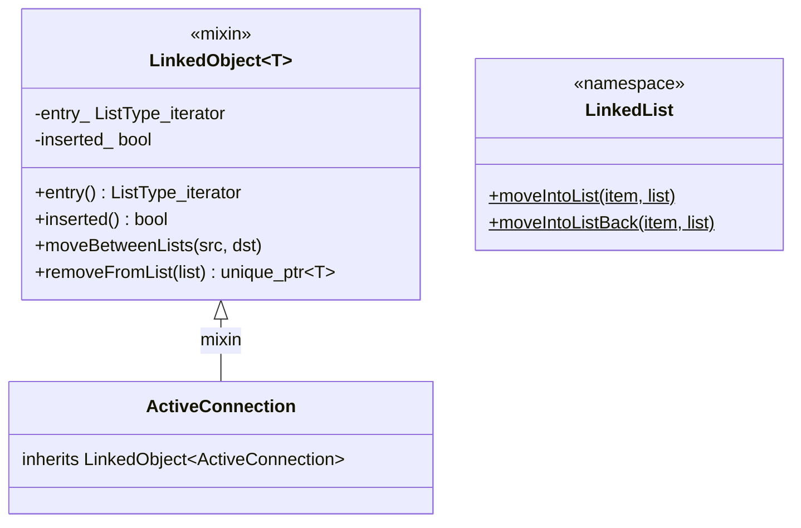

# Linked Object — `linked_object.h`

**File:** `source/common/common/linked_object.h`

`LinkedObject<T>` is a mixin that gives any class the ability to be efficiently
inserted into, moved between, and removed from `std::list<std::unique_ptr<T>>`
containers in O(1) time — without needing an external iterator reference at the
call site. Critical for connection and stream tracking throughout Envoy.

---

## Design



---

## `LinkedObject<T>` Members

### `entry_` — Stored Iterator

The key design insight: the `std::list` iterator is stored **inside the object
itself**. This allows O(1) removal from any list without a separate iterator lookup:

```cpp
connection->removeFromList(active_connections_);  // O(1)
```

In contrast, the alternative — scanning the list to find the element — is O(n).

### `inserted_` Flag

Iterators have no "invalid" state in C++, so `inserted_` tracks whether the object
is actually in a list. All methods `ASSERT(inserted_)` before use.

---

## Free Functions (`LinkedList` namespace)

### `moveIntoList` / `moveIntoListBack`

```cpp
template <typename T, typename U>
void moveIntoList(std::unique_ptr<T>&& item,
                  std::list<std::unique_ptr<U>>& list);
```

The **only** way to insert a `LinkedObject` into a list. Takes ownership via
`unique_ptr`, prepends (or appends for `Back`) to the list, then stores the resulting
iterator into `item->entry_`. The `inserted_` flag is set to `true`.

```cpp
auto conn = std::make_unique<ActiveConnection>(...);
LinkedList::moveIntoList(std::move(conn), active_connections_);
```

---

## Member Methods

### `removeFromList(list)` → `unique_ptr<T>`

Removes the object from the list and returns ownership as a `unique_ptr`. Sets
`inserted_ = false`. The caller now owns the object and can either destroy it
or re-insert it elsewhere.

```cpp
// Triggered by HCM when connection closes:
auto conn = active_conn->removeFromList(active_connections_);
// conn goes out of scope → connection destroyed
```

### `moveBetweenLists(src, dst)`

Moves the element from `src` to the front of `dst` using `std::list::splice` — O(1),
no allocation. The iterator stored in `entry_` remains valid because splicing does
not invalidate list iterators.

```cpp
// Move connection from "new connections" to "active" list:
conn->moveBetweenLists(new_connections_, active_connections_);
```

---

## Usage Patterns in Envoy

| Owner | List | Element type | Operation |
|---|---|---|---|
| `ConnectionHandlerImpl` | `active_connections_` | `ActiveTcpConnection` | insert on accept, remove on close |
| `Http::ConnectionManagerImpl` | `streams_` | `ActiveStream` | insert on new request, remove on end-stream |
| `Http1::ConnectionImpl` | `pending_responses_` | `PendingResponse` | insert on request, remove on response sent |
| `Upstream::ConnPoolImplBase` | `ready_clients_` / `busy_clients_` | `ActiveClient` | moveBetween on borrow/return |
| `Upstream::HealthCheckerImplBase` | `active_sessions_` | `ActiveHealthCheckSession` | insert on check start |

The pattern is always:

```
1. allocate unique_ptr<Derived>
2. LinkedList::moveIntoList(ptr, owner.list_)
3. ... object lives in list ...
4. obj->removeFromList(owner.list_)  // on closure/completion
```

---

## Ownership Invariant

Since `LinkedObject` is designed for use in `std::list<std::unique_ptr<T>>`, the
list owns the object. Removing from the list transfers ownership back to the
caller. This makes connection lifecycle explicit: the connection is alive exactly
as long as it is in the list.

```cpp
// Connection closes → calls:
auto conn = active_conn_->removeFromList(active_connections_);
// conn unique_ptr destructor runs → ~ActiveConnection runs
// → ~Http::ConnectionManagerImpl, ~TcpConnection, socket closed
```
