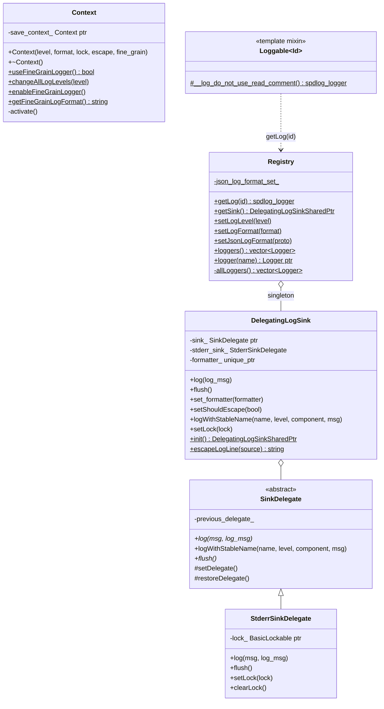

# Logging System — `logger.h`

**File:** `source/common/common/logger.h`

Envoy's logging is built on **spdlog** with a custom delegating sink architecture.
Every component uses a named `Logger::Id`, inherits `Logger::Loggable<Id>`, and logs
via the `ENVOY_LOG` family of macros. Log level, format, and lock are configured
globally through `Logger::Context`.

---

## Architecture



---

## Logger IDs (`Logger::Id`)

`ALL_LOGGER_IDS(FUNCTION)` X-macro expands to an `enum class Id` with ~70 named
loggers. Selected important ones:

| Id | Used by |
|---|---|
| `admin` | Admin server request handling |
| `connection` | TCP connection lifecycle |
| `http` | HTTP codec, stream events |
| `http2` | HTTP/2 codec events |
| `router` | Route matching and upstream selection |
| `upstream` | Upstream health, load balancing |
| `config` | xDS config parsing and update |
| `runtime` | Runtime flag reads and RTDS |
| `grpc` | gRPC codec and streams |
| `pool` | Connection pool events |
| `hc` | Health checker requests |
| `dns` | DNS resolution |
| `assert` | ASSERT macro failures |
| `envoy_bug` | ENVOY_BUG macro failures |
| `stats` | Stats store operations |
| `init` | Init manager target tracking |
| `quic` / `quic_stream` | QUIC transport |
| `misc` | Generic logging when no logger available |

---

## `Loggable<Id>` Mixin

```cpp
template <Id id>
class Loggable {
protected:
    static spdlog::logger& __log_do_not_use_read_comment() {
        static spdlog::logger& instance = Registry::getLog(id);
        return instance;
    }
};
```

Classes inherit `Logger::Loggable<Logger::Id::foo>` to bind to a named logger.
The static local variable is initialized once via `Registry::getLog`, which returns
a reference to the pre-created logger in the `allLoggers()` vector.

Usage:
```cpp
class MyClass : Logger::Loggable<Logger::Id::http> {
    void doWork() {
        ENVOY_LOG(debug, "Processing request for {}", path);
    }
};
```

---

## `DelegatingLogSink` — Sink Stack

`DelegatingLogSink` is the single global spdlog sink. It maintains a **stack** of
`SinkDelegate*` via `previous_delegate_`. This allows tests to temporarily override
the log destination without rebuilding all loggers:

```
DelegatingLogSink
    → current sink_ (e.g., test recorder)
        → previous_delegate_ (e.g., StderrSinkDelegate)
```

`StderrSinkDelegate` is always the terminal sink. A `Thread::BasicLockable` mutex
is set on it to serialize stderr writes across threads.

`setShouldEscape(true)` enables C-style escape of control characters in log lines
(useful to prevent log injection).

---

## `Context` — Log Level Scoping

`Context` sets the global log level, format, and thread lock. Contexts nest — when
a `Context` is destroyed, the previous context is restored.

```cpp
Context ctx(spdlog::level::debug,
             "[%Y-%m-%d %T.%e][%t][%l][%n] %v",
             mutex_,
             /*should_escape=*/true,
             /*enable_fine_grain=*/false);
// All loggers now use debug level
// Context destructor restores previous level
```

**Fine-grain logging**: When `enable_fine_grain_logging = true`, the per-file logger
(no explicit `Loggable<>` required) is used instead of the component logger. Enabled
globally via `Context::enableFineGrainLogger()`.

---

## Macro Reference

### Core macros

| Macro | Description |
|---|---|
| `ENVOY_LOG(level, ...)` | Log to the class's bound logger (`ENVOY_LOGGER()`) |
| `ENVOY_LOG_TO_LOGGER(logger, level, ...)` | Log to a specific logger |
| `ENVOY_LOG_MISC(level, ...)` | Log to the `misc` logger (no `Loggable<>` needed) |
| `ENVOY_CONN_LOG(level, fmt, conn, ...)` | Log with `ConnectionId` tag prepended |
| `ENVOY_STREAM_LOG(level, fmt, stream, ...)` | Log with `ConnectionId` + `StreamId` tags |
| `ENVOY_TAGGED_LOG(level, tags_map, fmt, ...)` | Log with arbitrary tag map serialized as `[Tags: "k":"v"]` |
| `ENVOY_LOG_EVENT(level, event_name, ...)` | Log + emit stable named event via `logWithStableName` |

### Rate-limiting macros

| Macro | Behavior | State |
|---|---|---|
| `ENVOY_LOG_ONCE(level, ...)` | Log at most 1 time | `static atomic<uint64_t>` per call site |
| `ENVOY_LOG_FIRST_N(level, N, ...)` | Log at most N times | `static atomic<uint64_t>` per call site |
| `ENVOY_LOG_EVERY_NTH(level, N, ...)` | Log every Nth call | `static atomic<uint64_t>` per call site |
| `ENVOY_LOG_EVERY_POW_2(level, ...)` | Log on calls 1, 2, 4, 8… | `static atomic<uint64_t>` per call site |
| `ENVOY_LOG_PERIODIC(level, duration, ...)` | Log at most once per duration | `static atomic<int64_t>` timestamp per call site |

All rate-limited macros use `static` atomic counters per call site — they are
**not** reset between requests or connections. Use `ENVOY_LOG_ONCE` for startup
warnings, `ENVOY_LOG_PERIODIC` for ongoing operational logging.

### Level-check optimization

```cpp
#define ENVOY_LOG_COMP_LEVEL(LOGGER, LEVEL) \
    (ENVOY_SPDLOG_LEVEL(LEVEL) >= (LOGGER).level())
```

All macros check the level before evaluating format arguments, avoiding string
formatting overhead for suppressed log levels.

---

## `CustomFlagFormatter` — Log Format Flags

Custom spdlog pattern flags registered via `setLogFormat`:

| Flag char | Class | Effect |
|---|---|---|
| `_` | `EscapeMessageNewLine` | Replaces `\n` → `\\n` in message body |
| `j` | `EscapeMessageJsonString` | JSON-escapes the message body |
| `*` | `ExtractedTags` | Extracts `[Tags: ...]` prefix as separate JSON properties |
| `+` | `ExtractedMessage` | Extracts the message body after the `[Tags: ...]` prefix |

These are used for structured JSON log formatting: `%*` emits tags as JSON fields,
`%+` emits the message, enabling downstream log processors to parse structured logs.

---

## `Logger::Utility` — Tag Serialization

```cpp
std::string serializeLogTags(const std::map<std::string, std::string>& tags);
// Output: [Tags: "key1":"val1","key2":"val2"]
// In JSON mode: JSON-escaped key/value strings
```

The prefix `[Tags: ` and suffix `] ` are defined as constants for search/parsing.

---

## JSON Log Format

When `Registry::setJsonLogFormat(proto)` is called with a struct proto, the log
format switches to JSON. `EscapeMessageJsonString` (`%j`) and `ExtractedTags` (`%*`)
become active, producing structured log lines like:

```json
{"timestamp":"2024-01-01T00:00:00.000Z","level":"info","logger":"http",
 "ConnectionId":"12345","StreamId":"67","message":"request started"}
```
