# Matchers — `matchers.h`

**File:** `source/common/common/matchers.h`

Provides the full hierarchy of string, value, path, metadata, and filter-state
matchers used throughout Envoy's routing, RBAC, header matching, and admin
endpoint filtering. All implementations derive from either `StringMatcher` or
`ValueMatcher` interfaces, and are built from proto configs at xDS load time.

---

## Class Hierarchy

```mermaid
classDiagram
    class StringMatcher {
        <<interface envoy/common/matchers.h>>
        +match(value)* bool
        +match(value, context)* bool
    }

    class ValueMatcher {
        <<abstract>>
        +match(Protobuf::Value)* bool
        +create(proto, context)$ ValueMatcherConstSharedPtr
    }

    class StringMatcherImpl {
        +match(value) bool
        +match(value, context) bool
        +match(Protobuf::Value) bool
        +getCaseSensitivePrefixMatch(prefix) bool
        +stringRepresentation() string
        +createExactMatcher(match)$ StringMatcherImpl
        -matcher_ StringMatcherVariant
    }

    class UniversalStringMatcher {
        +match(value) = true
    }

    class ExactStringMatcher { -exact_ -ignore_case_ }
    class PrefixStringMatcher { -prefix_ -ignore_case_ }
    class SuffixStringMatcher { -suffix_ -ignore_case_ }
    class RegexStringMatcher { -regex_ CompiledMatcherPtr }
    class ContainsStringMatcher { -contents_ -ignore_case_ }
    class CustomStringMatcher { -custom_ StringMatcherPtr }

    class PathMatcher {
        +match(path) bool
        +stringRepresentation() string
        +createExact(...)$ PathMatcherConstSharedPtr
        +createPrefix(...)$ PathMatcherConstSharedPtr
        +createSafeRegex(...)$ PathMatcherConstSharedPtr
        -matcher_ StringMatcherImpl
    }

    class MetadataMatcher {
        +match(Metadata) bool
        -path_ vector~string~
        -value_matcher_ ValueMatcherConstSharedPtr
    }

    class FilterStateMatcher {
        +match(FilterState) bool
        +create(proto, context)$ StatusOr
        -key_ string
        -object_matcher_ FilterStateObjectMatcherPtr
    }

    class NullMatcher
    class BoolMatcher { -matcher_ bool }
    class PresentMatcher { -matcher_ bool }
    class DoubleMatcher { -matcher_ proto }
    class ListMatcher { -oneof_value_matcher_ }
    class OrMatcher { -or_matchers_ vector }

    StringMatcher <|-- StringMatcherImpl
    StringMatcher <|-- UniversalStringMatcher
    StringMatcher <|-- PathMatcher
    ValueMatcher <|-- StringMatcherImpl
    ValueMatcher <|-- NullMatcher
    ValueMatcher <|-- BoolMatcher
    ValueMatcher <|-- PresentMatcher
    ValueMatcher <|-- DoubleMatcher
    ValueMatcher <|-- ListMatcher
    ValueMatcher <|-- OrMatcher
    StringMatcherImpl o-- ExactStringMatcher
    StringMatcherImpl o-- PrefixStringMatcher
    StringMatcherImpl o-- SuffixStringMatcher
    StringMatcherImpl o-- RegexStringMatcher
    StringMatcherImpl o-- ContainsStringMatcher
    StringMatcherImpl o-- CustomStringMatcher
```



---

## `StringMatcherImpl` — The Core Matcher

`StringMatcherImpl` is a variant holder over all 6 leaf matcher types. It implements
both `StringMatcher` (for `absl::string_view` inputs) and `ValueMatcher` (for
`Protobuf::Value` inputs), dispatching via `absl::visit`.

### Variant Type

```cpp
using StringMatcherVariant = absl::variant<
    ExactStringMatcher,
    PrefixStringMatcher,
    SuffixStringMatcher,
    RegexStringMatcher,
    ContainsStringMatcher,
    CustomStringMatcher
>;
```

### Construction

Built from either `envoy::type::matcher::v3::StringMatcher` or
`xds::core::v3::StringMatcher` via a templated constructor — both proto types
have the same field structure.

```cpp
// From proto
StringMatcherImpl matcher(proto_matcher, factory_context);

// Shortcut for exact match without factory context
auto m = StringMatcherImpl::createExactMatcher("exact-value");
```

### Leaf Matcher Implementations

| Matcher | Proto field | Case-insensitive? | Implementation |
|---|---|---|---|
| `ExactStringMatcher` | `exact` | Optional | `absl::EqualsIgnoreCase` or `==` |
| `PrefixStringMatcher` | `prefix` | Optional | `absl::StartsWith[IgnoreCase]` |
| `SuffixStringMatcher` | `suffix` | Optional | `absl::EndsWith[IgnoreCase]` |
| `ContainsStringMatcher` | `contains` | Optional | `absl::StrContains` (lowercases input if ignore_case) |
| `RegexStringMatcher` | `safe_regex` | N/A | `Regex::CompiledMatcher::match` (RE2) |
| `CustomStringMatcher` | `custom` | N/A | Extension via `StringMatcherExtensionFactory` |

### `getCaseSensitivePrefixMatch` Optimization

Routes and header matchers frequently need to check whether a matcher is a simple
case-sensitive prefix — used to build prefix tries and routing tables:

```cpp
std::string prefix;
if (matcher.getCaseSensitivePrefixMatch(prefix)) {
    trie.insert(prefix, route);
}
```

---

## `PathMatcher`

Wraps `StringMatcherImpl` for URL path matching. Implements `StringMatcher` so it
can be used wherever a `StringMatcher` is expected.

```cpp
auto pm = PathMatcher::createPrefix("/api/v1", /*ignore_case=*/false, ctx);
pm->match("/api/v1/users");  // true
pm->match("/API/V1/users");  // false (case-sensitive)
```

Factory methods for `Exact`, `Prefix`, `SafeRegex` create from string without needing
a full `PathMatcher` proto.

---

## `MetadataMatcher`

Matches against `envoy::config::core::v3::Metadata` (endpoint or listener metadata)
by traversing a dot-separated path and applying a `ValueMatcher` at the leaf:

```
path: ["filter_metadata", "envoy.lb", "version"]
value_matcher: ExactStringMatcher("v2")
```

Walks the `filter_metadata` protobuf map following the path keys, then tests the
final value. Returns `false` if any intermediate key is missing.

---

## `FilterStateMatcher`

Matches against `StreamInfo::FilterState` objects by key. The `object_matcher_`
is a `FilterStateObjectMatcherPtr` (extension point) that knows how to extract and
compare the typed object stored at the key.

```cpp
auto fsmatcher = FilterStateMatcher::create(proto, context);
fsmatcher->match(stream_info.filterState()); // true/false
```

---

## `ValueMatcher` Hierarchy

For matching `Protobuf::Value` (JSON-like values in metadata):

| Matcher | Matches |
|---|---|
| `NullMatcher` | `null_value` |
| `BoolMatcher` | `bool_value == expected` |
| `PresentMatcher` | Any non-null value (or null if `present=false`) |
| `DoubleMatcher` | Numeric range or exact double comparison |
| `StringMatcherImpl` | String value via any `StringMatcherVariant` |
| `ListMatcher` | List where at least one element matches `oneof_value_matcher` |
| `OrMatcher` | Any of multiple `ValueMatcher`s matches |

---

## `UniversalStringMatcher`

Always returns `true`. Used as the default "match everything" matcher when no
filter is configured, avoiding null checks at call sites.

---

## `StringMatcherExtensionFactory`

Extension point for custom string matchers:

```cpp
class StringMatcherExtensionFactory : public Config::TypedFactory {
    virtual StringMatcherPtr createStringMatcher(
        const Protobuf::Message& config,
        CommonFactoryContext& context) PURE;
    std::string category() const override { return "envoy.string_matcher"; }
};
```

Registered extensions populate the `custom` field of `StringMatcher` proto.
Retrieved via `getExtensionStringMatcher()`.

---

## Usage Across Envoy

| Subsystem | Matcher type | Applied to |
|---|---|---|
| Route matching (`HeaderMatcher`) | `StringMatcherImpl` | Request header values |
| Route matching (`PathMatcher`) | `PathMatcher` | `:path` pseudo-header |
| RBAC filter | `StringMatcherImpl`, `MetadataMatcher` | Principals, permissions |
| Admin handler prefix | `StringMatcherImpl` | URL path prefixes |
| JWT filter | `StringMatcherImpl` | Issuer/audience strings |
| ConfigDump `name_regex` | `StringMatcherImpl` | xDS resource names |
| ListenerFilter | `FilterStateMatcher` | Filter state key matching |
