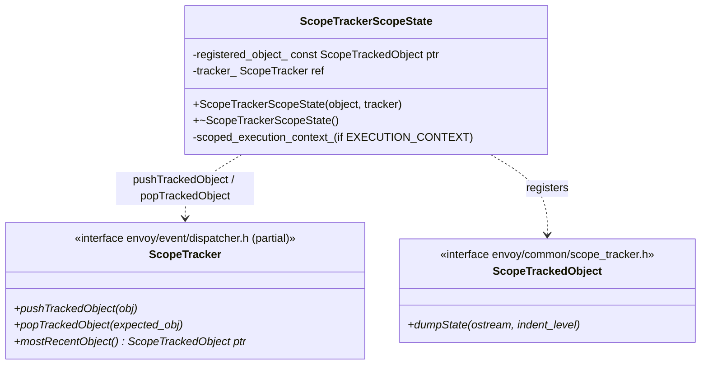

# Scope Tracker — `scope_tracker.h`

**File:** `source/common/common/scope_tracker.h`

Provides `ScopeTrackerScopeState` — an RAII guard that pushes/pops a
`ScopeTrackedObject*` onto the dispatcher's crash-context stack. When Envoy crashes,
the stack of tracked objects is dumped to identify which connection/stream/request was
being processed at the time of the fault.

---

## Class Overview



---

## `ScopeTrackerScopeState` — RAII Push/Pop

```cpp
class ScopeTrackerScopeState {
  public:
    ScopeTrackerScopeState(const ScopeTrackedObject* object,
                           Event::ScopeTracker& tracker)
        : registered_object_(object), tracker_(tracker) {
        tracker_.pushTrackedObject(registered_object_);
    }

    ~ScopeTrackerScopeState() {
        tracker_.popTrackedObject(registered_object_);
    }

    void* operator new(std::size_t) = delete;  // stack-only
};
```

The `operator new = delete` prevents heap allocation — the object **must** live on
the stack so its destructor is guaranteed to run when the scope exits, even on
exception or early return.

---

## Usage Pattern

Typically used at the start of any callback that processes a connection or stream:

```cpp
// In Http::ConnectionManagerImpl::decodeHeaders
void ActiveStream::decodeHeaders(RequestHeaderMap& headers, bool end_stream) {
    ScopeTrackerScopeState scope(this, dispatcher_);
    // If Envoy crashes here, "this" (ActiveStream) will be dumped
    // ...process headers...
}
```

```cpp
// In Network::ConnectionImpl::onReadReady
void ConnectionImpl::onReadReady() {
    ScopeTrackerScopeState scope(this, dispatcher_);
    // ...
}
```

---

## Crash Context Stack

The `ScopeTracker` (implemented by `Event::DispatcherImpl`) maintains an internal
stack of `ScopeTrackedObject*`:

```
Crash context stack (top = most recent):
  [0] ActiveStream (id=12345, path=/api/v1/users)
  [1] ActiveConnection (peer=192.168.1.1:54321)
```

When a crash handler fires (e.g., signal handler, `RELEASE_ASSERT`), it calls
`dumpState()` on each object in the stack from top to bottom. Each `ScopeTrackedObject`
implementation dumps its relevant state (connection info, request headers, stream ID,
etc.) to help diagnose the crash.

---

## `ScopeTrackedObject::dumpState`

```cpp
class ActiveStream : public ScopeTrackedObject {
    void dumpState(std::ostream& os, int indent_level) const override {
        DUMP_STATE_HELPER(os, indent_level,
            "stream_id_", stream_id_,
            "path_", request_headers_->path());
    }
};
```

`dumpState(os, indent_level)` is called by the crash handler (or `/config_dump` for
init manager debugging). `indent_level` controls nested indentation for sub-objects.

---

## `ScopedExecutionContext` (Optional)

When `ENVOY_ENABLE_EXECUTION_CONTEXT` is defined, `ScopeTrackerScopeState` also
constructs a `ScopedExecutionContext` member. This hooks into the execution context
framework (used for flow-control and accounting), associating the current execution
unit with a specific object for resource tracking.

---

## Implementing `ScopeTrackedObject`

Any object that processes work on the event loop should implement this:

```cpp
class MyConnection : public ScopeTrackedObject {
    void dumpState(std::ostream& os, int indent_level) const override {
        const std::string indent(indent_level * 2, ' ');
        os << indent << "MyConnection: peer=" << peer_address_
           << " state=" << stateName(state_) << "\n";
    }
};

// In callbacks:
void MyConnection::onDataReceived(Buffer::Instance& data) {
    ScopeTrackerScopeState scope(this, dispatcher_);
    processData(data);
}
```

---

## Classes Implementing `ScopeTrackedObject`

| Class | State dumped |
|---|---|
| `Network::ConnectionImpl` | Peer address, connection state, filter chain |
| `Http::ConnectionManagerImpl::ActiveStream` | Stream ID, request path/method, response code |
| `Http2::ConnectionImpl` | Active stream count, pending frames |
| `Upstream::PendingRequest` | Cluster name, request headers |
| `Grpc::AsyncClientImpl` | RPC method, stream state |
