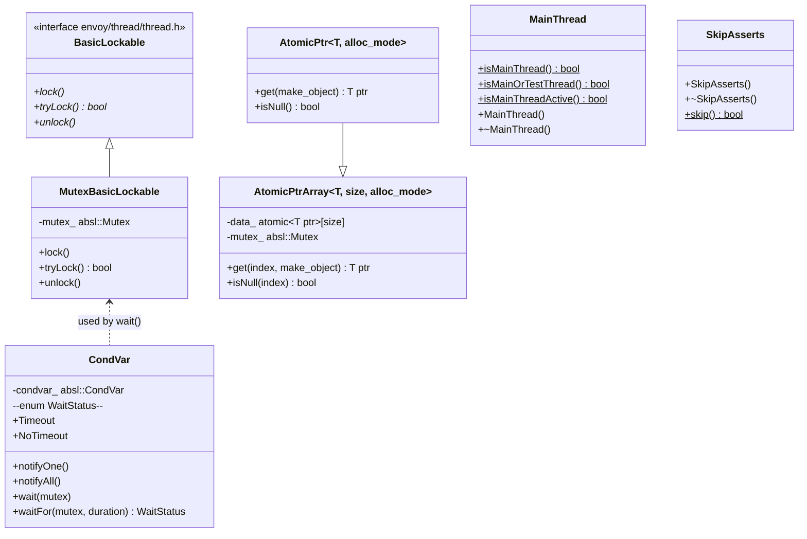
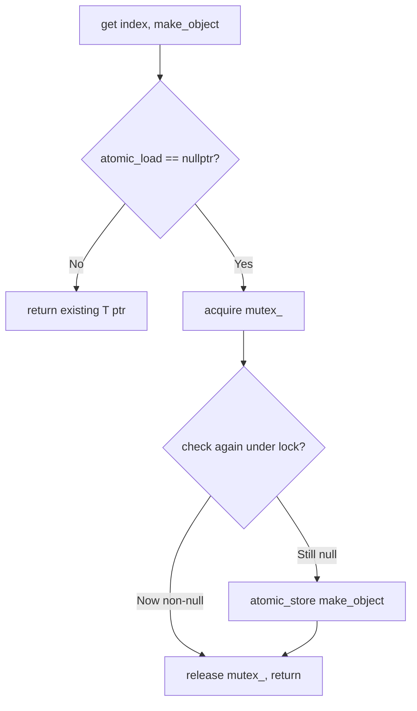

# Thread Primitives — `thread.h`

**File:** `source/common/common/thread.h`

Envoy's threading utilities built on `absl::Mutex` / `absl::CondVar`. Provides
`MutexBasicLockable`, `CondVar`, lock-free lazy-init containers (`AtomicPtrArray`,
`AtomicPtr`), `MainThread` / `TestThread` identity helpers, thread-assertion macros,
and exception-handling macros that compile away when exceptions are disabled.

---

## Class Overview



---

## `MutexBasicLockable`

Implements `Thread::BasicLockable` (Envoy's lockable interface) using `absl::Mutex`.
Used throughout Envoy as the standard mutex type — passed to `Logger::Context`,
`StderrSinkDelegate`, `ThreadSafeCallbackManager`, etc.

```cpp
Thread::MutexBasicLockable lock_;
Thread::LockGuard guard(lock_);  // RAII lock
```

`absl::Mutex` provides thread-safety annotations (`ABSL_GUARDED_BY`,
`ABSL_EXCLUSIVE_LOCKS_REQUIRED`) enforced by the Clang thread-safety analysis.

---

## `CondVar`

Hybrid between `std::condition_variable` and `absl::CondVar`. Wraps `absl::CondVar`
to preserve thread-safety annotation compatibility with `MutexBasicLockable`:

```cpp
Thread::MutexBasicLockable mu;
Thread::CondVar cv;

// Waiter thread:
{
    Thread::LockGuard g(mu);
    while (!ready_) cv.wait(mu);
}

// Notifier thread:
cv.notifyOne();
```

`waitFor` returns `WaitStatus::Timeout` if the duration elapsed without notification,
`WaitStatus::NoTimeout` on success or spurious wakeup.

> **Note**: unlike `std::condition_variable::wait(lock, pred)`, Envoy's `CondVar` does
> not take a predicate — callers must re-check the condition in a `while` loop.

---

## `AtomicPtrArray<T, size, alloc_mode>` — Lock-Free Lazy Init

Double-checked locking for lazy initialization of an array of `T*`:



The outer `atomic.load()` without lock avoids mutex overhead on the common path
(already initialized). Under lock, re-checks to prevent two racing threads from
both constructing the object.

`alloc_mode`:
- `DoNotDelete` — caller manages lifetime of returned `T*`
- `DeleteOnDestruct` — `~AtomicPtrArray` deletes all non-null entries

Used heavily for per-stat-scope atomic codec-stats pointers (e.g.,
`Http::Http1::CodecStats::AtomicPtr`).

### `AtomicPtr<T, alloc_mode>`

Single-element specialization of `AtomicPtrArray`. Used when there is exactly one
lazily-initialized object to protect.

---

## `MainThread` — Thread Identity

RAII object that declares the current thread as the "main thread":

```cpp
// In main_common.cc:
Thread::MainThread main_thread;
// Now Thread::MainThread::isMainThread() returns true on this thread
```

Envoy uses this to enforce that certain operations only occur on the main thread
(config updates, listener hot-restart, etc.). Typically instantiated in
`main_common()` and in `ThreadLocal::Instance` for tests.

```cpp
Thread::MainThread::isMainThread()      // true on main thread only
Thread::MainThread::isMainOrTestThread() // true on main or test thread
Thread::MainThread::isMainThreadActive() // true if a MainThread RAII object exists
```

---

## `TestThread` — Test Thread Identity

```cpp
Thread::TestThread::isTestThread()  // Linux/macOS only
```

Identifies the "test thread" (the thread running the test function). Available on
Linux and macOS. Used by assertion macros to allow test code to bypass certain
main-thread-only checks.

---

## Thread-Assertion Macros

```cpp
ASSERT_IS_MAIN_OR_TEST_THREAD()   // fires if on a worker thread
ASSERT_IS_TEST_THREAD()           // fires if not on the test thread
ASSERT_IS_NOT_MAIN_OR_TEST_THREAD() // fires if called from main (for worker-only code)
```

All are no-ops in release builds (`NDEBUG` defined) or when platform thread detection
is unavailable. Also no-ops when a `SkipAsserts` object is alive.

---

## `SkipAsserts` — Disabling Thread Assertions

RAII class for test code that intentionally violates threading assumptions (e.g.,
synchronously calling worker-only callbacks from the main thread in unit tests):

```cpp
Thread::SkipAsserts skip;
// Thread assertions suppressed within this scope
some_worker_only_function();
```

`SkipAsserts::skip()` returns true while any `SkipAsserts` is alive, and the macros
`ASSERT_IS_*` all check this first.

---

## Exception Macros

Envoy can be built with `ENVOY_DISABLE_EXCEPTIONS`, replacing C++ exceptions with
process aborts. These macros abstract that:

| Macro | Exceptions enabled | Exceptions disabled |
|---|---|---|
| `TRY_NEEDS_AUDIT` | `try {` | `{` (no exception catching) |
| `CATCH(Type, handler)` | `catch (Type) { handler }` | empty |
| `MULTI_CATCH(Type, h1, h2)` | `catch (Type){h1} catch(...){h2}` | empty |
| `TRY_ASSERT_MAIN_THREAD` | `try { ASSERT_IS_MAIN_OR_TEST_THREAD();` | `{` |
| `END_TRY` | `}` | `}` |

`TRY_NEEDS_AUDIT` marks try/catch blocks that need review for exception-safety.
`TRY_ASSERT_MAIN_THREAD` enforces that the try block only runs on the main thread
(config parsing must not be done on workers).
