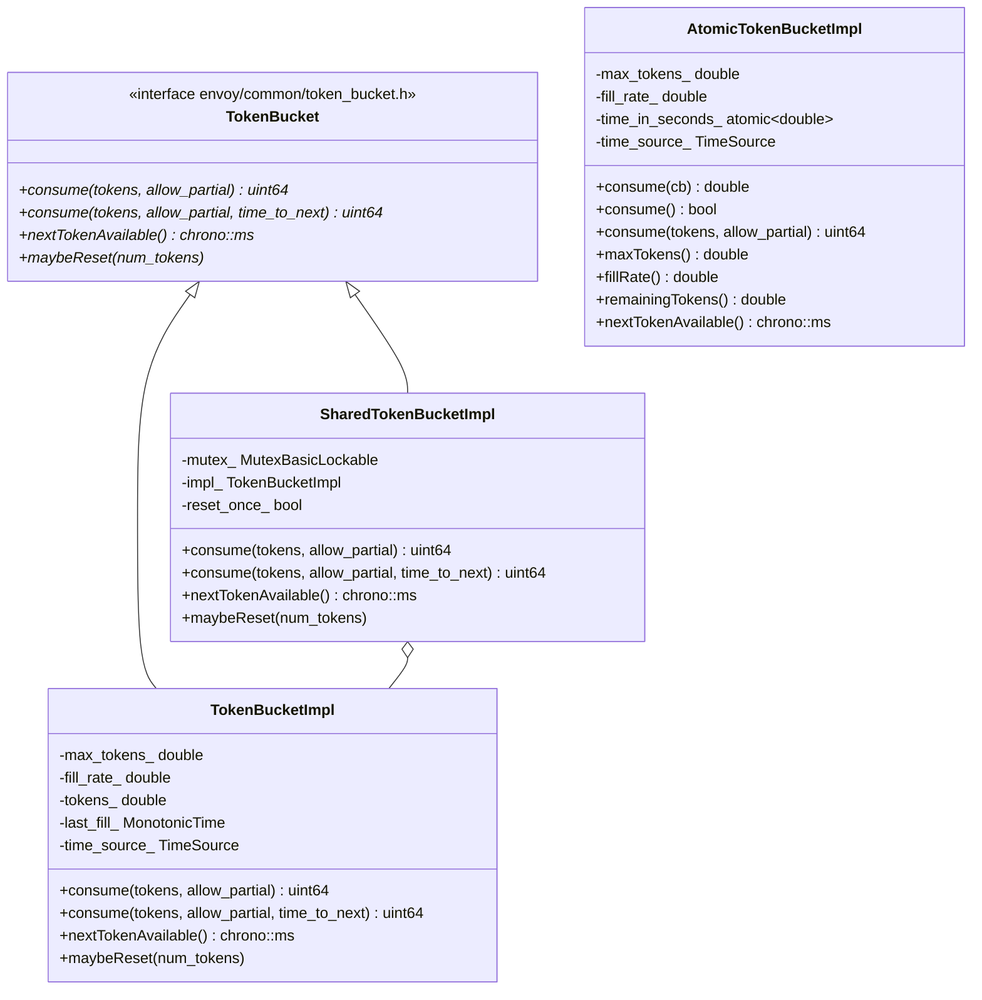

# Token Bucket — `token_bucket_impl.h` / `shared_token_bucket_impl.h`

**Files:**
- `source/common/common/token_bucket_impl.h` — `TokenBucketImpl`, `AtomicTokenBucketImpl`
- `source/common/common/shared_token_bucket_impl.h` — `SharedTokenBucketImpl`

Three token bucket implementations for rate limiting at different levels of thread
safety. Used in local rate limiting, ENVOY_BUG logging frequency, connection limits,
HTTP/2 PING rate control, and more.

---

## Class Overview



---

## Token Bucket Algorithm

All implementations use the **token-bucket** algorithm:
- Bucket holds up to `max_tokens` tokens
- Refills at `fill_rate` tokens/second (continuous, time-based)
- `consume(N)` removes N tokens if available; returns 0 if not enough

### `TokenBucketImpl` — Time-Based Refill

Tokens are computed on each `consume()` call using elapsed time since `last_fill_`:

```
available_tokens = min(max_tokens, tokens_ + fill_rate * elapsed_seconds)
```

Not thread-safe — must only be used from a single event loop thread.

```cpp
// Rate: 100 requests/second, burst: 100
TokenBucketImpl bucket(100, time_source_, 100.0);

// Returns 1 if available, 0 if empty
uint64_t consumed = bucket.consume(1, /*allow_partial=*/false);

// Returns partial tokens up to what's available
uint64_t consumed = bucket.consume(10, /*allow_partial=*/true);

// Returns time until next token (for retry backoff)
std::chrono::milliseconds wait = bucket.nextTokenAvailable();
```

`maybeReset(N)` resets `tokens_` to `N` (used to pre-fill bucket on startup).

---

## `AtomicTokenBucketImpl` — Lock-Free Thread-Safe

Uses a CAS loop on `time_in_seconds_` (an `std::atomic<double>`) to represent bucket
state without a mutex. The time offset encodes how many tokens have been consumed:

```
tokens_available = min(max_tokens, (now - time_in_seconds_) * fill_rate)
```

Consuming N tokens advances `time_in_seconds_` forward by `N / fill_rate` seconds.

### CAS Loop Pattern (from Folly's TokenBucket)

```cpp
template <class GetConsumedTokens>
double consume(const GetConsumedTokens& cb) {
    double time_old = time_in_seconds_.load(relaxed);
    do {
        double total_tokens = min(max_tokens_, (now - time_old) * fill_rate_);
        double consumed = cb(total_tokens);  // caller decides how many to take
        if (consumed == 0) return 0;
        double time_new = now - ((total_tokens - consumed) / fill_rate_);
    } while (!time_in_seconds_.CAS(time_old, time_new, relaxed));
    return consumed;
}
```

- **No mutex** — suitable for extremely hot paths
- **Negative consumed** — adds tokens back (e.g., returning unused burst)
- **consumed > total_tokens** — over-drafts future tokens (bucket debt)

### Convenience overloads

```cpp
bool consume();               // consume exactly 1 token
uint64_t consume(N, partial); // consume N or partial N
```

---

## `SharedTokenBucketImpl` — Mutex-Protected Wrapper

Wraps `TokenBucketImpl` behind a `MutexBasicLockable` for safe shared use across
threads. Used in local rate limit filters shared between worker threads.

```
SharedTokenBucketImpl
  mutex_        MutexBasicLockable
  impl_         TokenBucketImpl   (ABSL_GUARDED_BY mutex_)
  reset_once_   bool              (ABSL_GUARDED_BY mutex_)
```

**`maybeReset` semantics**: Only the first call succeeds — subsequent calls are
ignored (`reset_once_` guard). This prevents multiple workers from all racing to
reset the shared bucket. Useful during config reload where multiple workers might
call reset simultaneously.

---

## Thread Safety Comparison

| Class | Thread safe | Mechanism | Use case |
|---|---|---|---|
| `TokenBucketImpl` | No | N/A | Single event-loop (per-worker rate limits) |
| `AtomicTokenBucketImpl` | Yes | CAS on atomic double | Hot path; no contention on success |
| `SharedTokenBucketImpl` | Yes | `absl::Mutex` | Shared across workers; lower throughput |

---

## Usage in Envoy

| Feature | Implementation | Why |
|---|---|---|
| Local rate limit filter (per-connection) | `TokenBucketImpl` | Worker-local, no sharing |
| Local rate limit filter (shared across workers) | `SharedTokenBucketImpl` | Cross-worker token sharing |
| `ENVOY_LOG_EVERY_POW_2` macro | `static atomic<uint64_t>` (not token bucket) | — |
| HTTP/2 PING rate limiting | `TokenBucketImpl` | Per-connection, single thread |
| Connection rate limiting | `TokenBucketImpl` | Per-listener, per-worker |
| Overload manager action throttling | `AtomicTokenBucketImpl` | Cross-thread resource tracking |
