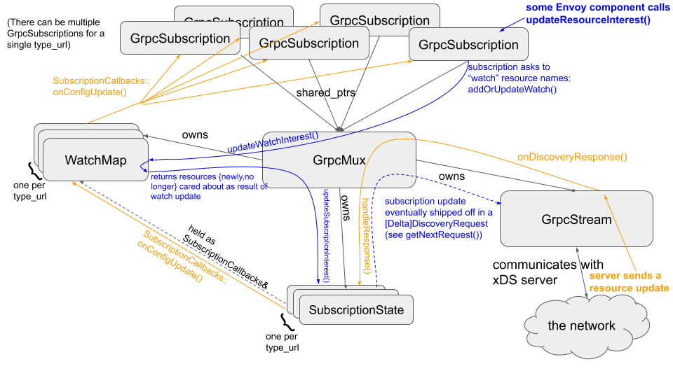

# xDS

xDS stands for [fill in the blank] Discovery Service. It provides dynamic config discovery/updates.

tldr: xDS can use the filesystem, REST, or gRPC. gRPC xDS comes in four flavors.
However, Envoy code uses all of that via the same Subscription interface.
If you are an Envoy developer with your hands on a valid Subscription object,
you can mostly forget the filesystem/REST/gRPC distinction, and you can
especially forget about the gRPC flavors. All of that is specified in the
bootstrap config, which is read and put into action by ClusterManagerImpl.

Note that there can be multiple active gRPC subscriptions for a single resource
type. This concept is called "resource watches". If one EDS subscription
subscribes to X and Y, and another subscribes to Y and Z, the underlying
subscription logic will maintain a subscription to the union: X Y and Z. Updates
to X will be delivered to the first object, Y to both, Z to the second. This
logic is implemented by WatchMap.

### If you are working on Envoy's gRPC xDS client logic itself, read on.

When using gRPC, xDS has two pairs of options: aggregated/non-aggregated, and
delta/state-of-the-world updates. All four combinations of these are usable.

"Aggregated" means that EDS, CDS, etc resources are all carried by the same gRPC stream.
For Envoy's implementation of xDS client logic, there is effectively no difference
between aggregated xDS and non-aggregated: they both use the same request/response protos. The
non-aggregated case is handled by running the aggregated logic, and just happening to only have 1
xDS subscription type to "aggregate", i.e., NewGrpcMuxImpl only has one
DeltaSubscriptionState entry in its map.

However, to the config server, there is a huge difference: when using ADS (caused
by the user providing an ads_config in the bootstrap config), the gRPC client sets
its method string to {Delta,Stream}AggregatedResources, as opposed to {Delta,Stream}Clusters,
{Delta,Stream}Routes, etc. So, despite using the same request/response protos,
and having identical client code, they're actually different gRPC services.

Delta vs state-of-the-world is a question of wire format: the protos in question are named
[Delta]Discovery{Request,Response}. That is what the GrpcMux interface is useful for: its
NewGrpcMuxImpl (TODO may be renamed) implementation works with DeltaDiscovery{Request,Response} and has
delta-specific logic; its GrpxMuxImpl implementation (TODO will be merged into NewGrpcMuxImpl) works with Discovery{Request,Response}
and has SotW-specific logic. Both the delta and SotW Subscription implementations (TODO will be merged) hold a shared_ptr<GrpcMux>.
The shared_ptr allows for both non- and aggregated: if non-aggregated, you'll be the only holder of that shared_ptr.

Note that the orange flow does not necessarily have to happen in response to the blue flow; there can be spontaneous updates. ACKs are not shown in this diagram; they are also carred by the [Delta]DiscoveryRequest protos.
What does GrpcXdsContext even do in this diagram? Just own things and pass through function calls? Answer: it sequences the requests and ACKs that the various type_urls send.
