# Envoy Connection Pool Architecture

## Overview

The Envoy connection pool manages a pool of upstream connections, handling connection lifecycle, stream multiplexing, and load distribution. It provides intelligent connection management with features like preconnection, circuit breaking, and graceful draining.

---

## System Architecture

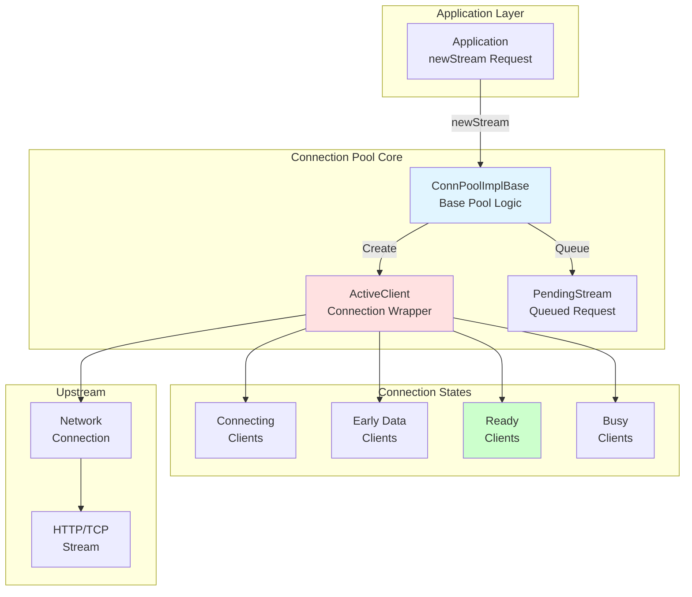
```mermaid
graph TB
    subgraph "Application Layer"
        App[Application<br/>newStream Request]
    end

    subgraph "Connection Pool Core"
        ConnPoolBase[ConnPoolImplBase<br/>Base Pool Logic]
        ActiveClient[ActiveClient<br/>Connection Wrapper]
        PendingStream[PendingStream<br/>Queued Request]
    end

    subgraph "Connection States"
        Connecting[Connecting<br/>Clients]
        EarlyData[Early Data<br/>Clients]
        Ready[Ready<br/>Clients]
        Busy[Busy<br/>Clients]
    end

    subgraph "Upstream"
        Connection[Network<br/>Connection]
        Stream[HTTP/TCP<br/>Stream]
    end

    App -->|newStream| ConnPoolBase
    ConnPoolBase -->|Create| ActiveClient
    ConnPoolBase -->|Queue| PendingStream

    ActiveClient --> Connecting
    ActiveClient --> EarlyData
    ActiveClient --> Ready
    ActiveClient --> Busy

    ActiveClient --> Connection
    Connection --> Stream

    style ConnPoolBase fill:#e1f5ff
    style ActiveClient fill:#ffe1e1
    style Ready fill:#ccffcc
```

---

## 1. Core Classes

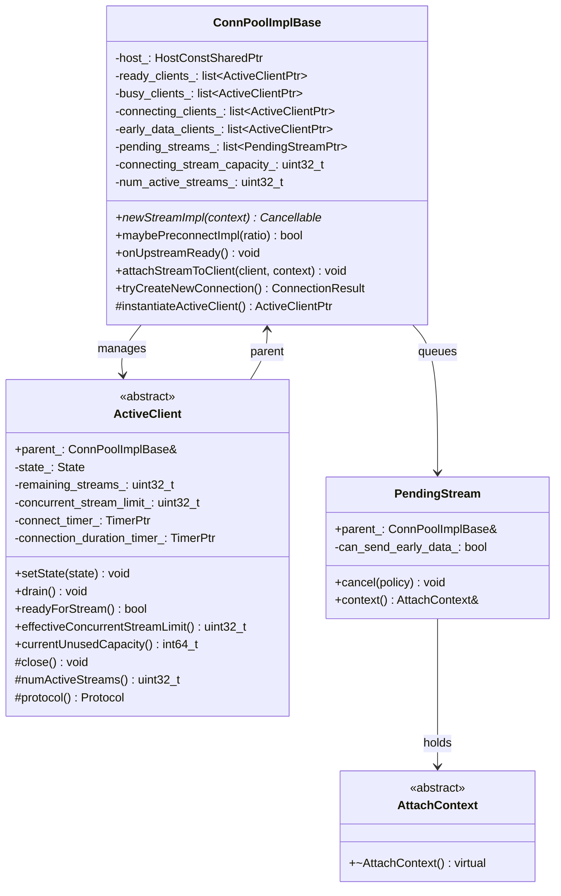
```mermaid
classDiagram
    class ConnPoolImplBase {
        -host_: HostConstSharedPtr
        -ready_clients_: list~ActiveClientPtr~
        -busy_clients_: list~ActiveClientPtr~
        -connecting_clients_: list~ActiveClientPtr~
        -early_data_clients_: list~ActiveClientPtr~
        -pending_streams_: list~PendingStreamPtr~
        -connecting_stream_capacity_: uint32_t
        -num_active_streams_: uint32_t
        +newStreamImpl(context) Cancellable*
        +maybePreconnectImpl(ratio) bool
        +onUpstreamReady() void
        +attachStreamToClient(client, context) void
        +tryCreateNewConnection() ConnectionResult
        #instantiateActiveClient() ActiveClientPtr
    }

    class ActiveClient {
        <<abstract>>
        +parent_: ConnPoolImplBase&
        -state_: State
        -remaining_streams_: uint32_t
        -concurrent_stream_limit_: uint32_t
        -connect_timer_: TimerPtr
        -connection_duration_timer_: TimerPtr
        +setState(state) void
        +drain() void
        +readyForStream() bool
        +effectiveConcurrentStreamLimit() uint32_t
        +currentUnusedCapacity() int64_t
        #close() void
        #numActiveStreams() uint32_t
        #protocol() Protocol
    }

    class PendingStream {
        +parent_: ConnPoolImplBase&
        -can_send_early_data_: bool
        +cancel(policy) void
        +context() AttachContext&
    }

    class AttachContext {
        <<abstract>>
        +~AttachContext() virtual
    }

    ConnPoolImplBase --> ActiveClient: manages
    ConnPoolImplBase --> PendingStream: queues
    PendingStream --> AttachContext: holds
    ActiveClient --> ConnPoolImplBase: parent
```

---

## 2. ActiveClient State Machine

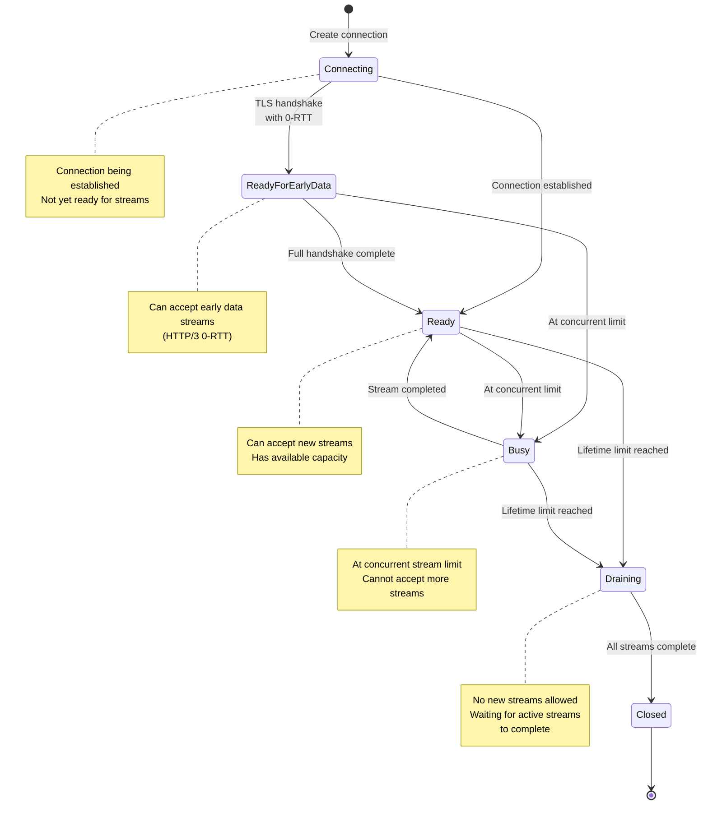
```mermaid
stateDiagram-v2
    [*] --> Connecting: Create connection

    Connecting --> ReadyForEarlyData: TLS handshake<br/>with 0-RTT
    Connecting --> Ready: Connection established

    ReadyForEarlyData --> Ready: Full handshake complete
    ReadyForEarlyData --> Busy: At concurrent limit

    Ready --> Busy: At concurrent limit
    Ready --> Draining: Lifetime limit reached

    Busy --> Ready: Stream completed
    Busy --> Draining: Lifetime limit reached

    Draining --> Closed: All streams complete
    Closed --> [*]

    note right of Connecting
        Connection being established
        Not yet ready for streams
    end note

    note right of ReadyForEarlyData
        Can accept early data streams
        (HTTP/3 0-RTT)
    end note

    note right of Ready
        Can accept new streams
        Has available capacity
    end note

    note right of Busy
        At concurrent stream limit
        Cannot accept more streams
    end note

    note right of Draining
        No new streams allowed
        Waiting for active streams
        to complete
    end note
```

### State Transitions

| From | To | Trigger | Action |
|------|------|---------|--------|
| Connecting | ReadyForEarlyData | 0-RTT ready | Move to early_data_clients_ |
| Connecting | Ready | Connection established | Move to ready_clients_ |
| ReadyForEarlyData | Ready | Handshake complete | Move to ready_clients_ |
| ReadyForEarlyData | Busy | At capacity | Move to busy_clients_ |
| Ready | Busy | At concurrent limit | Move to busy_clients_ |
| Busy | Ready | Stream freed | Move to ready_clients_ |
| Any | Draining | Lifetime exhausted | Move to busy_clients_, drain() |
| Draining | Closed | No active streams | Close connection |

---

## 3. Connection Pool Operations

### newStream Request Flow

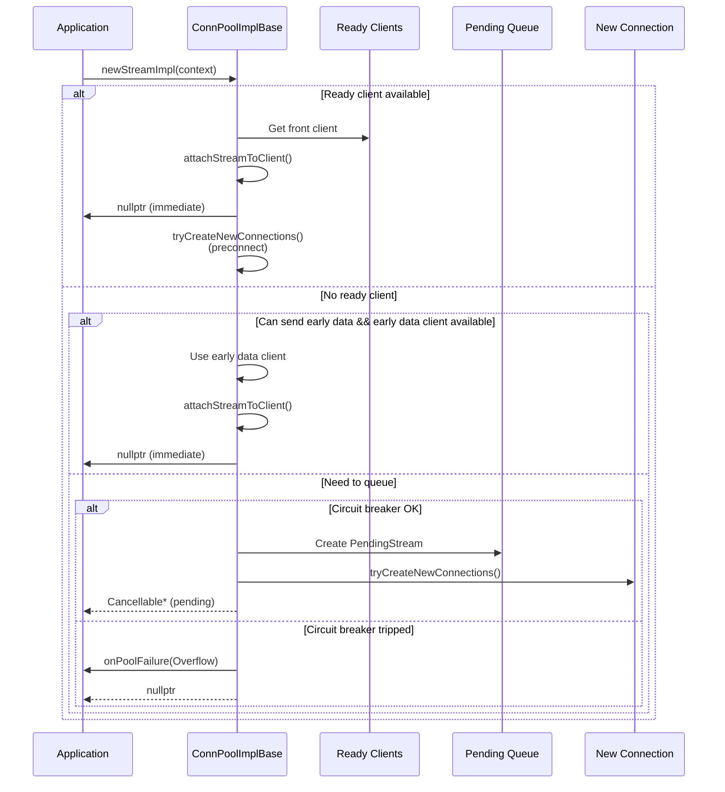
```mermaid
sequenceDiagram
    participant App as Application
    participant Pool as ConnPoolImplBase
    participant Ready as Ready Clients
    participant Pending as Pending Queue
    participant Connect as New Connection

    App->>Pool: newStreamImpl(context)

    alt Ready client available
        Pool->>Ready: Get front client
        Pool->>Pool: attachStreamToClient()
        Pool->>App: nullptr (immediate)
        Pool->>Pool: tryCreateNewConnections()<br/>(preconnect)
    else No ready client
        alt Can send early data && early data client available
            Pool->>Pool: Use early data client
            Pool->>Pool: attachStreamToClient()
            Pool->>App: nullptr (immediate)
        else Need to queue
            alt Circuit breaker OK
                Pool->>Pending: Create PendingStream
                Pool->>Connect: tryCreateNewConnections()
                Pool-->>App: Cancellable* (pending)
            else Circuit breaker tripped
                Pool->>App: onPoolFailure(Overflow)
                Pool-->>App: nullptr
            end
        end
    end
```

### Attach Stream to Client

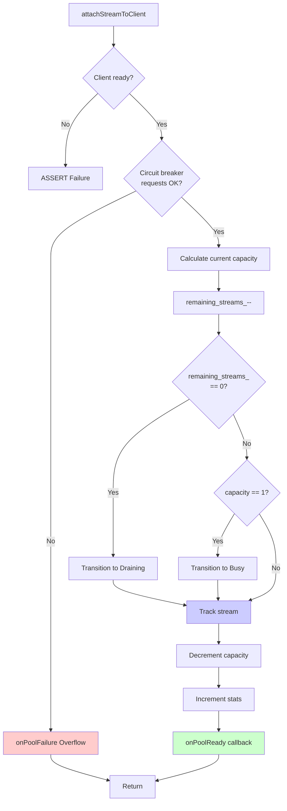
```mermaid
flowchart TD
    Start[attachStreamToClient] --> CheckReady{Client ready?}

    CheckReady -->|No| Assert[ASSERT Failure]
    CheckReady -->|Yes| CheckCB{Circuit breaker<br/>requests OK?}

    CheckCB -->|No| Fail[onPoolFailure Overflow]
    CheckCB -->|Yes| CalcCapacity[Calculate current capacity]

    CalcCapacity --> DecrStreams[remaining_streams_--]

    DecrStreams --> CheckZero{remaining_streams_<br/>== 0?}

    CheckZero -->|Yes| TransDrain[Transition to Draining]
    CheckZero -->|No| CheckCap{capacity == 1?}

    CheckCap -->|Yes| TransBusy[Transition to Busy]
    CheckCap -->|No| TrackStream[Track stream]

    TransDrain --> TrackStream
    TransBusy --> TrackStream

    TrackStream --> DecrCapacity[Decrement capacity]
    DecrCapacity --> IncrStats[Increment stats]
    IncrStats --> Callback[onPoolReady callback]

    Callback --> End[Return]
    Fail --> End

    style Fail fill:#ffcccc
    style Callback fill:#ccffcc
    style TrackStream fill:#ccccff
```

### Stream Completion Flow

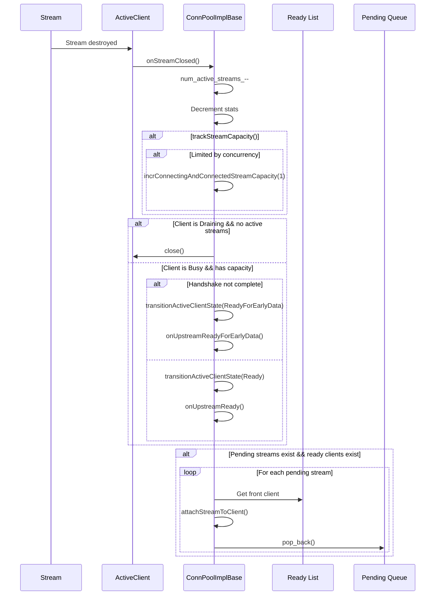
```mermaid
sequenceDiagram
    participant Stream
    participant Client as ActiveClient
    participant Pool as ConnPoolImplBase
    participant Ready as Ready List
    participant Pending as Pending Queue

    Stream->>Client: Stream destroyed
    Client->>Pool: onStreamClosed()

    Pool->>Pool: num_active_streams_--
    Pool->>Pool: Decrement stats

    alt trackStreamCapacity()
        alt Limited by concurrency
            Pool->>Pool: incrConnectingAndConnectedStreamCapacity(1)
        end
    end

    alt Client is Draining && no active streams
        Pool->>Client: close()
    else Client is Busy && has capacity
        alt Handshake not complete
            Pool->>Pool: transitionActiveClientState(ReadyForEarlyData)
            Pool->>Pool: onUpstreamReadyForEarlyData()
        else
            Pool->>Pool: transitionActiveClientState(Ready)
            Pool->>Pool: onUpstreamReady()
        end
    end

    alt Pending streams exist && ready clients exist
        loop For each pending stream
            Pool->>Ready: Get front client
            Pool->>Pool: attachStreamToClient()
            Pool->>Pending: pop_back()
        end
    end
```

---

## 4. Preconnection Strategy

### shouldConnect Logic

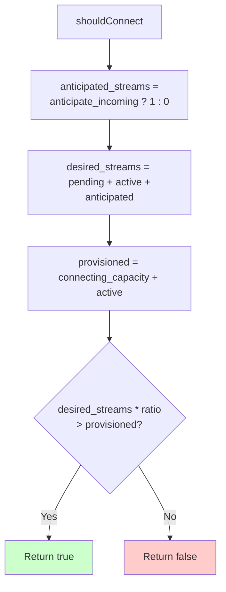
```mermaid
flowchart TD
    Start[shouldConnect] --> CalcAnticipated[anticipated_streams = <br/>anticipate_incoming ? 1 : 0]

    CalcAnticipated --> CalcDesired[desired_streams = <br/> pending + active + anticipated]

    CalcDesired --> CalcProvisioned[provisioned = <br/>connecting_capacity + active]

    CalcProvisioned --> Compare{desired_streams * ratio<br/>> provisioned?}

    Compare -->|Yes| Return1[Return true]
    Compare -->|No| Return2[Return false]

    style Return1 fill:#ccffcc
    style Return2 fill:#ffcccc
```

**Formula:**
```
should_connect = (pending + active + anticipated) * preconnect_ratio
                 > (connecting_capacity + active)
```

**Examples:**

| Pending | Active | Ratio | Capacity | Result |
|---------|--------|-------|----------|--------|
| 5 | 0 | 1.0 | 0 | Connect (5 > 0) |
| 3 | 2 | 1.5 | 3 | Connect (7.5 > 5) |
| 1 | 5 | 1.2 | 7 | Don't connect (7.2 < 12) |
| 0 | 0 | 1.0 | 0 | Don't connect (0 = 0) |
| 0 | 0 | 1.0 | 0 | Connect* (with anticipate=true) |

\* Global preconnect always anticipates 1 stream

### Preconnect Ratio

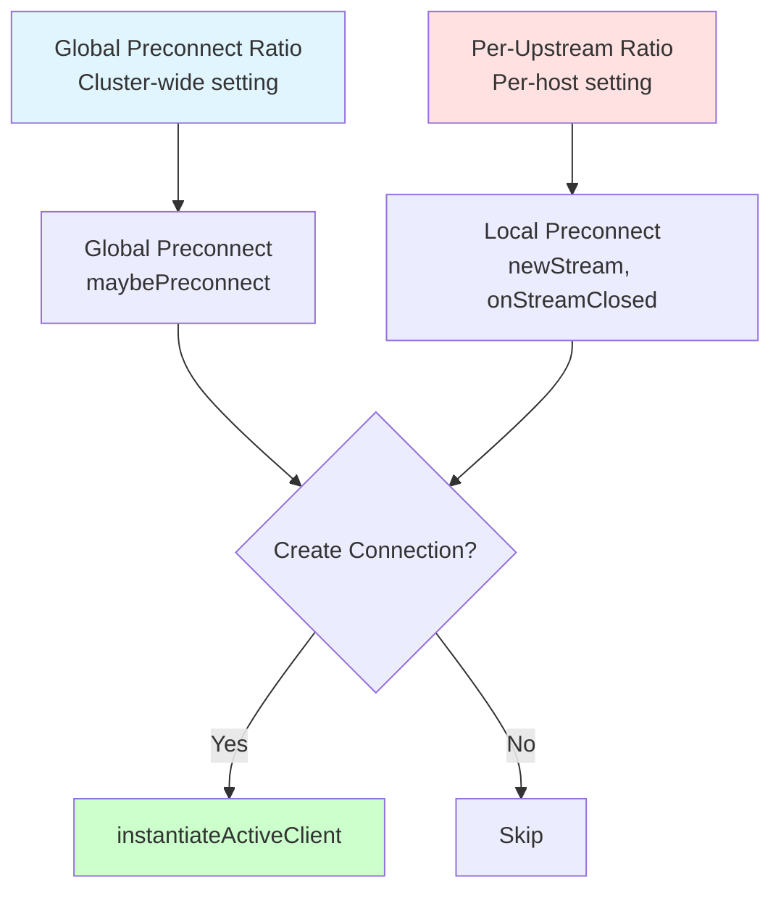
```mermaid
graph TB
    GlobalRatio[Global Preconnect Ratio<br/>Cluster-wide setting]
    PerUpstreamRatio[Per-Upstream Ratio<br/>Per-host setting]

    Global[Global Preconnect<br/>maybePreconnect]
    Local[Local Preconnect<br/>newStream, onStreamClosed]

    GlobalRatio --> Global
    PerUpstreamRatio --> Local

    Global --> Decision{Create Connection?}
    Local --> Decision

    Decision -->|Yes| Create[instantiateActiveClient]
    Decision -->|No| Skip[Skip]

    style GlobalRatio fill:#e1f5ff
    style PerUpstreamRatio fill:#ffe1e1
    style Create fill:#ccffcc
```

**Ratios:**
- **1.0**: Traditional behavior (1 connection per pending stream)
- **1.5**: Moderate preconnection (50% more capacity)
- **2.0**: Aggressive preconnection (2x capacity)
- **3.0**: Maximum allowed (3x capacity)

---

## 5. Connection Creation

### tryCreateNewConnection Flow

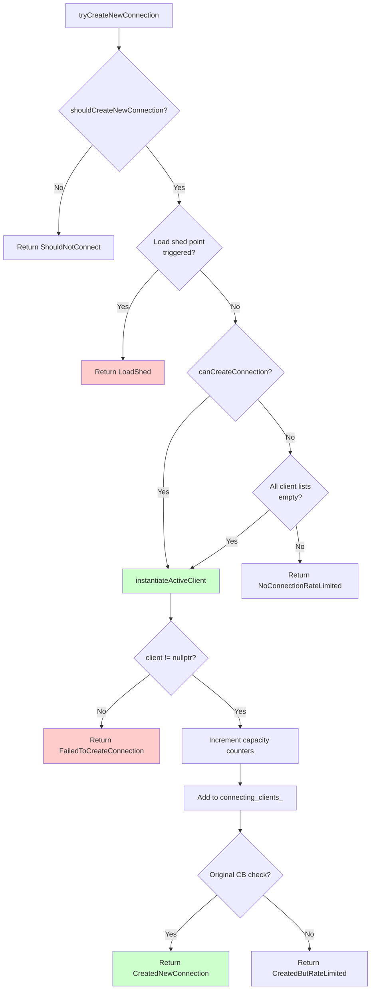
```mermaid
flowchart TD
    Start[tryCreateNewConnection] --> CheckShould{shouldCreateNewConnection?}

    CheckShould -->|No| ReturnNo[Return ShouldNotConnect]
    CheckShould -->|Yes| CheckLoadShed{Load shed point<br/>triggered?}

    CheckLoadShed -->|Yes| ReturnShed[Return LoadShed]
    CheckLoadShed -->|No| CheckCB{canCreateConnection?}

    CheckCB -->|Yes| Create[instantiateActiveClient]
    CheckCB -->|No| CheckEmpty{All client lists<br/>empty?}

    CheckEmpty -->|Yes| Create
    CheckEmpty -->|No| ReturnRate[Return NoConnectionRateLimited]

    Create --> CheckSuccess{client != nullptr?}

    CheckSuccess -->|No| ReturnFail[Return FailedToCreateConnection]
    CheckSuccess -->|Yes| IncrCapacity[Increment capacity counters]

    IncrCapacity --> AddList[Add to connecting_clients_]
    AddList --> ReturnSuccess{Original CB check?}

    ReturnSuccess -->|Yes| ReturnCreated[Return CreatedNewConnection]
    ReturnSuccess -->|No| ReturnButRate[Return CreatedButRateLimited]

    style Create fill:#ccffcc
    style ReturnCreated fill:#ccffcc
    style ReturnFail fill:#ffcccc
    style ReturnShed fill:#ffcccc
```

### Circuit Breaker Integration

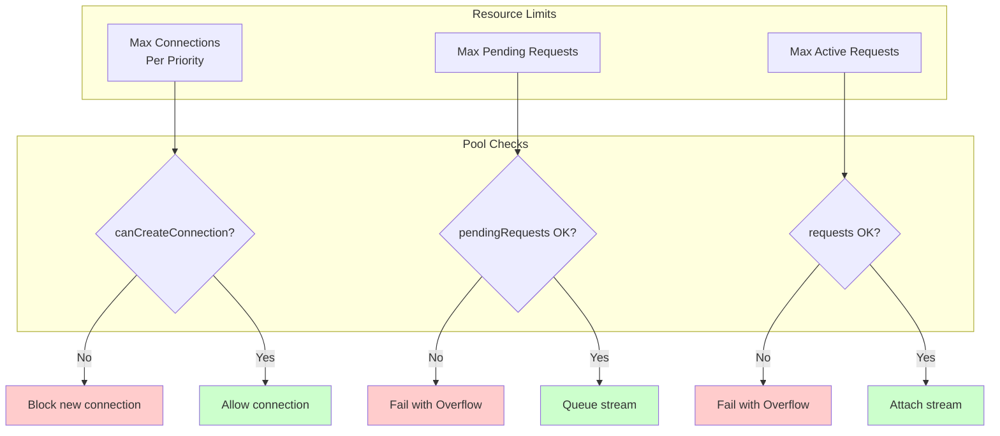
```mermaid
graph TB
    subgraph "Resource Limits"
        MaxConn[Max Connections<br/>Per Priority]
        MaxPending[Max Pending Requests]
        MaxRequests[Max Active Requests]
    end

    subgraph "Pool Checks"
        CanCreate{canCreateConnection?}
        PendingOK{pendingRequests OK?}
        RequestsOK{requests OK?}
    end

    MaxConn --> CanCreate
    MaxPending --> PendingOK
    MaxRequests --> RequestsOK

    CanCreate -->|No| Block1[Block new connection]
    PendingOK -->|No| Block2[Fail with Overflow]
    RequestsOK -->|No| Block3[Fail with Overflow]

    CanCreate -->|Yes| Allow1[Allow connection]
    PendingOK -->|Yes| Allow2[Queue stream]
    RequestsOK -->|Yes| Allow3[Attach stream]

    style Block1 fill:#ffcccc
    style Block2 fill:#ffcccc
    style Block3 fill:#ffcccc
    style Allow1 fill:#ccffcc
    style Allow2 fill:#ccffcc
    style Allow3 fill:#ccffcc
```

---

## 6. Capacity Tracking

### Capacity Counters

```mermaid
graph TB
    subgraph "Connecting Capacity"
        ConnectingCap[connecting_stream_capacity_<br/>Future capacity from<br/>connecting connections]
    end

    subgraph "Connected Capacity"
        ReadyCap[Sum of currentUnusedCapacity<br/>from ready_clients_]
        BusyCap[Sum of currentUnusedCapacity<br/>from busy_clients_<br/> negative values]
    end

    subgraph "Total"
        Total[connecting_and_connected_<br/>stream_capacity_<br/>= connecting + ready + busy]
    end

    ConnectingCap --> Total
    ReadyCap --> Total
    BusyCap --> Total

    style ConnectingCap fill:#ffffcc
    style ReadyCap fill:#ccffcc
    style BusyCap fill:#ffcccc
    style Total fill:#ccccff
```

### Capacity Updates

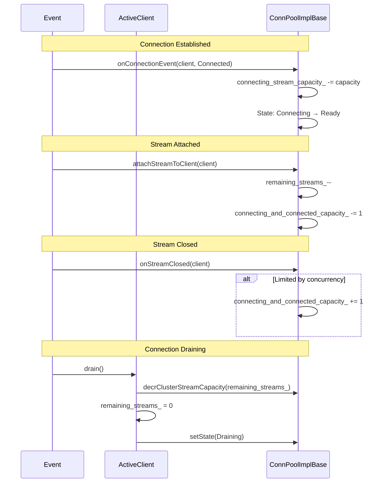
```mermaid
sequenceDiagram
    participant Event
    participant Client as ActiveClient
    participant Pool as ConnPoolImplBase

    Note over Event,Pool: Connection Established

    Event->>Pool: onConnectionEvent(client, Connected)
    Pool->>Pool: connecting_stream_capacity_ -= capacity
    Pool->>Pool: State: Connecting → Ready

    Note over Event,Pool: Stream Attached

    Event->>Pool: attachStreamToClient(client)
    Pool->>Pool: remaining_streams_--
    Pool->>Pool: connecting_and_connected_capacity_ -= 1

    Note over Event,Pool: Stream Closed

    Event->>Pool: onStreamClosed(client)

    alt Limited by concurrency
        Pool->>Pool: connecting_and_connected_capacity_ += 1
    end

    Note over Event,Pool: Connection Draining

    Event->>Client: drain()
    Client->>Pool: decrClusterStreamCapacity(remaining_streams_)
    Client->>Client: remaining_streams_ = 0
    Client->>Pool: setState(Draining)
```

---

## 7. Client Lists Management

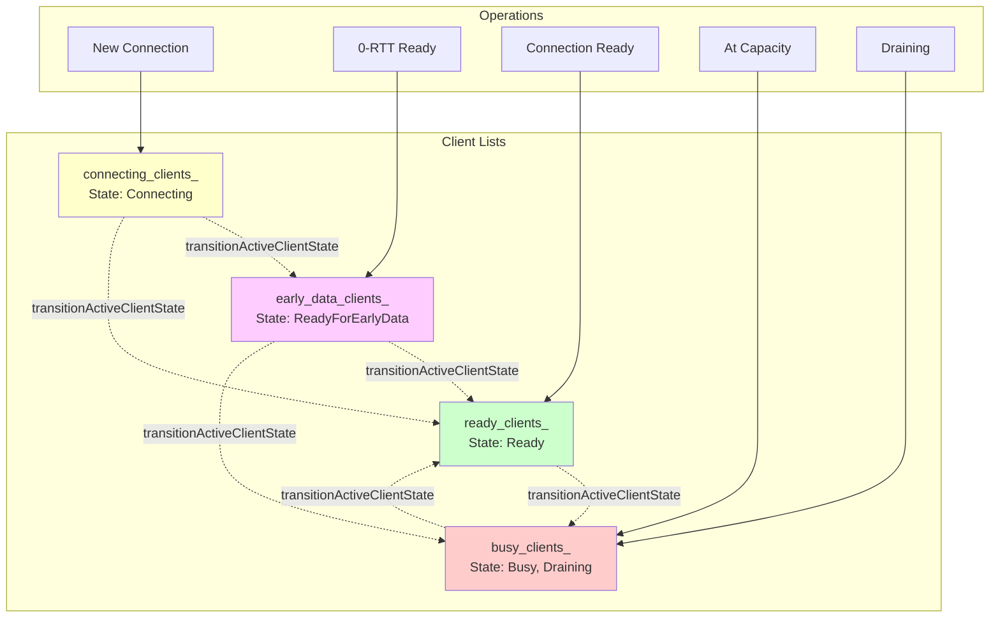
```mermaid
graph TB
    subgraph "Client Lists"
        Connecting[connecting_clients_<br/>State: Connecting]
        EarlyData[early_data_clients_<br/>State: ReadyForEarlyData]
        Ready[ready_clients_<br/>State: Ready]
        Busy[busy_clients_<br/>State: Busy, Draining]
    end

    subgraph "Operations"
        NewConn[New Connection] --> Connecting
        TLSReady[0-RTT Ready] --> EarlyData
        ConnReady[Connection Ready] --> Ready
        AtCapacity[At Capacity] --> Busy
        Drain[Draining] --> Busy
    end

    Connecting -.->|transitionActiveClientState| EarlyData
    Connecting -.->|transitionActiveClientState| Ready
    EarlyData -.->|transitionActiveClientState| Ready
    EarlyData -.->|transitionActiveClientState| Busy
    Ready -.->|transitionActiveClientState| Busy
    Busy -.->|transitionActiveClientState| Ready

    style Connecting fill:#ffffcc
    style EarlyData fill:#ffccff
    style Ready fill:#ccffcc
    style Busy fill:#ffcccc
```

### transitionActiveClientState

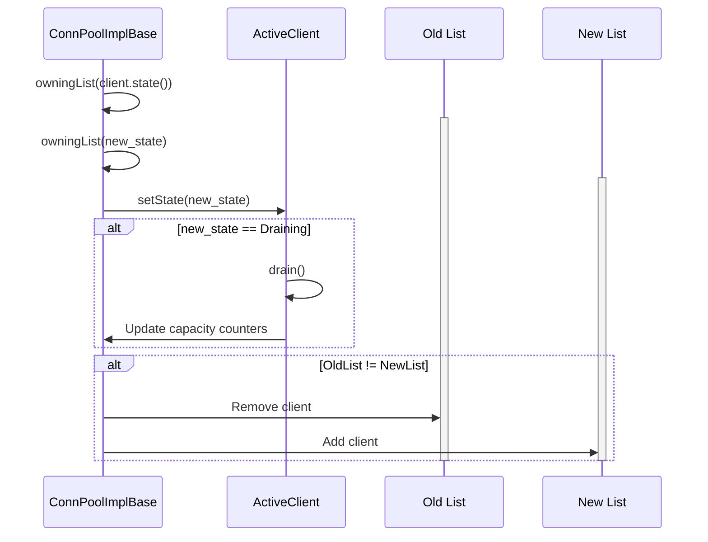
```mermaid
sequenceDiagram
    participant Pool as ConnPoolImplBase
    participant Client as ActiveClient
    participant OldList as Old List
    participant NewList as New List

    Pool->>Pool: owningList(client.state())
    activate OldList
    Pool->>Pool: owningList(new_state)
    activate NewList

    Pool->>Client: setState(new_state)

    alt new_state == Draining
        Client->>Client: drain()
        Client->>Pool: Update capacity counters
    end

    alt OldList != NewList
        Pool->>OldList: Remove client
        Pool->>NewList: Add client
    end

    deactivate OldList
    deactivate NewList
```

---

## 8. Pending Stream Management

### PendingStream Lifecycle

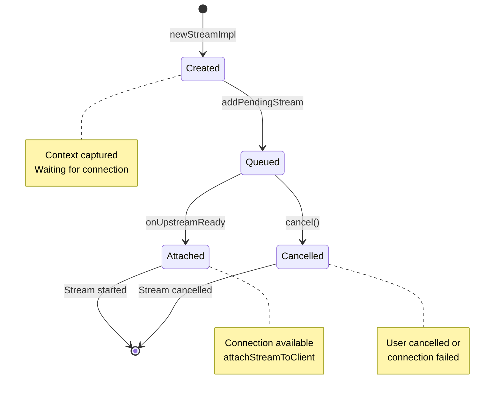
```mermaid
stateDiagram-v2
    [*] --> Created: newStreamImpl
    Created --> Queued: addPendingStream
    Queued --> Attached: onUpstreamReady
    Queued --> Cancelled: cancel()

    Attached --> [*]: Stream started
    Cancelled --> [*]: Stream cancelled

    note right of Created
        Context captured
        Waiting for connection
    end note

    note right of Attached
        Connection available
        attachStreamToClient
    end note

    note right of Cancelled
        User cancelled or
        connection failed
    end note
```

### Cancel Policies

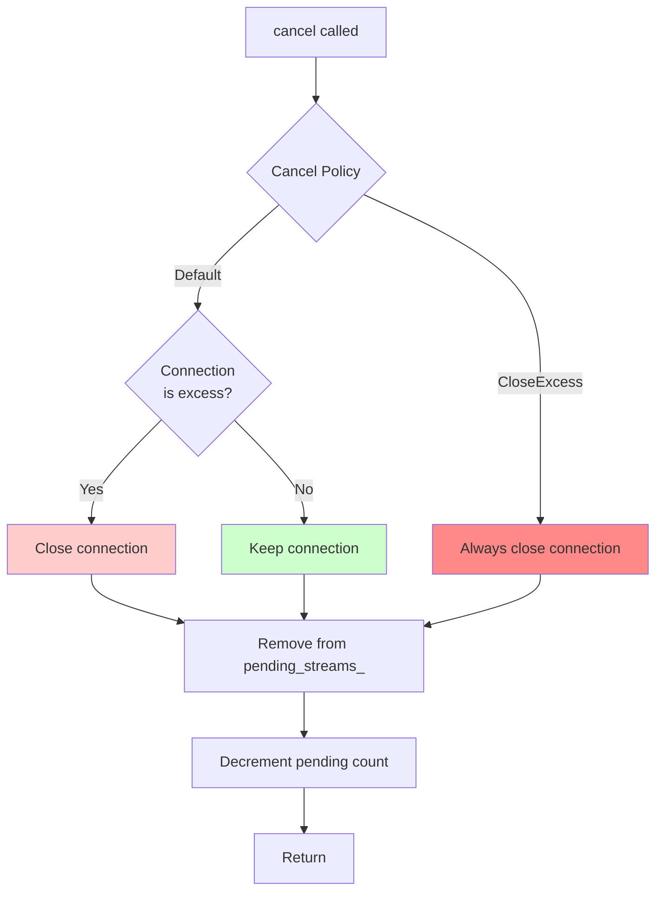
```mermaid
graph TD
    Cancel[cancel called] --> CheckPolicy{Cancel Policy}

    CheckPolicy -->|Default| CheckExcess{Connection<br/>is excess?}
    CheckPolicy -->|CloseExcess| ForceClose[Always close connection]

    CheckExcess -->|Yes| CloseConn[Close connection]
    CheckExcess -->|No| KeepConn[Keep connection]

    CloseConn --> RemovePending[Remove from pending_streams_]
    KeepConn --> RemovePending
    ForceClose --> RemovePending

    RemovePending --> DecrCount[Decrement pending count]
    DecrCount --> End[Return]

    style CloseConn fill:#ffcccc
    style KeepConn fill:#ccffcc
    style ForceClose fill:#ff8888
```

**connectingConnectionIsExcess Logic:**
```cpp
bool excess = (pending_streams_.size() + 1) * ratio
              <= connecting_stream_capacity_;
```

If removing this pending stream means we have too much capacity, the connection is excess.

---

## 9. Drain and Idle Management

### Drain Behavior

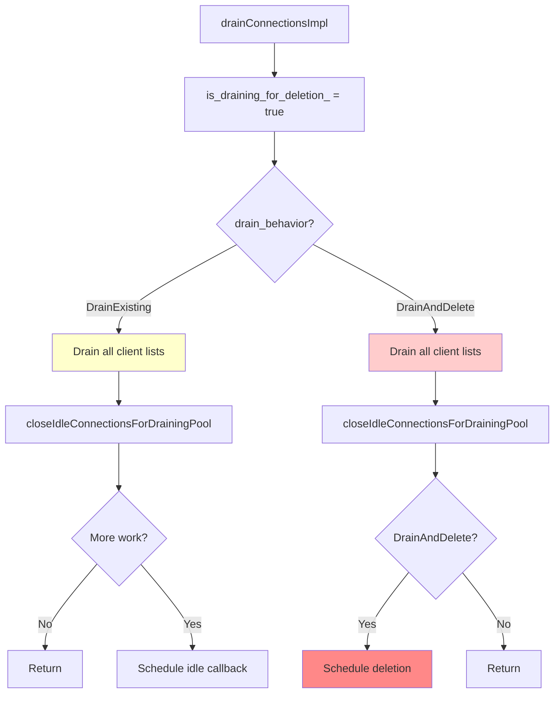
```mermaid
flowchart TD
    Start[drainConnectionsImpl] --> SetFlag[is_draining_for_deletion_ = true]

    SetFlag --> CheckBehavior{drain_behavior?}

    CheckBehavior -->|DrainExisting| DrainLists1[Drain all client lists]
    CheckBehavior -->|DrainAndDelete| DrainLists2[Drain all client lists]

    DrainLists1 --> CloseIdle1[closeIdleConnectionsForDrainingPool]
    DrainLists2 --> CloseIdle2[closeIdleConnectionsForDrainingPool]

    CloseIdle1 --> End1{More work?}
    CloseIdle2 --> CheckFlag{DrainAndDelete?}

    CheckFlag -->|Yes| DeleteThis[Schedule deletion]
    CheckFlag -->|No| End2[Return]

    End1 -->|No| End3[Return]
    End1 -->|Yes| ScheduleIdle[Schedule idle callback]

    style DrainLists1 fill:#ffffcc
    style DrainLists2 fill:#ffcccc
    style DeleteThis fill:#ff8888
```

### Idle Detection

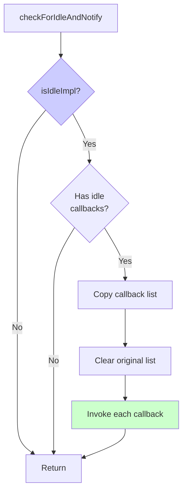
```mermaid
flowchart TD
    Check[checkForIdleAndNotify] --> CheckIdle{isIdleImpl?}

    CheckIdle -->|No| Return[Return]
    CheckIdle -->|Yes| HasCallbacks{Has idle<br/>callbacks?}

    HasCallbacks -->|No| Return
    HasCallbacks -->|Yes| CopyList[Copy callback list]

    CopyList --> ClearList[Clear original list]
    ClearList --> Invoke[Invoke each callback]

    Invoke --> Return

    style CheckIdle fill:#ccccff
    style Invoke fill:#ccffcc
```

**isIdleImpl Conditions:**
```cpp
bool isIdle() {
    return pending_streams_.empty() &&
           ready_clients_.empty() &&
           busy_clients_.empty() &&
           connecting_clients_.empty() &&
           early_data_clients_.empty();
}
```

---

## 10. Connection Timeouts

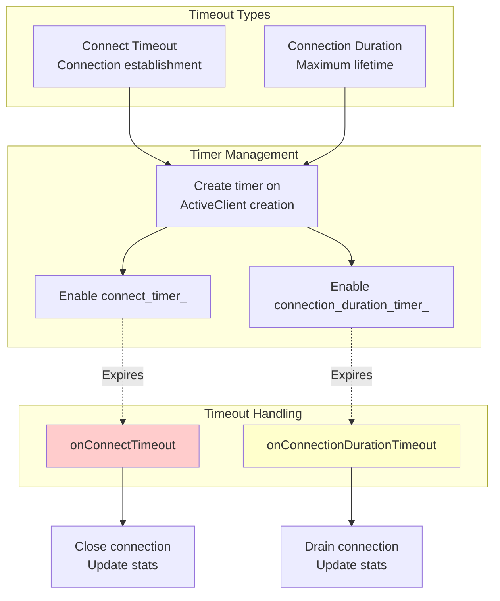
```mermaid
graph TB
    subgraph "Timeout Types"
        ConnectTO[Connect Timeout<br/>Connection establishment]
        DurationTO[Connection Duration<br/>Maximum lifetime]
    end

    subgraph "Timer Management"
        CreateTimer[Create timer on<br/>ActiveClient creation]
        EnableConnect[Enable connect_timer_]
        EnableDuration[Enable connection_duration_timer_]
    end

    subgraph "Timeout Handling"
        ConnectExpired[onConnectTimeout]
        DurationExpired[onConnectionDurationTimeout]
    end

    ConnectTO --> CreateTimer
    DurationTO --> CreateTimer

    CreateTimer --> EnableConnect
    CreateTimer --> EnableDuration

    EnableConnect -.->|Expires| ConnectExpired
    EnableDuration -.->|Expires| DurationExpired

    ConnectExpired --> Close1[Close connection<br/>Update stats]
    DurationExpired --> Close2[Drain connection<br/>Update stats]

    style ConnectExpired fill:#ffcccc
    style DurationExpired fill:#ffffcc
```

### Timeout Flow

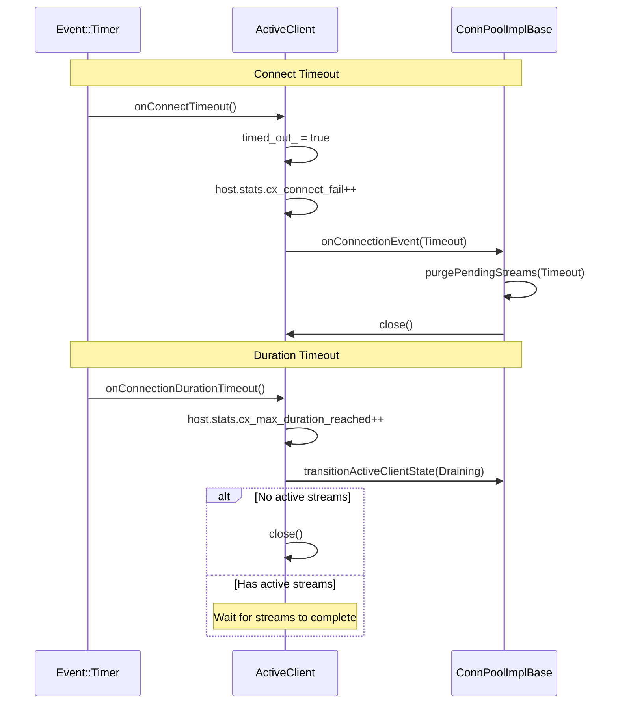
```mermaid
sequenceDiagram
    participant Timer as Event::Timer
    participant Client as ActiveClient
    participant Pool as ConnPoolImplBase

    Note over Timer,Pool: Connect Timeout

    Timer->>Client: onConnectTimeout()
    Client->>Client: timed_out_ = true
    Client->>Client: host.stats.cx_connect_fail++
    Client->>Pool: onConnectionEvent(Timeout)
    Pool->>Pool: purgePendingStreams(Timeout)
    Pool->>Client: close()

    Note over Timer,Pool: Duration Timeout

    Timer->>Client: onConnectionDurationTimeout()
    Client->>Client: host.stats.cx_max_duration_reached++
    Client->>Pool: transitionActiveClientState(Draining)

    alt No active streams
        Client->>Client: close()
    else Has active streams
        Note over Client: Wait for streams to complete
    end
```

---

## 11. Statistics and Observability

### Key Metrics

```mermaid
graph TB
    subgraph "Connection Stats"
        CxTotal[cx_total<br/>Total connections created]
        CxActive[cx_active<br/>Currently active]
        CxConnectFail[cx_connect_fail<br/>Connection failures]
        CxMax[cx_max_requests<br/>Hit stream limit]
    end

    subgraph "Request Stats"
        RqTotal[rq_total<br/>Total requests]
        RqActive[rq_active<br/>Active requests]
        RqPending[rq_pending_overflow<br/>Queue overflow]
    end

    subgraph "Timing Stats"
        ConnectMs[cx_connect_ms<br/>Connection time]
        LengthMs[cx_length_ms<br/>Connection duration]
    end

    subgraph "Special"
        ZeroRTT[upstream_rq_0rtt<br/>0-RTT requests]
    end

    style CxActive fill:#ccffcc
    style RqActive fill:#ccffcc
    style RqPending fill:#ffcccc
    style ZeroRTT fill:#ccccff
```

### State Dumps

```mermaid
graph LR
    State[Connection Pool State] --> Dump[dumpState]

    Dump --> Ready[ready_clients_.size]
    Dump --> Busy[busy_clients_.size]
    Dump --> Connecting[connecting_clients_.size]
    Dump --> ConnCap[connecting_stream_capacity_]
    Dump --> TotalCap[connecting_and_connected_<br/>stream_capacity_]
    Dump --> ActiveStreams[num_active_streams_]
    Dump --> Pending[pending_streams_.size]
    Dump --> Ratio[perUpstreamPreconnectRatio]

    style Dump fill:#e1f5ff
```

---

## 12. Load Shed Integration

```mermaid
flowchart TD
    Start[tryCreateNewConnection] --> CheckPoint{Load shed point<br/>configured?}

    CheckPoint -->|No| Proceed[Continue normally]
    CheckPoint -->|Yes| CheckShed{shouldShedLoad?}

    CheckShed -->|Yes| Return[Return LoadShed]
    CheckShed -->|No| Proceed

    Return --> Cancel[Cancel pending stream]
    Cancel --> Fail[onPoolFailure Overflow]

    Proceed --> CreateConn[Create connection]

    style CheckShed fill:#ffffcc
    style Return fill:#ffcccc
    style Fail fill:#ff8888
    style CreateConn fill:#ccffcc
```

**Load Shed Point:**
- Name: `envoy.load_shed_points.connection_pool_new_connection`
- Purpose: Prevent overload by rejecting new connections
- Trigger: Overload manager pressure threshold
- Effect: Fail pending streams with Overflow reason

---

## 13. HTTP/3 and Early Data

### 0-RTT Support

```mermaid
sequenceDiagram
    participant App as Application
    participant Pool as ConnPoolImplBase
    participant EarlyClient as Early Data Client
    participant TLS as TLS Layer

    App->>Pool: newStreamImpl(can_send_early_data=true)

    alt Early data client available
        Pool->>EarlyClient: Check state == ReadyForEarlyData
        Pool->>Pool: attachStreamToClient()
        Pool->>App: nullptr (immediate)
        Note over Pool: Increment upstream_rq_0rtt stat
    else No early data client
        Pool->>Pool: Create pending stream
        Pool->>Pool: tryCreateNewConnections()
        Pool->>App: Cancellable* (pending)
    end

    Note over TLS: TLS handshake completes

    TLS->>EarlyClient: Handshake complete
    EarlyClient->>Pool: transitionActiveClientState(Ready)
    Pool->>Pool: Move from early_data_clients_<br/>to ready_clients_
```

### Early Data Client State

```mermaid
graph TB
    Start[New Connection] --> TLS{TLS with<br/>0-RTT?}

    TLS -->|Yes| Early[State: ReadyForEarlyData]
    TLS -->|No| Connect[State: Connecting]

    Early --> Handshake[Full handshake completes]
    Connect --> Established[Connection established]

    Handshake --> Ready1[State: Ready]
    Established --> Ready2[State: Ready]

    Early -.->|Stream attached| Busy1[State: Busy]
    Ready1 -.->|Stream attached| Busy2[State: Busy]
    Ready2 -.->|Stream attached| Busy3[State: Busy]

    style Early fill:#ccccff
    style Ready1 fill:#ccffcc
    style Ready2 fill:#ccffcc
```

---

## 14. Key Design Patterns

### Pattern 1: Double Linked List with State-based Segregation

Clients are organized into separate lists by state:
- Fast access to ready clients (O(1))
- Easy iteration over clients in specific states
- Transitions involve simple list moves

```mermaid
graph LR
    A[Client List 1<br/>Connecting] --> B[Client List 2<br/>Early Data]
    B --> C[Client List 3<br/>Ready]
    C --> D[Client List 4<br/>Busy/Draining]

    style A fill:#ffffcc
    style B fill:#ccccff
    style C fill:#ccffcc
    style D fill:#ffcccc
```

### Pattern 2: Capacity-based Preconnection

Maintain capacity counters to avoid overconnecting:
- Track future capacity (connecting)
- Track current capacity (ready + busy)
- Create connections only when needed

### Pattern 3: Circuit Breaker Integration

Multiple layers of protection:
1. Connection limits (per priority)
2. Pending request limits
3. Active request limits
4. Load shed points

### Pattern 4: Graceful Draining

Connections drain gracefully:
- Stop accepting new streams
- Wait for active streams to complete
- Clean up resources
- Prevent abrupt connection closure

---

## 15. Performance Characteristics

### Throughput
- **Ready client access**: O(1)
- **Stream attachment**: O(1)
- **Connection creation**: O(1) pool operations
- **State transitions**: O(1) list moves

### Scaling
- Per-host pool isolation
- Multiple priority levels
- Concurrent stream multiplexing (HTTP/2, HTTP/3)
- Thousands of pools per Envoy instance

### Latency
- Immediate dispatch with ready client: ~1 μs
- Queue with connecting client: Connection RTT
- Circuit breaker check: ~100 ns
- Preconnection overhead: ~10 μs

---

## 16. Common Scenarios

### Scenario 1: Steady State Traffic

```
Pool State:
- ready_clients: 2
- num_active_streams: 8
- preconnect_ratio: 1.5

New Stream Arrives:
1. Check ready_clients → client available
2. attachStreamToClient() → immediate
3. tryCreateNewConnections() → check ratio
4. (8+1) * 1.5 = 13.5 > current_capacity? → maybe create
```

### Scenario 2: Traffic Burst

```
Pool State:
- ready_clients: 0
- connecting_clients: 1 (capacity 100)
- pending_streams: 5

New Stream Arrives:
1. No ready clients
2. Add to pending_streams (now 6)
3. tryCreateNewConnections()
4. 6 * 1.0 > 100? No
5. Return Cancellable* (queued)

When Connection Completes:
1. onUpstreamReady()
2. Attach all 6 pending streams
3. Clear pending_streams
```

### Scenario 3: Connection Failure

```
Pool State:
- connecting_clients: 1
- pending_streams: 3

Connect Timeout:
1. onConnectTimeout()
2. purgePendingStreams(Timeout)
3. Call onPoolFailure for each pending stream
4. Close client
5. Remove from connecting_clients
```

---

## Summary

The Envoy connection pool provides:

1. **Intelligent Connection Management**
   - State-based client organization
   - Preconnection based on demand
   - Graceful draining and cleanup

2. **High Performance**
   - O(1) operations for common paths
   - Zero-copy client moves between lists
   - Efficient capacity tracking

3. **Robust Flow Control**
   - Circuit breaker integration
   - Multiple queue limits
   - Load shed protection

4. **Advanced Features**
   - HTTP/3 0-RTT support
   - Per-upstream and global preconnection
   - Connection lifetime management
   - Detailed statistics and observability

5. **Scalability**
   - Per-host pool isolation
   - Priority-based resource management
   - Configurable limits at multiple levels

This design enables Envoy to efficiently manage millions of upstream connections while providing predictable behavior under load and graceful handling of failures.
