# Envoy HTTP Layer — Overview Part 1: Architecture & Request Pipeline

**Directory:** `source/common/http/`  
**Part:** 1 of 4 — Architecture, Request Pipeline, Connection Manager, Filter System

---

## Table of Contents

1. [High-Level Architecture](#1-high-level-architecture)
2. [Component Map](#2-component-map)
3. [End-to-End Request Flow](#3-end-to-end-request-flow)
4. [ConnectionManagerImpl Deep Dive](#4-connectionmanagerimpl-deep-dive)
5. [FilterManager and the Filter Chain](#5-filtermanager-and-the-filter-chain)
6. [FilterChainHelper — Building the Chain](#6-filterchainhelper--building-the-chain)
7. [Key Design Patterns](#7-key-design-patterns)

---

## 1. High-Level Architecture

**This diagram shows the complete HTTP request/response pipeline through Envoy:**

**Downstream Path (Client Request → Envoy):**

**1. Network Layer → HTTP Layer Transition:**
- Raw TCP/QUIC bytes arrive on network connection
- `ConnectionManagerImpl` is a **Network::ReadFilter** - bridges network and HTTP layers
- It's the entry point from network layer into HTTP processing

**2. Protocol Detection & Codec Creation:**
- `ConnectionManagerUtility` sniffs first bytes to detect protocol (HTTP/1.1, HTTP/2, HTTP/3)
- Creates appropriate codec: `Http1::ServerConnection`, `Http2::ServerConnection`, or `Http3::ServerConnection`
- Codec parses raw bytes into HTTP semantic elements (headers, data, trailers)

**3. Stream Creation (Per Request):**
- Codec creates `ActiveStream` for each HTTP request
- One connection can have multiple concurrent streams (HTTP/2, HTTP/3)
- HTTP/1.1 has one stream per connection at a time

**4. Filter Chain Execution:**
- `DownstreamFilterManager` owns the HTTP filter chain
- Filters execute in order: A → B → C → Router
- Each filter can:
  - **Inspect**: Read headers/data
  - **Modify**: Change headers, body, trailers
  - **Halt**: Stop for async operations (database lookup, external auth)
  - **Generate**: Create local response (auth failure, rate limit)

**Upstream Path (Envoy → Backend):**

**5. Routing & Connection Pool:**
- Router filter determines upstream cluster based on routing rules
- Connection pool manages pooled connections to upstream hosts
- Pools are protocol-specific: HTTP/1.1, HTTP/2, HTTP/3, or Grid (mixed)

**6. CodecClient & Upstream Connection:**
- `CodecClient` wraps upstream connection with codec
- Sends HTTP request to upstream server
- Manages request/response correlation

**Response Path (Reverse):**
- Response flows back through same components in reverse
- Upstream → CodecClient → Pool → Router → Filter C → B → A → Codec → Client
- Encoder filters process response (reverse order from decoder)

**Key Design Points:**
- **Separation of concerns**: Network layer, protocol layer, application layer
- **Protocol abstraction**: Filters don't care about HTTP/1 vs HTTP/2 vs HTTP/3
- **Bidirectional filter chain**: Decoder filters for requests, encoder filters for responses
- **Async support**: Filters can pause processing for async operations

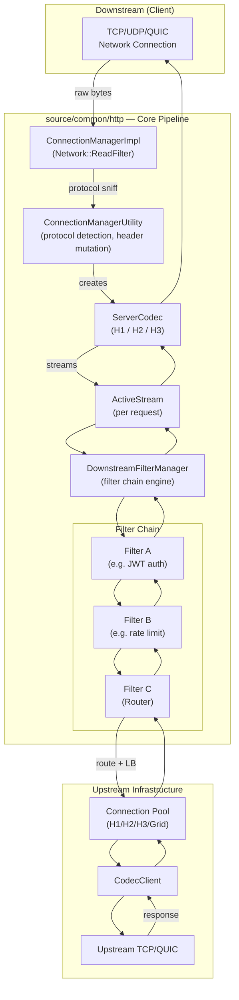

---

## 2. Component Map

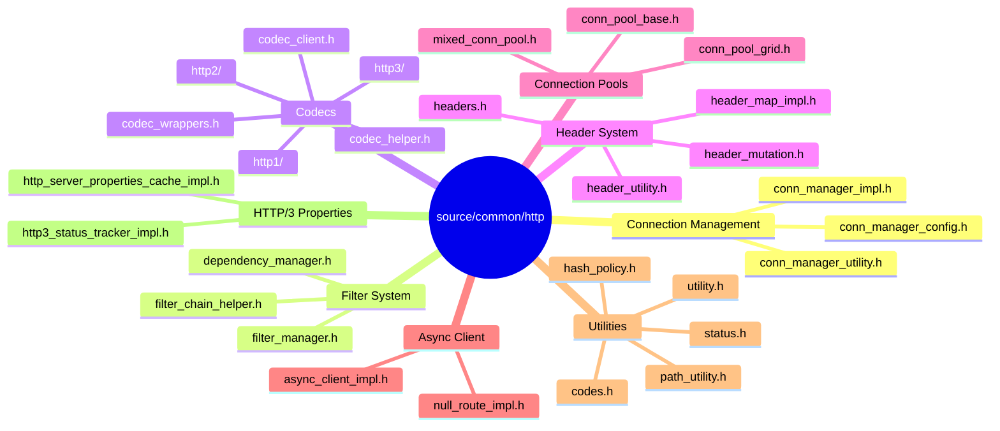

---

## 3. End-to-End Request Flow

**This sequence diagram traces a complete HTTP request from client bytes to upstream response:**

**Phase 1: Connection & Protocol Setup (Steps 1-3):**
- Client sends raw TCP bytes (HTTP request)
- `ConnectionManagerImpl` receives bytes as network filter
- `ConnectionManagerUtility::autoCreateCodec()` examines first bytes:
  - HTTP/1.1: Looks for `GET`, `POST`, etc.
  - HTTP/2: Looks for connection preface (`PRI * HTTP/2.0`)
  - HTTP/3: Uses QUIC stream types
- Appropriate server codec is created and stored

**Phase 2: Stream Creation (Steps 4-6):**
- Codec parses request and calls `newStream()`
- `ConnectionManagerImpl` creates `ActiveStream` for this request
- `ActiveStream` creates `DownstreamFilterManager` for filter chain execution
- Request tracking begins (timing, metrics)

**Phase 3: Header Processing (Steps 7-13):**
- Codec calls `decodeHeaders()` with parsed headers
- `ConnectionManagerUtility` performs header mutations:
  - Add `x-forwarded-for`, `x-envoy-*` headers
  - Sanitize headers for security
  - Set request ID for tracing
- Filter chain begins: A → B → C → Router
- Filter B returns `StopIteration` (e.g., waiting for rate limit check)
- Eventually `continueDecoding()` is called to resume

**Phase 4: Routing & Upstream Selection (Steps 14-16):**
- Router filter matches route based on headers (path, host, method)
- Selects upstream cluster
- Applies load balancing to choose specific host
- Gets connection from pool (may create new connection)

**Phase 5: Upstream Request (Steps 17-18):**
- Request sent to upstream backend
- Connection pool manages connection lifecycle
- Request queued if no connection available

**Phase 6: Response Processing (Steps 19-26):**
- Upstream responds with headers
- Response flows through encoder filters (reverse order): Router → C → B → A
- Each encoder filter can modify response
- Codec encodes response back to wire format
- Bytes sent to client

**Key Behavioral Notes:**

**Async Filter Operations:**
- When filter returns `StopIteration`, request processing pauses
- Filter performs async work (auth check, rate limit, etc.)
- Filter calls `continueDecoding()` or `continueEncoding()` when ready
- Processing resumes from where it stopped

**Header Mutations:**
- Happen before filter chain (request) and after filter chain (response)
- Add operational headers: request ID, trace context, proxy info
- Remove internal headers before sending to client
- Normalize headers for consistency

**Connection Pooling Benefits:**
- Reuses connections → reduces latency and overhead
- HTTP/2 multiplexing → multiple requests on one connection
- Connection limits prevent resource exhaustion
- Health checking ensures connections are valid

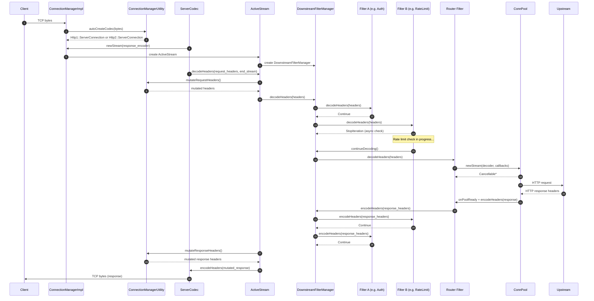

---

## 4. ConnectionManagerImpl Deep Dive

### Responsibilities

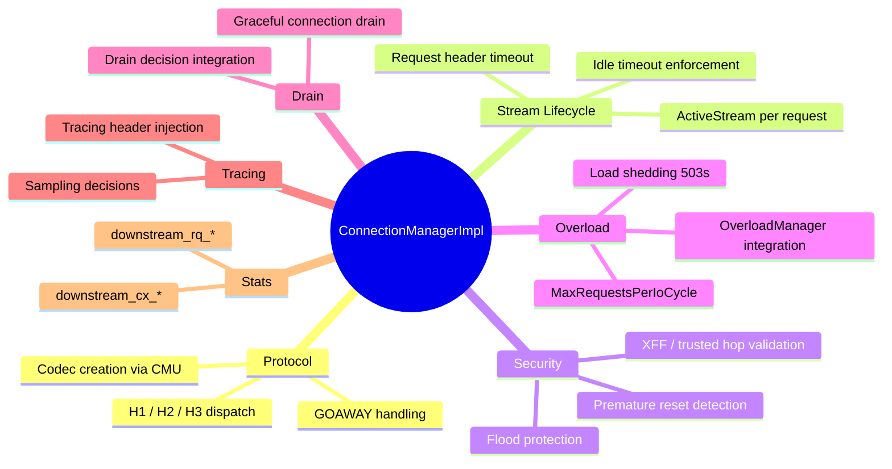

### `ActiveStream` — The Request Object

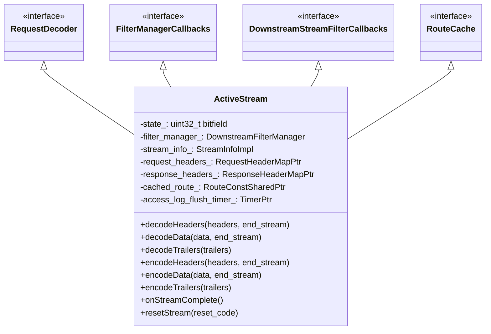

### Connection Manager State Machine

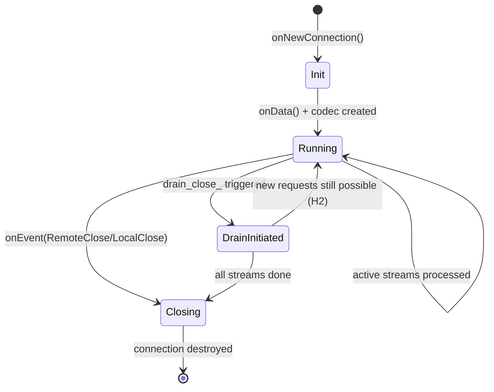

---

## 5. FilterManager and the Filter Chain

### Filter Registration

Filters are registered at configuration load time by `FilterChainHelper`. At runtime, `FilterManager` holds the instantiated filter chain:

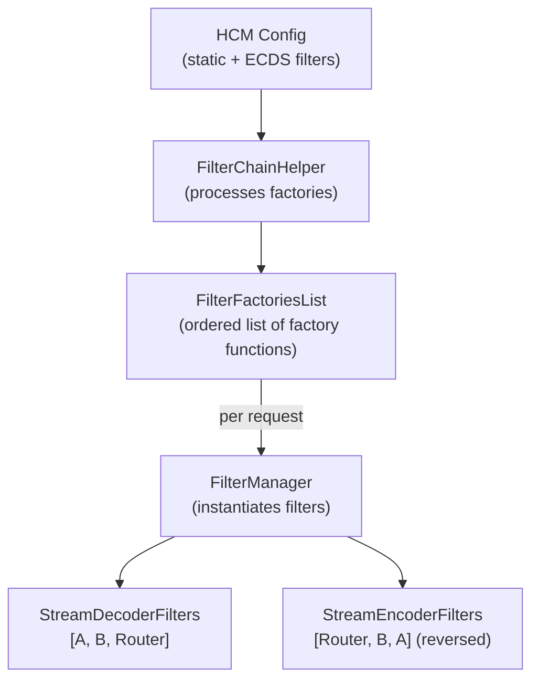

### Iteration State Machine

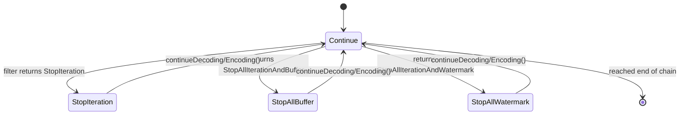

### Buffering During Stop

When a filter returns `StopAllIterationAndBuffer`, subsequent data is accumulated in the filter's `buffered_body_`:

```
Request Data Flow with StopAllBuffer:
─────────────────────────────────────
Filter A: decodeHeaders() → Continue
Filter B: decodeHeaders() → StopAllIterationAndBuffer
  [data chunks arrive]
  FilterManager: append to B.buffered_body_
  [B finishes async work]
  B: continueDecoding()
  FilterManager: replay buffered_body_ to subsequent filters
Filter C (Router): decodeHeaders() + decodeData(buffered_body_)
```

### Local Reply Shortcut

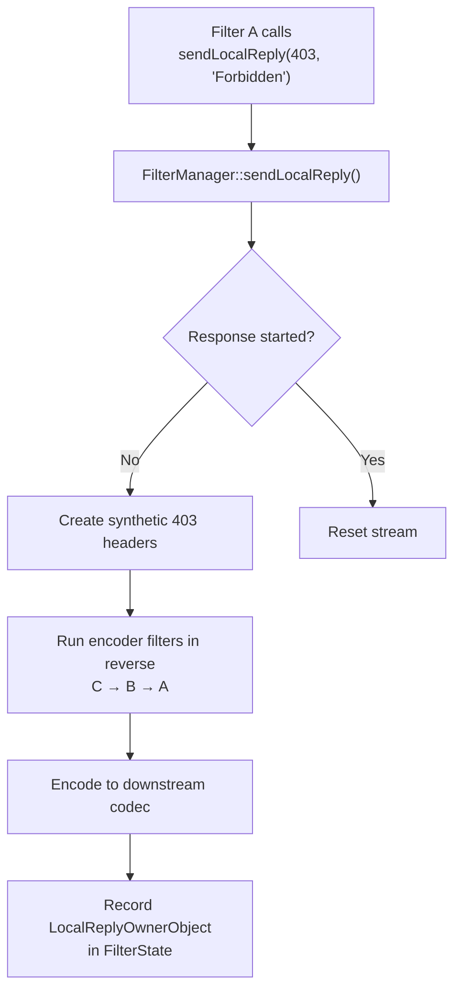

---

## 6. FilterChainHelper — Building the Chain

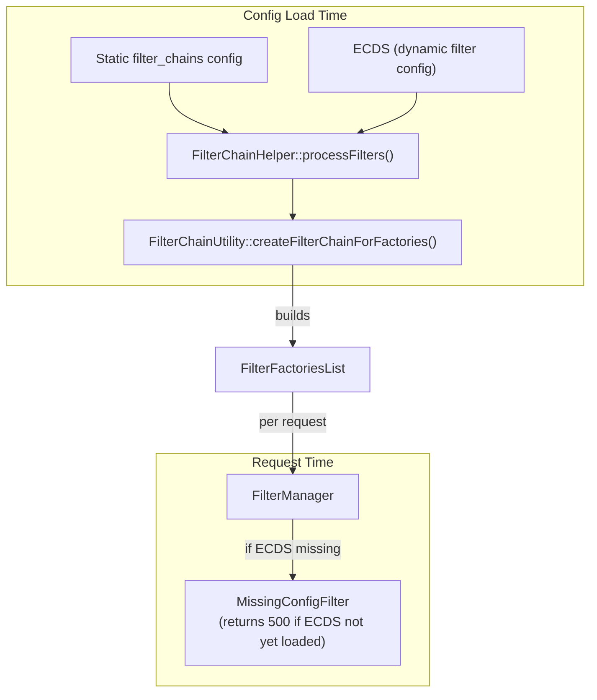

**`FilterChainHelper<FilterCtx, Factory>`** is a template class parameterized over:
- `FilterCtx` — the filter context type (e.g., `Http::FilterChainFactoryCallbacks`)
- `Factory` — the factory type (e.g., `NamedHttpFilterConfigFactory`)

---

## 7. Key Design Patterns

### Pattern 1: Per-Filter Iteration State

Each `ActiveStreamFilterBase` tracks its own `IterationState`, allowing filters to independently pause and resume without a global lock or callback stack.

### Pattern 2: Deferred Deletion

All stream objects (`ActiveStream`, `AsyncStreamImpl`, `WrapperCallbacks`) implement `Event::DeferredDeletable`. Destruction is deferred to the next event loop iteration to prevent use-after-free when a callback deletes an object that's in the current call stack.

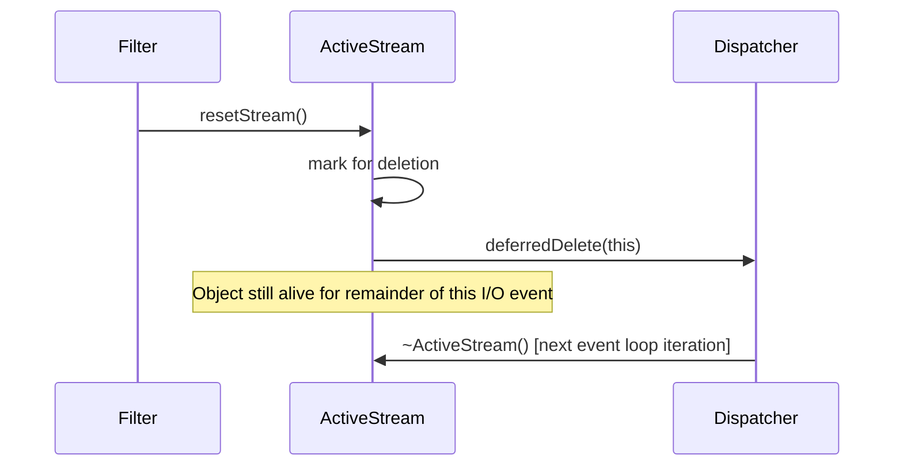

### Pattern 3: absl::Status in Codecs

All codec operations return `absl::Status` instead of throwing exceptions. This keeps the codec paths exception-free and allows precise error propagation:

```
Codec::dispatch(data) → absl::Status
  OK              → continue
  CodecProtocolError → close connection with protocol error stats
  PrematureResponseError → reset stream
  InboundFramesWithEmptyPayload → flood protection
```

### Pattern 4: Thread-Local Route Caches

`ActiveStream` caches the resolved route in `cached_route_` and refreshes it only when `clearRouteCache()` is called. Route resolution is lock-free since each worker thread has its own snapshot of the route table via thread-local slots.

---

## Navigation

| Part | Topics |
|------|--------|
| **Part 1 (this file)** | Architecture, Request Pipeline, ConnectionManager, FilterSystem |
| [Part 2](OVERVIEW_PART2_codecs_and_pools.md) | Codecs (H1/H2/H3), Connection Pools, Protocol Details |
| [Part 3](OVERVIEW_PART3_headers_and_utilities.md) | Header System, Utilities, Path Normalization |
| [Part 4](OVERVIEW_PART4_async_and_advanced.md) | Async Client, HTTP/3, Server Properties, Advanced Topics |
